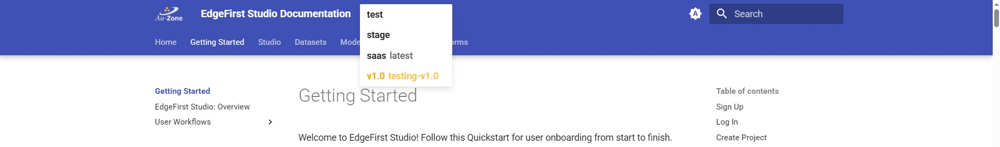

# EdgeFirst Documentation

The EdgeFirst Documentation provides tutorials and information related to EdgeFirst Studio, Middleware, and Platforms.

# Deployment

## MkDocs
Follow these steps for deploying the documentation locally on your machine.

`pip install -r requirements.txt`

`mkdocs serve`

You should now be able to see the documentation on your browser by visiting this link `http://localhost:8000/`.

## Mike

**Alternatively**, use `mike` which is typically used for extra verification that the links are not broken.

`mike deploy -r <git branch> <version> <alias>` [Example: `mike deploy -r DE-1941-doc-fixes v1.0 testing-v1.0`]

Once deployed, run `mike serve` to see the changes.

This will create a local branch for the documentation that will show like the following below.

To delete the local branches that's created, run `mike delete <identifier>` [Example: `mike delete DE-1941-doc-fixes`]

More information for using `mike` can be found [here](https://github.com/jimporter/mike?tab=readme-ov-file#building-your-docs).

## Spell Check

Run a spell checker on the documentation using `mkdocs build -s`.

# Conventions

Follow these conventions when working on the documentation.

1. Filenames should be lower case. Avoid a name like "Projects" for files and directories for example. 
2. Keep images in an `assets` folder for better organization. 
3. Use well descriptive names for the images. Avoid a name like "image-1" for example. 
4. Either keep assets as a sub-folder to where the documentation using these assets lives, or a sub-folder of the root assets with the same hierarchy. (Former is currently being followed).
5. Do NOT use screenshots from private customer data in the documentation. We should be using our own custom datasets. Exception would be documentation for a specific dataset such as COCO.
