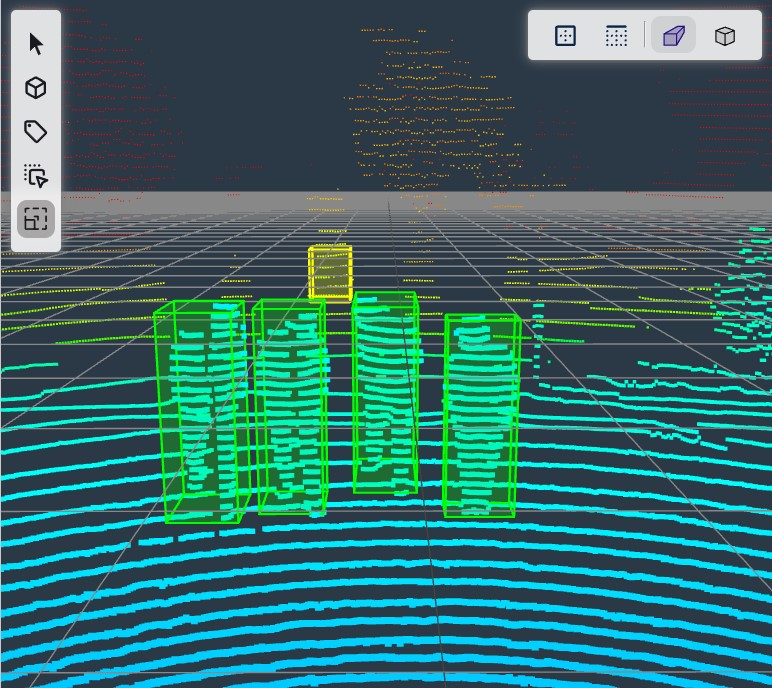

# 3D Annotations

The 3D annotations are a set of 3D bounding boxes in meters that represent the position of the object in the frame in world coordinates.  More information can be found regarding the [format of the 3D bounding boxes](../datasets/format/index.md#box3d).

<figure markdown="span">

<figcaption>LiDAR</figcaption>
</figure>

## Automatic Ground Truth Generation

The 3D annotations are formulated using Radar or LiDAR PCDs that's available in [Raivin Platforms](../platforms/index.md) by Au-Zone Technologies. The [Automatic Ground Truth Generation (AGTG)](../studio/agtg.md) automatically creates the 3D annotations for the dataset if the PCDs are available in the dataset.  For a tutorial to this process, refer to [deploying the AGTG pipeline in EdgeFirst Studio](../datasets/tutorials/annotations/automatic.md). 

For modifying 3D annotations in the dataset, follow the steps in the next section. 


