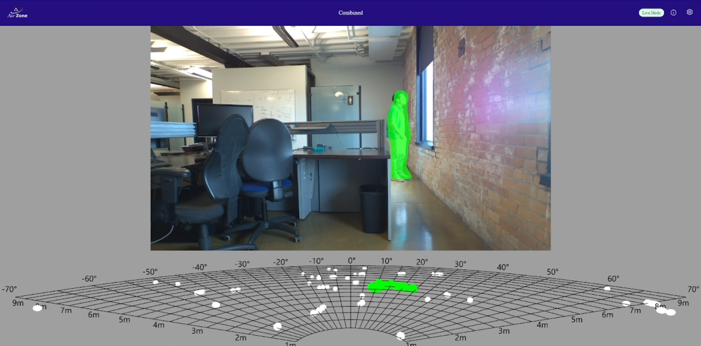

# 3D Fusion Model Deployment

If you have a [Raivin Platform](../platforms/index.md) then you can deploy and run the trained Fusion model using the bundled EdgeFirst Middleware by following the tutorial [Deploying to Raivin](../models/deployment/3d_raivin.md).

A sample model inference will show like the following on the Raivin Platform.

<figure markdown="span">
{ align=center }
<figcaption>Model Inference on the Raivin</figcaption>
</figure>
