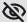
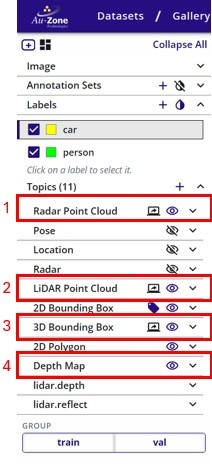
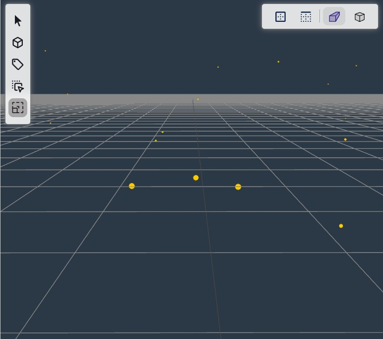
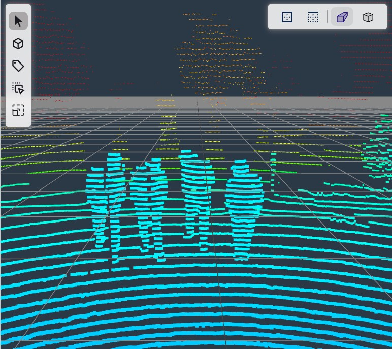
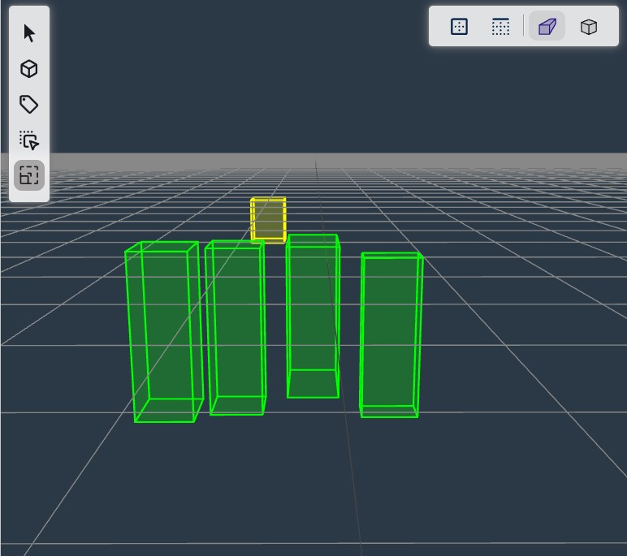
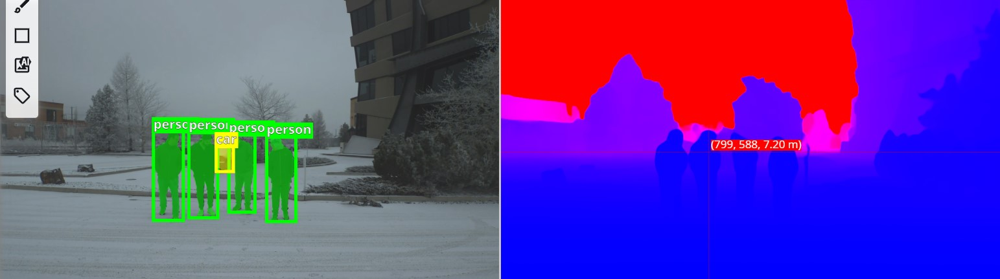

# 3D Data Viewers

The 3D Data Viewers in EdgeFirst Studio provide visualizations of 3D data such as 3D annotations, LiDAR or Radar point clouds, and depth maps.  The visualization features are found in the [dataset gallery](../studio/datasets/gallery.md).

In the gallery, the left side panel provides options to toggle the visualization of the canvas On /Off . 

<figure markdown="span">
{ align=center }
<figcaption>3D Data Viewers</figcaption>
</figure>

The point clouds for the Radar (1) or LiDAR (2) can be visualized on the 3D canvas.  Radar points clouds can be sparse whereas LiDAR point clouds can form the general shape of the object.  

| Radar Points Clouds             | LiDAR Point Clouds           |
|---------------------------------|-----------------------------|
|  |  |

The 3D bounding boxes (3) can also be displayed on the 3D canvas.  The 3D bounding box is the annotation used for [training 3D perception (Fusion) models](training.md).  More information towards the format used for the 3D bounding box is provided [here](../datasets/format/schema.md#box3d). 

| 3D Bounding Boxes               | 3D Bounding Boxes with LiDAR   |
|---------------------------------|--------------------------------|
|  |  |

The 3D bounding boxes are generated through the utilization of both 2D box projections and the point clouds.  The [AGTG algorithm](../studio/agtg.md#the-agtg-algorithm) describes the process of generating 3D bounding box annotations from 2D annotations and PCDs.  

Since the Radar PCDs are too sparse, it requires additional information for formulating the 3D bounding box.  The depth map  (4) is used which provides distance estimations of each pixel in the image in meters.  The depth map is a separate canvas that can be visualized separately from the 3D annotations.  When hovering over the depth map, the values for pixel values (x, y) corresponding the image position and the estimated depth value in meters are provided. 

<figure markdown="span">
{ align=center }
<figcaption>Depth Map</figcaption>
</figure>

