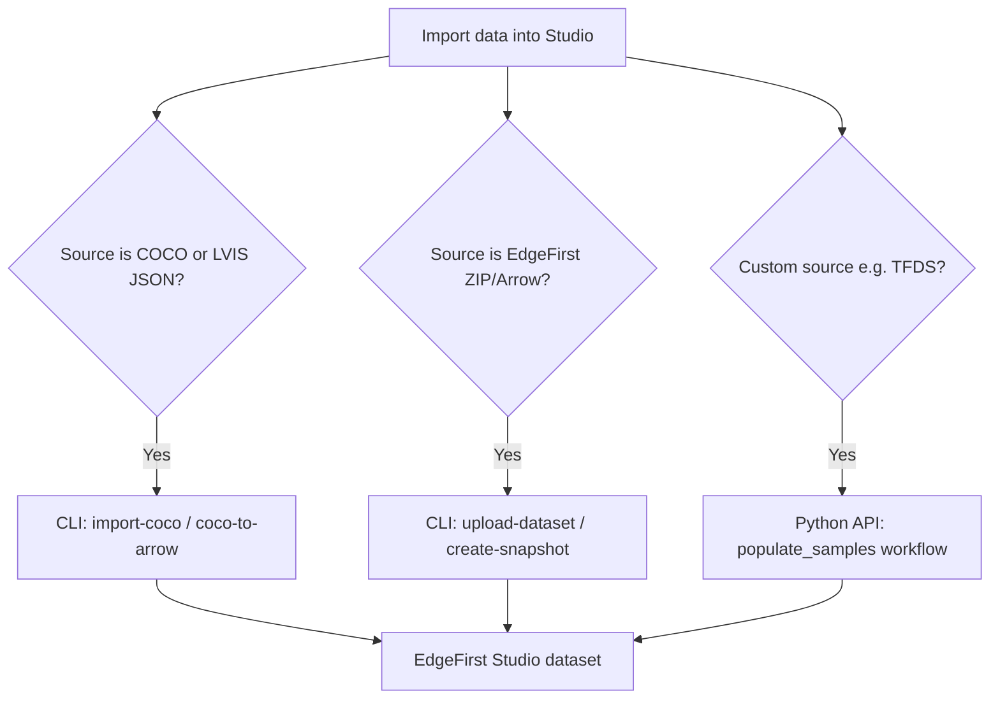
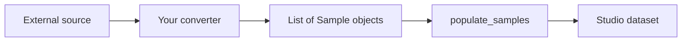

# Dataset Import

Import annotated or raw data into EdgeFirst Studio using `edgefirst-client`. Choose the pathway that matches your source format.



For Darknet/YOLO imports through the Studio web UI, see the [dataset import tutorial](../datasets/tutorials/import.md).

## Native COCO and LVIS support

`edgefirst-client` includes built-in COCO interchange commands. **LVIS v1** annotations are handled through the same pipeline — `coco-to-arrow` accepts LVIS JSON (including `coco_url`-derived filenames) and preserves LVIS-specific columns documented in the [format schema](../datasets/format/schema.md).

| Command | Purpose |
|---------|---------|
| `import-coco` | Upload COCO annotations and images directly into Studio |
| `export-coco` | Export a Studio dataset to COCO JSON or ZIP |
| `coco-to-arrow` | Convert COCO/LVIS JSON to EdgeFirst Arrow |
| `arrow-to-coco` | Convert EdgeFirst Arrow to COCO JSON |

### import-coco

Import an extracted COCO directory or annotation JSON file. ZIP archives are **not** supported — extract images and annotations first.

```bash
# Create a new dataset in a project
edgefirst-client import-coco ./coco --project p-123 --name "COCO 2017"

# Import into an existing dataset and annotation set
edgefirst-client import-coco ./coco --dataset ds-123 --annotation-set as-456

# Bounding boxes only (no segmentation masks)
edgefirst-client import-coco ./coco/annotations/instances_train2017.json \
    --dataset ds-123 --annotation-set as-456 --masks=false
```

!!! note "Group assignment"
    Standard COCO JSON references images by bare filename (e.g. `000000397133.jpg`) with no detectable train/val group. To assign splits, convert with `coco-to-arrow --group train` and upload with `upload-dataset` instead.

See the [CLI reference](cli/reference.md#import-coco) for `--verify`, `--update`, and batch options.

### coco-to-arrow and arrow-to-coco

Convert between COCO/LVIS and [EdgeFirst Dataset Format](../datasets/format/index.md) without uploading:

```bash
# COCO/LVIS JSON to Arrow (preserves category_id and object_id)
edgefirst-client coco-to-arrow instances.json -o dataset.arrow --group train

# Arrow back to COCO JSON
edgefirst-client arrow-to-coco dataset.arrow -o instances.json --groups train,val
```

LVIS taxonomies with more than 255 categories are supported (Arrow `label_index` uses `U16`).

### export-coco

Download a Studio dataset as COCO:

```bash
edgefirst-client export-coco ds-123 as-456 -o instances.json
edgefirst-client export-coco ds-123 as-456 -o coco.zip --images --groups train,val
```

When restoring MCAP snapshots with auto-annotation, `--autolabel` accepts [COCO labels](../datasets/coco/index.md#coco-labels).

## EdgeFirst Dataset Format

Import data natively in the [EdgeFirst Dataset Format](../datasets/format/index.md) (ZIP + Arrow pairs).

### upload-dataset

```bash
# Images only
edgefirst-client upload-dataset ds-123 --images ./photos/

# Arrow annotations with auto-discovered images
edgefirst-client upload-dataset ds-123 \
    --annotations dataset.arrow \
    --annotation-set-id as-456
```

Arrow files must conform to the current schema (2026.04). Use `edgefirst-client migrate` to upgrade legacy 2025.10 Arrow files — see the [migration guide](../datasets/format/migration.md).

### Snapshots

Upload a local directory or MCAP file as a snapshot, then restore into a project:

```bash
edgefirst-client create-snapshot ./sensor_data/
edgefirst-client restore-snapshot p-123 ss-abc --dataset-name "Imported" --monitor
```

Preparation utilities:

```bash
edgefirst-client generate-arrow ./images --output dataset.arrow
edgefirst-client migrate dataset.arrow --output dataset-2026.arrow
edgefirst-client validate-snapshot ./my_dataset
```

!!! note "Arrow schema version"
    `generate-arrow` produces a 2025.10 Arrow file. Before `upload-dataset`, migrate to
    2026.04 with `edgefirst-client migrate` (see the [migration guide](../datasets/format/migration.md)).

See [CLI: MCAP snapshot workflow](cli/index.md#mcap-snapshot-workflow) and [Studio Snapshots](../studio/snapshots.md).

## Custom imports via Python API

For sources without a native CLI importer (TensorFlow Datasets, Hugging Face, proprietary formats), use the Python API to transform data into Studio samples programmatically.

General workflow:

1. **Authenticate** — `Client()` reuses the CLI token ([Tutorial 1](tutorials/01_authentication.md))
2. **Create or target a dataset** — `create_dataset(project_id, name, description)`
3. **Create an annotation set** — `create_annotation_set(dataset_id, name, description)`
4. **Define labels** — `add_label` / `add_labels` with explicit indices if needed ([Tutorial 7](tutorials/07_manage_labels.md))
5. **Upload samples** — `populate_samples(dataset_id, annotation_set_id, samples, progress=...)`

[Tutorial 6: Create annotations](tutorials/06_create_annotations.md) demonstrates the minimal write path: create a sandbox dataset, build `Sample` objects with `Annotation` and `Box2d`, and call `populate_samples`.

Typical custom pipeline:



!!! info "Future examples"
    Practical tutorials for importing from TensorFlow Datasets, Hugging Face Datasets, and similar sources are planned. Until then, use Tutorial 6 as the reference implementation for the upload API.

## See also

- [CLI reference: COCO interchange](cli/reference.md#coco-interchange)
- [EdgeFirst Dataset Format](../datasets/format/index.md)
- [Python API reference](api/python.md)
