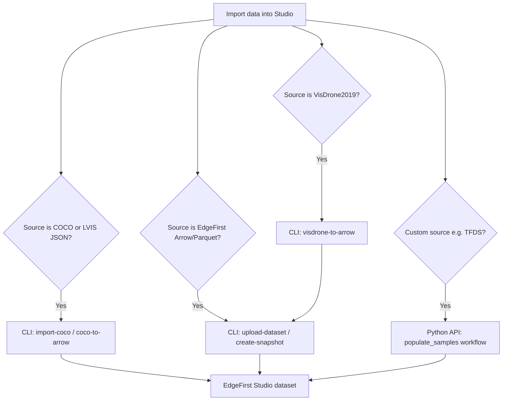
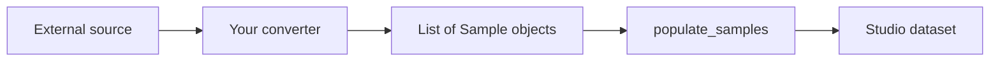

# Dataset Import

Import annotated or raw data into EdgeFirst Studio using `edgefirst-client`. Choose the pathway that matches your source format.


```mermaid
flowchart TD
  start[Import data into Studio]
  start --> cocoPath{Source is COCO or LVIS JSON?}
  start --> visdronePath{Source is VisDrone2019?}
  start --> efPath{Source is EdgeFirst Arrow/Parquet?}
  start --> customPath{Custom source e.g. TFDS?}
  cocoPath -->|Yes| nativeCoco["CLI: import-coco / coco-to-arrow"]
  visdronePath -->|Yes| visdrone["CLI: visdrone-to-arrow"]
  efPath -->|Yes| efFormat["CLI: upload-dataset / create-snapshot"]
  customPath -->|Yes| pythonApi["Python API: populate_samples workflow"]
  nativeCoco --> studio[EdgeFirst Studio dataset]
  visdrone --> efFormat
  efFormat --> studio
  pythonApi --> studio
```

For Darknet/YOLO imports through the Studio web UI, see the [dataset import tutorial](../datasets/tutorials/import.md).

## Native COCO and LVIS support

`edgefirst-client` includes built-in COCO interchange commands. **LVIS v1** annotations are handled through the same pipeline — `coco-to-arrow` accepts LVIS JSON (including `coco_url`-derived filenames) and preserves LVIS-specific columns documented in the [format schema](../datasets/format/schema.md).

| Command | Purpose |
|---------|---------|
| `import-coco` | Upload COCO annotations and images directly into Studio |
| `export-coco` | Export a Studio dataset to COCO JSON or ZIP |
| `coco-to-arrow` | Convert COCO/LVIS JSON, a ZIP, or an extracted COCO directory to an offline EdgeFirst dataset (Arrow or Parquet) |
| `arrow-to-coco` | Convert an EdgeFirst Arrow or Parquet file to COCO JSON |

### import-coco

Import an extracted COCO directory or annotation JSON file. ZIP archives are **not** supported — extract images and annotations first.

```bash
# Create a new dataset in a project
edgefirst-client import-coco ./coco --project p-123 --name "COCO 2017"

# Import into an existing dataset and annotation set
edgefirst-client import-coco ./coco --dataset ds-123 --annotation-set as-456

# Bounding boxes only (no segmentation masks)
edgefirst-client import-coco ./coco/annotations/instances_train2017.json \
    --dataset ds-123 --annotation-set as-456 --masks=false
```

!!! note "Group assignment"
    Standard COCO JSON references images by bare filename (e.g. `000000397133.jpg`) with no detectable train/val group. To assign splits, convert with `coco-to-arrow` (which infers the split from each `instances_*.json` filename when given a directory, or takes `--group`) and upload with `upload-dataset` instead.

!!! warning "Crowd annotations are skipped"
    COCO crowd annotations (`iscrowd=1`) map to the `ignore` flag, which EdgeFirst Studio does not store yet. `import-coco` and `import-coco --update` skip them and log one warning with the count, and `--verify` leaves them out of the comparison.

See the [CLI reference](cli/reference.md#import-coco) for `--verify`, `--update`, and batch options.

### coco-to-arrow and arrow-to-coco

Convert between COCO/LVIS and [EdgeFirst Dataset Format](../datasets/format/index.md) without uploading. No Studio credentials are needed.

```bash
# COCO/LVIS JSON to Arrow (preserves category_id and object_id)
edgefirst-client coco-to-arrow instances.json -o dataset.arrow --group train

# Arrow back to COCO JSON
edgefirst-client arrow-to-coco dataset.arrow -o instances.json --groups train,val
```

LVIS taxonomies with more than 255 categories are supported; `label_index` is stored as `UInt64` and preserves the source `category_id`.

`arrow-to-coco` writes COCO `iscrowd=1` from labeled `ignore` rows. Unlabeled `ignore` rows and all `exclude` rows have no COCO equivalent and are skipped with one warning giving the count.

#### Offline COCO dataset

Given a standard extracted COCO directory, `coco-to-arrow` produces one offline dataset containing every split, with the images staged next to the annotation file:

```text
COCO/
├── annotations/
│   ├── instances_train2017.json
│   └── instances_val2017.json
├── train2017/
└── val2017/
```

```bash
# Arrow IPC
edgefirst-client coco-to-arrow COCO --output coco/coco.arrow --images COCO --link
edgefirst-client validate-snapshot coco

# Parquet — chosen by the .parquet extension
edgefirst-client coco-to-arrow COCO --output coco-parquet/coco-parquet.parquet --images COCO --link
edgefirst-client validate-snapshot coco-parquet
```

Directory conversion discovers the `instances_*.json` files and assigns the split inferred from each filename to the `group` column (`train`, `val`, or `test`). `--images` copies the referenced images into a sibling folder; `--link` creates symlinks instead (Unix only). Existing staged files are left untouched on re-run, and missing source images or filename collisions are reported as warnings. An image with no annotations still receives one row with a null `label`, keeping its `name`, `size`, and `group`.

```text
coco/
├── coco.arrow                 # or coco.parquet
└── coco/
    ├── 000000000009.jpg
    └── ...
```

Select a split with Polars:

```python
import polars as pl

df = pl.read_ipc("coco/coco.arrow")    # or pl.read_parquet("coco-parquet/coco-parquet.parquet")
train = df.filter(pl.col("group") == "train")
val = df.filter(pl.col("group") == "val")
```

### export-coco

Download a Studio dataset as COCO:

```bash
edgefirst-client export-coco ds-123 as-456 -o instances.json
edgefirst-client export-coco ds-123 as-456 -o coco.zip --images --groups train,val
```

When restoring MCAP snapshots with auto-annotation, `--autolabel` accepts [COCO labels](../datasets/coco/index.md#coco-labels).

## VisDrone

`visdrone-to-arrow` converts extracted [VisDrone2019](https://github.com/VisDrone/VisDrone-Dataset) DET (still image) and VID (video sequence) splits into one offline EdgeFirst dataset. Several split directories can be combined; the group is inferred from each directory name (`-train`, `-val`, `-test-dev`, `-test-challenge`) or set with `--group`.

```bash
# DET train + val into one offline dataset
edgefirst-client visdrone-to-arrow VisDrone2019-DET-train VisDrone2019-DET-val \
    -o visdrone-det/visdrone-det.arrow --images
edgefirst-client validate-snapshot visdrone-det

# VID val as a sequence dataset, written as Parquet
edgefirst-client visdrone-to-arrow VisDrone2019-VID-val \
    -o visdrone-vid/visdrone-vid.parquet --images
```

The ten VisDrone object classes are indexed `label_index` 0–9 (`pedestrian` = 0 … `motor` = 9), matching the Ultralytics VisDrone mapping. VID sequences become `name`/`frame` rows with `object_id = <sequence>/<target_id>`, which Studio keeps as the object reference, so track IDs survive upload. The VisDrone `truncation` and `occlusion` values are stored in the matching [annotation columns](../datasets/format/schema.md#truncation-and-occlusion).

By default, VisDrone category 0 (`ignored regions`) and category 11 (`others`) are dropped. `--keep-ignored` keeps them as unlabeled rows flagged [`ignore`](../datasets/format/schema.md#ignore) and [`exclude`](../datasets/format/schema.md#exclude) for evaluation protocols that need them. Studio does not store these flags or the attribute columns yet; see the [CLI reference](cli/reference.md#visdrone-to-arrow) for details.

## EdgeFirst Dataset Format

Import data natively in the [EdgeFirst Dataset Format](../datasets/format/index.md) (an Arrow or Parquet annotation file with a sibling image folder or ZIP).

### upload-dataset

```bash
# Images only
edgefirst-client upload-dataset ds-123 --images ./photos/

# Arrow annotations with auto-discovered images
edgefirst-client upload-dataset ds-123 \
    --annotations dataset.arrow \
    --annotation-set-id as-456
```

Annotation files can be Arrow IPC or Parquet and must conform to schema 2026.04 or 2026.10; 2026.04 files are accepted as is. Use `edgefirst-client migrate` to upgrade legacy 2025.10 Arrow files — see the [migration guide](../datasets/format/migration.md).

!!! warning "Data not stored by Studio yet"
    `upload-dataset` drops annotations flagged `ignore` or `exclude` and logs one warning with the count. It sends the `truncation` and `occlusion` columns, but Studio does not persist them yet. Keep the annotation file as the source of truth for this data.

!!! warning "IMU pose and GPS location in older files"
    `upload-dataset` reads `pose` as `[roll, pitch, yaw]` in signed degrees and `location` as `[lat, lon]`, as schema 2026.10 defines. Files written by EdgeFirst Client 2.14 and earlier store `pose` as `[yaw, pitch, roll]`, and files from the EdgeFirst Publisher use a 0–360 range (and `[lon, lat]` before Publisher 1.10). Correct these files before uploading them; see [IMU Pose and GPS Location in Older Files](../datasets/format/migration.md#imu-pose-and-gps-location-in-older-files).

### Snapshots

Upload a local directory or MCAP file as a snapshot, then restore into a project:

```bash
edgefirst-client create-snapshot ./sensor_data/
edgefirst-client restore-snapshot p-123 ss-abc --dataset-name "Imported" --monitor
```

Preparation utilities:

```bash
edgefirst-client generate-arrow ./images --output dataset.arrow
edgefirst-client migrate dataset.arrow --output dataset-2026.arrow
edgefirst-client validate-snapshot ./my_dataset
```

!!! note "Arrow schema version"
    `generate-arrow` produces an Arrow file with the current 2026.10 schema and null annotations, ready for `upload-dataset`. `migrate` is only needed for files written in the 2025.10 schema (see the [migration guide](../datasets/format/migration.md)).

See [CLI: MCAP snapshot workflow](cli/index.md#mcap-snapshot-workflow) and [Studio Snapshots](../studio/snapshots.md).

## Custom imports via Python API

For sources without a native CLI importer (TensorFlow Datasets, Hugging Face, proprietary formats), use the Python API to transform data into Studio samples programmatically.

General workflow:

1. **Authenticate** — `Client()` reuses the CLI token ([Tutorial 1](tutorials/01_authentication.md))
2. **Create or target a dataset** — `create_dataset(project_id, name, description)`
3. **Create an annotation set** — `create_annotation_set(dataset_id, name, description)`
4. **Define labels** — `add_label` / `add_labels` with explicit indices if needed ([Tutorial 7](tutorials/07_manage_labels.md))
5. **Upload samples** — `populate_samples(dataset_id, annotation_set_id, samples, progress=...)`

[Tutorial 6: Create annotations](tutorials/06_create_annotations.md) demonstrates the minimal write path: create a sandbox dataset, build `Sample` objects with `Annotation` and `Box2d`, and call `populate_samples`.

Typical custom pipeline:


```mermaid
flowchart LR
  source[External source] --> transform[Your converter]
  transform --> samples[List of Sample objects]
  samples --> populate[populate_samples]
  populate --> studio[Studio dataset]
```

!!! info "Future examples"
    Practical tutorials for importing from TensorFlow Datasets, Hugging Face Datasets, and similar sources are planned. Until then, use Tutorial 6 as the reference implementation for the upload API.

## See also

- [CLI reference: COCO interchange](cli/reference.md#coco-interchange)
- [CLI reference: VisDrone interchange](cli/reference.md#visdrone-interchange)
- [EdgeFirst Dataset Format](../datasets/format/index.md)
- [Python API reference](api/python.md)
