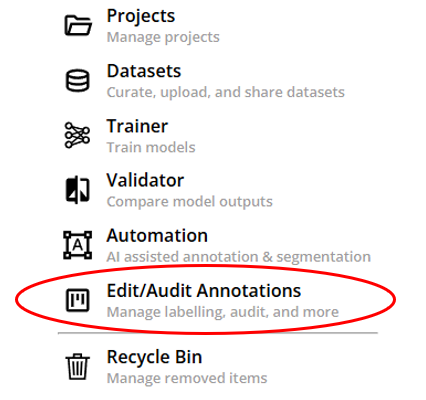
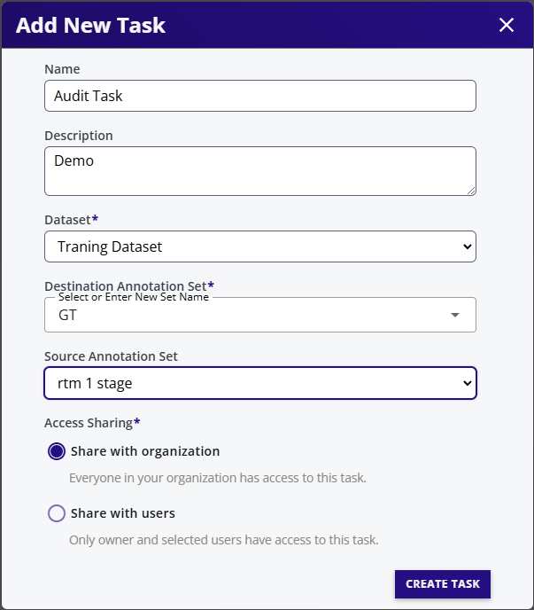
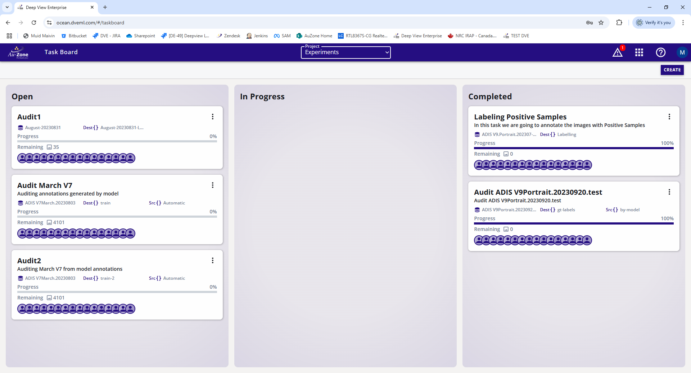
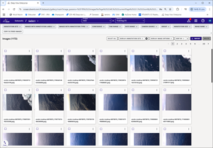
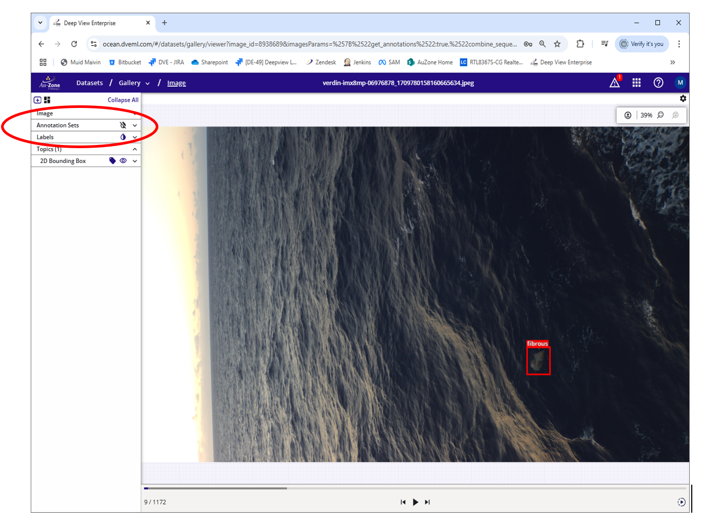
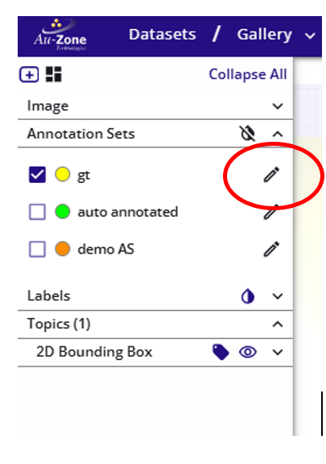
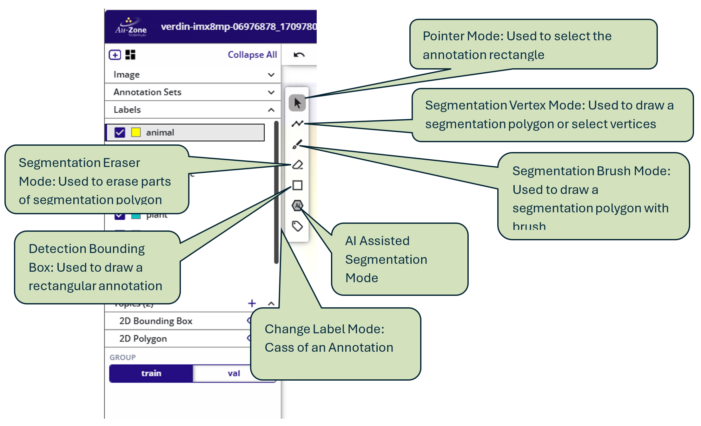
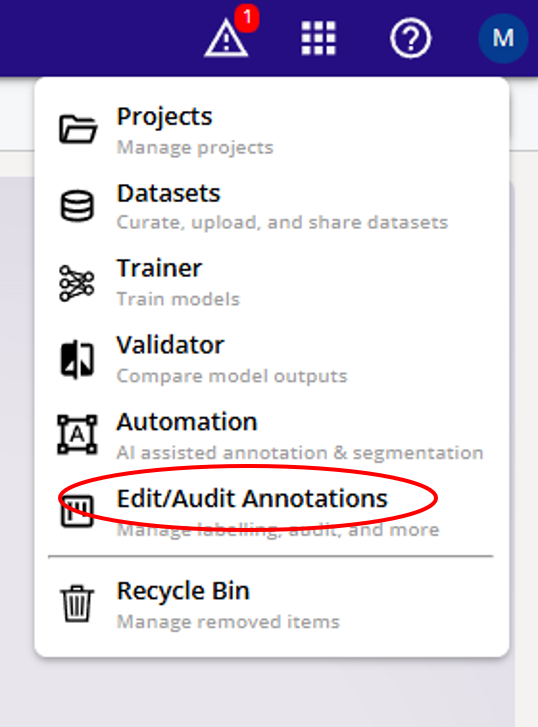
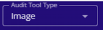

# Annotation Sets

## Editing 2D Annotations

There are two modes of operations:

1.	Edit images from gallery (Adhoc)
2.	Edit Images from the Edit/Audit Dashboard (Multi-user editing environment)

## Multi-User Annotation Audit / Edit 

DVE allows multiple users to remotely access a single dataset and annotation set and make changes without interfering with each other.

### Difference between Audit and Edit

#### Edit

User works on one annotation set, makes changes and saves in the same annotations set

#### Audit

User reviews annotations in the source annotation set: 
- Accepted annotations move to the destination annotation set.  
- Rejected annotation asr nopt copied to the destination annotation set.
- Edited annotations are copied with edits to teh destination annotation set.

- To create a multi-user Edit Task select "Edit/Audit Annotations" from the Apps Menu 

- Click CREATE

- Select Task name and description
- Select Dataset
- Select Destination Dataset - Where changes will be saved
- Select Source Dataset only if Audit task only. For editing task leave Source Annotation set empty as Source and Destination annotation sets are the same as destination annotation set
- Select Sharing - With entire organization or few selected users
- Click CREATE TASK

Task entry ius created in the Edit Dashboard. There are three columns: 

1. Open - Created but no work has started
2. In Progress - Some images have been worked on - the remaining images are shown
3. Completed - All images have been worked on

Click on any task entry and start editing. Teh actual editing process is same for task based or ad-hoc editing. The editing process is described below.

## Edit images from gallery
Open the image gallery

Click on an image and expand Annotation Sets

Click on the pencil icon for the annotation set to edit

### Add a Rectangular Annotation
1.	Expand the Labels Section
2.	Click on a label class – all boxes drawn will be of this class
3.	Click on the Detection Bounding Box Mode
4.	Click and drag on image to draw as many rectangular bounding boxes
5.	Select any other class and add boxes for that class
6.	Click on SUBMIT ALL ANNOTATIONS to finalize the annotations 

### Add a Polygon Annotation with vertices
1.	Expand the Labels Section
2.	Click on a label class – all polygons drawn will be of this class
3.	Click on the Segmentation Vertex Mode
4.	Click-click on image to draw as many vertices of the polygon as required.
5.	Select any other class and ad polygons for that class
6.	Select Pointer mode to click-drag any vertices
7.	Click on SUBMIT ALL ANNOTATIONS to finalize the annotations 

### Add a Polygon Annotation with Brush
1.	Expand the Labels Section
2.	Click on a label class – all polygons drawn will be of this class
3.	Click on the Segmentation Brush Mode
4.	Click-drag on image to draw the polygon as required.
5.	Select any other class and ad polygons for that class
6.	Select Pointer mode to click-drag any vertices
7.	Select Segmentation Eraser mode to erase parts of the polygon by click-drag
8.	NOTE: Only the polygon selected (using pointer tool) will be erased 
9.	Use [+]  [-]  icons to make the brush/eraser larger or smaller.
10.	Click on SUBMIT ALL ANNOTATIONS to finalize the annotations 

### Change Class Label of an Annotation 
1.	Expand the Labels Section
2.	Click on a label class – all annotations clicked after this will be changed to this class
3.	Click on the Change Label Mode
4.	Click on ant annotation to change its class top the selected class
5.	Click on any other class in the Labels section on the left.
6.	Then clicking on any annotation after this will change the class of the annotation to this label 
7.	Select Pointer mode to click-drag any vertices

### Edit Images from the Edit/Audit Dashboard

Go to the Edit /Audit Dashboard

Create a new task or continue an existing task
#### Audit: 
Review annotations in one annotation set (Source Annotation Set), approve, reject or edit annotation and put in a new annotation set (Destination Annotation Set).

####  Edit: 
Add, delete, edit annotations in one annotation set (Source Annotation Set) and save back in the same annotation set.

There are two modes:
1.	Image based editing
2.	Annotation based audit

### Image Based Editing
Clicking on the dashboard tasks takes directly to the image mode editing. All the editing is the same as described in the Gallery based Editing above.
User can switch between Image based editing/audit and annotation based Audit from the top header: 

### Annotation Based Audit
In this mode only one annotation is shown at a time. The user can edit the with single click and next annotation is automatically presented:

1.	ENTER – accept annotation
2.	SPACE – reject annotation
3.	<- Goto previous annotation – no change to the current  annotation 
4.	-> Goto next annotation – no change to the current annotation 
5.	Z – Toggle zoom to annotation view and full image
6.	1-9 change the annotation class from 1 to 9
7.	SHIFT 0-9, change the annotation class from 10 to 19
User can edit the size of the annotation by mouse click and drag

