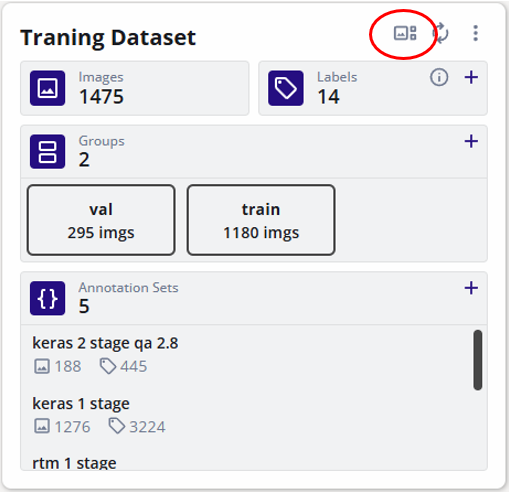

# Dataset Gallery

To open Dataset Gallery, click the gallery icon on the dataset card

Gallery is multi-page with 40 images per page.

## Filters

Filters allow user to select images based on teh filter conditions. The number of images filtered is displayed on the images count. Filtered images can be copies to another dataset.

## Tag an Image

User can create tags for images. These tags can be used to filter out images of certain tags. Tags can be added from the ACTIONS dropdown and can be filtered using the IMAGE TAGS filter.

- Display tags: Enable "Show Tags" under "Display Image Options"

- Create new tags: Click on the first line labeled "Click here to add a new tag". Then press the ENTER key or click the accept button at the right side of the input field to create the tag. If any image is selected, this tag will be automatically applied to those images

- Edit existing tags: Click on the pencil icon when hovering over a tag name. Enter the new tag name and click the aceept button at the right side of the input.

- Delete existing tags: Click on the cross icon when hovering over a tag name. A confirmation popup will open. Confirming this will remove this tag from the dataset and all applied images.

- Apply and unapply tags: At least one image must be selected to apply or unapply tags. Click on any tag under the dropdown to select it. Applied tags are denoted by a check icon. To remove the applied tags, click on it again.

