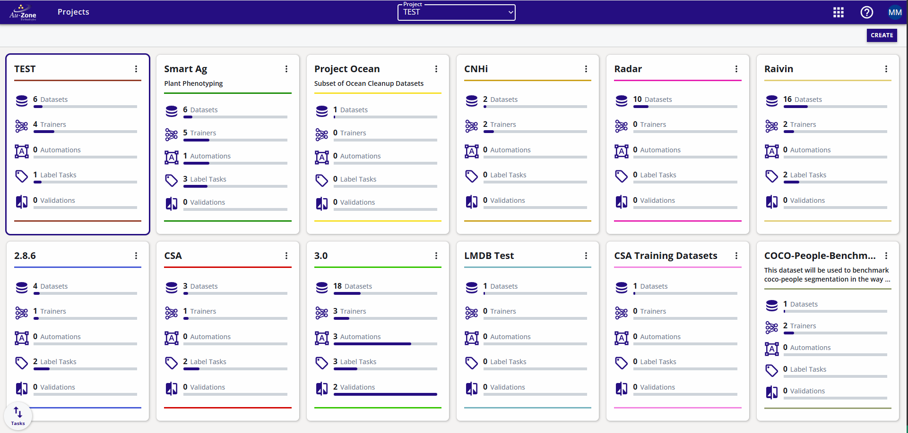
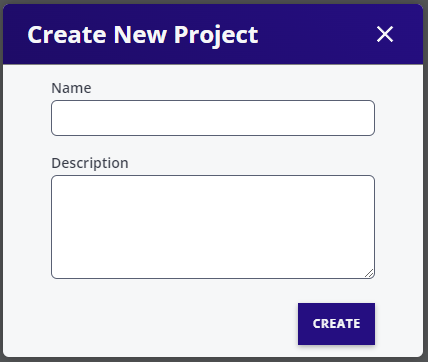

# Project Dashboard

Organize data into logical projects partitions

## Create Project

1. Click on "CREATE" on the project dash board
2. Enter project name and description
2. Click Create 

## Delete Project

1. Click on project Menu drop down on the project card
2. Click Remove Project
2. NOTE: The project is moved to the recycling bin. Remove from the recycling bin to actually free the storage space.

## Edit Project

1. Click on project Menu drop down on the project card
2. Click Edit
3. Change the name or description as desired
4. Click Apply Changes

## Project Access Control

Project access control allows projects resources to be selectively available to different users. 

For more information pease visit [Access Control](../../start/access/access.md)
