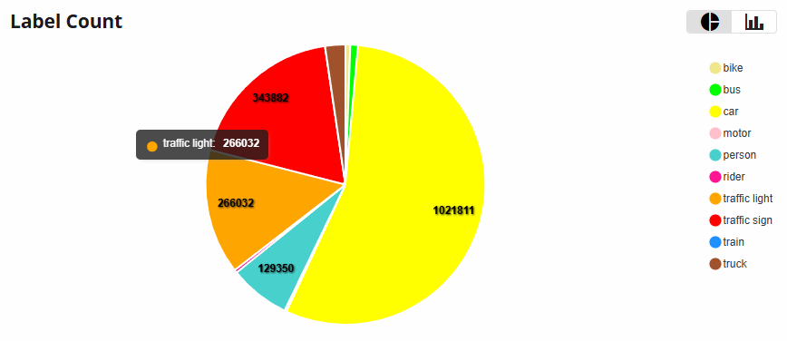
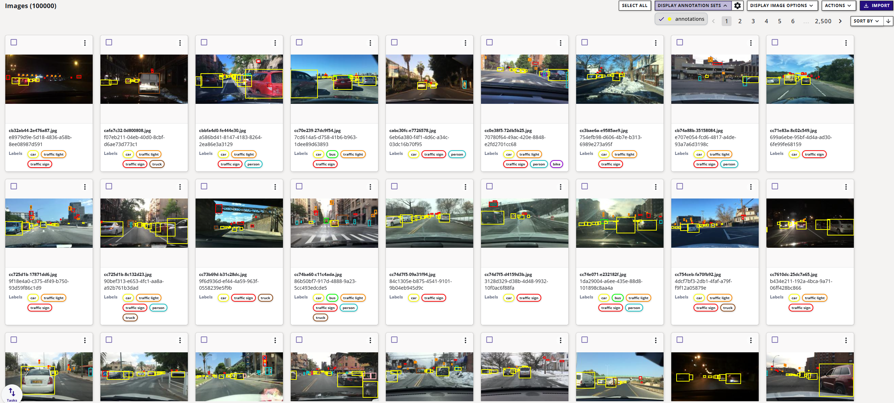

# BDD100K: A Large-scale Diverse Driving Video Database

The BDD100K dataset is a large-scale driving video dataset containing 100,000 video clips with annotations for various computer vision tasks. It includes labels for object detection, lane marking, drivable areas, semantic segmentation, instance segmentation, tracking, and more. BDD100K supports research in autonomous driving and real-world scene understanding.

## Dataset Information

- **Groups**:
    - train: 70000 images
    - val: 10000 images
    - test: 20000 images

The dataset contains a total of 100000 images and 10 different classes

{align=center}

## Object Detection Benchmark (100 epochs)

**Table: COCO Metrics - RGB - (640x640) | Float32**

| Model             | mAP@0.5 | mAP@0.5..0.95 |
|-------------------|-----------|-----------|
| csp19-large       | 0.422     |   0.226    |
| csp53-nano        | 0.467     |   0.263    | 

## Dataset Gallery

{align=center}

## License

[Dataset Home Page](https://bair.berkeley.edu/blog/2018/05/30/bdd/) and [Download Portal](http://bdd-data.berkeley.edu/)

## Reference

Yu, F., Chen, H., Wang, X., Xian, W., Chen, Y., Liu, F., ... & Darrell, T. (2020). Bdd100k: A diverse driving dataset for heterogeneous multitask learning. In Proceedings of the IEEE/CVF conference on computer vision and pattern recognition (pp. 2636-2645).