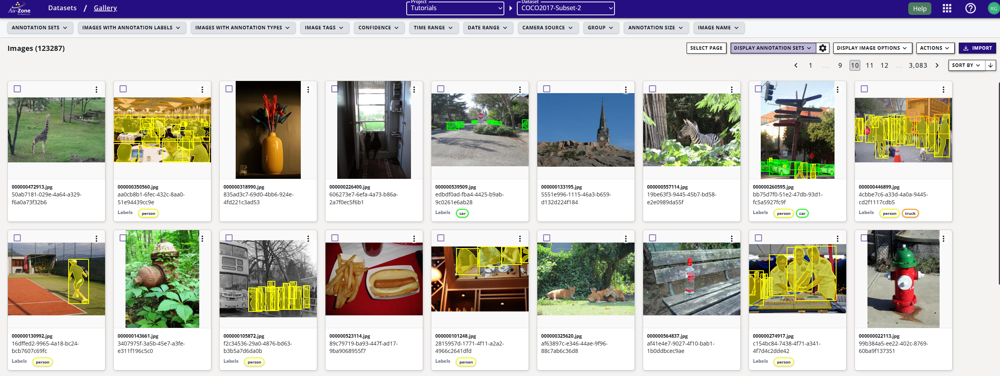

# Import COCO Dataset

In this tutorial, you'll learn how to import the COCO dataset into EdgeFirst Studio using the `edgefirst-client` Python API.  Alternatively, you can also import the COCO dataset using the EdgeFirst Studio web interface either as a [Darknet dataset](../tutorials/import.md#import-darknet-datasets) or as an [EdgeFirst dataset](../tutorials/import.md#import-edgefirst-datasets). To get started, you'll need to create a helper script that will handle the dataset processing. Copy the code from **Appendix I** into a new file named `coco.py` - we'll use this implementation throughout the tutorial to process and prepare the COCO dataset for import.

## Download COCO Dataset

To download the dataset, instantiate the `COCODataset` class and invoke the `download(...)` method, providing the destination folder path as a parameter.

```python

from coco import COCODataset

coco = COCODataset()
coco.download('./dataset')

```

## Export COCO Dataset into EdgeFirst format

After downloading the dataset, we need to convert it from the COCO format to the [EdgeFirst Dataset format](../format/index.md). The `to_edgefirst(...)` function handles this conversion, transforming the standard COCO dataset structure into the EdgeFirst-compatible format.

```python

coco.to_edgefirst(path='./edgefirst-coco-subset', classes=['person', 'car', 'truck'])

```

The `to_edgefirst` function takes two parameters: `path` specifies the destination folder for the converted dataset, while `classes` lets you filter which object classes to include. If you don't specify any classes (i.e., `classes=None`), the function will include annotations for all 80 COCO classes in the output.

## Import Dataset into Studio

To import data into EdgeFirst Studio, you must first log in to set up your credentials.

```python

server_name = 'saas' # This is the name of the server you are using
username = 'username' # this is your username
coco.login(server=server_name, username=username)

```

To view all available projects and their IDs, use the following code:

```python
coco.list_projects()
```

The dataset import process is executed through a two-step API workflow: `create_snapshot` followed by `restore_snapshot`. For detailed implementation details, refer to **Appendix I**.

```python
project_id = 100 # this is a valid project ID returned from project list
coco.upload_dataset(
    path='./edgefirst-coco-subset',  # path to the dataset location
    project=project_id,  
    name='COCO2017-Subset' # Dataset name displayed on the GUI
)
```

Note that this procedure skips the AGTG pipeline since the dataset already contains annotations. The import process will take few minutes depending on the bandwidth. Once the process finishes, you can login into EdgeFirst Studio and check the dataset `COCO2017-Subset` is there.

<figure markdown="span">
{ align=center }
<figcaption>COCO 2017 Subset with classes people, car and truck</figcaption>
</figure>

## Appendix I

This appendix includes the code used to handle automation in COCO dataset.

```python

from edgefirst_client import Client as StudioClient
from getpass import getuser, getpass
from pycocotools.coco import COCO
from tqdm import tqdm
import polars as pl
import numpy as np
import requests
import zipfile
import shutil
import glob
import cv2
import os


class COCODataset:
    def __init__(
        self
    ):
        # URLs for the different parts of the COCO dataset
        self.urls = {
            'train': 'http://images.cocodataset.org/zips/train2017.zip',
            'val': 'http://images.cocodataset.org/zips/val2017.zip',
            'annotations': 'http://images.cocodataset.org/annotations/annotations_trainval2017.zip'
        }
        self.client = None
        self.server = None
        self.token = None

    def login(self, server: str, username: str):
        self.server = server
        self.client = StudioClient(
            server=server,
            token=None
        )

        password = getpass()
        self.client.login_sync(username, password)
        self.token = self.client.token_sync()

    def _download_file(self, url: str, filename: str, path: str) -> None:
        """ Helper method to download a file with a progress bar """
        filepath = os.path.join(path, filename)
        if os.path.exists(filepath):
            print(f"   - Found at {filepath}")
            return

        response = requests.get(url, stream=True)
        total_size_in_bytes = int(response.headers.get('content-length', 0))

        with open(filepath, 'wb') as file, tqdm(
            desc=filename,
            total=total_size_in_bytes,
            unit='B',
            unit_scale=True,
        ) as bar:
            for data in response.iter_content(chunk_size=1024):
                bar.update(len(data))
                file.write(data)

    def download(self, path) -> None:
        self.base_path = path
        os.makedirs(path, exist_ok=True)

        for set_name, url in self.urls.items():
            filename = url.split("/")[-1]  # Extract filename from URL
            print(f"Downloading {set_name}...")
            self._download_file(url, filename, path)

    def _extract_zip(self, zip_file: str, extract_to: str) -> None:
        """ Extracts the contents of a zip file into the specified path """
        with zipfile.ZipFile(zip_file, 'r') as zip_ref:
            total_files = len(zip_ref.infolist())
            with tqdm(total=total_files, desc=f"Extracting {zip_file}", unit="file") as bar:
                for file_info in zip_ref.infolist():
                    zip_ref.extract(file_info, extract_to)
                    bar.update(1)

    def _annotations_to_dataframe(self, annotations: str, group: str, classes: list = None) -> pl.DataFrame:
        """This function loads COCO annotations from JSON file and produces a pl.Dataframe

        Parameters
        ----------
        annotations : str
            Path to annotations file *.json
        group: str
            Name of the group. (train, val, test, )

        Returns
        -------
        pl.DataFrame
            _description_
        """
        ds = COCO(annotation_file=annotations)
        categories = ds.loadCats(ds.getCatIds())
        if classes is None:
            classes = [category['name'] for category in categories]

        names = []
        frames = []
        groups = []
        labels = []
        masks = []
        boxes2d = []
        boxes3d = []
        quality = []

        images = ds.getImgIds()
        for id in tqdm(images):
            img = ds.loadImgs(id)[0]
            ann_ids = ds.getAnnIds(imgIds=img['id'], iscrowd=None)
            anns = ds.loadAnns(ann_ids)
            anns = [
                ann for ann in anns if ds.cats[ann["category_id"]]['name'] in classes]
            file_name = img['file_name']
            fname = os.path.splitext(file_name)[0]

            if len(anns) > 0:
                dims = np.array([img['width'], img['height']]).tolist()
                for ann in anns:
                    bbox = ann['bbox']
                    x, y, w, h = bbox
                    label = ds.cats[ann["category_id"]]['name']
                    normalized_x = (x + w/2) / dims[0]
                    normalized_y = (y + h/2) / dims[1]
                    normalized_w = w / dims[0]
                    normalized_h = h / dims[1]

                    names.append(fname)
                    frames.append(None)
                    groups.append(group)
                    labels.append(label)
                    boxes2d.append([normalized_x, normalized_y,
                                    normalized_w, normalized_h])
                    boxes3d.append(None)
                    quality.append(None)
                    mask = ds.annToMask(ann)
                    contours, _ = cv2.findContours(
                        mask, cv2.RETR_EXTERNAL, cv2.CHAIN_APPROX_SIMPLE)
                    polygons = []
                    for c in contours:
                        c = np.array(c) / dims
                        polygons.extend(c.flatten().tolist())
                        polygons.append(np.nan)
                    polygons = polygons[:-1]
                    masks.append(polygons)
            else:
                names.append(fname)
                frames.append(None)
                groups.append(group)
                labels.append(None)
                masks.append(None)
                boxes2d.append(None)
                boxes3d.append(None)
                quality.append(None)

        df = pl.DataFrame({
            "name": names,
            "frame": frames,
            "group": groups,
            "label": labels,
            "mask": masks,
            "box2d": boxes2d,
            "box3d": boxes3d,
            "degradation": quality
        }, schema={
            "name": pl.Categorical,
            "frame": pl.UInt32,
            "group": pl.Enum(["train", "val", "test"]),
            "label": pl.Enum(classes),
            "mask": pl.List(pl.Float32),
            "box2d": pl.Array(pl.Float32, 4),
            "box3d": pl.Array(pl.Float32, 6),
            "degradation": pl.Enum(["low", "medium", "high"]),
        })

        return df, classes

    def to_edgefirst(self, path: str, classes: list = None) -> None:
        dataset = os.path.join(path, "dataset")
        os.makedirs(dataset, exist_ok=True)

        for zipFile in ["train2017.zip", "val2017.zip", "annotations_trainval2017.zip"]:
            zipFile = os.path.join(self.base_path, zipFile)
            self._extract_zip(zip_file=zipFile, extract_to=dataset)

        images = glob.glob(os.path.join(dataset, "train2017", "*")) + \
            glob.glob(os.path.join(dataset, "val2017", "*"))

        zip_filename = os.path.join(path, 'dataset.zip')

        print("Building dataset images file...")
        with zipfile.ZipFile(zip_filename, 'w') as zipf:
            for file in tqdm(images):
                zipf.write(file, arcname=os.path.basename(file))

        train_df, classes = self._annotations_to_dataframe(
            os.path.join(dataset, 'annotations', 'instances_train2017.json'),
            group='train',
            classes=classes
        )
        val_df, _ = self._annotations_to_dataframe(
            os.path.join(dataset, 'annotations', 'instances_val2017.json'),
            group='val',
            classes=classes
        )

        df = pl.concat([train_df, val_df])
        df.write_ipc(os.path.join(path, 'dataset.arrow'))

        shutil.rmtree(path=dataset, ignore_errors=True)

    def _create_snapshot(
        self,
        source: str
    ) -> None:
        with tqdm(total=0, unit='B', unit_scale=True, unit_divisor=1024) as bar:
            def progress(current, total):
                if total != bar.total:
                    bar.reset(total),
                bar.update(current - bar.n)
            return self.client.create_snapshot_sync(source, progress)

    def upload_dataset(self, path: str, project: int, name: str = "COCO2017") -> None:
        snapshot = self._create_snapshot(source=path)
        self.client.restore_snapshot_sync(
            project_id=project,
            snapshot_id=snapshot.id(),
            dataset_name=name,
            dataset_description="COCO 2017 dataset for research purposes only"
        )

    def list_projects(self):

        projects = self.client.projects_sync()
        for p in projects:
            print(f"Project ID {p.id()} - Name: {p.name()}")

    def list_datasets_in_project(self, project_id: int) -> None:
        datasets = self.client.datasets_sync(project_id)
        for d in datasets:
            print(f"Dataset ID {d.id()} - Name: {d.name()}")


```
