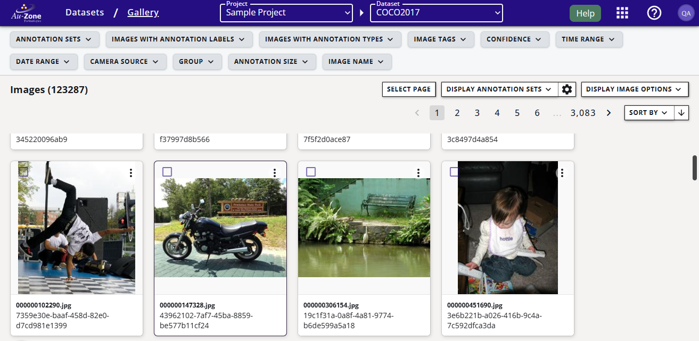
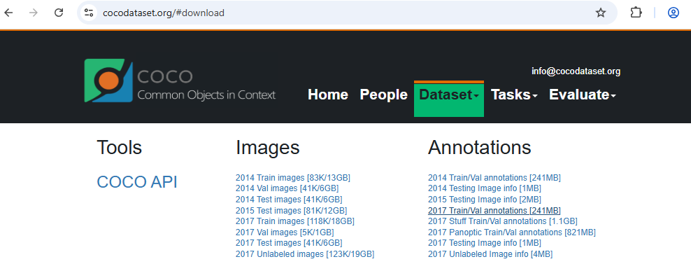
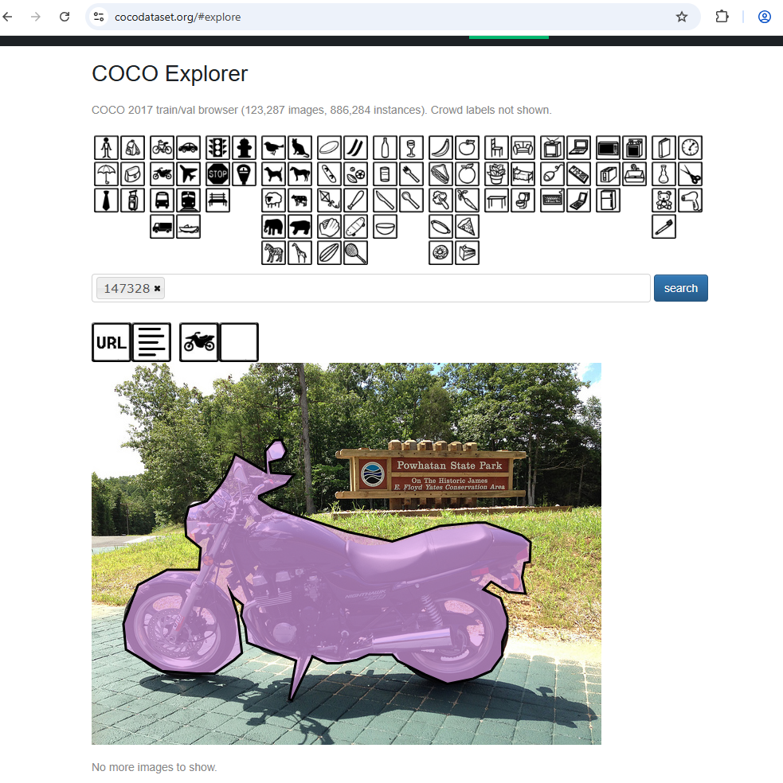
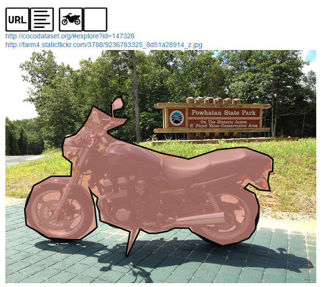
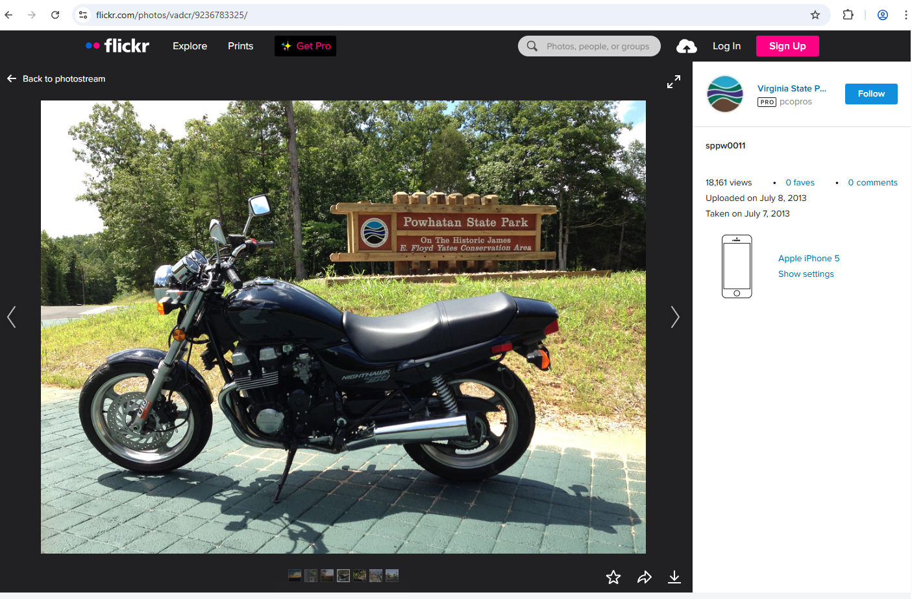

# COCO Dataset (2017)

The [Common Objects in COntext (COCO)][coco] is a large image dataset that contains annotations for both object detection (2D bounding boxes) and object segmentation (image masks).   The latest dataset is the 2017 version, which contains over 330k images, each annotated with 80 object categories and 5 captions.  The dataset is maintained by the [COCO Consortium][consort].

We maintain a copy of the latest version of the COCO dataset (the 2017 version) in EdgeFirst Studio for non-commercial, research purposes only.  This copy only contains:

* 118k training images with 2D bounding boxes and segmentation masks
* 5k validation images with 2D bounding boxes and segmentation masks
* 80 object categories

While individual images may be available for commercial use, the dataset as a whole should not be considered available for commercial use.

## Terms of Use
The COCO dataset has two, separate [terms of use][terms]:

* The annotation set belongs to the COCO Consortium and is licensed under the [Creative Commons Attribution 4.0 License][creative].
* The images in the dataset are licensed under the [Flickr Terms of Use][flickr].

If you use the dataset in your research or development work, it is requested that you also cite the [Microsoft COCO: Common Objects in Context][paper] paper describing the dataset.

### How to find the license for a specific image
The license for specific images can be found by:

1. In the COCO 2017 Public dataset in EdgeFirst Studio, get the file name of the image.  Partial file names work as well.
    <figure markdown="span">
    {align=center}
    <figcaption>Filename of the Motorcycle</figcaption>
    </figure>

2. Go to the [download][download] page and download the "2017 Train/Val annotations \[241MB\]" Zip file.
    <figure markdown="span">
    {align=center}
    <figcaption>COCO 2017 Annotations Download</figcaption>
    </figure>
3. Unzip the "instances_train2017.json" and "instances_val2017.json" into a directory.
4. In the same directory, copy the following Python script.
    ```python
    import json
    import sys

    def search_anno_json(json_file:str, image_text:str):

        try:
            with open(json_file, 'r') as jf_obj:
                data = json.load(jf_obj)
        except Exception as e:
            print(e)
            return

        licenses = data['licenses']

        for image in data['images']:
            if image_text in image['file_name']:
                lic = licenses[image['license']]['name']
                url = licenses[image['license']]['url']
                print(f"In '{json_file}', image '{image['file_name']}' has license '{lic} ( {url} )'")

    if __name__ == "__main__":
        if len(sys.argv) != 2:
            print(f"This script expects 1 argument, not {len(sys.argv)-1}.")
            exit(10)

        search_anno_json("instances_train2017.json", sys.argv[1])
        search_anno_json("instances_val2017.json", sys.argv[1])
    ```
4. Run the script, with the image file name as the only argument:
    ```shell
    python .\find_license.py 147328
    In 'instances_train2017.json', image '000000147328.jpg' has license 'Attribution-NonCommercial License ( http://creativecommons.org/licenses/by-nc/2.0/ )'
    ```

The specific Creative Commons sublicence types are described [here][sublic].

### How to find the specific creator of a COCO image
Most of the images in the COCO dataset will require you to attribute the image to its original creator. The following process will get you this information.

1. As mentioned above, get the file name of the image.
2. Go to the [COCO Explore Dataset][explore] page and enter the name in the search field. All you need is the non-zero number of the file name without an extension.
    <figure markdown="span">
    {align=center}
    <figcaption>Motorcycle COCO page</figcaption>
    </figure>
3. Click on the "URL" button to reveal the Flickr link. Copy the number after the final slash and before the first underscore: `9236783325` in the example below.
    <figure markdown="span">
    {align=center}
    <figcaption>Motorcycle COCO page</figcaption>
    </figure>
4. Append the number above to the following URL `https://www.flickr.com/photo.gne?id=`. For this example, with the above number, the link should look like `https://www.flickr.com/photo.gne?id=9236783325`.
5. Put that link into your browser. It will take you to the Flickr page of that image. For this example, the original creator of the image is "Virginia State Parks - Marketing Photos".
    <figure markdown="span">
    {align=center}
    <figcaption>Motorcycle page with creator</figcaption>
    </figure>

## COCO Labels
These are the list of 80 labels or classes in the COCO dataset.

```shell
person
bicycle
car
motorcycle
airplane
bus
train
truck
boat
traffic light
fire hydrant
stop sign
parking meter
bench
bird
cat
dog
horse
sheep
cow
elephant
bear
zebra
giraffe
backpack
umbrella
handbag
tie
suitcase
frisbee
skis
snowboard
sports ball
kite
baseball bat
baseball glove
skateboard
surfboard
tennis racket
bottle
wine glass
cup
fork
knife
spoon
bowl
banana
apple
sandwich
orange
broccoli
carrot
hot dog
pizza
donut
cake
chair
couch
potted plant
bed
dining table
toilet
tv
laptop
mouse
remote
keyboard
cell phone
microwave
oven
toaster
sink
refrigerator
book
clock
vase
scissors
teddy bear
hair drier
toothbrush
```


[coco]: https://cocodataset.org/#home
[consort]: https://cocodataset.org/#people
[terms]: https://cocodataset.org/#termsofuse
[creative]:  https://creativecommons.org/licenses/by/4.0/legalcode
[flickr]: https://www.flickr.com/creativecommons/
[download]: https://cocodataset.org/#download
[paper]: https://arxiv.org/abs/1405.0312
[sublic]: https://creativecommons.org/share-your-work/cclicenses/
[explore]: https://cocodataset.org/#explore