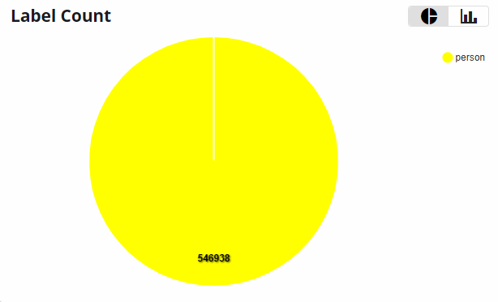
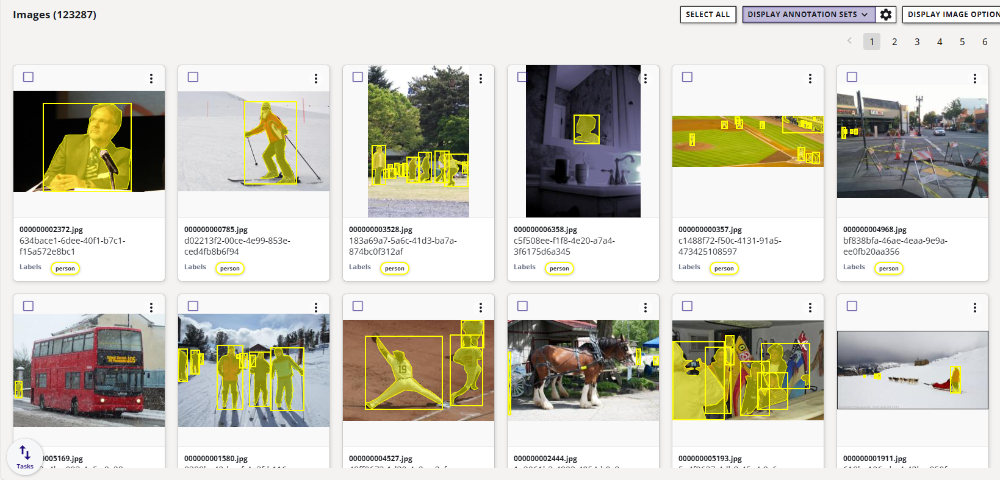

# COCO People dataset

This dataset is a subset of the original COCO dataset.  All annotations were filtered to retain only those corresponding to the person class, effectively removing all other object categories. The complete set of images from the original dataset is preserved — including those that no longer have any associated annotations after filtering.  Images without any person annotations are treated as negative samples, helping improve model robustness by providing background-only examples during training.

## Object Detection Benchmark (100 epochs)

=== "ONNX"

    **COCO Metrics - RGB - (640x640) | ONNX**

    | Model                            | mAP@0.5 | mAP@0.5..0.95 |
    |----------------------------------|---------|---------------|
    | modelpack-csp19-nano-640x640-rgb | 0.480   | 0.223         | 
    | ultralytics-yolov8n-640x640-rgb  | 0.620   | 0.410         |

    !!! note "Timing Benchmark"
        Time information is not included in this validation because they can change depending on the hardware quality of the cloud servers in EdgeFirst Studio. The timing benchmarks are provided when the models are run on specific platforms such as the [i.MX 8M Plus](#imx-8m-plus).

=== "i.MX 8M Plus"

    <h2 id="imx-8m-plus" style="display: none;"></h2>

    **COCO Metrics - RGB - (640x640) | TFLite | INT8**

    | Model                            | mAP@0.5 | mAP@0.5..0.95 | Time (ms) |
    |----------------------------------|---------|---------------|-----------|
    | modelpack-csp19-nano-640x640-rgb | 0.196   | 0.073         | 10.63     | 
    | ultralytics-yolov8n-640x640-rgb  | 0.583   | 0.374         | 137.43    | 

    !!! note "BSP Version"
        **i.MX 8M Plus** is flashed with [NXP Yocto BSP](https://www.nxp.com/design/design-center/software/embedded-software/i-mx-software/embedded-linux-for-i-mx-applications-processors:IMXLINUX) 6.12.

## Dataset Information

**Groups**:

- train: 64115 Images
- val: 2693 images

It contains 123,287 images in total and one class.

!!! info "Ungrouped Images"
    There are 56,479 images in this dataset that are not associated to
    the train or val groups.

<figure markdown="span">
{ align=center }
</figure>

## Image Gallery

<figure markdown="span">
{ align=center }
</figure>

## License

TBA
