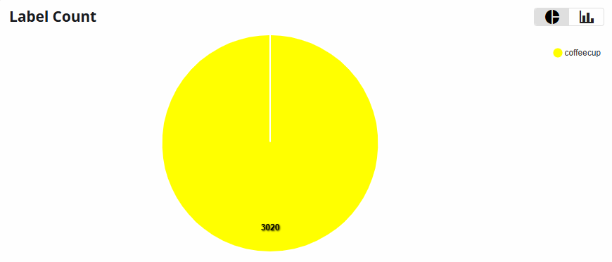
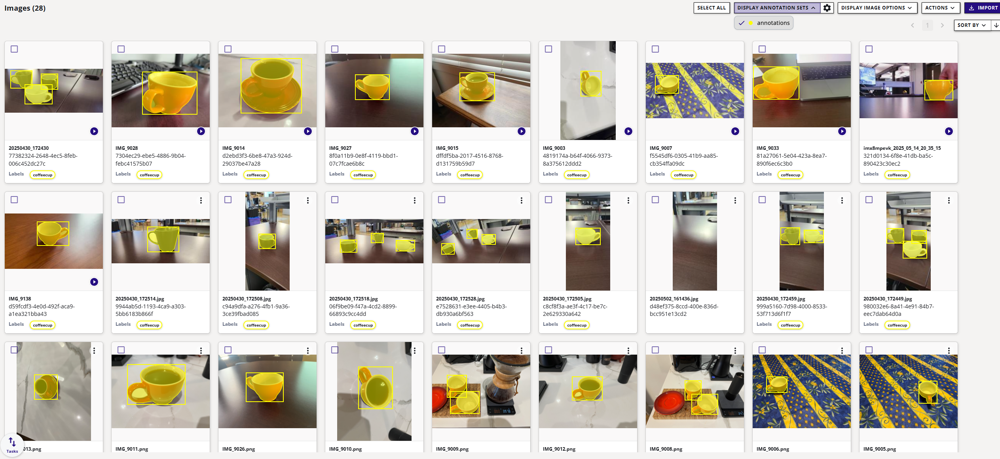

# Coffee Cup Dataset

The Coffee Cup dataset is part of our [Data Capture Tutorial](../../datasets/tutorials/capture.md).  The dataset has different types of coffee cups on different poses and surfaces with annotations for Object Detection and Semantic Segmentation.

## Object Detection Benchmark (50 epochs)

These tables provide the object detection and segmentation metrics for Vision models trained on the Coffee Cup dataset.

=== "ONNX"

    **COCO Metrics - RGB - (640x640) | ONNX**

    | Model                              | mAP@0.5 | mAP@0.5..0.95 | seg-mAP@0.5 | seg-mAP@0.5..0.95 |  
    |------------------------------------|---------|---------------|-------------|-------------------|
    | modelpack-csp19-medium-640x640-rgb | 0.995   | 0.978         | 0.891       | 0.863             |
    | ultralytics-yolov8n-640x640-rgb    | 0.993   | 0.991         | 0.993       | 0.982             |

    !!! note "Timing Benchmark"
        Time information is not included in this validation because they can change depending on the hardware quality of the cloud servers in EdgeFirst Studio. The timing benchmarks are provided when the models are run on specific platforms such as the [i.MX 8M Plus](#imx-8m-plus).

=== "i.MX 8M Plus"

    <h2 id="imx-8m-plus" style="display: none;"></h2>

    **COCO Metrics - RGB - (640x640) | TFLite | INT8**

    | Model                              | mAP@0.5 | mAP@0.5..0.95 | seg-mAP@0.5 | seg-mAP@0.5..0.95 | Time (ms) |
    |------------------------------------|---------|---------------|-------------|-------------------|-----------|
    | modelpack-csp19-medium-640x640-rgb | 0.995   | 0.911         | 0.884       | 0.856             | 45.53     |  
    | ultralytics-yolov8n-640x640-rgb    | 0.995   | 0.891         | 0.995       | 0.970             | 170.89    |  

    !!! note "BSP Version"
        **i.MX 8M Plus** is flashed with [NXP Yocto BSP](https://www.nxp.com/design/design-center/software/embedded-software/i-mx-software/embedded-linux-for-i-mx-applications-processors:IMXLINUX) 6.12.

## Dataset Information

**Groups**:

- train: 915 images
- val: 229 images

The dataset contains a total of 1399 images and one class.

!!! info "Ungrouped Images"
    There are 255 images in this dataset that are not associated to
    the train or val groups. 

<figure markdown="span">
{ align=center }
</figure>

## Dataset Gallery

<figure markdown="span">
{ align=center }
</figure>

## License

TBA
