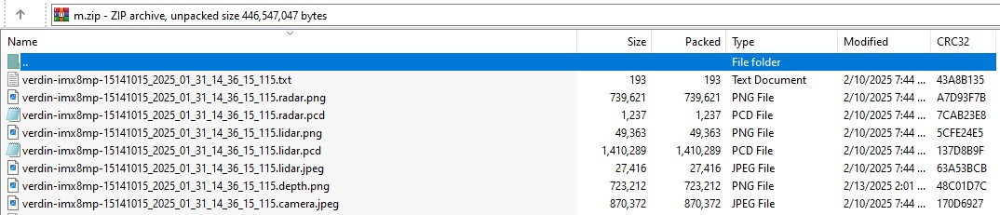
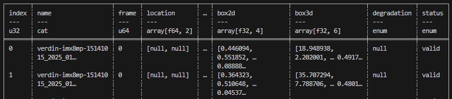

# EdgeFirst Dataset Format

This article describes the structure of the *EdgeFirst Dataset Format*. EdgeFirst 
Datasets support various sample datatypes, they are split into sensor data 
and annotation data. Sensor data should be treated as static and not changed after capture. 
Meanwhile, annotation datatypes are dynamic and will be created and edited many times after capture 
as we first generate automated annotations and then perform audits on these automatic annotations.

The *Dataset Storage Format* is the container used to store sensor data from the
MCAP recordings which includes the camera, LiDAR, Radar, and Depth estimations. The
*Dataset Annotation Format* is the container used to store dataset annotations which 
includes object label, 2D bounding boxes, segmentations masks, 3D bounding boxes, etc.

## Dataset Storage Format

The ZIP format was chosen as the container for the sensor data as it is
a widely supported standard format which has been around for a long time, 
every system supports ZIP (ZIP64 was standardized in 2001). The ZIP format 
supports random access as it uses a file index, then each individual file is optionally compressed. 

### Dataset Hierarchy

EdgeFirst Datasets are captured from MCAP recordings and maintain a relation 
from their original MCAP file through the directory holding all the samples for 
a given recording. Each of these directories are then combined into the dataset.  

The MCAP recordings use the `hostname_date_time.mcap` naming convention, so we 
maintain this for directories as `hostname_date_time`, then the samples repeat this 
name but add the frame number and file extension.  

!!! note
    The frame numbers are not necessarily continuous nor complete, the MCAP could’ve 
    been cropped or downsampled, what’s important is the frame number is unique 
    for the given sequence and contains all the sample datatypes.

```
* Dataset
    * hostname_date_time
        * hostname_date_time_frame.camera.jpeg (camera frame)
        * hostname_date_time_frame.depth.png (camera depthmap)
        * hostname_date_time_frame.radar.png (radar cube)
        * hostname_date_time_frame.radar.pcd (radar point cloud)
        * hostname_date_time_frame.lidar.png (lidar depth map)
        * hostname_date_time_frame.lidar.pcd (lidar point cloud)
        * hostname_date_time_frame.lidar.jpeg (lidar reflectivity)
```

The following figure is a visualization of the typical contents in a Zip file.

<figure markdown="span">
{ align=center }
<figcaption>Sample Zip Contents</figcaption>
</figure>

#### Camera

Camera data is captured on the Maivin as an H.265 encoded video into the MCAP stream. 
During conversion from MCAP to the EdgeFirst Dataset Format we need to convert and align 
all the sensor streams into discrete dataset samples. As part of this the H.265 video 
is converted into images, either JPEG (default) or PNG.

The camera images also include additional meta-data in the EXIF tags which are 
gathered from the MCAP recording. For example the global location of where the sample 
was captured can be embedded into the image’s EXIF using the NavSat topic from the MCAP, if present.

#### Radar

The radar data is collected in two forms, the point-cloud data and the low-level radar data cube. 
While the data cube is optional, we expect it to be present in datasets used for training 
the [Fusion model](../models/fusion/index.md) which is trained to consume the low-level 
radar data cube. The point-cloud data is most useful during the annotation process 
as a way of viewing the spatial detections from the radar.

The radar point-cloud data is stored using the standard PCD format and encodes the following fields.

```
* x, y, z cartesian location in meters
* speed in m/s
* power
* noise
* rcs
```

The radar data cube is a range-doppler data cube. It is recorded as the raw data cube 
multi-dimensional array in the MCAP recording and encoded into a 16bit PNG when 
converting into the EdgeFirst Dataset Format. The 16bit PNG is a lossless conversion 
and provides an easier to consume format for visualization and transport.

The radar cube array contains the following dimensions: `sequence, rx_antenna, range_bins, doppler_bins`. 
The array is stored as complex int16 values. The typical cube shape is `[2, 4, 200, 256]` 
for `[sequence, rx_antenna, range_bins, doppler_bins]`, though it is common to crop range_bins and 
doppler_bins depending on the radar configuration. Typically only doppler varies in the 
dataset depending on the radar configurations while range will be cropped when 
training or running the RadarExp model.

For the PNG encoding the radar cube array is arranged into a 4x2 grid (WxH) where 
each cell in the grid is the range-doppler matrix, with the complex int16 split into 
a pair of int16 (PNG does not support complex numbers); this results in the matrix 
being double the normal width.  The RX antennas are separated into columns (4) and the 
sequences into rows (2). So for the standard cube shape noted above we produce an 
image of size 2048x400, four columns of double wide (complex pairs) 
range-doppler matrices (4*2*256), and two rows of these range-doppler 
matrices which typically contain 200 range bins.

The radar cube has a wide dynamic range though most data is near zero, 
making visualization challenging. It is suggested to normalize the cube for 
visualization by following the conventions documented in the [Radar Normalizers](TBA) article.

#### LiDAR

The LiDAR data is stored as PCD based on the Maivin MCAP Recorder configuration. 
We’re currently working on defining the specific configuration for the LiDAR and 
will update this section once these details are finalized.

## Dataset Annotation Format

The Arrow file format was chosen as the container for the dataset annotations. 
The [Apache Arrow](https://arrow.apache.org/) is an open source, column-oriented 
data file format designed for in-memory computing and efficient data storage and retrieval. 
It provides high performance compression and encoding schemes to handle complex data 
in bulk and is supported in many programming languages and analytics tools.

We use [Polars](https://pola.rs/) to interface with the Arrow files. Polars has an 
SDK for [Python](https://pypi.org/project/polars/), [Javascript](https://www.npmjs.com/package/nodejs-polars), and 
[Rust](https://crates.io/crates/polars). An SQL-based CLI interface is also available.

### Annotation Schema

The annotations are represented as a dataframe based on an underlying schema that
describes each column of the dataframe. The schema for the annotations is explicit
in describing the column name, the column type, and the column categories or shapes
in order to maintain consistency in data representations. However, the schema remains 
dynamic where new columns can be added. The following schema is a typical representation
of the annotations. 

```
('name', Categorical(ordering='physical')),
('frame', UInt64),
('group', Enum(categories=['train', 'val'])),
('label', Enum(categories=['person'])),
('mask', List(Float32)),
('box2d', Array(Float32, shape=(4,))),
('box3d', Array(Float32, shape=(6,))),
('location', Array(Float64, shape=(2,))),
('pose', Array(Float64, shape=(3,))),
('degradation', Enum(categories=['low', 'medium', 'high']))
('status', Enum(categories=['valid','edit']))
```

The following figure visualizes the contents in a sample dataframe.

<figure markdown="span">
{ align=center }
<figcaption>Sample DataFrame</figcaption>
</figure>

It is important to consider that an annotation is attached to a sample and that samples 
read from the archive (ZIP) should be used as the primary source of records. Not 
all samples have annotations and we generally want to train models using all samples, 
with the understanding that no annotations means no objects of interest (the dataset should have been fully audited). 
So if we’re interested in detecting people we would want to include images without people, 
which for a dataset with only people in it would mean images without annotations. 

It is also important to consider the inputs to our model when reading samples from the archive 
so that we only pull samples that include our desired input type. The *EdgeFirst Dataset Format* 
supports various input types: camera images, radar data cubes, radar point-clouds, and lidar point-clouds. 
When querying samples from the archive we should filter for those that include all our desired input types.

#### Name

A sample identifier is used to cross-reference the collections of data, 
the sample identifier is a unique string common for all the various sensor data and annotations for a single sample.  
The sample identifier can also be made of a pair of string and integer representing the sequence and frame number, 
this is the representation used when converting from an MCAP recording.

#### Frame

The Frame number directly maps to the specific camera frame stored in the archive (ZIP). 
This column allows us to query the annotations that exists only for that specific frame(s).
The values stored in this column are integers. 

#### Group

Since we must attribute samples to a specific dataset split (training, validation) 
we use this split attribute, referred to as the *group*, as our primary source of records. 
Users should ensure they either use the group or the samples within the archives as their primary source of records, 
when using groups they should ensure all samples within the archives have an associated group. 
The typical group associated are `("train", "val")`.

#### Label

The label specifies the label of the target annotation. This is a string to 
indicate the object classification. For example, this annotation is a "person".

#### Mask

These annotations are in camera coordinates and provide the coordinates within
a camera image to where the annotated object exists. The mask is an array
of Float32 values which are normalized x and y coordinates as part of the 
polygon that traces the shape of the target object. This array is a flattened
array, but to represent multiple polygons, `NaN` values are placed to separate
individual polygons. 

#### Box2D

These annotations are in camera coordinates and provide the coordinates within
a camera image to where the annotated object exists. The 2D bounding boxes
provide normalized x and y coordinates to a bounding box center along with
the width and height of the box in this format `[xc, yc, width, height]`. This
box should surround a target object we wish to identify.

#### Box3D

The 3D boxes provide the absolute x, y, z coordinates to an object in world
coordinates (typically meters) with the capture device, such as the Maivin, as the 
origin coordinate (0, 0, 0). The coordinates are in floating point meters. The
bounding box also include the depth, width, height of the bounding box. 

!!! note
    We follow the 3D orientation as the [Sensor Coordinate Frame](https://static.ouster.dev/sensor-docs/image_route1/image_route2/sensor_data/sensor-data.html#sensor-coordinate-frame)
    which is consistent with the standard followed by [ROS](https://www.ros.org/reps/rep-0103.html#coordinate-frame-conventions).
    In this frame, the x-axis points forward, the y-axis points left, and the z-axis points up.

The 3D bounding box will be stored in this format `[x, y, z, depth, width, height]`.

#### Location

The location field is saved as an array of floats which represent the 
(longitude, latitude) of the location.

#### Pose

The pose field is saved as an array of float which represent the Roll Pitch 
and Yaw of the camera in degrees.

#### Degradation

This column is optional, but it is mentionable to highlight the dynamic schemas 
characteristic. This column identifies the level of degradation imposed
on the images during recording. The values can either be `[None, "low", "medium", "high"]`.
None could indicate the camera is not obstructed at all and the objects are
entirely visible. A low degradation could indicate there is some level of obstruction on the
camera, but the targets are still quite visible. A medium degradation could indicate a higher
obstruction and the targets are visible, but it's not very obvious. A high degradation could
indicate the camera is completely obstructed and the objects cannot be seen anymore.

A good example of these degradations is provided for the *Blur augmentation* under [Vision Augmentations](../models/augmentations.md#blur).

#### Status

The status column is generated during the auto-annotations which provides values
as either "valid" or "edit". This helps us identify which samples requires the most
attention as denoted by the "edit" status. An "edit" status is based on an incomplete
set of annotations. For example, a segmentation mask could exist for this annotation,
but it is missing a 3D bounding box, etc. A "valid" status indicates a complete
set of annotations a 2D bounding box, segmentation mask, and a 3D bounding box.