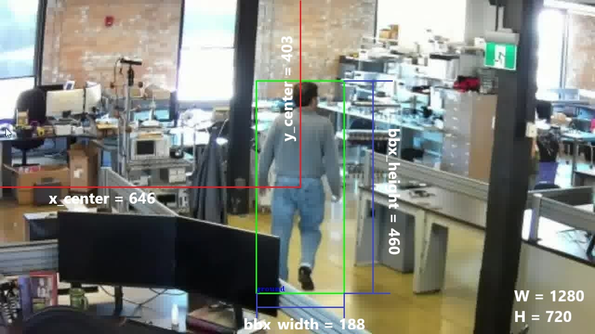
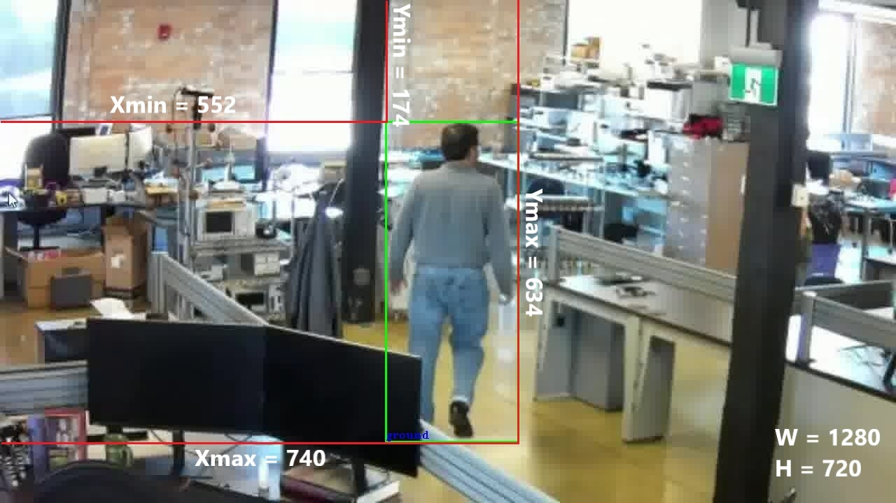
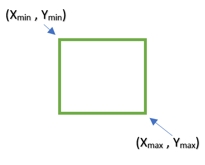
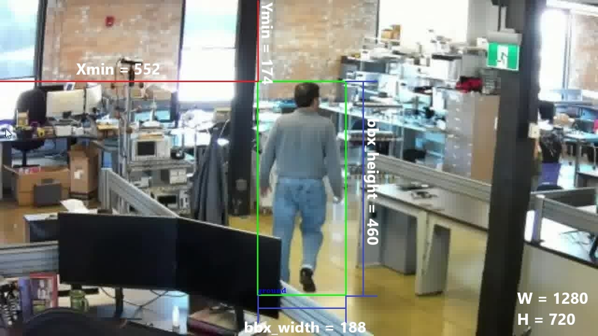

# 2D Bounding Box Formats

This section describes the different formats of 2D bounding box annotations.  These annotation formats are different ways of representing the same annotation and position of the bounding boxes surrounding the objects in an image.

## Annotation Formats

Currently, there are three recognized formats:

1. [YOLO](https://docs.ultralytics.com/datasets/detect/)
2. [PASCAL VOC](https://labelformat.com/formats/object-detection/pascalvoc/)
3. [COCO](https://cocodataset.org/#format-data)

### YOLO Format

The YOLO format describes the bounding boxes in the following way: `class xc yc width height`.

The class is an integer which represents the object class ID.  The object class ID represents the index of the object in a unique set of labels.

For example, if the unique set of labels is the following below.

```
background
person
car
```

If the object class ID is 1, then the object label would be "person". Similarly, 2 would point to "car" and 0 is "background".

Consider the following image below as a reference with a bounding box around the person in the center of the image.

<figure markdown="span">
{ align=center }
<figcaption>YOLO Format</figcaption>
</figure>

The coordinate *xc* represents the center of the bounding box normalized to the image width, *W*.  This means that if *x_center* is the x-coordinate of the center of the bounding box in pixels, then 

```
xc = x_center/W
xc = 646/1280 = 0.5046875
```

The coordinate *yc* has the same idea, except that this coordinate is normalized to the image height, *H*.  This means that if *y_center* is the y-coordinate of the center of the bounding box in pixels, then

```
yc = y_center/H
yc = 403/720 = 0.5597222
```

The *width* is not the width of the image.  The *width* is the normalized width of the bounding box.  This means that if *bbx_width* represents the width of the bounding box in pixels, then

```
width = bbx_width/W
width = 188/1280 = 0.146875
```

The *height* has the same idea, except that this dimension is normalized to the height of the image.  This means that if *bbx_height* represents the height of the bounding box in pixels, then

```
height = bbx_height/H
height = 460/720 = 0.6388889
```

!!! note
    The values for *xc, yc, width, and height* are floating-point values. 

Finally, a text file annotation in a Darknet dataset would contain the line `1 0.5046875 0.5597222 0.146875 0.6388889`.

### PascalVOC Format

The PASCAL VOC format describes the bounding boxes in the following way: `class x1 y1 x2 y2`.

The class follows the same idea as the YOLO format above.  However, the coordinates are represented differently.

Consider the following image below as a reference with a bounding box around the person in the center of the image.

<figure markdown="span">
{ align=center }
<figcaption>PascalVOC Format</figcaption>
</figure>

The coordinates point to the corners of the bounding box in pixels as shown below.

<figure markdown="span">
{ align=center }
<figcaption>Box Corners</figcaption>
</figure>

If the width of the image is *W*, and the height of the image is *H*, then the coordinates in PascalVOC format are described below.

```
x1 = Xmin/W = 552/1280 = 0.43125
y1 = Ymin/H = 174/720 = 0.241667
x2 = Xmax/W = 740/1280 = 0.578125
y2 = Ymax/H = 634/720 = 0.880556
```

!!! note
    The coordinates x1, y1, x2, and y2 are all floating-point values.

Finally, a text file annotation in a Darknet dataset would contain the line `1 0.43125 0.241667 0.578125 0.880556`.

### COCO Format

The COCO format is a combination of both YOLO and PascalVOC format and describes the bounding boxes in the following way: `class x1 y1 width height`.

The class follows the same idea as the YOLO format.  In addition, *x1* and *y1* follow the same calculations as the *x1* and *y1* in PascalVOC format.  Finally, the *width* and the *height* follow the same calculations as the YOLO format as these represent the normalized width and the height of the bounding box respectively. 

Consider the following image below as a reference with a bounding box around the person in the center of the image.

<figure markdown="span">
{ align=center }
<figcaption>COCO Format</figcaption>
</figure>

```
x1 = Xmin/W = 552/1280 = 0.43125
y1 = Ymin/H = 174/720 = 0.241667
width = bbx_width/W = 188/1280 = 0.146875
height = bbx_height/H = 460/720 = 0.638889
```

!!! note
    The coordinates x1, y1, x2, and y2 are all floating-point values.

Finally, a text file annotation in a Darknet dataset would contain the line `1 0.43125 0.241667 0.146875 0.638889`

## Further Reading

This section has described three different annotation formats for describing 2D bounding box annotations: YOLO, PascalVOC, and COCO. 

Next, take a look at the conventions followed for the [EdgeFirst Dataset Structure](../structure.md) which describes how the file structure is organized depending if the dataset is sequence-based or not.
