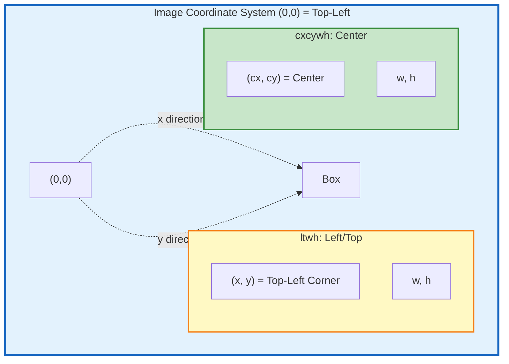

# Box Formats

EdgeFirst 2026.04 introduces **metadata-based format selection** for bounding boxes.
The `box2d_format` and `box3d_format` file-level metadata keys describe the array
layout so that readers can interpret box data without assumptions.

## Box2D

### Format Descriptors

The `box2d_format` metadata key selects the array element order:

| Value | Array Layout | JSON Fields | Description |
|-------|-------------|-------------|-------------|
| `cxcywh` | `[center_x, center_y, width, height]` | `{cx, cy, w, h}` | ML standard (YOLO, etc.) |
| `xyxy` | `[x_min, y_min, x_max, y_max]` | `{x1, y1, x2, y2}` | Corner-pair format |
| `ltwh` | `[left, top, width, height]` | `{x, y, w, h}` | COCO / Studio legacy format |

### Coordinate System

The `box2d_normalized` metadata key indicates whether coordinates are normalized:

| Value | Description |
|-------|-------------|
| `"true"` (default) | Coordinates in 0..1 range, resolution-independent |
| `"false"` | Pixel coordinates |

!!! note "Value representation differs by format"
    In Arrow/Parquet file metadata, all values are strings (`"true"`, `"false"`).
    In JSON files, use native boolean values (`true`, `false`).

### Default Behavior (Metadata Absent)

When `box2d_format` metadata is **absent**, the default depends on the storage format.
This preserves backward compatibility with files written before metadata was introduced.

| Storage Format | Default `box2d_format` | Reason |
|---------------|------------------------|--------|
| Arrow IPC | `cxcywh` | Backward compatibility with 2025.10 Arrow files |
| Parquet | `cxcywh` | New format, follows Arrow convention |
| JSON (file) | `ltwh` | Backward compatibility with Studio JSON-RPC API |
| JSON-RPC API | Always `ltwh` | Fixed protocol, cannot be changed |

!!! tip "When metadata IS present, it is authoritative"
    Regardless of storage format, the `box2d_format` metadata value overrides the
    default. A JSON file with `"box2d_format": "cxcywh"` uses center coordinates.

### Conversion Between Formats

```text
cxcywh → ltwh:  left = cx - w/2,  top = cy - h/2
ltwh → cxcywh:  cx = left + w/2,  cy = top + h/2

cxcywh → xyxy:  x_min = cx - w/2, y_min = cy - h/2, x_max = cx + w/2, y_max = cy + h/2
xyxy → cxcywh:  cx = (x_min + x_max) / 2, cy = (y_min + y_max) / 2,
                w = x_max - x_min, h = y_max - y_min
```

### Coordinate Diagram



### Example (1920 x 1080 image)

```text
JSON (ltwh):      {x: 0.683854, y: 0.342593, w: 0.015104, h: 0.050926}
Arrow (cxcywh):   [0.691406, 0.368056, 0.015104, 0.050926]

Pixel coordinates:
  Left:   0.683854 x 1920 = 1313 px
  Top:    0.342593 x 1080 = 370 px
  Width:  0.015104 x 1920 = 29 px
  Height: 0.050926 x 1080 = 55 px

  Center: (1313 + 29/2, 370 + 55/2) = (1327.5 px, 397.5 px)
  cx:     1327.5 / 1920 = 0.691406
  cy:     397.5  / 1080 = 0.368056
```

## Box3D

### Format Descriptor

The `box3d_format` metadata key describes the 3D box array layout:

| Value | Array Layout | Description |
|-------|-------------|-------------|
| `cxcyczwhl` | `[center_x, center_y, center_z, width, height, length]` | Center of bounding box |

### Dimension Axes

| Dimension | Axis | Description |
|-----------|------|-------------|
| Width (w) | X | X-axis extent |
| Height (h) | Y | Y-axis extent |
| Length (l) | Z | Z-axis extent |

All coordinates represent the **geometric center** of the 3D bounding box (not surface
or object centroid).

!!! warning "Corrected dimension order"
    The authoritative array order is `[cx, cy, cz, w, h, l]`. Earlier documentation
    may have listed `[x, y, z, l, w, h]` — that was a documentation error. The Rust
    `Box3d` struct field order `{x, y, z, w, h, l}` matches this array layout exactly.

### Coordinate System

The `box3d_normalized` metadata key indicates whether coordinates are normalized:

| Value | Description |
|-------|-------------|
| `"true"` (default) | Normalized 0..1 (e.g., camera-projected 3D boxes) |
| `"false"` | Absolute units, typically meters (LiDAR / ROS convention) |

### JSON Representation

Both JSON and DataFrame use the same field semantics:

```json
{
  "box3d": {
    "x": 0.45,
    "y": 0.12,
    "z": 0.03,
    "w": 0.08,
    "h": 0.06,
    "l": 0.15
  },
  "box3d_score": 0.94
}
```

**DataFrame equivalent**:

```python
box3d: [0.45, 0.12, 0.03, 0.08, 0.06, 0.15]
#       cx    cy    cz    w     h     l
```

### References

- [ROS Coordinate Conventions](https://www.ros.org/reps/rep-0103.html#coordinate-frame-conventions) (X=forward, Y=left, Z=up)
- [Ouster Sensor Frame](https://static.ouster.dev/sensor-docs/image_route1/image_route2/sensor_data/sensor-data.html#sensor-coordinate-frame)
