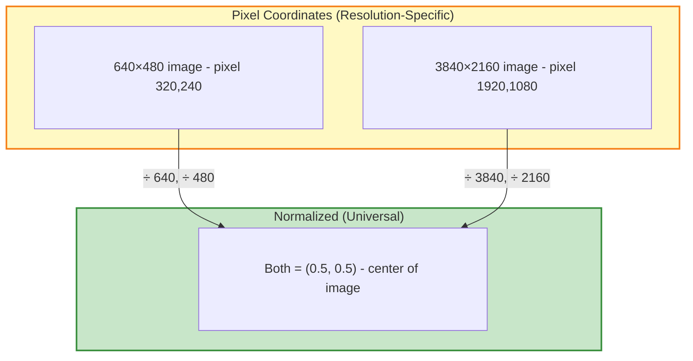

# Bounding Box Formats

This page explains how 2D bounding boxes work in the EdgeFirst Dataset Format, including coordinate systems, normalized coordinates, and the differences between Arrow and JSON formats.

## Understanding Normalized Coordinates

All coordinates in EdgeFirst are **normalized to 0–1 range**. This makes annotations independent of image resolution—the same annotation works for 640×480 images or 4K (3840×2160) images.

```text
normalized_x = pixel_x / image_width
normalized_y = pixel_y / image_height
```

### Why Normalization?



**Benefits**:

- Resize images without updating annotations
- Combine datasets with different resolutions
- Share models across camera resolutions

## Coordinate Systems

EdgeFirst uses **top-left origin** for image coordinates (same as most image libraries):

```text
(0,0) ─────────────────> x (normalized: 0 to 1)
  │
  │     Box example:
  │     ┌─────┐ (cx, cy) = center
  │     │  ●  │ 
  │     └─────┘
  │     width, height
  ▼
  y (normalized: 0 to 1)
```

## EdgeFirst Box2D Format

In the EdgeFirst Dataset Format, 2D bounding boxes are stored in the `box2d` column as a fixed-size array.

### Arrow Format (Primary)

The Arrow file stores `box2d` as a **center-based** array:

```python
box2d: Array(Float32, shape=(4,))  # [cx, cy, width, height]
```

| Index | Field | Description |
|-------|-------|-------------|
| 0 | `cx` | Center X coordinate (normalized 0–1) |
| 1 | `cy` | Center Y coordinate (normalized 0–1) |
| 2 | `width` | Box width (normalized 0–1) |
| 3 | `height` | Box height (normalized 0–1) |

**Example**:

```python
box2d = [0.691406, 0.368056, 0.015104, 0.050926]
#        cx        cy        width     height
```

This format aligns with ML frameworks like YOLO, making it efficient for training pipelines.

### JSON Format (Legacy)

The JSON format uses a **top-left corner** representation for legacy Studio API compatibility:

```json
{
  "box2d": {
    "x": 0.683854,
    "y": 0.342593,
    "w": 0.015104,
    "h": 0.050926
  }
}
```

| Field | Description |
|-------|-------------|
| `x` | Left edge (normalized 0–1) |
| `y` | Top edge (normalized 0–1) |
| `w` | Box width (normalized 0–1) |
| `h` | Box height (normalized 0–1) |

!!! warning "Format Difference"
    The Arrow and JSON formats use different coordinate origins:

    - **Arrow**: Center-based `[cx, cy, w, h]`
    - **JSON**: Top-left `{x, y, w, h}` (legacy)
    
    The [`edgefirst_client`](../../perception/api/studio.md) library handles these conversions automatically.

### Conversion Between Formats

**Arrow → JSON** (center to top-left):

```python
x = cx - width / 2
y = cy - height / 2
# w, h stay the same
```

**JSON → Arrow** (top-left to center):

```python
cx = x + width / 2
cy = y + height / 2
# w, h stay the same
```

## Box2D in the Schema

The `box2d` field is one column in the annotation schema. Related fields include:

| Column | Type | Description |
|--------|------|-------------|
| `label` | Categorical | Object class (e.g., "person", "car") |
| `label_index` | UInt64 | Numeric index for ML models |
| `box2d` | Array(Float32, 4) | 2D bounding box `[cx, cy, w, h]` |
| `box3d` | Array(Float32, 6) | 3D bounding box |
| `mask` | List(Float32) | Segmentation polygon |
| `object_id` | String | UUID for tracking across frames |

See [Annotation Schema](schema.md) for the complete field reference.

!!! tip "How boxes are created"
    In EdgeFirst Studio, bounding boxes can be created through:

    - **[Manual annotation](../../studio/agtg.md)**: Draw boxes directly on images in the Instance Dashboard
    - **[Automatic annotation (AGTG)](../../studio/agtg.md)**: AI-powered detection using SAM-2 generates `box2d` automatically
    - **[Model inference](../../models/index.md)**: Running trained models on datasets creates predicted boxes
    
    All methods store boxes in the center-based format in the Arrow file.

!!! tip "edgefirst-client abstracts format differences"
    The [`edgefirst_client`](../../perception/api/studio.md#edgefirst_client.Box2d) Python library handles format conversions automatically, allowing you to work with your preferred coordinate system regardless of how annotations are stored internally.

## 3D Bounding Boxes

The `box3d` column stores 3D bounding boxes in world coordinates:

```python
box3d: Array(Float32, shape=(6,))  # [x, y, z, width, height, length]
```

| Index | Field | Description |
|-------|-------|-------------|
| 0 | `x` | Center X in meters |
| 1 | `y` | Center Y in meters |
| 2 | `z` | Center Z in meters |
| 3 | `width` | Width (Y-axis) |
| 4 | `height` | Height (Z-axis) |
| 5 | `length` | Length (X-axis) |

**Coordinate frame**: ROS convention (X=forward, Y=left, Z=up)

**Origin**: Center of capture device (e.g., Maivin) at (0, 0, 0)

!!! note "Consistent format"
    Unlike `box2d`, the `box3d` format is **identical** in both Arrow and JSON—both use center-point representation.

## Common Box Format Standards

For reference, here's how EdgeFirst compares to other common formats:

| Format | Representation | Used By |
|--------|---------------|---------|
| **EdgeFirst Arrow** | `[cx, cy, w, h]` (center) | Arrow files, ML training |
| **EdgeFirst JSON** | `{x, y, w, h}` (top-left) | Legacy Studio API |
| **YOLO** | `cx cy w h` (center, normalized) | Darknet, Ultralytics |
| **COCO** | `[x, y, w, h]` (top-left, pixels) | MS COCO dataset |
| **Pascal VOC** | `[x1, y1, x2, y2]` (corners, pixels) | Pascal VOC dataset |

The EdgeFirst Arrow format aligns with YOLO conventions, making it straightforward to use with popular ML frameworks.

## Debugging Boxes

If your boxes look wrong, check these common issues:

| Problem | Cause | Fix |
|---------|-------|-----|
| Box appears too small | Coordinates in pixels, not normalized | Divide by image width/height |
| Box off-center | Using JSON format as Arrow | Convert: `cx = x + w/2` |
| Box position wrong | Coordinate origin confusion | Verify top-left (0,0) origin |
| Box too large | Swapped width/height | Check order of w and h |

## Further Reading

- [Annotation Schema](schema.md) — Complete field reference for all annotation columns
- [Sensors](sensors.md) — Understand camera specifications and EXIF data
- [Dataset Organization](structure.md) — How files are organized on disk
- [Format Conversion](conversion.md) — Converting between Arrow and JSON
- [AGTG (Automatic Annotation)](../../studio/agtg.md) — Auto-generate box annotations using AI
- [Model Training](../../models/training/vision.md) — Train object detection models with your boxes
- [edgefirst-client API](../../perception/api/studio.md) — Python API for working with annotations
