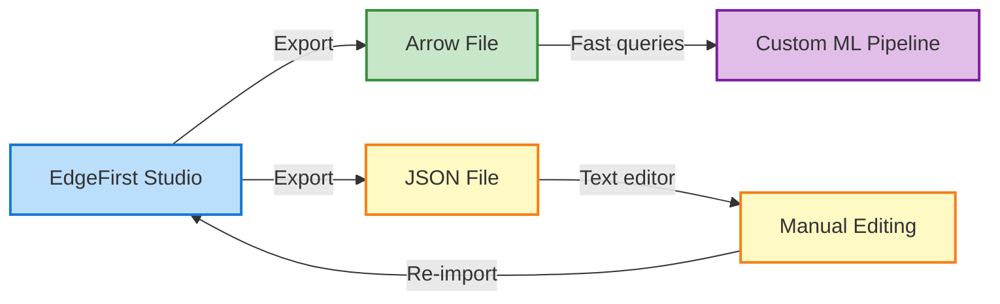

# Format Conversion: Arrow ↔ JSON

This page shows you how to convert between Arrow and JSON annotation formats when working with datasets outside of EdgeFirst Studio.

## Why Convert?

**Most users don't need to convert formats manually.** EdgeFirst Studio handles all format conversions internally—when you upload snapshots, restore datasets, or export annotations, Studio manages the underlying format automatically.

Manual conversion is useful when:

- **Building custom ML pipelines** outside of Studio that need Arrow's fast columnar queries
- **Editing annotations manually** in a text editor (JSON is human-readable)
- **Integrating with third-party tools** that expect a specific format
- **Analyzing annotation statistics** with Polars or pandas DataFrames



## JSON → Arrow Conversion

Converting from JSON (human-friendly) to Arrow (ML-optimized).

### Python Code

```python
import polars as pl
import json
from typing import List, Dict, Any

def json_to_arrow(json_file: str, output_arrow: str):
    """Convert JSON annotations to Arrow format."""
    
    # Load JSON data
    with open(json_file, 'r') as f:
        samples = json.load(f)
    
    # List to collect all annotation rows
    rows = []
    
    for sample in samples:
        # Extract sample-level metadata (same for all annotations)
        name = sample.get('image_name', '').replace('.camera.jpeg', '').replace('.jpg', '')
        frame = sample.get('frame_number')
        group = sample.get('group', 'train')
        
        # Extract sample metadata (new in 2025.10)
        size = None
        if 'width' in sample and 'height' in sample:
            size = [sample['width'], sample['height']]
        
        # GPS coordinates: nested object → array [lat, lon]
        location = None
        if sample.get('sensors', {}).get('gps'):
            gps = sample['sensors']['gps']
            location = [gps.get('latitude'), gps.get('longitude')]
        
        # IMU orientation: nested object → array [roll, pitch, yaw]
        pose = None
        if sample.get('sensors', {}).get('imu'):
            imu = sample['sensors']['imu']
            pose = [imu.get('roll'), imu.get('pitch'), imu.get('yaw')]
        
        degradation = sample.get('degradation')
        
        # Process each annotation in the sample
        for ann in sample.get('annotations', []):
            
            # Box2D: JSON {x, y, w, h} → Arrow [cx, cy, w, h]
            box2d = None
            if 'box2d' in ann:
                b = ann['box2d']
                box2d = [
                    b['x'] + b['w'] / 2,    # cx = left + width/2
                    b['y'] + b['h'] / 2,    # cy = top + height/2
                    b['w'],                  # width
                    b['h']                   # height
                ]
            
            # Box3D: JSON object → Array [x, y, z, w, h, l]
            box3d = None
            if 'box3d' in ann:
                b = ann['box3d']
                box3d = [b['x'], b['y'], b['z'], b['w'], b['h'], b['l']]
            
            # Mask: JSON nested lists → flat array with NaN separators
            mask = None
            if 'mask' in ann and 'polygon' in ann['mask']:
                polys = ann['mask']['polygon']
                flat = []
                for i, poly in enumerate(polys):
                    if i > 0:
                        flat.append(float('nan'))  # Separator between polygons
                    for point in poly:
                        flat.extend(point)
                mask = flat if flat else None
            
            # Create Arrow row
            row = {
                'name': name,
                'frame': frame,
                'object_id': ann.get('object_id'),
                'label': ann.get('label_name'),
                'label_index': ann.get('label_index'),
                'group': group,
                'box2d': box2d,
                'box3d': box3d,
                'mask': mask,
                'size': size,
                'location': location,
                'pose': pose,
                'degradation': degradation,
            }
            
            rows.append(row)
    
    # Create Arrow table and save
    df = pl.DataFrame(rows)
    df.write_ipc(output_arrow)
    print(f"✅ Saved {len(df)} annotations to {output_arrow}")

# Usage
json_to_arrow('annotations.json', 'dataset.arrow')
```

### Key Conversions

| JSON | → | Arrow |
|------|---|-------|
| `label_name` | → | `label` |
| `group` | → | `group` |
| Box2D `{x, y, w, h}` | → | `[cx, cy, w, h]` |
| GPS nested object | → | Array `[lat, lon]` |
| IMU nested object | → | Array `[roll, pitch, yaw]` |
| Mask nested polygons | → | Flat array + NaN separators |

---

## Arrow → JSON Conversion

Converting from Arrow (ML-optimized) to JSON (human-friendly).

### Python Code

```python
import polars as pl
import json
from typing import List, Dict, Any

def arrow_to_json(arrow_file: str, output_json: str):
    """Convert Arrow annotations to JSON format."""
    
    # Load Arrow data
    df = pl.read_ipc(arrow_file)
    
    # Group by sample (name, frame)
    samples_dict = {}
    
    for row in df.iter_rows(named=True):
        sample_key = (row['name'], row['frame'])
        
        if sample_key not in samples_dict:
            # Create sample object (only once per unique sample)
            sample = {
                'image_name': f"{row['name']}.camera.jpeg",
                'frame_number': row['frame'],
                'group': row['group'],
                'annotations': []
            }
            
            # Add size if available
            if row.get('size'):
                sample['width'] = int(row['size'][0])
                sample['height'] = int(row['size'][1])
            
            # Add sensors if available
            sensors = {}
            
            if row.get('location'):
                sensors['gps'] = {
                    'latitude': float(row['location'][0]),
                    'longitude': float(row['location'][1])
                }
            
            if row.get('pose'):
                sensors['imu'] = {
                    'roll': float(row['pose'][0]),
                    'pitch': float(row['pose'][1]),
                    'yaw': float(row['pose'][2])
                }
            
            if sensors:
                sample['sensors'] = sensors
            
            # Add degradation if present
            if row.get('degradation'):
                sample['degradation'] = row['degradation']
            
            samples_dict[sample_key] = sample
        
        # Add annotation to sample
        sample = samples_dict[sample_key]
        
        # Box2D: Arrow [cx, cy, w, h] → JSON {x, y, w, h}
        ann = {}
        if row.get('box2d'):
            b = row['box2d']
            ann['box2d'] = {
                'x': float(b[0] - b[2] / 2),   # x = cx - w/2
                'y': float(b[1] - b[3] / 2),   # y = cy - h/2
                'w': float(b[2]),               # w
                'h': float(b[3])                # h
            }
        
        # Box3D: Array [x, y, z, w, h, l] → JSON object
        if row.get('box3d'):
            b = row['box3d']
            ann['box3d'] = {
                'x': float(b[0]),
                'y': float(b[1]),
                'z': float(b[2]),
                'w': float(b[3]),
                'h': float(b[4]),
                'l': float(b[5])
            }
        
        # Mask: flat array + NaN separators → nested polygons
        if row.get('mask'):
            mask_flat = row['mask']
            polygons = []
            current_poly = []
            
            for i in range(0, len(mask_flat), 2):
                if i + 1 < len(mask_flat):
                    x, y = mask_flat[i], mask_flat[i + 1]
                    
                    # Check for NaN separator
                    if isinstance(x, float) and isinstance(y, float):
                        if x != x or y != y:  # NaN check
                            if current_poly:
                                polygons.append(current_poly)
                                current_poly = []
                        else:
                            current_poly.append([float(x), float(y)])
            
            # Add last polygon
            if current_poly:
                polygons.append(current_poly)
            
            if polygons:
                ann['mask'] = {'polygon': polygons}
        
        # Add labels
        ann['label_name'] = row['label']
        ann['label_index'] = row['label_index']
        ann['object_id'] = row['object_id']
        
        sample['annotations'].append(ann)
    
    # Convert to list of samples
    samples = list(samples_dict.values())
    
    # Save JSON
    with open(output_json, 'w') as f:
        json.dump(samples, f, indent=2)
    
    print(f"✅ Saved {len(samples)} samples to {output_json}")

# Usage
arrow_to_json('dataset.arrow', 'annotations.json')
```

### Key Conversions

| Arrow | → | JSON |
|-------|---|------|
| `label` column | → | `label_name` field |
| `[cx, cy, w, h]` | → | Box2D `{x, y, w, h}` |
| Array `[lat, lon]` | → | GPS nested object |
| Array `[roll, pitch, yaw]` | → | IMU nested object |
| Flat array + NaN | → | Mask nested polygons |
| Grouped by (name, frame) | → | Sample with annotations[] |

---

## Complete Example

### Starting with JSON

```json
{
  "image_name": "scene_001.camera.jpeg",
  "frame_number": 0,
  "group": "train",
  "width": 1920,
  "height": 1080,
  "sensors": {
    "gps": {"latitude": 37.7749, "longitude": -122.4194},
    "imu": {"roll": 0.5, "pitch": -1.2, "yaw": 45.3}
  },
  "annotations": [
    {
      "label_name": "person",
      "label_index": 0,
      "object_id": "obj-001",
      "box2d": {"x": 0.43, "y": 0.24, "w": 0.15, "h": 0.64},
      "mask": {"polygon": [[[0.43, 0.24], [0.58, 0.24], [0.58, 0.88]]]}
    }
  ]
}
```

### After JSON → Arrow Conversion

```python
# Row in Arrow DataFrame
{
    'name': 'scene_001',
    'frame': 0,
    'label': 'person',
    'label_index': 0,
    'object_id': 'obj-001',
    'group': 'train',
    'box2d': [0.505, 0.56, 0.15, 0.64],      # [cx, cy, w, h]
    'size': [1920, 1080],                     # [width, height]
    'location': [37.7749, -122.4194],        # [lat, lon]
    'pose': [0.5, -1.2, 45.3],               # [roll, pitch, yaw]
    'mask': [0.43, 0.24, 0.58, 0.24, ...]   # flattened polygon
}
```

### Converting Back to JSON

```json
{
  "image_name": "scene_001.camera.jpeg",
  "frame_number": 0,
  "group": "train",
  "width": 1920,
  "height": 1080,
  "sensors": {
    "gps": {"latitude": 37.7749, "longitude": -122.4194},
    "imu": {"roll": 0.5, "pitch": -1.2, "yaw": 45.3}
  },
  "annotations": [
    {
      "label_name": "person",
      "label_index": 0,
      "object_id": "obj-001",
      "box2d": {"x": 0.43, "y": 0.24, "w": 0.15, "h": 0.64},
      "mask": {"polygon": [[[0.43, 0.24], [0.58, 0.24], [0.58, 0.88]]]}
    }
  ]
}
```

---

## Box2D Conversion Details

**⚠️ IMPORTANT**: Box2D coordinates change between formats!

### Arrow (Center) → JSON (Top-Left)

```python
# Arrow stores center-based: [cx, cy, w, h]
cx, cy, w, h = 0.5, 0.5, 0.3, 0.4

# Convert to JSON legacy: {x, y, w, h} (top-left)
x = cx - w / 2  # 0.5 - 0.15 = 0.35
y = cy - h / 2  # 0.5 - 0.20 = 0.30
# Result: {"x": 0.35, "y": 0.30, "w": 0.3, "h": 0.4}
```

### JSON (Top-Left) → Arrow (Center)

```python
# JSON legacy: {x, y, w, h} (top-left)
x, y, w, h = 0.35, 0.30, 0.3, 0.4

# Convert to Arrow center-based: [cx, cy, w, h]
cx = x + w / 2  # 0.35 + 0.15 = 0.50
cy = y + h / 2  # 0.30 + 0.20 = 0.50
# Result: [0.5, 0.5, 0.3, 0.4]
```

---

## Mask Conversion Details

### Nested (JSON) → Flat (Arrow)

```python
# JSON: nested list of polygons
mask_json = {
    "polygon": [
        [[0.4, 0.3], [0.6, 0.3], [0.6, 0.7]],  # polygon 1
        [[0.1, 0.1], [0.2, 0.1], [0.2, 0.2]]   # polygon 2
    ]
}

# Arrow: flat array with NaN separators
mask_arrow = [
    0.4, 0.3, 0.6, 0.3, 0.6, 0.7,  # polygon 1
    float('nan'), float('nan'),     # NaN separator
    0.1, 0.1, 0.2, 0.1, 0.2, 0.2   # polygon 2
]
```

### Flat (Arrow) → Nested (JSON)

```python
# Split on NaN values
import math

mask_arrow = [0.4, 0.3, 0.6, 0.3, 0.6, 0.7, float('nan'), ...]

polygons = []
current_poly = []

for i in range(0, len(mask_arrow), 2):
    x, y = mask_arrow[i], mask_arrow[i + 1]
    
    # Check for NaN
    if math.isnan(x) or math.isnan(y):
        polygons.append(current_poly)
        current_poly = []
    else:
        current_poly.append([x, y])

# Result: list of polygon coordinate lists
```

---

## Batch Conversion

Convert an entire directory of JSON files:

```python
from pathlib import Path
import polars as pl
import json

def batch_json_to_arrow(json_dir: str):
    """Convert all JSON files in directory to Arrow."""
    
    all_rows = []
    
    for json_file in Path(json_dir).glob("*.json"):
        with open(json_file, 'r') as f:
            samples = json.load(f)
        
        # ... (use json_to_arrow logic) ...
        # append rows to all_rows
    
    df = pl.DataFrame(all_rows)
    df.write_ipc(Path(json_dir) / "combined.arrow")
    print(f"✅ Saved {len(df)} annotations")

# Usage
batch_json_to_arrow("./annotations/")
```

---

## Troubleshooting

### Box positions are wrong after conversion

- ✅ Check if you're using the right coordinate system
- ✅ Verify JSON uses top-left `{x, y}` and Arrow uses center `[cx, cy]`
- ✅ Test with a known box: center at (0.5, 0.5) should be `{x: 0.35, y: 0.3, w: 0.3, h: 0.4}`

### Missing annotations after conversion

- ✅ Check that JSON has `"annotations"` array
- ✅ Verify sample `"image_name"` or `"name"` field exists
- ✅ Ensure `"label_name"` field is present (not just `"label"`)

### NaN appearing in wrong places

- ✅ Make sure mask polygons are properly separated
- ✅ Check that coordinates are numbers, not strings
- ✅ Verify polygon structure: `[[x1, y1], [x2, y2], ...]`

---

## Further Reading

- [Annotation Formats](formats.md) — Choose between Arrow and JSON
- [Annotation Schema](schema.md) — Understand all field definitions
- [Bounding Box Formats](box_format.md) — Deep dive into coordinate systems
