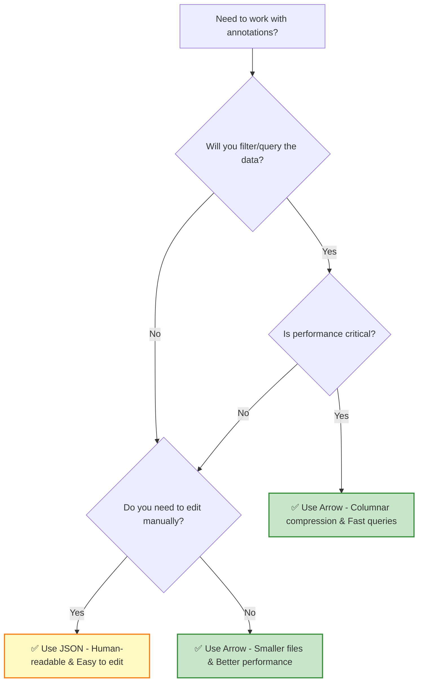

# Annotation Formats: Arrow vs. JSON

EdgeFirst supports two formats for storing and exchanging annotations. They contain the same data—just structured differently for different use cases.

!!! info "Studio Handles This Automatically"
    When working within EdgeFirst Studio, you don't need to worry about format conversions. Studio manages all data transformations internally when you upload snapshots, restore datasets, train models, or export annotations. These format details are primarily relevant when building custom pipelines or working with datasets outside of Studio.

## Quick Comparison

| Aspect | Arrow | JSON |
|--------|-------|------|
| **Use Case** | Analysis, ML training, queries | Manual editing, data exchange |
| **Structure** | Flat (one row per annotation) | Nested (sample → annotations[]) |
| **File Size** | Smaller (columnar compression) | Larger (text-based) |
| **Performance** | ⚡ Fast batch operations | 🐢 Moderate (parse overhead) |
| **Readability** | Requires viewer/library | Human-readable text |
| **Primary Tool** | Polars DataFrame | Text editor or JSON viewer |

## Arrow Format (Recommended for ML)

### When to Use

✅ **Use Arrow when**:

- Building ML training pipelines
- Analyzing annotation statistics
- Filtering or querying large datasets
- Working with Python/Polars
- Maximum performance needed

❌ **Don't use Arrow when**:

- You need to edit annotations manually
- Sharing data with non-technical collaborators
- Debugging (not human-readable)

### Structure: Flat, Columnar

```python
import polars as pl

df = pl.read_ipc("dataset.arrow")
print(df)

# Output: One row per annotation
# name       | frame | label  | box2d                  | ...
# sample_001 | 0     | person | [0.5, 0.5, 0.2, 0.3]  | ...
# sample_001 | 0     | car    | [0.3, 0.7, 0.15, 0.2] | ...
# sample_002 | 1     | person | [0.6, 0.4, 0.25, 0.35]| ...
```

**Key characteristics**:

- **One row per annotation** (not per sample)
- **Repeated sample metadata** (size, location, pose) for each annotation
- **Sample-level fields** (like `frame` and `group`) repeated
- **Efficient storage** — columnar format compresses well
- **Query-friendly** — use Polars to filter, group, aggregate

### File Size Comparison

For a typical dataset with 10,000 annotations:

```text
Arrow file: ~5-10 MB  (compressed columnar)
JSON file:  ~50-100 MB (text-based)
```

### Sample Metadata in Arrow

```python
# Access repeated sample metadata
width = df['size'][0]   # [0] = first element
height = df['size'][1]  # [1] = second element

# GPS coordinates
latitude = df['location'][0]
longitude = df['location'][1]

# IMU orientation (degrees)
roll = df['pose'][0]
pitch = df['pose'][1]
yaw = df['pose'][2]
```

---

## JSON Format (Human-Friendly)

### When to Use

✅ **Use JSON when**:

- Manually editing annotations
- Sharing datasets with collaborators
- Documentation and examples
- Debugging specific samples
- Need sample metadata visible

❌ **Don't use JSON when**:

- Processing millions of annotations
- Maximum performance required
- File size is a concern

### Structure: Nested

```json
{
  "image_name": "scene_001.camera.jpeg",
  "frame_number": 0,
  "width": 1920,
  "height": 1080,
  "group": "train",
  "sensors": {
    "gps": {
      "latitude": 37.7749,
      "longitude": -122.4194
    },
    "imu": {
      "roll": 0.5,
      "pitch": -1.2,
      "yaw": 45.3
    }
  },
  "annotations": [
    {
      "label_name": "person",
      "label_index": 0,
      "object_id": "550e8400-e29b-41d4-a716-446655440000",
      "box2d": {
        "x": 0.43,
        "y": 0.24,
        "w": 0.15,
        "h": 0.64
      },
      "mask": {
        "polygon": [
          [[0.43, 0.24], [0.58, 0.24], [0.58, 0.88], [0.43, 0.88]]
        ]
      }
    },
    {
      "label_name": "car",
      "label_index": 1,
      "box2d": {
        "x": 0.20,
        "y": 0.40,
        "w": 0.30,
        "h": 0.25
      }
    }
  ]
}
```

**Key characteristics**:

- **One object per sample** (sample-level data at top)
- **Nested annotations array** (all annotations for sample inside)
- **Sample metadata visible** (width, height, sensors, GPS, IMU)
- **Human-readable** — can edit in any text editor
- **Easy to validate** — use any JSON schema validator

### Sample Metadata in JSON

```json
{
  "image_name": "...",
  "width": 1920,                    ← Image dimensions
  "height": 1080,
  "sensors": {
    "gps": {
      "latitude": 37.7749,          ← GPS coordinates
      "longitude": -122.4194
    },
    "imu": {
      "roll": 0.5,                  ← IMU orientation
      "pitch": -1.2,
      "yaw": 45.3
    }
  }
}
```

---

## Key Differences

### Box2D Format Difference

⚠️ **WARNING**: Box2D coordinates differ between formats!

**Arrow format** (YOLO):

```python
box2d = [cx, cy, width, height]  # center-based
```

**JSON format** (legacy):

```json
box2d = {
  "x": left_edge,    // top-left corner
  "y": top_edge,
  "w": width,
  "h": height
}
```

**Conversion**:

```python
# JSON (left, top) → Arrow (center)
cx = x + w/2
cy = y + h/2

# Arrow (center) → JSON (left, top)
x = cx - w/2
y = cy - h/2
```

### Mask Format Difference

**Arrow format** (flat with NaN separators):

```python
mask = [x1, y1, x2, y2, x3, y3, ..., NaN, x4, y4, ...]
#  polygon 1 coordinates ↑                ↑  polygon 2
```

**JSON format** (nested lists):

```json
mask: {
  "polygon": [
    [[x1, y1], [x2, y2], [x3, y3]],    // polygon 1
    [[x4, y4], ...]                     // polygon 2
  ]
}
```

---

## Choosing a Format

### Decision Tree



### Use Cases

| Scenario | Format | Why |
|----------|--------|-----|
| Training a model | Arrow | Fast loading, efficient storage |
| Auditing annotations | JSON | See sample metadata, easy to edit |
| Sharing dataset | Arrow | Smaller file size |
| Statistical analysis | Arrow | Columnar queries, aggregation |
| Debugging a sample | JSON | Human-readable |
| Data validation | Arrow | Fast filtering |
| Crowdsourcing edits | JSON | Non-technical annotators |
| Third-party tool integration | Either | Depends on tool requirements |

---

## Converting Between Formats

Both formats represent the exact same data. You can convert losslessly between them:

```python
import polars as pl

# Arrow → JSON (covered in conversion.md)
df = pl.read_ipc("dataset.arrow")
json_data = df.to_dict()  # simplified example

# JSON → Arrow (covered in conversion.md)
df = pl.DataFrame(json_list)
df.write_ipc("dataset.arrow")
```

Learn the complete conversion process in [Format Conversion](conversion.md).

---

## File Organization

**Arrow format** (recommended for analysis):

```text
my_dataset/
├── my_dataset.arrow              ← Binary, columnar
└── my_dataset/
    └── ... sensor data ...
```

**JSON format** (recommended for exchange):

```text
my_dataset/
├── annotations.json              ← Text, human-readable
└── sensor_data/
    └── ... sensor files ...
```

Both can coexist:

```text
my_dataset/
├── my_dataset.arrow              ← For ML pipelines
├── annotations.json              ← For editing/sharing
└── my_dataset/
    └── ... sensor data ...
```

---

## Performance Comparison

### Loading Time

```python
# Arrow (fast)
import polars as pl
df = pl.read_ipc("dataset.arrow")  # ~100ms for 100k rows

# JSON (slower)
import json
with open("annotations.json") as f:
    data = json.load(f)  # ~500ms for equivalent data
```

### Memory Usage

```text
Arrow: ~50 MB for 100k annotations
JSON:  ~200 MB for same data
```

### Query Performance

```python
# Arrow (very fast)
train_data = df.filter(pl.col("group") == "train")  # instant

# JSON (slow)
train_data = [a for a in data if a.get("group") == "train"]  # slower
```

---

## Tips for Each Format

### Working with Arrow

```python
import polars as pl

# Load
df = pl.read_ipc("dataset.arrow")

# Query efficiently
people = df.filter(pl.col("label") == "person")
train = df.filter(pl.col("group") == "train")

# Group by sample
samples = df.groupby("name").len()

# Export for specific use
subset = df.filter(pl.col("group") == "train")
subset.write_ipc("train.arrow")
```

### Working with JSON

```python
import json

# Load
with open("annotations.json") as f:
    samples = json.load(f)

# Iterate samples
for sample in samples:
    print(f"{sample['image_name']}: {len(sample['annotations'])} objects")

# Modify and save
sample['annotations'].append(new_annotation)
with open("annotations.json", "w") as f:
    json.dump(samples, f, indent=2)
```

---

## Further Reading

- [Annotation Schema](schema.md) — Detailed field definitions
- [Format Conversion](conversion.md) — Step-by-step conversion examples with code
- [Official Specification](https://github.com/EdgeFirstAI/client/blob/main/DATASET_FORMAT.md) — Technical details
