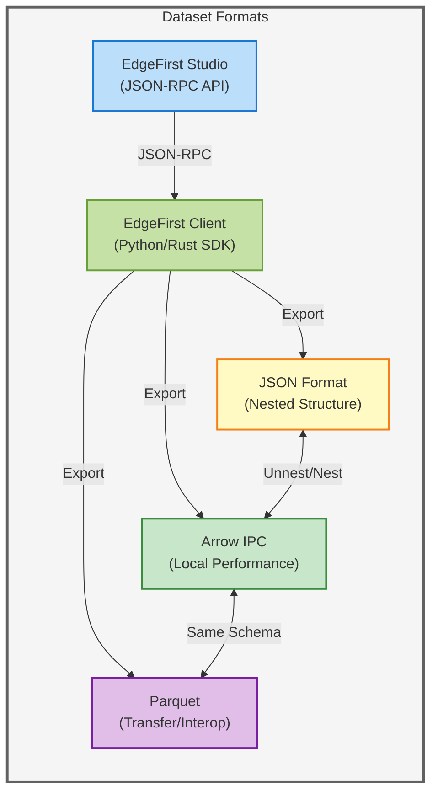
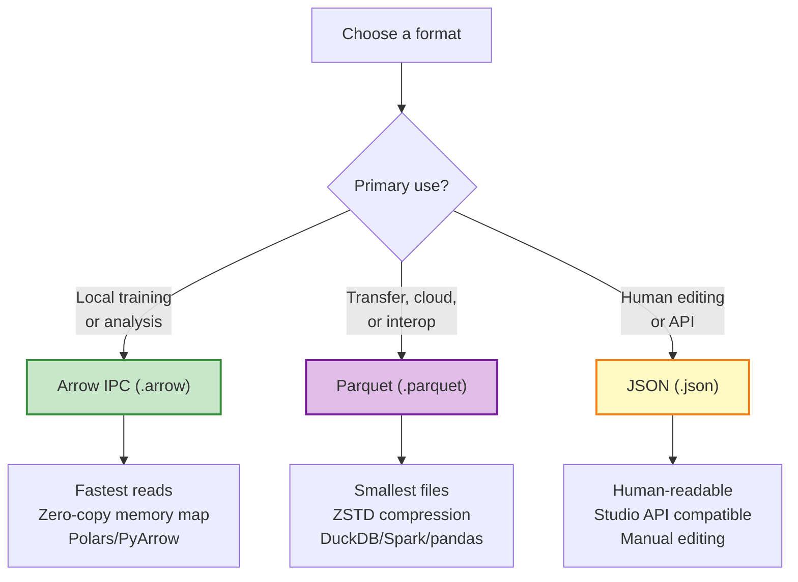

# Storage Formats

EdgeFirst 2026.04 supports three annotation storage formats. All three express the
**same logical schema** — the choice is a deployment / transfer concern, not a data
model concern.

## Format Tiers

|  | Arrow IPC | Parquet | JSON |
| --- | --------- | ------- | ---- |
| **Extension** | `.arrow` | `.parquet` | `.json` |
| **Use Case** | Local ML training, fast random access | Transfer, cloud storage, interop | Human-readable, API exchange |
| **Structure** | Flat columnar (one row per annotation) | Flat columnar (one row per annotation) | Nested (sample with annotations array) |
| **Compression** | None (memory-mapped) | ZSTD columnar compression | None (text) |
| **File Size** | Medium | Smallest | Largest |
| **Read Performance** | Fastest (zero-copy) | Fast (decompression overhead) | Moderate (parse overhead) |
| **Readability** | Requires viewer / library | Requires viewer / library | Human-readable text |
| **Metadata** | Schema-level key-value pairs | File-level key-value pairs | Top-level JSON fields |
| **Ecosystem** | Polars, PyArrow, Arrow-rs | DuckDB, Spark, pandas, BigQuery | Any JSON parser |
| **Best For** | Training pipelines, analysis | Distribution, archival, cloud queries | Editing, API, documentation |

## Format Relationship



## Arrow IPC

**Technology**: [Apache Arrow](https://arrow.apache.org/) IPC with
[Polars](https://pola.rs/) interface

**Extension**: `.arrow`

Arrow IPC files use zero-copy memory mapping for maximum local read performance.
This is the default output format for the EdgeFirst Client SDK.

```python
import polars as pl

df = pl.read_ipc("dataset.arrow")
```

**Characteristics**:

- Zero-copy memory mapping — fastest local performance
- Efficient querying and filtering via Polars
- Multi-language support (Python, Rust, JavaScript)
- Schema-level metadata preserves `schema_version`, box format descriptors, etc.

**When to use**: Local ML training, data analysis, batch processing, any pipeline
where read speed is critical.

## Parquet

**Technology**: [Apache Parquet](https://parquet.apache.org/) columnar format

**Extension**: `.parquet`

Parquet provides ZSTD-compressed columnar storage optimized for transfer, cloud
storage, and interoperability with the broader data ecosystem.

```python
import polars as pl

df = pl.read_parquet("dataset.parquet")

# Or use DuckDB for SQL queries
import duckdb
result = duckdb.sql("SELECT label, count(*) FROM 'dataset.parquet' GROUP BY label")
```

**Characteristics**:

- ZSTD compression for smaller file sizes
- Column statistics enable predicate pushdown (DuckDB, Spark)
- Widely supported across data tooling (pandas, BigQuery, Spark, DuckDB)
- File-level metadata preserves `schema_version`, box format descriptors, etc.

**When to use**: Distributing datasets, cloud storage, querying with DuckDB/Spark,
archival, bandwidth-constrained transfers.

### Parquet Configuration

EdgeFirst uses the following Parquet defaults:

| Setting | Value | Rationale |
| ------- | ----- | --------- |
| Compression | ZSTD (level 3) | Best compression/speed trade-off for transfer |
| Row group size | 64K rows or 256 MB | Balance between random access and compression |
| Page encoding | Parquet v2 (data page v2) | Better compression, widely supported |
| Statistics | Enabled (min/max per column) | Enables predicate pushdown in DuckDB/Spark |

!!! warning "Categorical column encoding"
    `Categorical` columns (`label`, `group`) are written as `Dictionary`-encoded
    string columns in Parquet. Dictionary index ordering in Parquet is **not guaranteed**
    to match `label_index` values. Always use the explicit `label_index` column for
    numeric class indices.

## JSON

**Structure**: Nested format — one object per sample with an annotations array.

**Extension**: `.json`

JSON files are human-readable and compatible with the EdgeFirst Studio JSON-RPC API.

**Version detection**:

- **2025.10 (legacy)**: Top-level is a bare JSON array `[...]`
- **2026.04**: Top-level is an object with `schema_version`: `{"schema_version": "2026.04", ...}`

```json
{
  "schema_version": "2026.04",
  "box2d_format": "cxcywh",
  "box2d_normalized": true,
  "mask_interpretation": "binary",
  "samples": [
    {
      "image_name": "deer_001.camera.jpeg",
      "width": 1920,
      "height": 1080,
      "annotations": [
        {
          "label_name": "deer",
          "label_index": 0,
          "box2d": {"cx": 0.691, "cy": 0.368, "w": 0.015, "h": 0.051},
          "box2d_score": 0.97
        }
      ]
    }
  ]
}
```

**When to use**: Manual editing, API communication, dataset documentation, distribution
to consumers who prefer text formats.

!!! info "JSON field names differ from Arrow columns"
    Some fields have different names in JSON vs. Arrow/Parquet. See [Conversion](conversion.md)
    for the full mapping table.

## Format Selection Decision Tree


