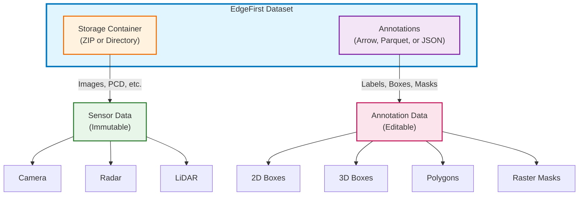

# Dataset Format Overview

The EdgeFirst Dataset Format provides a structured, self-describing representation for
multi-sensor annotations. Version **2026.04** introduces Parquet support, polygon geometry,
raster masks, confidence scores, and file-level metadata that makes every file interpretable
without external context.



## Key Principles

- **Normalized coordinates** — all spatial data uses the 0..1 range (resolution-independent)
- **Three storage formats** — Arrow IPC (local performance), Parquet (transfer / interop), JSON (human-readable)
- **Self-describing files** — file-level metadata records `schema_version`, box layouts, and mask interpretation
- **One row per instance** — flat columnar layout optimized for ML queries
- **Sensor data always external** — Arrow/Parquet/JSON contain annotations only; sensor data lives in sibling folders or ZIP files
- **Lossless data representation** — annotation data converts between formats without loss

## Quick Start (Python)

```python
import polars as pl

# Read Arrow IPC
df = pl.read_ipc("dataset.arrow")

# Read Parquet
df = pl.read_parquet("dataset.parquet")

# Check schema version
# Robust detection: check schema_version metadata first (see Conversion Guidelines)
if "polygon" in df.columns:
    print("2026.04 format detected")
    polygons = df["polygon"]       # List<List<f32>> — interleaved xy per ring
    masks    = df["mask"]          # Binary — PNG-encoded raster pixels
else:
    print("2025.10 or earlier format")
```

!!! tip "Use the EdgeFirst Client SDK"
    The SDK handles version detection, format conversion, and metadata extraction
    automatically. Direct Polars access is shown here for illustration; prefer the
    SDK for production code.

## Section Map

| Page | Contents |
|------|----------|
| [Schema](schema.md) | Full column definitions, types, and field semantics |
| [Box Formats](box_format.md) | Box2D / Box3D layout descriptors and metadata |
| [Storage Formats](formats.md) | Arrow IPC, Parquet, and JSON comparison |
| [Conversion](conversion.md) | Code examples for reading and converting between formats |
| [Sensors](sensors.md) | Camera, Radar, and LiDAR sensor file types |
| [Directory Structure](structure.md) | File naming, directory layout, and ZIP support |
| [Migration Guide](migration.md) | Upgrading from 2025.10 to 2026.04 |
