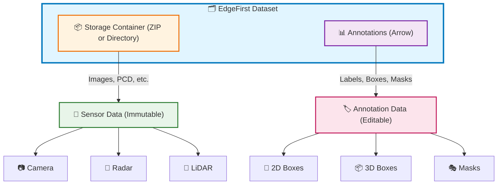
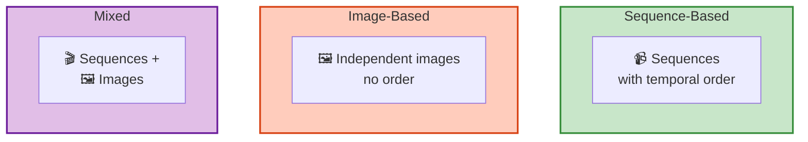

# EdgeFirst Dataset Format

The EdgeFirst Dataset Format is designed to handle multi-sensor datasets with rich annotations. It separates **sensor data** (immutable) from **annotation data** (dynamic), allowing both to be managed independently and efficiently.

!!! tip "When Do You Need This?"
    **Most users can skip these details.** EdgeFirst Studio handles dataset formats automatically when you:

    - Record MCAP files on a [Raivin platform](../../platforms/recording.md) and [publish them as snapshots](../../platforms/publishing.md)
    - [Import existing datasets](../tutorials/import.md) through the Studio UI
    - [Export datasets](../../studio/datasets/index.md#export-dataset) for offline use
    - Train models using [ModelPack](../../models/modelpack/index.md) or [Ultralytics](../../models/ultralytics/index.md)
    
    This chapter is for users who need to:
    
    - Build custom ML pipelines outside of Studio
    - Integrate EdgeFirst datasets with third-party tools
    - Programmatically generate or modify annotations
    - Understand the data structures for advanced debugging

## Overview



### Key Principles

- **Normalized coordinates**: All spatial data uses 0–1 range (resolution-independent)
- **Sensor container**: ZIP or directory holding images and point clouds
- **Annotation container**: Apache Arrow file with columnar annotation data
- **Multiple sensor types**: Camera, Radar (point cloud + data cube), LiDAR
- **Flexible structure**: Supports sequence-based, image-based, or mixed datasets

## Dataset Organization

Datasets can be organized in three patterns depending on your use case:



Each organization has different directory structures and file naming conventions. See [Dataset Organization](structure.md) for detailed examples.

## Annotation Data

EdgeFirst stores annotations in **Apache Arrow** format—a columnar, high-performance data structure. Think of it as a database table where each row represents an annotation and each column represents an annotation property.

```python
import polars as pl

# Load and view your annotations
df = pl.read_ipc("dataset.arrow")
print(df.head())
```

Learn more about the annotation schema, field definitions, and sample metadata in [Annotation Schema](schema.md).

## Sensor Data

EdgeFirst supports multiple sensor types:

- **Camera**: JPEG or PNG images with embedded EXIF metadata (GPS, timestamp)
- **Radar**: Point clouds (PCD format) and data cubes (16-bit PNG)
- **LiDAR**: Point clouds (PCD format) with optional depth and reflectivity maps

See [Sensor Data](sensors.md) for detailed specifications on each format.

## What's Inside This Chapter

### 📁 [Dataset Organization](structure.md)

How to structure your dataset files depending on whether you have video sequences, standalone images, or both. Includes file naming conventions and directory hierarchies.

### 📏 [Bounding Box Formats](box_format.md)

Understanding the EdgeFirst bounding box format: center-based coordinates in Arrow files vs. top-left coordinates in the legacy JSON API. Includes 3D boxes and polygon masks.

### 📊 [Annotation Schema & Fields](schema.md)

Detailed reference for every field in your annotations: sample identifiers, labels, geometry types (masks, boxes), and optional metadata (GPS, IMU, degradation).

### 📡 [Sensor Data](sensors.md)

Complete specification for camera, radar, and LiDAR data formats, file extensions, and encoding details.

### 🔄 [Format Conversion](conversion.md)

How to convert between Arrow (for analysis) and JSON (for editing) formats with Python code examples. Understand the key differences between formats.

## Important Concepts

### Samples vs. Annotations

- A **sample** is a single image or frame
- An **annotation** is one labeled object within a sample
- One sample can have **zero or many annotations**

Samples without annotations are still important! They represent images with no objects of interest and should be included in your training dataset.

### Normalized Coordinates

All spatial coordinates in EdgeFirst are **normalized to 0–1 range**:

```text
normalized_x = pixel_x / image_width
normalized_y = pixel_y / image_height
```

This makes annotations resolution-independent and portable across different image sizes.

### Frame Numbers

- **For sequences**: Frame numbers indicate temporal order (frame 0, 1, 2, ...)
- **For images**: Frame is `null` (no temporal ordering)
- Frame numbers are **unique within a sequence** but don't need to be continuous (frames can be dropped or downsampled)

## Quick Example

Here's a typical dataset structure:

```text
my_dataset/
├── my_dataset.arrow                    # Annotations
└── my_dataset/                         # Sensor data
    ├── sequence_01/                    # First video sequence
    │   ├── sequence_01_001.camera.jpeg
    │   ├── sequence_01_002.camera.jpeg
    │   └── sequence_01_001.radar.pcd
    ├── image_background.jpg            # Standalone image
    └── sequence_02/                    # Second video sequence
        └── sequence_02_001.camera.jpeg
```

## Next Steps

1. Learn how to [organize your dataset files](structure.md)
2. Understand [bounding box coordinate systems](box_format.md)
3. Explore the [annotation schema](schema.md)
4. Check the [official specification](https://github.com/EdgeFirstAI/client/blob/main/DATASET_FORMAT.md) for authoritative technical details
