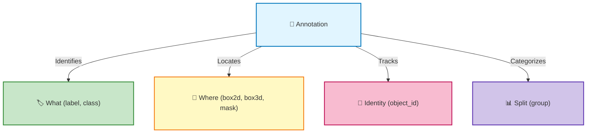

# Annotation Schema & Fields

This page documents all the fields in your EdgeFirst annotations, what they mean, and how to use them.

## How Annotations Are Created

Annotations in EdgeFirst are created through several methods:

| Method | Fields Populated | Source |
|--------|------------------|--------|
| **[Manual annotation](../../studio/agtg.md)** | `label`, `box2d`, `mask` | User draws in Instance Dashboard |
| **[AGTG (Automatic)](../../studio/agtg.md)** | `label`, `box2d`, `mask`, `status` | SAM-2 AI auto-detection |
| **[Model inference](../../models/index.md)** | `label`, `box2d`, `box3d` | Trained model predictions |
| **[Import from snapshot](../../studio/snapshots.md)** | All fields | Restored from Arrow file |

!!! tip "AGTG fills annotation fields automatically"
    When you run Automatic Ground Truth Generation (AGTG) on a dataset, EdgeFirst Studio uses SAM-2 to detect objects and populate:

    - `label`: Object class detected
    - `box2d`: Bounding box coordinates (center-based)
    - `mask`: Pixel-level segmentation polygon
    - `status`: Annotation quality indicator
    
    You can then review and adjust these annotations in the Instance Dashboard.

## Understanding the Annotation Structure

Each annotation describes **one labeled object** in one sample (image or frame). An annotation contains:



## Core Fields

### name

**Type**: `String`  
**What it is**: Sample identifier—links the annotation to a specific image or frame  
**Example**: `sequence_001_042` or `background_image_1`

**How it's derived**:

- **For sequences**: Filename without extension and frame number
- **For images**: Filename without extension

Examples:

```text
scene_001.camera.jpg      →  name = "scene_001"
deer_sequence_042.jpg     →  name = "deer_sequence" 
image_background.png      →  name = "image_background"
```

### frame

**Type**: `UInt64` (nullable, can be `null`)  
**What it is**: Frame number within a sequence (0-indexed)  
**Example**: `42` for the 42nd frame, or `null` for standalone images

**When it's used**:

- **Sequences**: `frame = {number}` (e.g., `0`, `1`, `2`, ...)
- **Standalone images**: `frame = null`

The combination of `(name, frame)` uniquely identifies a sample in the dataset.

### label

**Type**: `String` (Categorical)  
**What it is**: The object classification—what is this thing?  
**Examples**: `"person"`, `"car"`, `"tree"`, `"bicycle"`

### label_index

**Type**: `UInt64`  
**What it is**: Numeric index for the label (used by ML models)  
**Example**: In COCO dataset, "person"=0, "car"=2, "bicycle"=1

**Why it exists**: Pre-trained models expect numeric indices, not strings. The mapping ensures consistency.

### object_id

**Type**: `String` (UUID strongly recommended)  
**What it is**: Unique identifier for tracking objects across frames and linking annotations  
**Examples**:

```text
550e8400-e29b-41d4-a716-446655440000  (UUID - recommended)
car_track_005
person_01
```

**Use cases**:

- Track the same object across multiple frames in a sequence
- Link a 2D box to a segmentation mask on the same object
- Enable object-level queries ("show me all frames with object X")

**Best practice**: Use UUIDs for guaranteed uniqueness across datasets

### group

**Type**: `String` (Categorical, nullable)  
**What it is**: Optional dataset split assignment—which set does this sample belong to?  
**Values**: `null`, `"train"`, `"val"`, `"test"`, or any custom string

**Default behavior in Studio**: When you split a dataset in EdgeFirst Studio, it assigns `"train"` and `"val"` by default. You can also use custom split names for your specific workflow.

**Important**: This is a **sample-level field**, not per-annotation. All annotations from the same sample have the same group value.

**Typical distribution** (when used):

- 70% train
- 20% validation
- 10% test

## Geometry Fields

These fields describe **where** the object is located in the image or 3D world.

### box2d

**Type**: `Array(Float32, shape=(4,))`  
**Format**: `[cx, cy, width, height]` (center-based)  
**Coordinate system**: Normalized (0–1), top-left origin

**Values**:

- `cx`: Box center x-coordinate (0=left edge, 1=right edge)
- `cy`: Box center y-coordinate (0=top edge, 1=bottom edge)
- `width`: Box width as fraction of image width
- `height`: Box height as fraction of image height

**Example**: `[0.5, 0.5, 0.2, 0.3]` means a box centered in the image, 20% of image width, 30% of image height

**Visual**:

```text
Image
(0,0) ─────────────────────────→ x=1
  │
  │       (0.5, 0.5)
  │         ●───────┐
  │         │ 0.2w  │ 0.3h
  │         └───────┘
  │
  ▼
  y=1
```

Learn more in [Bounding Box Formats](box_format.md).

### box3d

**Type**: `Array(Float32, shape=(6,))`  
**Format**: `[x, y, z, width, height, length]`  
**Coordinate system**: ROS/Ouster (X=forward, Y=left, Z=up)  
**Units**: Meters (normalized 0–1 in some contexts)

**Values**:

- `x, y, z`: Box center in 3D world space
- `width`: Dimension along Y axis
- `height`: Dimension along Z axis (typically vertical)
- `length`: Dimension along X axis (forward/backward)

**Example**: `[5.0, -2.0, 1.5, 2.0, 1.8, 4.5]` means an object 5m ahead, 2m to the right, 1.5m high

### mask

**Type**: `List(Float32)`  
**What it is**: Pixel-level segmentation—precise boundary of the object  
**Format**: Flattened array with NaN separators for multiple polygons

**Structure**:

```python
# Single polygon: [x1, y1, x2, y2, x3, y3, ...]
# Multiple polygons: [x1, y1, x2, y2, ..., NaN, x4, y4, ...]
#                                      ↑ polygon separator
```

**Example** (single polygon around a person):

```python
[0.4, 0.3, 0.45, 0.25, 0.5, 0.25, 0.52, 0.28, 0.5, 0.4, 0.45, 0.42, 0.4, 0.35]
```

**Coordinate system**: Normalized (0–1), same as 2D boxes

Learn more in [Annotation Schema](schema.md) and the official format docs.

## Sample Metadata Fields

These fields describe properties of the **sample** (image), not individual annotations. In Arrow format, they're repeated for each annotation row from the same sample.

### size

**Type**: `Array(UInt32, shape=(2,))`  
**Format**: `[width, height]`  
**What it is**: Image dimensions in pixels

**Example**: `[1920, 1080]` for a Full HD image

**Usage**:

```python
# Access in Arrow/DataFrame
width = df['size'][0]
height = df['size'][1]

# Convert from normalized to pixel coordinates
pixel_x = normalized_x * width
pixel_y = normalized_y * height
```

### location

**Type**: `Array(Float32, shape=(2,))`  
**Format**: `[latitude, longitude]`  
**What it is**: GPS coordinates where the image was captured

**Example**: `[37.7749, -122.4194]` (San Francisco)

**Source**:

- EXIF metadata in image
- MCAP NavSat topic
- Manual entry

**Note**: Altitude may be added in future versions

### pose

**Type**: `Array(Float32, shape=(3,))`  
**Format**: `[roll, pitch, yaw]`  
**What it is**: IMU orientation of the camera when image was captured

**Values in degrees**:

- `roll`: Rotation around X axis (-180 to 180°)
- `pitch`: Rotation around Y axis (-90 to 90°)
- `yaw`: Rotation around Z axis (-180 to 180°)

**Example**: `[0.5, -1.2, 45.3]` means slightly tilted, pitched down, rotated 45° counterclockwise

**Source**:

- MCAP IMU topic
- IMU sensor readings
- Manual entry

### degradation

**Type**: `String` (nullable)  
**What it is**: Visual quality indicator—how compromised is the camera view?

**Typical values**:

- `"none"`: Perfect view, objects fully visible
- `"low"`: Slight obstruction, targets clearly visible
- `"medium"`: Higher obstruction, targets visible but not obvious
- `"high"`: Severe obstruction, objects cannot be seen

**Examples of degradation**:

- Fog, rain, snow
- Camera obstruction (dirt, condensation)
- Low light, night
- Backlighting

**Use cases**:

- Filter training data by quality level
- Train robust models for adverse weather
- Identify which sensor to trust (use radar when camera degraded)

---

## Complete Example

Here's a complete annotation with all fields:

```python
{
    # Sample identification
    "name": "sequence_001_042",
    "frame": 42,
    
    # Object identification
    "label": "person",
    "label_index": 0,
    "object_id": "550e8400-e29b-41d4-a716-446655440000",
    
    # Dataset split
    "group": "train",
    
    # Geometry
    "box2d": [0.5, 0.5, 0.2, 0.3],
    "box3d": [5.0, -2.0, 1.5, 2.0, 1.8, 4.5],
    "mask": [0.48, 0.4, 0.52, 0.4, 0.52, 0.6, 0.48, 0.6],
    
    # Sample metadata
    "size": [1920, 1080],
    "location": [37.7749, -122.4194],
    "pose": [0.5, -1.2, 45.3],
    "degradation": "low"
}
```

## Optional Fields

Some fields may be `null` or missing depending on your dataset:

| Field | When Null | Reason |
|-------|-----------|--------|
| `frame` | Always for images | Images don't have frame numbers |
| `box2d` | Sometimes | Only 3D annotations or image without 2D box |
| `box3d` | Sometimes | Only 2D annotations |
| `mask` | Often | Not all datasets include segmentation |
| `object_id` | Rarely | Required for tracking |
| `location` | Often | Not all images have GPS data |
| `pose` | Often | Not all images have IMU data |
| `degradation` | Often | Optional quality indicator |

## Querying Annotations

Once you understand the schema, you can query your annotations:

```python
import polars as pl

df = pl.read_ipc("dataset.arrow")

# Get all person detections
people = df.filter(pl.col("label") == "person")

# Get training split
train_data = df.filter(pl.col("group") == "train")

# Find annotations with 3D boxes
boxes_3d = df.filter(pl.col("box3d").is_not_null())

# Find samples captured in San Francisco
sf_samples = df.filter(
    (pl.col("location")[0] > 37.77) & (pl.col("location")[0] < 37.78)
)

# Track an object across frames
object_track = df.filter(pl.col("object_id") == "550e8400-e29b-41d4-a716-446655440000")

print(f"Total annotations: {len(df)}")
print(f"Unique objects: {df['object_id'].n_unique()}")
print(f"Date range: {df['name'].min()} to {df['name'].max()}")
```

## Further Reading

- [Bounding Box Formats](box_format.md) — Detailed guide to 2D box coordinate systems
- [Dataset Organization](structure.md) — How samples are organized on disk
- [Sensors](sensors.md) — Understanding camera and sensor metadata
- [AGTG (Automatic Annotation)](../../studio/agtg.md) — How AI automatically populates annotation fields
- [Snapshots Dashboard](../../studio/snapshots.md) — Download and restore datasets with annotations
