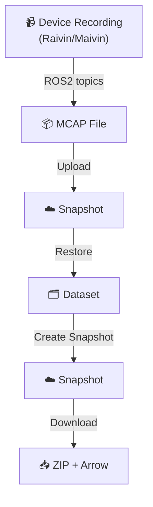
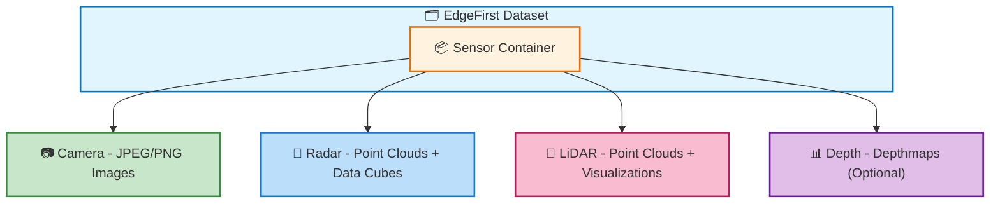
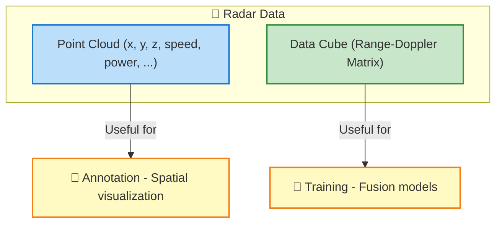

# Sensor Data

This page describes the different sensor data types that EdgeFirst datasets can contain: camera images, radar point clouds and data cubes, and LiDAR data.

## How Sensor Data Gets Into Datasets

Sensor data typically flows through this pipeline:



1. **Recording**: [Raivin or Maivin devices](../../platforms/recording.md) record sensor data as ROS2 topics into MCAP files
2. **Upload**: MCAP files are [uploaded as snapshots](../../platforms/publishing.md) to EdgeFirst Studio  
3. **Restore**: Snapshots are [restored into datasets](../../studio/snapshots.md#restore-snapshot), converting MCAP topics to discrete sensor files
4. **Create Snapshot**: Datasets can be [exported as snapshots](../../studio/snapshots.md#create-snapshot) for download
5. **Download**: Snapshots are downloaded as ZIP + Arrow file pairs in the [EdgeFirst Dataset Format](index.md)

!!! tip "Snapshots contain sensor data"
    When you [download a snapshot](../../studio/snapshots.md#download-snapshot), the ZIP file contains all the sensor data (images, point clouds, etc.) organized by sequence and frame.

## Overview

EdgeFirst datasets support multiple sensor types that are captured simultaneously and stored together:



## Camera Data

### File Format

- **Default**: JPEG (`.camera.jpeg`) — good compression, standard format
- **Lossless**: PNG (`.camera.png`) — when exact pixel preservation needed
- **Encoding**: H.265 from MCAP → converted to discrete frames during dataset creation

### File Naming

```text
{sequence_name}_{frame_number}.camera.jpeg
```

Example:

```text
system_2025_01_15_143022_001.camera.jpeg
system_2025_01_15_143022_002.camera.jpeg
```

### EXIF Metadata

Camera images embed metadata in EXIF tags:

- **GPS coordinates**: Latitude, longitude (from MCAP NavSat topic)
- **Timestamp**: When the frame was captured
- **Camera parameters**: Intrinsic calibration (if available)
- **Device info**: Device/system identifier

This metadata is automatically extracted and stored in the [Annotation Schema](schema.md) as `location` field.

### Typical Use Case

Primary input for:

- Object detection models
- Segmentation masks (pixel-level)
- Visual analysis and auditing
- 2D bounding box annotations

---

## Radar Data

Radar provides two complementary representations:



### Point Cloud (`.radar.pcd`)

**Format**: PCD (Point Cloud Data) — standard format for 3D point clouds

**Fields**:

- `x, y, z`: Cartesian position in meters (relative to vehicle)
- `speed`: Doppler velocity (m/s)
- `power`: Signal power
- `noise`: Noise level
- `rcs`: Radar cross-section

**File naming**:

```text
{sequence_name}_{frame_number}.radar.pcd
```

**Typical use**:

- Visualize spatial detections during annotation
- Verify camera detections against radar
- Point cloud-based 3D object detection

**Example reading** (Python):

```python
import open3d as o3d

pcd = o3d.io.read_point_cloud("frame_001.radar.pcd")
points = np.asarray(pcd.points)
print(f"Points: {len(points)}")  # Number of radar returns
```

### Data Cube (`.radar.png`)

**Format**: 16-bit PNG (lossless encoding)

**What it is**: Range-Doppler matrix representing raw radar signal

**Dimensions**: `[sequence, rx_antenna, range_bins, doppler_bins]`

**Typical shape**: `[2, 4, 200, 256]`

- 2 sequences (transmit sequences)
- 4 RX antennas
- 200 range bins
- 256 doppler bins

**PNG Encoding**:

The 4D array is laid out as a 4×2 grid in the PNG:

```text
PNG Image Layout (simplified):
┌─────────────────────────────────┐
│  Seq1  │  Seq1  │  Seq1  │  Seq1│  Row 1: 4 columns
│  RxA0  │  RxA1  │  RxA2  │  RxA3│
├─────────────────────────────────┤
│  Seq2  │  Seq2  │  Seq2  │  Seq2│  Row 2: 4 columns
│  RxA0  │  RxA1  │  RxA2  │  RxA3│
└─────────────────────────────────┘

Each cell contains:
- X-axis: 2× doppler bins (complex int16 → two int16 for real/imaginary)
- Y-axis: range bins
```

**Complex data storage**:

- Original: Complex int16 values
- PNG format: Split into real/imaginary pairs (doesn't support complex numbers)
- Width doubled to accommodate: `4 * 2 * 256 = 2048` pixels
- Height: `2 * 200 = 400` pixels

**Final image size**: 2048×400 pixels (for typical configuration)

**File naming**:

```text
{sequence_name}_{frame_number}.radar.png
```

**Important notes**:

- Wide dynamic range (most data near zero)
- Difficult to visualize directly (consider log scaling)
- Lossless conversion (no information lost)

**Typical use**:

- Training fusion models that consume low-level radar data
- Radar signal analysis and research

---

## LiDAR Data

### Point Cloud (`.lidar.pcd`)

**Format**: PCD (Point Cloud Data)

**Configuration**: Based on Maivin MCAP Recorder settings (specifics subject to configuration)

**File naming**:

```text
{sequence_name}_{frame_number}.lidar.pcd
```

### Visualizations

**Depth Map** (`.lidar.png`):

- Visualization of depth from LiDAR returns
- Used for analysis and debugging

**Reflectivity** (`.lidar.jpeg`):

- Intensity/reflectivity visualization
- Shows how reflective each point is

**File naming**:

```text
{sequence_name}_{frame_number}.lidar.png       # depth map
{sequence_name}_{frame_number}.lidar.jpeg      # reflectivity
```

---

## Depth Data (Optional)

Some datasets include depth estimation from camera frames:

**File format**: `.depth.png` (16-bit depth map)

**File naming**:

```text
{sequence_name}_{frame_number}.depth.png
```

**Use case**:

- Pseudo-3D from monocular depth estimation
- Training or evaluating depth models

---

## File Organization Example

Here's a complete example showing all possible sensor types:

```text
my_dataset/
├── my_dataset.arrow
└── my_dataset/
    └── system_2025_01_15_143022/
        ├── system_2025_01_15_143022_001.camera.jpeg
        ├── system_2025_01_15_143022_001.camera.png         (if lossless)
        ├── system_2025_01_15_143022_001.radar.pcd
        ├── system_2025_01_15_143022_001.radar.png
        ├── system_2025_01_15_143022_001.lidar.pcd
        ├── system_2025_01_15_143022_001.lidar.png
        ├── system_2025_01_15_143022_001.lidar.jpeg
        ├── system_2025_01_15_143022_001.depth.png
        ├── system_2025_01_15_143022_002.camera.jpeg
        ├── system_2025_01_15_143022_002.radar.pcd
        ├── system_2025_01_15_143022_002.radar.png
        └── ... (more frames)
```

## Sensor Data Alignment

All sensor data for a given frame is aligned temporally:

```text
system_2025_01_15_143022_042
├── .camera.jpeg     ← Captured at T=42
├── .radar.pcd       ← Measured at T=42
├── .radar.png       ← Measured at T=42
└── .lidar.pcd       ← Measured at T=42
```

This means:

- Same frame number across sensors = captured at same moment
- No temporal skew between modalities
- Safe for multi-sensor fusion and training

## Accessing Sensor Data

Once you have your dataset, you can access sensor files:

```python
import os
from pathlib import Path

dataset_root = Path("my_dataset")
sensor_dir = dataset_root / "my_dataset"

# List all camera images
camera_files = sorted(sensor_dir.glob("**/*.camera.jpeg"))
print(f"Found {len(camera_files)} camera frames")

# List all radar files
radar_pcd_files = sorted(sensor_dir.glob("**/*.radar.pcd"))
radar_cube_files = sorted(sensor_dir.glob("**/*.radar.png"))
print(f"Found {len(radar_pcd_files)} radar point clouds")
print(f"Found {len(radar_cube_files)} radar data cubes")

# Group by sequence
from collections import defaultdict
sequences = defaultdict(list)
for file in camera_files:
    seq_name = file.stem.rsplit('_', 1)[0]
    sequences[seq_name].append(file)

for seq, files in sequences.items():
    print(f"Sequence '{seq}': {len(files)} frames")
```

## Best Practices

- **Verify alignment**: Ensure matching frame numbers exist for all sensors
- **Check completeness**: Not all frames need all sensors (e.g., LiDAR might be optional)
- **Test loading**: Try loading a few files before processing entire dataset
- **Handle missing data**: Some frames may lack optional sensors (depth, reflectivity)

## Further Reading

- [Dataset Organization](structure.md) — How sensor files are organized on disk
- [Annotation Schema](schema.md) — Metadata extracted from EXIF and sensors
- [Platform Recording](../../platforms/recording.md) — How sensor data is recorded on Raivin/Maivin
- [Publishing Workflows](../../platforms/publishing.md) — How to upload MCAP recordings as snapshots
- [Snapshots Dashboard](../../studio/snapshots.md) — How to download and restore snapshots
