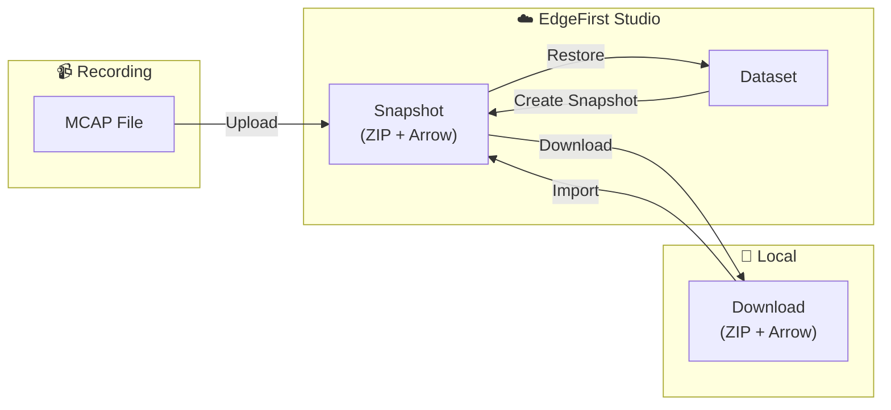
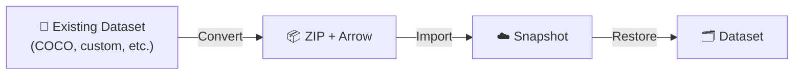
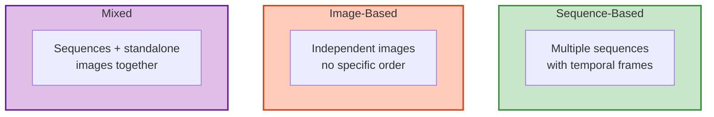
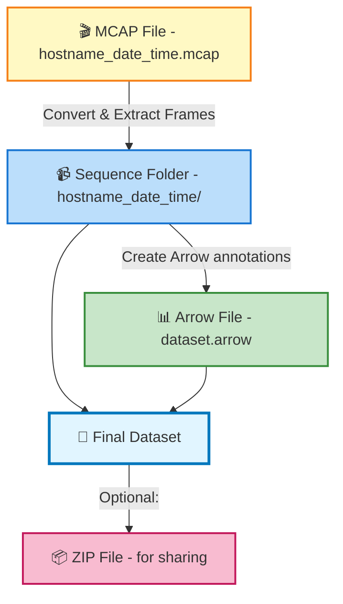

# Dataset Organization

EdgeFirst datasets support three organizational patterns based on your data type. This page explains the differences and shows you how to structure your files correctly.

## How Datasets Are Created

There are several ways to get data into EdgeFirst Studio:

### 1. From EdgeFirst Platforms (MCAP Recordings)

The primary workflow for [EdgeFirst Perception](../../platforms/index.md) users:



1. **MCAP files** are [recorded on devices](../../platforms/recording.md) and [uploaded to Studio](../../platforms/publishing.md)
2. **Snapshots** are the portable format—a ZIP file (sensor data) paired with an Arrow file (annotations)
3. **Datasets** are expanded snapshots that you can browse, annotate, and train on
4. **When you create a snapshot** from a dataset, Studio generates the ZIP+Arrow pair for download and sharing

### 2. From Pre-Annotated Datasets

If you have existing annotated datasets (e.g., from COCO, custom collections, or other tools), you can convert them directly to the EdgeFirst Dataset Format:



See [Format Conversion](conversion.md) for details on converting existing datasets.

### 3. Simple Videos and Images

For quick experimentation, you can also upload videos or images directly to Studio for auto-annotation—no format conversion required. This is covered in the [Capture Data](../tutorials/capture.md#capture-with-a-phone) tutorial.

!!! info "ZIP + Arrow = EdgeFirst Dataset Format"
    Whether you're downloading a snapshot or sharing a dataset, the format is always the same:

    - **ZIP file**: Contains sensor data organized by sequence/frame
    - **Arrow file**: Contains annotations in columnar format
    
    See [Format Overview](index.md) for details.

## The Three Patterns



### When to Use Each

| Pattern | When | Example |
|---------|------|---------|
| **Sequence-Based** | You have video recordings or MCAP files | MCAP from EdgeFirst Platform, MP4 videos |
| **Image-Based** | You have individual images with no order | COCO dataset, photos from mobile device |
| **Mixed** | You have both sequences and loose images | MCAP recordings + calibration images |

## 1. Sequence-Based Datasets {#sequence-based}

Use this pattern when your data comes from **video recordings** (MCAP files, MP4, etc.) where frames have temporal order.

### Directory Structure

```text
my_video_dataset/
├── my_video_dataset.arrow                          # Annotations
└── my_video_dataset/                               # Sensor container
    ├── hostname_date_time_001/                     # First sequence
    │   ├── hostname_date_time_001_001.camera.jpeg
    │   ├── hostname_date_time_001_002.camera.jpeg
    │   ├── hostname_date_time_001_003.camera.jpeg
    │   ├── hostname_date_time_001_001.radar.pcd
    │   └── hostname_date_time_001_001.lidar.pcd
    │
    ├── hostname_date_time_002/                     # Second sequence
    │   ├── hostname_date_time_002_001.camera.jpeg
    │   ├── hostname_date_time_002_002.camera.jpeg
    │   └── ...
    │
    └── hostname_date_time_003/
        └── ...
```

### File Naming Convention

```text
{sequence_name}_{frame_number}.{sensor}.{extension}
```

Where:

- `sequence_name`: Usually `hostname_date_time` (from MCAP filename)
- `frame_number`: Sequential frame index (001, 002, 003, ...) padded with zeros
- `sensor`: Type of sensor (`camera`, `radar`, `lidar`, `depth`)
- `extension`: Image format (`jpeg`, `png`, `pcd`)

### Examples

```text
9331381uhd_2025_01_15_143022_001.camera.jpeg
9331381uhd_2025_01_15_143022_002.camera.jpeg
9331381uhd_2025_01_15_143022_001.radar.pcd
9331381uhd_2025_01_15_143022_001.lidar.pcd
```

### Important Notes

- **Frame numbers don't need to be continuous** — MCAP files can be cropped or downsampled
- **All frames must have matching frame numbers across sensors** — if you have `frame_001.camera.jpeg`, you should have `frame_001.radar.pcd` and `frame_001.lidar.pcd`
- **Sequential ordering is preserved** — frame 001 comes before frame 002 in the dataset

## 2. Image-Based Datasets {#image-based}

Use this pattern when you have **standalone images without temporal ordering**, like datasets downloaded from COCO or photos taken with a mobile device.

### Directory Structure

```text
my_image_dataset/
├── my_image_dataset.arrow            # Annotations
└── my_image_dataset/                 # Sensor container
    ├── image_001.jpg
    ├── image_002.jpg
    ├── image_003.png
    ├── street_scene_24.jpg
    ├── parking_lot_156.jpg
    └── ...
```

### File Naming Convention

Any descriptive filename works:

```text
{descriptive_name}.{extension}
```

Examples:

```text
person_001.jpg
dog_standing.png
traffic_scene_morning.jpg
beach_sunset.jpg
```

### Key Characteristics

- No `sequence_` prefix required
- No frame numbers
- Files can be in any order (annotations will have `frame: null`)
- Can mix different image sources in same dataset

## 3. Mixed Datasets

Use this pattern when you have **both sequences and standalone images** in the same dataset.

### Directory Structure

```text
my_mixed_dataset/
├── my_mixed_dataset.arrow                    # Annotations
└── my_mixed_dataset/                         # Sensor container
    │
    ├── video_sequence_001/                   # Video sequences
    │   ├── video_sequence_001_001.camera.jpeg
    │   ├── video_sequence_001_002.camera.jpeg
    │   └── video_sequence_001_001.radar.pcd
    │
    ├── video_sequence_002/
    │   └── ...
    │
    ├── calibration_image_001.jpg             # Standalone images
    ├── reference_scene.png
    ├── test_pattern.jpg
    └── ...
```

### Organization Strategy

- **Sequences**: In subdirectories (same as sequence-based pattern)
- **Images**: Directly in dataset root (same as image-based pattern)
- **Mixed annotations**: Arrow file has `frame: {number}` for sequences, `frame: null` for images

### Example Use Cases

- Training set includes video sequences + manually curated reference images
- Calibration images stored alongside operational video data
- Augmented dataset combining MCAP recordings + external image sources

## Understanding the Arrow File Location

The Arrow file **always lives at the dataset root level**:

```text
my_dataset/
├── my_dataset.arrow                  # ← Always here
└── my_dataset/
    └── ... sensor data ...
```

This centralized location makes it easy to find and load annotations for any dataset structure (sequence, image, or mixed).

## File Container Options

Sensor data can be stored in two ways:

### 1. Directory (Recommended for Development)

```text
my_dataset/
├── my_dataset.arrow
└── my_dataset/          # Regular directory
    ├── sequence_001/
    │   └── ...
    └── image_001.jpg
```

**Pros**: Easy to add/remove files, no extraction needed  
**Cons**: Harder to transfer, manage permissions

### 2. ZIP File (Recommended for Distribution)

```text
my_dataset.zip          # Contains everything inside
├── my_dataset/
│   ├── sequence_001/
│   │   └── ...
│   └── image_001.jpg
└── my_dataset.arrow
```

**Pros**: Single file, easy to transfer, automatic compression  
**Cons**: Need to extract to access files

Both formats work identically—EdgeFirst automatically handles both.

## Data Flow Example

Here's how data flows from MCAP to your final dataset:



## Naming Best Practices

### For Sequences

```text
# Good: Follows MCAP convention
hostname_date_time_001
system_2025_01_15_143022

# Avoid: Ambiguous
sequence_1
video_1
data
```

### For Standalone Images

```text
# Good: Descriptive
person_walking_001
street_intersection_morning_02
reference_calibration

# Okay: Generic but clear
image_001
photo_156

# Avoid: Unclear
img1
pic
data_new
```

## Checking Your Dataset Structure

You can verify your dataset is organized correctly:

```python
import polars as pl
import os

# Load annotations
df = pl.read_ipc("path/to/dataset.arrow")

# Check structure
print(f"Total annotations: {len(df)}")
print(f"Unique samples: {df['name'].n_unique()}")
print(f"Sequences: {df.filter(pl.col('frame').is_not_null())['name'].n_unique()}")
print(f"Images: {df.filter(pl.col('frame').is_null())['name'].n_unique()}")
print(f"Splits: {df['group'].unique().to_list()}")

# List all sensor files
sensor_dir = "path/to/dataset/dataset"
for root, dirs, files in os.walk(sensor_dir):
    for file in files:
        if file.endswith(('.jpeg', '.jpg', '.png', '.pcd')):
            print(f"  {file}")
```

## Further Reading

- [Annotation Schema](schema.md) — Understand what data is in your Arrow file
- [Bounding Box Formats](box_format.md) — Learn coordinate systems and conversions
- [Sensor Data](sensors.md) — Details on camera, radar, and LiDAR formats
- [Snapshots Dashboard](../../studio/snapshots.md) — Download and restore snapshots in Studio
- [Publishing Workflows](../../platforms/publishing.md) — Upload MCAP recordings as snapshots
