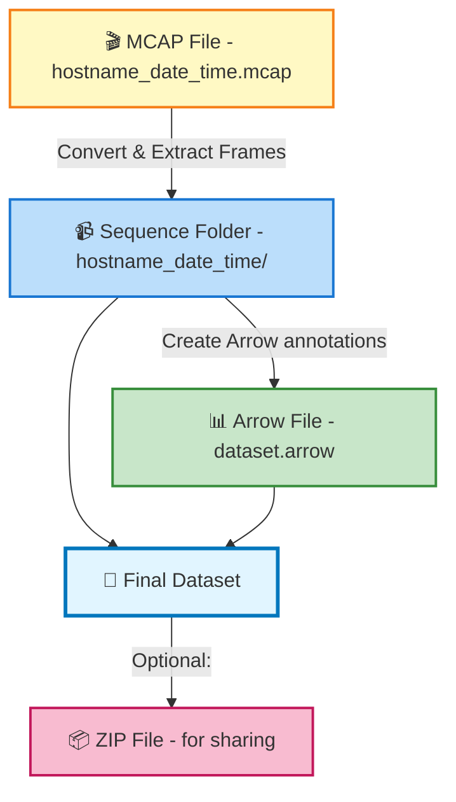

# Directory Structure

EdgeFirst datasets follow a consistent directory layout where the annotation file and
the sensor data container share the same base name.

## File Naming

Annotation files use the dataset base name with the format extension:

```
dataset_name/
├── dataset_name.arrow          # Arrow IPC (default)
│   # — OR —
├── dataset_name.parquet        # Parquet (transfer)
│   # — OR —
├── dataset_name.json           # JSON (human-readable)
└── dataset_name/               # Sensor container (directory or .zip)
```

Exactly **one annotation file** per dataset directory — choose a single format from
`.arrow`, `.parquet`, or `.json`. The tree above shows the three supported alternatives;
do not include more than one annotation file for the same dataset. The sensor container
directory name matches the dataset base name regardless of which annotation file format
you choose.

## Dataset Layouts

EdgeFirst supports three organizational patterns.

### 1. Sequence-Based Datasets

Video frames with temporal ordering (from MCAP recordings or video files):

```
deer_dataset/
├── deer_dataset.arrow
└── deer_dataset/
    └── 9331381uhd_3840_2160_24fps/
        ├── 9331381uhd_3840_2160_24fps_110.camera.jpeg
        ├── 9331381uhd_3840_2160_24fps_111.camera.jpeg
        └── ...
```

**File naming convention**:

- Sequence format: `{hostname}_{date}_{time}` (from MCAP)
- Frame format: `{sequence_name}_{frame_number}.{sensor}.{ext}`

### 2. Image-Based Datasets

Standalone images without temporal ordering:

```
coco_subset/
├── coco_subset.arrow
└── coco_subset/
    ├── image001.jpg
    ├── image002.jpg
    └── ...
```

### 3. Mixed Datasets

Combination of sequences and standalone images:

```
mixed_dataset/
├── mixed_dataset.arrow
└── mixed_dataset/
    ├── sequence_A/
    │   ├── sequence_A_001.camera.jpeg
    │   └── sequence_A_002.camera.jpeg
    ├── standalone_image1.jpg
    └── standalone_image2.jpg
```

## Multi-Sensor Examples

A single frame can include multiple sensor modalities:

```
sensor_fusion/
├── sensor_fusion.parquet
└── sensor_fusion/
    └── drive_2026_03_18/
        ├── drive_2026_03_18_001.camera.jpeg
        ├── drive_2026_03_18_001.radar.png
        ├── drive_2026_03_18_001.radar.pcd
        ├── drive_2026_03_18_001.lidar.pcd
        ├── drive_2026_03_18_002.camera.jpeg
        ├── drive_2026_03_18_002.radar.png
        └── ...
```

## Flattened Structure

As an alternative to nested subdirectories, datasets may use a flat layout with
sequence prefixes:

```
dataset_name/
├── dataset_name.arrow
└── dataset_name/
    ├── sequence_A_001.camera.jpeg
    ├── sequence_A_002.camera.jpeg
    ├── sequence_B_001.camera.jpeg
    └── standalone_image.jpg
```

The EdgeFirst Client SDK detects the layout automatically — no manual configuration is needed.

## ZIP Format

EdgeFirst supports ZIP64 as an alternative to directories for the sensor container:

```
dataset_name/
├── dataset_name.arrow
└── dataset_name.zip             # sensor data in ZIP
```

ZIP64 provides:

- Random access via file index
- Uncompressed storage recommended (JPEG and PNG are already compressed; PCD and other formats may benefit from ZIP compression)
- Cross-platform support

## Sensor File Extensions

<<<<<<< HEAD
### 1. Directory (Recommended for Development)

```text
my_dataset/
├── my_dataset.arrow
└── my_dataset/          # Regular directory
    ├── sequence_001/
    │   └── ...
    └── image_001.jpg
```

**Pros**: Easy to add/remove files, no extraction needed  
**Cons**: Harder to transfer, manage permissions

### 2. ZIP File (Recommended for Distribution)

```text
my_dataset.zip          # Contains everything inside
├── my_dataset/
│   ├── sequence_001/
│   │   └── ...
│   └── image_001.jpg
└── my_dataset.arrow
```

**Pros**: Single file, easy to transfer, automatic compression  
**Cons**: Need to extract to access files

Both formats work identically—EdgeFirst automatically handles both.

## Data Flow Example

Here's how data flows from MCAP to your final dataset:



## Naming Best Practices

### For Sequences

```text
# Good: Follows MCAP convention
hostname_date_time_001
system_2025_01_15_143022

# Avoid: Ambiguous
sequence_1
video_1
data
```

### For Standalone Images

```text
# Good: Descriptive
person_walking_001
street_intersection_morning_02
reference_calibration

# Okay: Generic but clear
image_001
photo_156

# Avoid: Unclear
img1
pic
data_new
```

## Checking Your Dataset Structure

You can verify your dataset is organized correctly:

```python
import polars as pl
import os

# Load annotations
df = pl.read_ipc("path/to/dataset.arrow")

# Check structure
print(f"Total annotations: {len(df)}")
print(f"Unique samples: {df['name'].n_unique()}")
print(f"Sequences: {df.filter(pl.col('frame').is_not_null())['name'].n_unique()}")
print(f"Images: {df.filter(pl.col('frame').is_null())['name'].n_unique()}")
print(f"Splits: {df['group'].unique().to_list()}")

# List all sensor files
sensor_dir = "path/to/dataset/dataset"
for root, dirs, files in os.walk(sensor_dir):
    for file in files:
        if file.endswith(('.jpeg', '.jpg', '.png', '.pcd')):
            print(f"  {file}")
```

## Further Reading

- [Annotation Schema](schema.md) — Understand what data is in your Arrow file
- [Bounding Box Formats](box_format.md) — Learn coordinate systems and conversions
- [Sensor Data](sensors.md) — Details on camera, radar, and LiDAR formats
- [Snapshots Dashboard](../../studio/snapshots.md) — Download and restore snapshots in Studio
- [Publishing Workflows](../../perception/data_collection/publishing.md) — Upload MCAP recordings as snapshots
=======
| Extension | Sensor | Description |
|-----------|--------|-------------|
| `.camera.jpeg` | Camera | Camera image (default) |
| `.camera.png` | Camera | Camera image (lossless) |
| `.jpg`, `.png` | Camera | Generic image formats |
| `.radar.pcd` | Radar | Radar point cloud |
| `.radar.png` | Radar | Radar data cube (16-bit PNG) |
| `.lidar.pcd` | LiDAR | LiDAR point cloud |
>>>>>>> test
