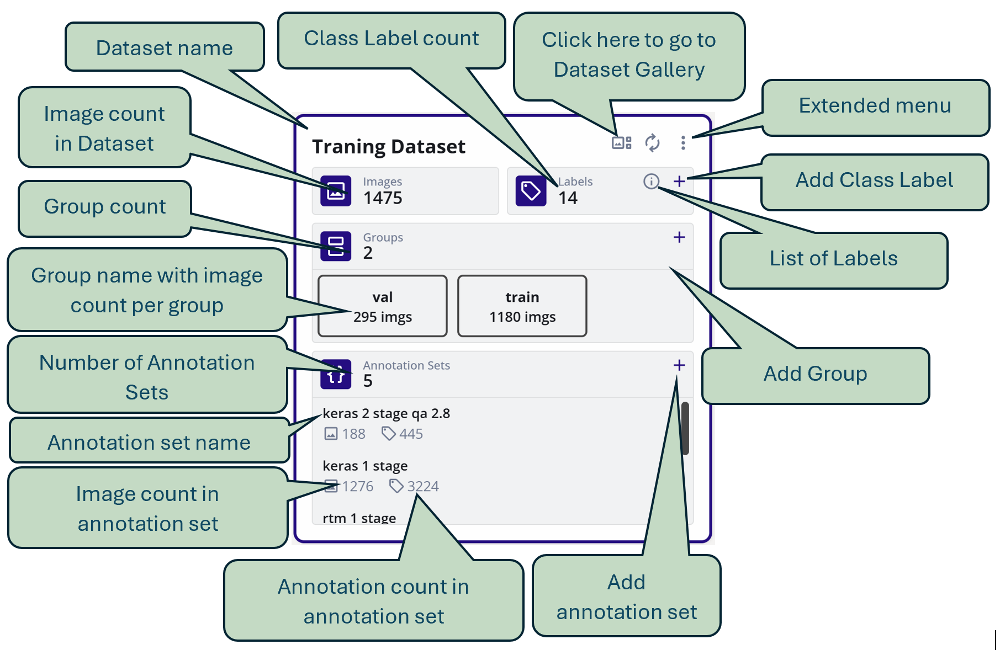

# EdgeFirst Datasets

Overview of EdgeFirst Studio Dataset workflow and pre-packaged datasets.

## Dataset Dashboard
Dataset dashboard show a list of datasets in a project 
with a summary of datasets in each card of dataset.

 
An explanation of information in the dataset card is shown below:

## Annotation Sets

Each dataset can have  multiple annotations sets. Each annotation set contains annotations from a different source (like different annotation teams, or inferences from models) 

#### Annotation Set Operation
 - Click on add annotation set icon (+) to add annotation set
 - Each annotation set has (x) icon to delete annotation set - all associated annotations will also be deleted. Please note that deleted annotation sets goes the the recycling bin and can be either restored or permanently deleted. The storage is only release when the recycling bin is cleared.  
 - Each annotation set has (i) icon to get/set the details of annotation set

## Labels

Click on labels (i) icon to open the dialog to edit labels

The edit dialog allows to:

- Add Label (class)
- Change Color of label
- Change the order of labels by changing its index
- Delete label
- Change the name of a class

## Groups

- Groups allow images to be associated with a certain functionality like training images, validation images, images with error etc.
- One image can be associated with zero or one group only at a time.
- Group can have any name
- Click on the groups (+) icon to add groups
- Multiple groups can be added at one time

The above image show a dialog to add two groups by the name AA abd BB and randomly add 70% and 30% images to each

## Dataset Extended Menu

Click on the three dots on Dataset card to open the extended menu

### Pause Activities
Pause or resume upload activities on this dataset

### Edit Dataset
Change Name or Description of the dataset

### Manage Access
Dataset access control allows dataset resources to be selectively available to different users. 

For more information pease visit [Access Control](../../start/access/access.md)

### Copy Dataset

To copy datasets proceed as follows:

1. Open teh dataset extended menu
2. Select Copy dataset

3. Select the source project (datasets from other projects can be copied into currently selected project)
4. Select the source dataset
5. Select a groups to copy (or all groups)  
6. Select source annotation set - of none is selected then annotations will not be copied
7. Optional select 'Copy Annotations for Duplicate Images'. Normally images with same names are not copied to avoid image duplications. In this case the annotations of duplication images are also not copied. This option (in selected) copy annotations even if the image is duplicated. This is useful if tow datasets have same images but only annotations are required to be copied form one dataset to another
8. Select filters if required. Please refer to [Gallery Filters](../Gallery/gallery.md) for more information.
9. Select the destination dataset(s). Please note that multiple destination datasets can be selected to spit the source dataset images into multiple datasets.
10. Finally select percentage of teh images to be copied. If less that 100% of the images are selected then random subset of the images will be copied.  

### Import Dataset

There are several import types available:

Select the import type. Most common import is the darknet format.

1. Pre create an annotation set where annotations are to be imported. Of only images are imported, then this step is not required.
2. Select the folder were the data is located. For Darknet format, browse ro the images images folder
3. If "Create image groups from folders" is selected, then tha importer will automatically create groups based on folders in the images folder (for example train, val)
4. Select an annotation set
5. Click START IMPORT
6. Import will start in the background and teh status is show in the task progress bar

7. NOTE: Although the import process is running in the background, closing the web browser or the DVE tab will kill the import. Moving to other pages on DVE is still fine.

### Export Dataset

Export Dataset downloads the data from DVE to local folder on PC

1. Select dataset type : detection (bounding box) or Segmentation (Polygons) 
2. Select Export format
3. Select teh annotation set top be exported (non is annotation are not to be exported)
4. Select Mode
    - Dataset: exports images nad annotations - exports a zip file in the download folder
    - Annotations Only - Exports only Annotations - exports a zip file in download folder
    - Images URLS only - useful for larger datasets - exports a file with image urls in the download folder.
5. For datasets larger than 10000 images, import image URLS and annotations separately and then use a python script (downloadable from help menu) to download images

### Analytics

Click on Analytics to see information about the dataset:

### View on Map

When importing a dataset, the GPS location can be imported as following two ways: 

1. GPS location in image EXIF
2. GPS location as annotation type

If GPS location is present, then the annotation can be view on teh map by using the View on Map option.

### Generate API Token

API Token is used for Bridge In and Bridge out API. To generate the API.  The API has encrypted Java Web Token (JWT) with embefded information about dataset and annotation set.

Select Dataset and Annotation set and Click GENERATE 

Copy the API Token in green and use it for Bridge In or Bridge out API

### Park Dataset

Datasets that are not used often can be parked. The advantages of Parking a dataset are:

1. Reduced Storage Cost
2. Dataset is segregated and un-corruptable

Data set can be un-parked at any time for normal usage.

### Remove Dataset

To delete a dataset, click Remove Dataset. This deletes all the images in dataset and its associated annotation.

#### NOTE:
The deleted dataset goes to the recycling bin and can be undeleted. The storage used by the dataset is only released when the dateset is purged from the recycling bin.

