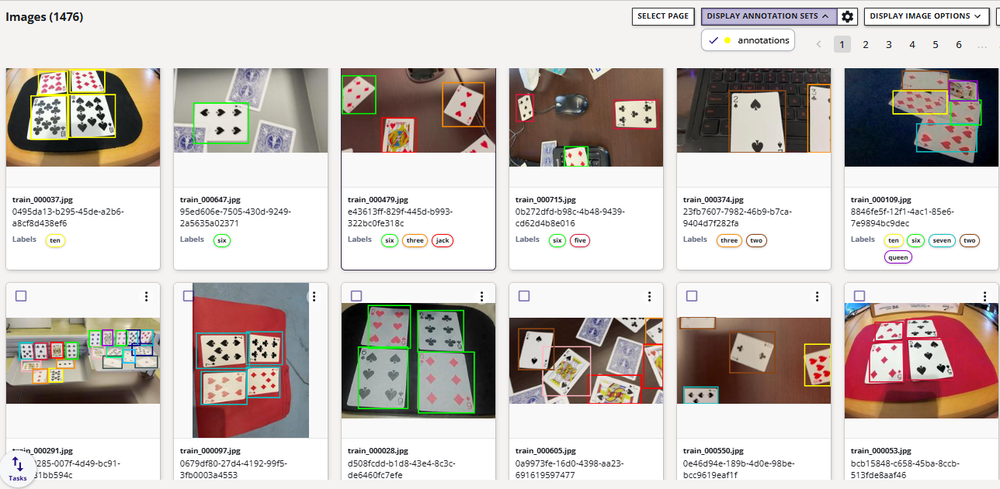

# Playingcards Dataset

PlayingCards is an experimental object detection dataset developed at Au-Zone Technologies to evaluate embedded models in indoor scenarios. 

## Object Detection Benchmark (50 epochs)

=== "ONNX"

    **COCO Metrics - RGB - (640x640) | ONNX**

    | Model             | mAP@0.5 | mAP@0.5..0.95 |
    |-------------------|-----------|-----------|
    | modelpack-csp19-small-640x640-rgb       | 0.874    |   0.687  | 
    | modelpack-csp19-medium-640x640-rgb       | 0.909    |   0.683  | 
    | modelpack-csp19-large-640x640-rgb       | 0.926    |   0.731  | 
    | modelpack-csp53-nano-640x640-rgb       | 0.876    |   0.706    | 
    | modelpack-csp53-small-640x640-rgb       | 0.931    |   0.755    | 
    | ultralytics-yolov8n-640x640-rgb | 0.829 | 0.7 |

    !!! note
        Time information is not included in this validation because they can change dependening on the hardware quality

=== "i.MX 8M Plus"

    **COCO Metrics - RGB - (640x640) | TFLite | INT8**

    | Model             | mAP@0.5 | mAP@0.5..0.95 | Time (ms) |
    |-------------------|-----------|-----------|---------------|
    | modelpack-csp19-small-640x640-rgb     | 0.867    | 0.642    | 16.0    |  
    | modelpack-csp19-medium-640x640-rgb    | 0.861    | 0.643    | 20.6    |  
    | modelpack-csp19-large-640x640-rgb     | 0.91    | 0.658    | 24.46    |  
    | modelpack-csp53-nano-640x640-rgb      | 0.862    | 0.642    | 44.08    |  
    | modelpack-csp53-small-640x640-rgb     | 0.928    | 0.692    | 80.29    |
    | ultralytics-yolov8n-640x640-rgb       | 0.809    | 0.671    | 138.13    | 

    !!! note
        **i.MX 8M Plus** is running BSP 6.12

## Dataset Information

- **Groups**:
    - train: 1327 Images
    - val: 148 images

It contains 1,476 images in total and 13 classes

{align=center}

## Image Gallery

{align=center}

## License
