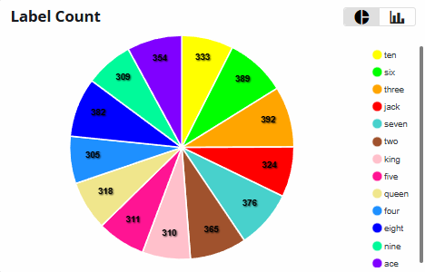

# Playing Cards Dataset

The Playing Cards is an experimental object detection dataset developed at Au-Zone Technologies to evaluate embedded models in indoor scenarios. 

## Object Detection Benchmark (50 epochs)

=== "ONNX"

    **COCO Metrics - RGB - (640x640) | ONNX**

    | Model                              | mAP@0.5 | mAP@0.5..0.95 |
    |------------------------------------|---------|---------------|
    | modelpack-csp19-small-640x640-rgb  | 0.874   | 0.687         | 
    | modelpack-csp19-medium-640x640-rgb | 0.909   | 0.683         | 
    | modelpack-csp19-large-640x640-rgb  | 0.926   | 0.731         | 
    | modelpack-csp53-nano-640x640-rgb   | 0.876   | 0.706         | 
    | modelpack-csp53-small-640x640-rgb  | 0.931   | 0.755         | 
    | ultralytics-yolov8n-640x640-rgb    | 0.829   | 0.700         |

    !!! note "Timing Benchmark"
        Time information is not included in this validation because they can change depending on the hardware quality of the cloud servers in EdgeFirst Studio. The timing benchmarks are provided when the models are run on specific platforms such as the [i.MX 8M Plus](#imx-8m-plus).

=== "i.MX 8M Plus"

    <h2 id="imx-8m-plus" style="display: none;"></h2>

    **COCO Metrics - RGB - (640x640) | TFLite | INT8**

    | Model                              | mAP@0.5 | mAP@0.5..0.95 | Time (ms) |
    |------------------------------------|---------|---------------|-----------|
    | modelpack-csp19-small-640x640-rgb  | 0.867   | 0.642         | 15.99     |  
    | modelpack-csp19-medium-640x640-rgb | 0.901   | 0.643         | 20.60     |  
    | modelpack-csp19-large-640x640-rgb  | 0.909   | 0.658         | 24.46     |  
    | modelpack-csp53-nano-640x640-rgb   | 0.862   | 0.642         | 44.08     |  
    | modelpack-csp53-small-640x640-rgb  | 0.928   | 0.692         | 79.29     |
    | ultralytics-yolov8n-640x640-rgb    | 0.809   | 0.671         | 138.13    | 

    !!! note "BSP Version"
        **i.MX 8M Plus** is flashed with [NXP Yocto BSP](https://www.nxp.com/design/design-center/software/embedded-software/i-mx-software/embedded-linux-for-i-mx-applications-processors:IMXLINUX) 6.12.

## Dataset Information

**Groups**:

- train: 1328 Images
- val: 148 images

It contains 1,476 images in total and 13 classes.

<figure markdown="span">
{ align=center }
</figure>

## Image Gallery

<figure markdown="span">
{ align=center }
</figure>

## License

TBA
