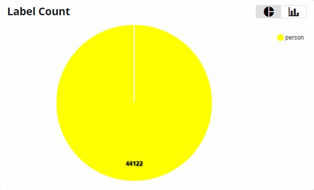
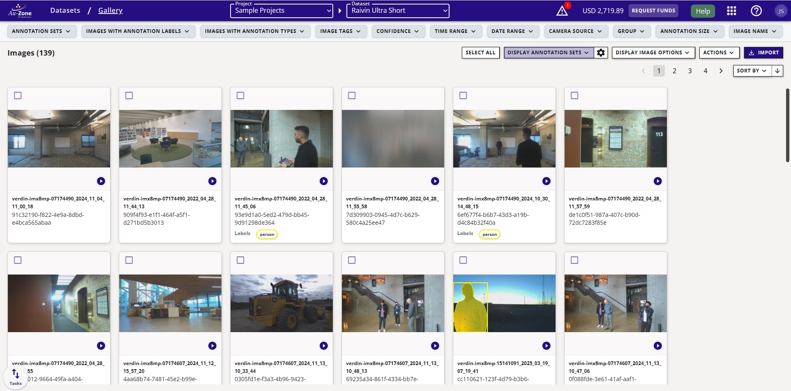

# Raivin Ultra Short Dataset

The Raivin Ultra Short dataset is a 3D dataset created by Au-Zone Technologies to evaluate Fusion models for people awareness at indoor and outdoor scenarios.

## Fusion Benchmark (50 epochs)

=== "ONNX"

    **Fusion BEV Metrics - (480x270) | ONNX**

    | Model                       | Kernel Size | Precision | Recall | IoU   | F1    |
    |-----------------------------|-------------|-----------|--------|-------|-------|
    | fusion-ultra-short-480x270  | 1           | 0.757     | 0.739  | 0.597 | 0.748 |
    |                             | 3           | 0.851     | 0.831  | 0.725 | 0.841 |

=== "TFLite"

    **Fusion BEV Metrics - (480x270) | TFLite**

    | Model                       | Kernel Size | Precision | Recall | IoU   | F1    |
    |-----------------------------|-------------|-----------|--------|-------|-------|
    | fusion-ultra-short-480x270  | 1           | 0.757     | 0.738  | 0.597 | 0.748 |
    |                             | 3           | 0.851     | 0.830  | 0.725 | 0.841 |

## Dataset Information

**Groups**:

- train: 16854 Images
- val: 2133 images

It contains 24,746 images in total and a single class "person".

!!! info "Ungrouped Images"
    There are 5759 images in this dataset that are not associated to
    the train or val groups. 

<figure markdown="span">
{ align=center }
</figure>

## Image Gallery

<figure markdown="span">
{ align=center }
</figure>

## License


