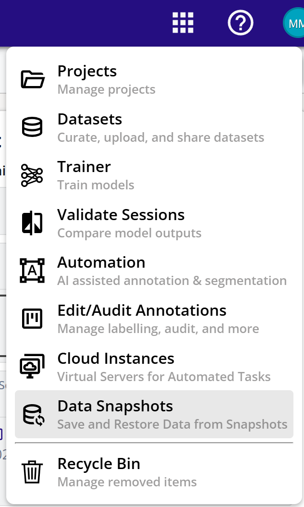
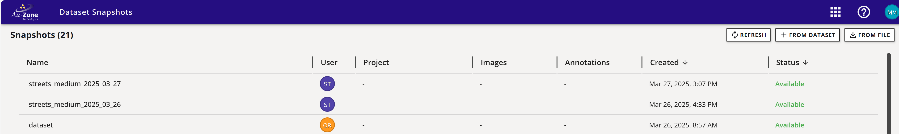
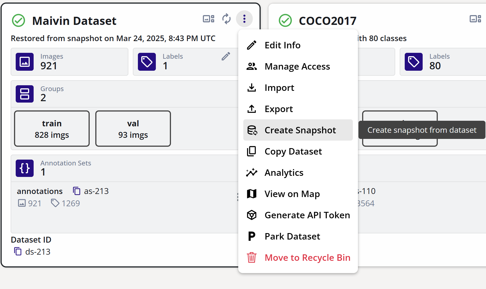
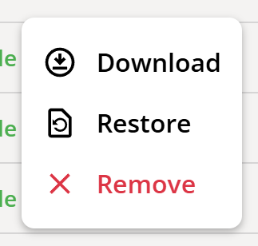
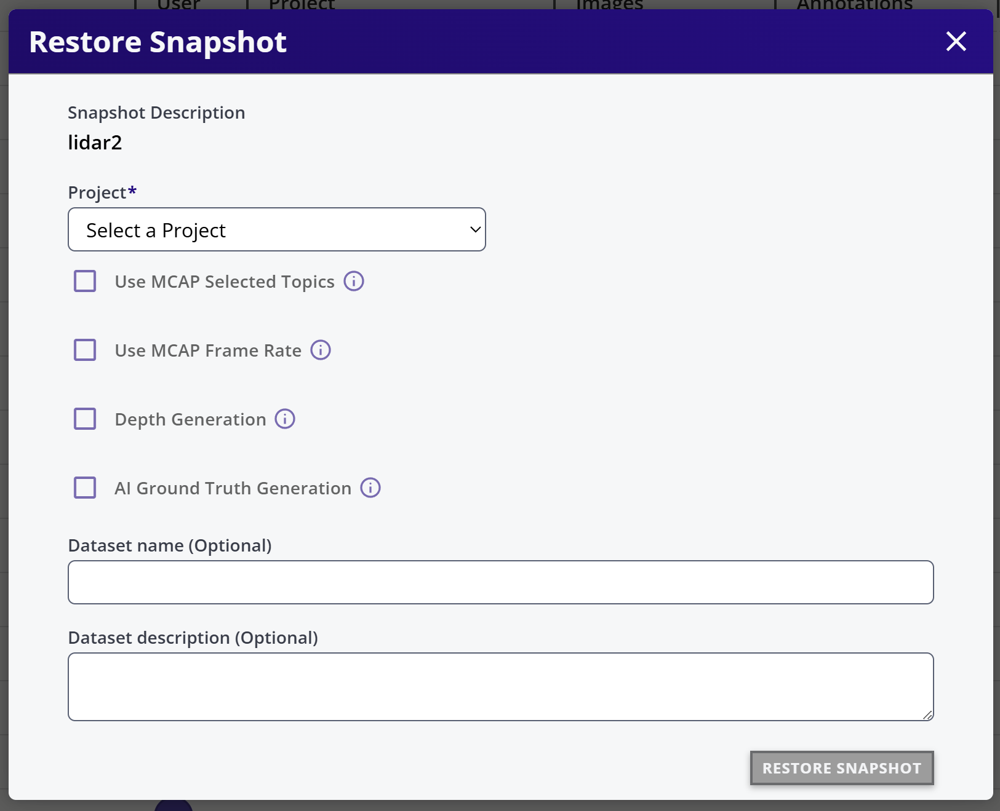

# Snapshots

Snapshots are frozen and compact form of datasets. A snapshot can be created by the following ways:

## Snapshot Dashboard

The snapshot can be opened from the apps menu:

The snapshots menu shows the list of snapshots with its name and status

## Create from existing Dataset
This will create a Zip/Arrow file pair for each sequence in a dataset and store in the cloud storage. This snapshot can be later restored (into another dataset) or can be downloaded to local folder on a PC.

1. From the Dataset Card, open teh context menu and select 'Generate API Token'

2. This will trigger the creation of snapshot.
3. The status of the snapshot generation will be shown in the dataset card.
4. When Completed, the snapshot will appear in teh snapshots dashboard

## Upload from file MCAP

1. Go to the snapshots dashboard
2. Click on the "From File" button or drag and drop an MCAP file on the dashboard

## Upload from Zip / Arrow file

1. Go to the snapshots dashboard
2. Click on the "From File" button or drag and drop aa folder container zip and arrow file pairs on the dashboard
3. The name of corresponding zip and arrow files must be same
4. If there are multiple zip and arrow pairs, then each pair will become a sequence

## Restore Snapshot

This action will take an MCAP or Zip/Arrow files and create a dataset in DVE. The Backend pipelines of auto depth map generation, object detection and Automated Ground Truth Generation can also be selected at this time while restoring.

1. Click on the snapshot context menu (three dots)
2. Select Restore

3. This will open the restore dialog

4. Select Project where the dataset will be created
5. Enter dataset name and description. If dataset name is not provided a dataset, a dataset with snapshot name will be created
6. Check 'Use MCAP Selected Topics' if selected topics are to be imported (for example ignoring Radar and only importing Segmentation)
7. Select 'Use MCAP Frame Rate' to select a custom frame rate
8. Select 'Depth Generation' to use AI Model based  depth map generation.
9. Select 'AI Ground Truth Generation' to enable Auto generation of 2D boxes, 3D boxes and segmentation masks 
10. Click RESTORE SNAPSHOT
11. The Dataset dashboard will have a new datasets with progress indication
12. The progress for different stages will be at different rates

## Download Snapshot

1. Click on the snapshot context menu (three dots)
2. Select Download 

## Delete Snapshot

1. Click on the snapshot context menu (three dots)
2. Select Remove 

