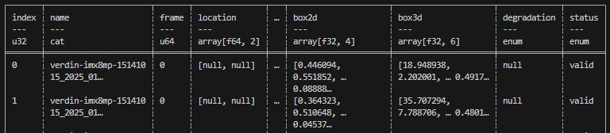

# Dataset File Structure

We propose different file structures for datasets that fall into two categories: Sequence-Based, Image-Based, and Mixed.  Sequence-Based datasets are imported from a video recording with sequential frames and these datasets preserve the order of the frames from start to end.  Image-Based datasets do not have frames, but images without any specific order.  Mixed datasets contains both sequences and image-based samples. 

Before reading further, it is highly recommended to be familiar with the [EdgeFirst Dataset Format](format.md) as this describes the dataset format presented by EdgeFirst Studio to distinguish sensor and annotation containers.  Recall that sensor containers contain the images captured by the camera that is stored in either a Zip file or a standard directory. The distinction between the file structures presented in this page is based on whether or not the sensor container stores video frames (sequences) or images.  Lastly, the annotations for each sample are stored in an Arrow file. 

A typical Arrow file has the following contents.

<figure markdown="span">
{ align=center }
<figcaption>Sample DataFrame</figcaption>
</figure>

For a sequence, the "name" column lists the sequence names and the "frame" column lists the frame indices.  For images, the "name" column is the name of the image and the "frame" will contain `Null`. 

!!! note
    The Arrow file in the file structures below is stored inside the dataset directory.  However, the user can specify the location of the Arrow file when using [EdgeFirst-Client](../perception/studio.md#annotation-management).

## Sequence-Based 

As noted above, these datasets contain video frames where the samples have a defined order from start to end (sequential). These datasets could originate from recordings using an EdgeFirst Platform which records an MCAP file or from a typical video file such as an MP4.  There could be multiple sequences stored for any given dataset.  The dataset structure of this type is organized in the following order.

```text
<dataset name>/
├── <sequence one>/
│   ├── *.<ext>
├── <sequence two>/
|   ├── *.<ext>
...
├── <sequence x>/
|   ├── *.<ext>
└── <dataset>.arrow
```

!!! note
    Elements surrounded by `<>` means that these elements are flexible and can be specified by any string.  Similarly, `*.<ext>` indicates any type of image extension.  For example, the directory could contain image files with `.camera.jpeg`, `.jpg`, `.png`, etc. 

## Image-Based

As noted above, these datasets contain image files where there is no order between images.  These datasets could originate from external datasets such as [COCO](https://docs.ultralytics.com/datasets/detect/coco/) or images captured from a mobile device.  The dataset structure of this type is organized in the following order.

```text
<dataset name>/
├── *.<ext>
└── <dataset>.arrow
```

!!! note
    `*.<ext>` indicates all the image files with any type of image extension.  For example, the directory could contain image files with `.camera.jpeg`, `.jpg`, `.png`, etc.

## Mixed

These datasets contain both sequences and standard non-sequence images.  The dataset structure of this type is organized in the following order.

```text
<dataset name>/
├── <sequence one>/
│   ├── *.<ext>
├── <sequence two>/
|   ├── *.<ext>
...
├── <sequence x>/
|   ├── *.<ext>
├── *.<ext>
└── <dataset>.arrow
```

Sequences have designated sub-directories in the dataset to store the frames.  Images are stored in the dataset directory. 

## Further Reading

In this article, we have described how EdgeFirst Datasets are structured depending if the dataset is sequence-based, image-based, or mixed.  Next, explore how datasets are created from scratch in EdgeFirst Studio from capture to annotation by following the [Dataset Tutorials](tutorials/index.md).