# Dataset Tutorials

This guide describes the various dataset tutorials/workflows in EdgeFirst Studio from capture to annotation and dataset management (curation).

## Capture/Record Data

This tutorial is a high level tutorial that provides an overview for recording data using an [EdgeFirst Platform](../platforms/index.md). For an in depth tutorial, please refer to the [MCAP Recording Service](../platforms/recording.md).

    <iframe width="560" height="315" src="https://www.youtube.com/embed/GVlkq9p0G5c" title="Dataset Recording" frameborder="0" allow="accelerometer; autoplay; clipboard-write; encrypted-media; gyroscope; picture-in-picture; web-share" referrerpolicy="strict-origin-when-cross-origin" allowfullscreen></iframe>

On your browser, enter the following URL `https://<hostname>/` and the following page will appear.

!!! note
    Replace `<hostname>` with the hostname of your device.

You will be greeted to the [Web UI Service](../platforms/walkthrough.md) page.

<figure markdown="span">
{ align=center }
<figcaption>WebUI Service Page</figcaption>
</figure>

To record data, click on the *MCAP Recorder* service highlighted in red above. Once clicked, you will be greeted with the [MCAP Recording Service](../platforms/walkthrough.md#the-mcap-recording-page) page.

<figure markdown="span">
{ align=center }
<figcaption>MCAP Recording Page</figcaption>
</figure>

To start recording toggle/enable the *Recording* button indicated above and
to stop the recording retoggle/disable the same button. 

For more information on managing recordings, please see the [Managing Recordings Tutorial](../platforms/recording.md#managing-recordings).

## Download Recorded Data

This tutorial shows how to download recorded MCAP data shown in [Capture/Record Data Tutorial](#capturerecord-data). For more information on downloading MCAPs, please see [Downloading and Analysis](../platforms/recording.md#downloading-and-analysis).

    <iframe width="560" height="315" src="https://www.youtube.com/embed/j-75Q5-_dC0?start=0&end=558" title="Download Recording" frameborder="0" allow="accelerometer; autoplay; clipboard-write; encrypted-media; gyroscope; picture-in-picture; web-share" referrerpolicy="strict-origin-when-cross-origin" allowfullscreen></iframe>

The MCAP files are listed under the list of MCAP files which can then be downloaded to your PC.

<figure markdown="span">
{ align=center }
<figcaption>Recorded MCAP</figcaption>
</figure>

## Upload Recorded Data to EdgeFirst Studio

This tutorial shows how to upload a downloaded MCAP recording shown in [Download Recorded Data Tutorial](#download-recorded-data). For uploading [EdgeFirst Datasets](format.md), please see the instructions for [Upload from Zip/Arrow File](../studio/snapshots.md#upload-from-ziparrow-file).

    <iframe width="560" height="315" src="https://www.youtube.com/embed/j-75Q5-_dC0?start=558&end=720" title="Upload MCAP" frameborder="0" allow="accelerometer; autoplay; clipboard-write; encrypted-media; gyroscope; picture-in-picture; web-share" referrerpolicy="strict-origin-when-cross-origin" allowfullscreen></iframe>

In EdgeFirst Studio, select *Data Snapshots* under the tool options.

<figure markdown="span">
{ align=center }
<figcaption>Data Snapshots</figcaption>
</figure>

!!! note
    A project has already been created intended for object detection. This step
    has been covered in [Getting Started](../index.md#initial-steps).

Once you are in the *Data Snapshots* page, upload the recorded MCAP by clicking *FROM FILE* which opens a new window dialog for selecting the MCAP downloaded in your PC.

<figure markdown="span">
{ align=center }
<figcaption>Upload MCAP</figcaption>
</figure>

Once the MCAP file is selected, this would start the upload progress in EdgeFirst Studio. This upload progress may take several minutes depending on the size of the MCAP. Once the upload is complete, the status will be shown like the figure on the right. 

**Upload Progress** | **Completed Upload** 
:------------------:|:------------------:
 | 

## Data -> Dataset: Annotating Data

This tutorial shows how to annotate an uploaded MCAP recording shown in [Upload Recorded Data Tutorial](#upload-recorded-data-to-edgefirst-studio).

##### Auto Annotations via Snapshot

To reduce the effort required by the user to annotate the data, part of this process is to run auto-annotations on the uploaded data. 

    <iframe width="560" height="315" src="https://www.youtube.com/embed/j-75Q5-_dC0?start=720&end=1163" title="Auto Annotate Dataset" frameborder="0" allow="accelerometer; autoplay; clipboard-write; encrypted-media; gyroscope; picture-in-picture; web-share" referrerpolicy="strict-origin-when-cross-origin" allowfullscreen></iframe>

To run auto-annotations on the recorded data, click *Restore* on the uploaded snapshot.

<figure markdown="span">
{ align=center }
<figcaption>Restore Snapshot</figcaption>
</figure>

The following fields are for the user to specify. Adjust the following fields for your own use case.

<figure markdown="span">
{ align=center }
<figcaption>Restore Snapshot Fields</figcaption>
</figure>

Once specifed, click *RESTORE SNAPSHOT* to start the auto-annotation process. This
will start the auto-annotation process.

<figure markdown="span">
{ align=center }
<figcaption>Restore Process</figcaption>
</figure>

The progress will be shown on the dataset specified in the project.

<figure markdown="span">
{ align=center }
<figcaption>Restore Progress</figcaption>
</figure>

Once completed, the dataset will now contain annotations that resulted from the auto-annotation process.

<figure markdown="span">
{ align=center }
<figcaption>Restored Dataset</figcaption>
</figure>

Next [navigate to the gallery](#viewing-datasets) of the dataset by clicking on the gallery button highlighted in red to visualize the annotations. The figure below shows a side-by-side display of the annotations from frames 1-3. The annotations for "people" are shown as both segmentation masks and bounding boxes. 

**Frame 1** | **Frame 2** | **Frame 3** 
:------------------:|:------------------:|:------------------:
 |  | 

##### Auto Annotations via Gallery

Another method for running auto-annotations is to utilize the propagation feature in the gallery.  This feature will preload all frames in a *video* sequence in the dataset into SAM-2 to generate segmentation masks, 2D bounding boxes, 3D bounding boxes (For Raivin/LiDAR Only) by tracking the object across the frames. 

Start by enabling an AI Assisted Ground Truth server by navigating to the *Cloud Instances* under the tool options.

<figure markdown="span">
{ align=center }
<figcaption>Cloud Instances</figcaption>
</figure>

Start and launch a new server to host the auto-segmentation backend.

<figure markdown="span">
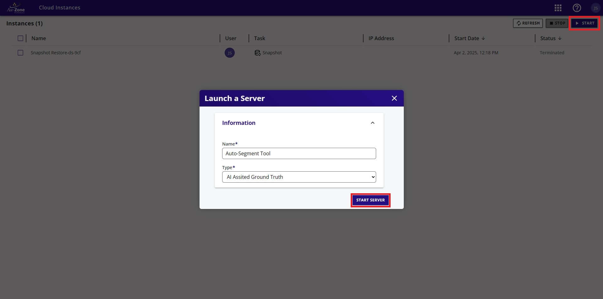{ align=center }
<figcaption>Start a Server</figcaption>
</figure>

!!! warning

    This server is costing credits to run.  An inactivity of 15 minutes will auto-terminate this server.  Otherwise, once you have completed the annotations, please ensure to terminate this server to avoid spending more of your credits. 

    <figure markdown="span">
    { align=center }
    <figcaption>Select AI Server</figcaption>
    </figure>

    <figure markdown="span">
    { align=center }
    <figcaption>Terminate AI Server</figcaption>
    </figure>

Next navigate back to the [dataset gallery](#viewing-datasets) and enable edit mode.

<figure markdown="span">
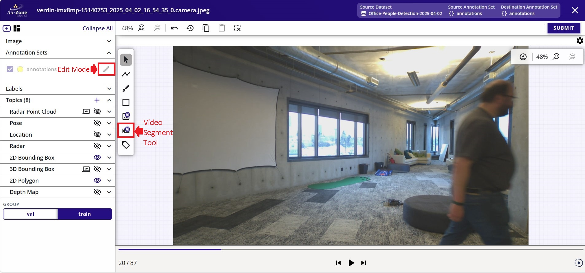{ align=center }
<figcaption>Select the Video Segment Tool</figcaption>
</figure>

Click on the Video Segment Tool as indicated in red above. Next click the "Initialize State". This will load the indicated starting frame (current) to the stop frame (end) to SAM-2 for tracking the object across these frames for auto annotations. 

<figure markdown="span">
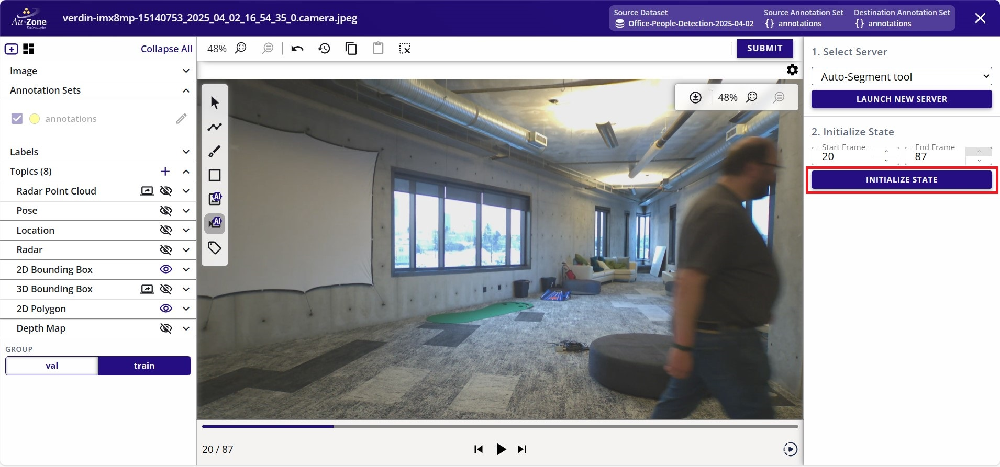{ align=center }
<figcaption>Initialize the Video State</figcaption>
</figure>

Once the state has been initialized, additional options will be provided to allow the user to provide prompts to SAM for propagation. Start by selecting the box tool as indicated in red. This will allow the user to draw bounding box prompts to the initial annotation for propagation.

<figure markdown="span">
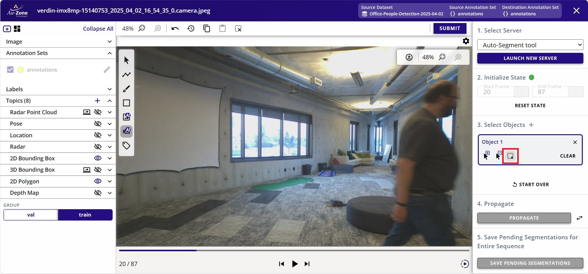{ align=center }
<figcaption>Select the Box Tool</figcaption>
</figure>

Now draw a bounding box prompt (white) around the object to annotate. In this case the person on the frame will be annotated. Once the bounding box is drawn, the segmentation mask will be drawn and the associated bounding box for the mask (yellow). Next click on "Propagate" to propagate this annotation (mask and bounding box) across frames using SAM-2 tracking and propagation. 

<figure markdown="span">
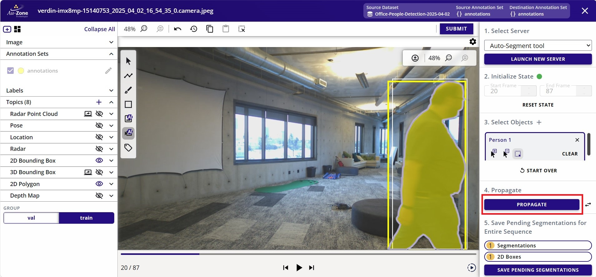{ align=center }
<figcaption>Initial Annotation</figcaption>
</figure>

This will start the propagation progress across the frames specified.

<figure markdown="span">
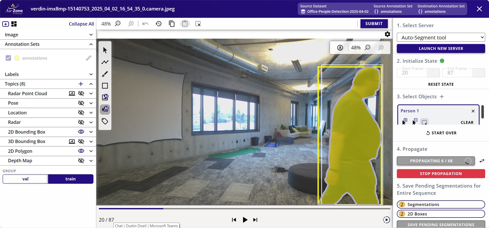{ align=center }
<figcaption>Propagation Progress</figcaption>
</figure>

Once the propagation is completed, click "Save Pending Segmentations" to save the propagated annotations. 

<figure markdown="span">
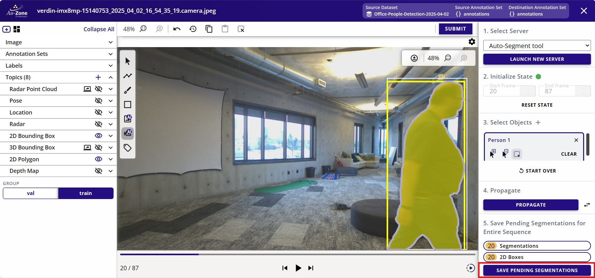{ align=center }
<figcaption>Save Pending Segmentations</figcaption>
</figure>

For cases where the object exits and then re-enters the frame, the object might not be tracked properly. Repeat the steps as necessary to annotate objects that were missed.

<figure markdown="span">
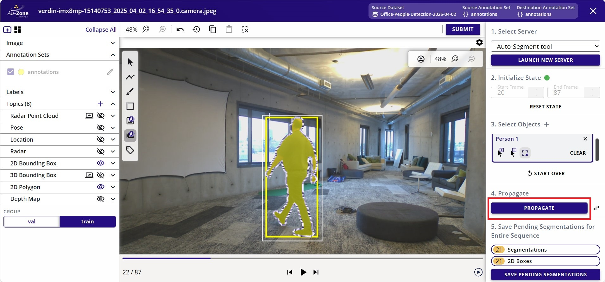{ align=center }
<figcaption>Repeat Propagation</figcaption>
</figure>

A completed propagation will show the annotations with masks and bounding boxes for subsequent frames as follows.

| Annotation 1             | Annotation 2           | Annotation 3           |
|--------------------------|------------------------|------------------------|
| 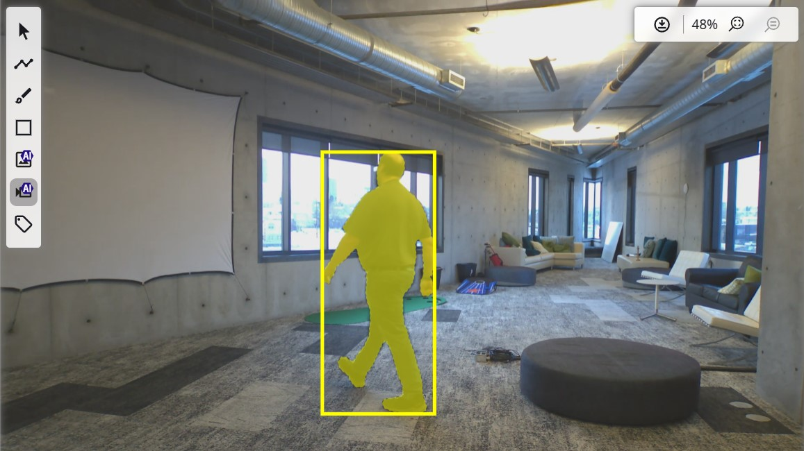 | 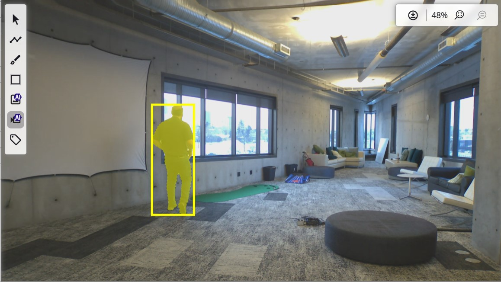 | 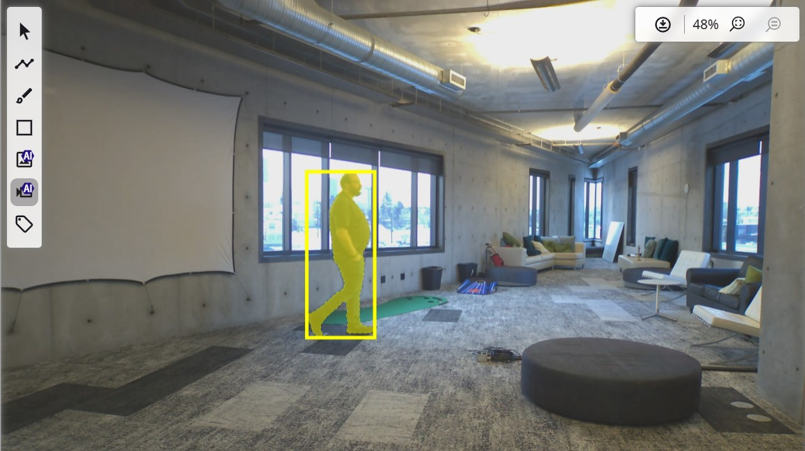 |

##### Audit 2D Annotations

This step requires verifying the outputs of the auto-annotations and to make
corrections to the 2D annotations if necessary in order to have a proper fully annotated dataset.

Some annotations were missed from the auto-annotations and to correct those errors, we can utilize the auto-segment tool.
Start by enabling an AI Assisted Ground Truth server by navigating to the *Cloud Instances* under the tool options.

<figure markdown="span">
{ align=center }
<figcaption>Cloud Instances</figcaption>
</figure>

Start and launch a new server to host the auto-segmentation backend.

<figure markdown="span">
{ align=center }
<figcaption>Start a Server</figcaption>
</figure>

Navigate back to the [dataset gallery](#viewing-datasets) and enable edit mode.

<figure markdown="span">
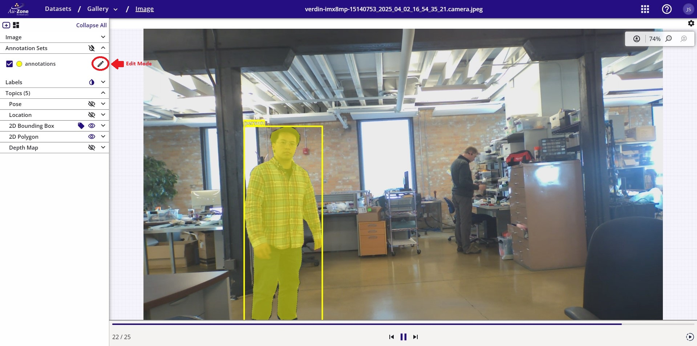{ align=center }
<figcaption>Edit Mode</figcaption>
</figure>

Select the *AI Image Segment Tool* and then enable the *SAM Box Tool*

<figure markdown="span">
{ align=center }
<figcaption>Auto Segment Mode</figcaption>
</figure>

Draw a bounding box around the person that was missed and then click *CREATE ANNOTATION* to create
the drawn segmentation mask. Click *SUBMIT* to accept the annotation. 

<figure markdown="span">
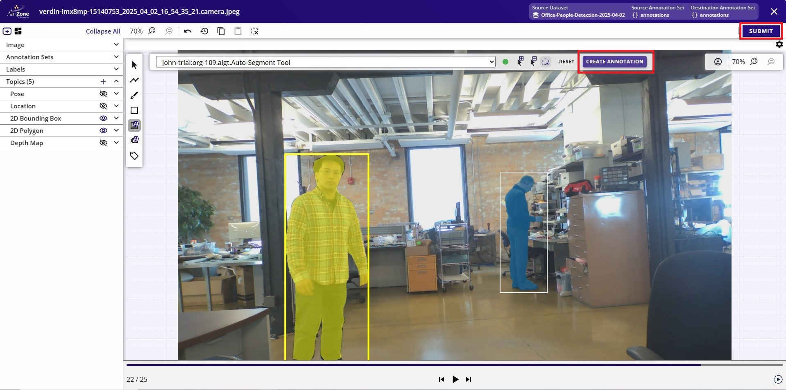{ align=center }
<figcaption>Segment Tool</figcaption>
</figure>

Draw a bounding box annotation around the person that was missed by selecting the *Box Tool*.
Click *SUBMIT* to accept the annotation. 

<figure markdown="span">
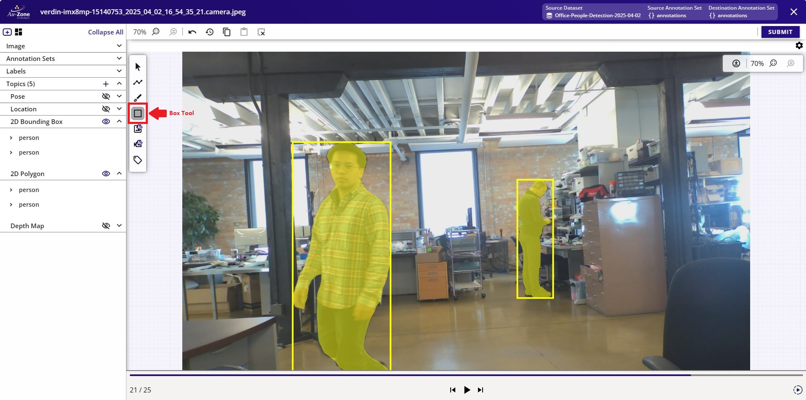{ align=center }
<figcaption>Box Tool</figcaption>
</figure>

Part of the audit process is to go over each sample in the dataset and correcting any missed annotations or incorrect annotations.

#### Audit 3D annotations

This step requires verifying the outputs of the auto-annotations and to make
corrections to the 3D bounding box annotations if necessary in order to have a proper fully annotated dataset.

    <iframe width="560" height="315" src="https://www.youtube.com/embed/j-75Q5-_dC0?start=1536&end=2144" title="Visualize Annotations" frameborder="0" allow="accelerometer; autoplay; clipboard-write; encrypted-media; gyroscope; picture-in-picture; web-share" referrerpolicy="strict-origin-when-cross-origin" allowfullscreen></iframe>

First [navigate to the gallery](#viewing-datasets) and enable edit mode.

<figure markdown="span">
{ align=center }
<figcaption>Edit Mode</figcaption>
</figure>

Ensure the point clouds and the 3D bounding box annotations are toggled visible.

<figure markdown="span">
{ align=center }
<figcaption>Visible 3D Annotations</figcaption>
</figure>

##### Scale 3D Annotation

The error in the current annotation is that the bounding box is not scaled properly. Click on the option on the left sidebar to enable 3D bounding box scaling as highlighted in red.

<figure markdown="span">
{ align=center }
<figcaption>Scale 3D Annotations</figcaption>
</figure>

Click on the current 3D bounding box to scale and this will provide cursors to scale the 3D bounding box in the 3-axis.

<figure markdown="span">
{ align=center }
<figcaption>Scaling 3D Annotations</figcaption>
</figure>

The 3D bounding box was adjusted with proper scaling to the LiDAR point clouds of the object.

| Scaled YZ Plane             | Scaled XY Plane           | Scaled XZ             |
|-----------------------------|---------------------------|-----------------------|
|  |  |  |

##### Translate 3D Annotation

Next the adjusted 3D bounding box needs to be properly translated. Click on the option on the left sidebar to enable 3D bounding box translation as highlighted in red.

<figure markdown="span">
{ align=center }
<figcaption>Translate 3D Annotations</figcaption>
</figure>

Similar to the workflow as scaling the 3D bounding boxes, move the three cursors for each axis to translate the bounding box for each axis.

| Translate YZ Plane          | Translate XY Plane        | Translate XZ          |
|-----------------------------|---------------------------|-----------------------|
|  |  |  |

Once the 3D bounding box annotation is properly oriented, click "SUBMIT" to save the changes.

<figure markdown="span">
{ align=center }
<figcaption>Submit 3D Annotations</figcaption>
</figure>

##### Add 3D Annotation

To add a missing 3D bounding box, click on the option on the left sidebar to add a new 3D bounding box annotation as highlighted in red.

<figure markdown="span">
{ align=center }
<figcaption>Add 3D Annotations</figcaption>
</figure>

Now click on the grid to add a new 3D bounding box on the position of the click.

<figure markdown="span">
{ align=center }
<figcaption>Added 3D Annotations</figcaption>
</figure>

This newly added 3D bounding box may not be scaled or translated properly. Follow instructions for [scaling](#scale-3d-annotation) and [translating](#translate-3d-annotation) a 3D bounding box to properly center the bounding box around the LiDAR point cloud as shown below. Once the annotation is properly scaled and translated, click "SUBMIT" to save the annotation.

<figure markdown="span">
{ align=center }
<figcaption>Submit 3D Annotations</figcaption>
</figure>

## Viewing Datasets

This tutorial will show how to view the contents in the dataset.

    <iframe width="560" height="315" src="https://www.youtube.com/embed/afPsj7_7SnU" title="Viewing Datasets" frameborder="0" allow="accelerometer; autoplay; clipboard-write; encrypted-media; gyroscope; picture-in-picture; web-share" referrerpolicy="strict-origin-when-cross-origin" allowfullscreen></iframe>

In the project's page, you can click on the dataset button highlighted in red
to view the datasets contained in the project.

<figure markdown="span">
{ align=center }
<figcaption>View Datasets</figcaption>
</figure>

You will now see the datasets contained in the project. Each dataset has a gallery. To see the images in the gallery, open the gallery by clicking the gallery button highlighted in red.

<figure markdown="span">
{ align=center }
<figcaption>Gallery Button</figcaption>
</figure>

When clicking the gallery button, you will either see the images in the dataset for [Image-Based Datasets](../datasets/structure.md#image-based) or sequences for [Sequence-Based Datasets](../datasets/structure.md#sequence-based).

For sequence-based datasets, you need to specify which sequence you would like to view. This can be done by clicking on the sequence.

!!! note
    The *Raivin Pedestrians (ultra-short range) 2025.03* has a single sequence.

<figure markdown="span">
{ align=center }
<figcaption>Dataset Sequence</figcaption>
</figure>

When the sequence is clicked, you will now see the frames stored in the sequence along with the annotations.

<figure markdown="span">
{ align=center }
<figcaption>Dataset Sequence</figcaption>
</figure>

## Verifying Datasets

This tutorial will show an example of a dataset that is ready for training. 

    <iframe width="560" height="315" src="https://www.youtube.com/embed/Q8uiYJb1HJ4?start=81&end=118" title="Indoor Dataset Overview" frameborder="0" allow="accelerometer; autoplay; clipboard-write; encrypted-media; gyroscope; picture-in-picture; web-share" referrerpolicy="strict-origin-when-cross-origin" allowfullscreen></iframe>

Verify that the dataset has a training and validation split.  The sample dataset shown below has a dedicated split for training (20066 samples) and validation (2229 samples).

<figure markdown="span">
{ align=center }
<figcaption>Fusion Dataset Groups</figcaption>
</figure>

Another sample dataset shown below is for training Vision models which has a dedicated split for training (1656 samples) and validation (184 samples).

<figure markdown="span">
{ align=center }
<figcaption>Vision Dataset Groups</figcaption>
</figure>

Verify the contents of the dataset and the annotations.  Click the button that navigates to the gallery.  This will show the contents of the dataset.  The dataset may be comprised of multiple sequences as shown below.  

<figure markdown="span">
{ align=center }
<figcaption>Fusion Dataset Sequences</figcaption>
</figure>

<figure markdown="span">
{ align=center }
<figcaption>Vision Dataset Sequences</figcaption>
</figure>

Clicking on any of these sequences will open individual images in the sequence with the visualizations of the annotations.  For more information please see [Viewing Datasets](#viewing-datasets) above.

!!! info
    Datasets that train Fusion models provide world annotations of the object's 3D bounding box.  For more information on the dataset annotations, please see [EdgeFirst Dataset Format](format.md#dataset-annotation-format).

<figure markdown="span">
{ align=center }
<figcaption>Fusion Annotations</figcaption>
</figure>

!!! info
    Datasets that train Vision models provide image annotations of the object's 2D bounding box and segmentation mask.  For more information on the dataset annotations, please see [EdgeFirst Dataset Format](format.md#dataset-annotation-format).

<figure markdown="span">
{ align=center }
<figcaption>Vision Annotations</figcaption>
</figure>

For cases where the annotations need corrections, please see [Audit 2D Annotations](#audit-2d-annotations) for more details.

## Creating Datasets

This tutorial will show how to create an empty dataset container in EdgeFirst Studio. This container is needed for [copying](#copying-datasets) or [combining](#combining-datasets) datasets as shown in the next sections.

    <iframe width="560" height="315" src="https://www.youtube.com/embed/DJabdEHaZ8E?start=42&end=94" title="Creating Datasets" frameborder="0" allow="accelerometer; autoplay; clipboard-write; encrypted-media; gyroscope; picture-in-picture; web-share" referrerpolicy="strict-origin-when-cross-origin" allowfullscreen></iframe>

To create a dataset, first select the project to store the new dataset. Next click the dataset button (highlighted in red) to view the datasets in that selected project.

<figure markdown="span">
{ align=center }
<figcaption>Dataset Button</figcaption>
</figure>

Next create a new dataset by clicking the "NEW DATASET" button highlighted in red on the top right.

<figure markdown="span">
{ align=center }
<figcaption>Create Dataset Button</figcaption>
</figure>

Provide the dataset name and the dataset desciption for this new dataset. In this example the name is the same as the original dataset source. Once the fields are filled, click the "CREATE" button on the bottom left of the window dialog.

<figure markdown="span">
{ align=center }
<figcaption>Create Dataset Fields</figcaption>
</figure>

Once created, define an annotation set. The annotation set is a container for storing
the annotations in the original dataset. To create an annotation set, click the "+" button
in the "Annotation Sets" field. 

<figure markdown="span">
{ align=center }
<figcaption>Create Annotation Set</figcaption>
</figure>

Next provide the name and description for the annotation container as shown below. Once provided, click "CREATE NEW SET" to create the annotation set.

<figure markdown="span">
{ align=center }
<figcaption>Annotation Set Fields</figcaption>
</figure>

You have now created a dataset and an annotation set container as shown below. This container can be used to store [copied](#copying-datasets) or [combined](#combining-datasets) datasets.

<figure markdown="span">
{ align=center }
<figcaption>Created Dataset</figcaption>
</figure>

## Copying Datasets

This tutorial will show how to copy the dataset to a different container.

    <iframe width="560" height="315" src="https://www.youtube.com/embed/qLv8ayxQ-Ns?start=326&end=372" title="Copying Datasets" frameborder="0" allow="accelerometer; autoplay; clipboard-write; encrypted-media; gyroscope; picture-in-picture; web-share" referrerpolicy="strict-origin-when-cross-origin" allowfullscreen></iframe>

To copy a dataset, first [create a dataset](#creating-datasets) container. Once created, select the "Copy Dataset" from the dataset options on the newly created dataset container as shown below.

<figure markdown="span">
{ align=center }
<figcaption>Copy Dataset</figcaption>
</figure>

This will open a new dialog for the user to specify the source dataset and the destination dataset. The source dataset is the original dataset and the destination dataset is the dataset container that was just created. The following options specified are shown below.

<figure markdown="span">
{ align=center }
<figcaption>Copy Dataset Options</figcaption>
</figure>

The options provided above specifies the source dataset to originate from the public dataset "Raivin Ultra Short 2025.03" inide the public project "Sample Project". Next the destination dataset is the dataset and annotation containers that was created. Once the options are specified, go ahead and click "APPLY" to start the copy process.

<figure markdown="span">
{ align=center }
<figcaption>Copy Dataset Process</figcaption>
</figure>

Once the copying process completes, the frames and the annotations have been copied.

**Original Dataset** | **Copied Dataset**
:------------------:|:------------------:
 | 

## Combining Datasets

The process of combining datasets consists of multiple copy processes on a given dataset container. To combine datasets, first [create a dataset](#creating-datasets) container. Follow the process for [copying a dataset](#copying-datasets) onto the destination dataset container that was created. The copy process will copy the selected dataset onto the same dataset container and thus combining multiple datasets.

## Splitting Datasets

A proper dataset has samples reserved for training and validation. This tutorial will show how to split the samples in the dataset into training and validation groups.

    <iframe width="560" height="315" src="https://www.youtube.com/embed/qLv8ayxQ-Ns?start=0&end=64" title="Splitting Datasets" frameborder="0" allow="accelerometer; autoplay; clipboard-write; encrypted-media; gyroscope; picture-in-picture; web-share" referrerpolicy="strict-origin-when-cross-origin" allowfullscreen></iframe>

Consider the following dataset without any groups reserved.

<figure markdown="span">
{ align=center }
<figcaption>No Groups</figcaption>
</figure>

To create the dataset groups, click on the "+" button in the *Groups* field. 

<figure markdown="span">
{ align=center }
<figcaption>Add Groups</figcaption>
</figure>

This will open a new dialog to list the groups needed by the user and the percentages dedicated for each group. Often the groups "train" and "val" are created, but the user is free to specify their own groups.

<figure markdown="span">
{ align=center }
<figcaption>Groups Field</figcaption>
</figure>

Once the groups are specified, click *ADD GROUPS* to create the groups. This will automatically divide the samples in the dataset based on the percentages of each group specified.

<figure markdown="span">
{ align=center }
<figcaption>Dataset Groups</figcaption>
</figure>

## Importing Datasets

This tutorial will show how to import a dataset into EdgeFirst Studio. For importing [EdgeFirst Datasets](format.md), please see the instructions for [Upload from Zip/Arrow File](../studio/snapshots.md#upload-from-ziparrow-file).

<iframe width="560" height="315" src="https://www.youtube.com/embed/DJabdEHaZ8E?start=41" title="Import Dataset" frameborder="0" allow="accelerometer; autoplay; clipboard-write; encrypted-media; gyroscope; picture-in-picture; web-share" referrerpolicy="strict-origin-when-cross-origin" allowfullscreen></iframe>

This tutorial will show importing a dataset such as [COCO128](https://www.kaggle.com/datasets/ultralytics/coco128) as an example.

To import a dataset, first [create a dataset](#creating-datasets) container. The following dataset is created with the name set to "Coco128" and the description as "Demo import". Furthermore, an annotation set has also been created called "Ground Truth".

<figure markdown="span">
{ align=center }
<figcaption>COCO128 Dataset Container</figcaption>
</figure>

For an example dataset, [COCO128](https://www.kaggle.com/datasets/ultralytics/coco128?resource=download) was downloaded using the link provided. This will download a ZIP archive which can then be extracted.

Once a container has been created, open the dataset options denoted by the three vertical dots on the top right corner of the dataset card.

<figure markdown="span">
{ align=center }
<figcaption>Dataset Options</figcaption>
</figure>

Select "Import".

<figure markdown="span">
{ align=center }
<figcaption>Import Option</figcaption>
</figure>

This will popup a new window for you to specify the dataset to be imported. In these options, select the "Import Type" to be "Darknet". Specify the dataset folder "coco128" to be imported. Specify the annotation set to the "Ground Truth" annotation set. The following figure shows the specifications.

<figure markdown="span">
{ align=center }
<figcaption>Import Options</figcaption>
</figure>

The "coco128" dataset that was specified contains the "images" and "labels" subdirectories. 

<figure markdown="span">
{ align=center }
<figcaption>COCO128</figcaption>
</figure>

Select "START IMPORT" at the bottom right to start the import process.

<figure markdown="span">
{ align=center }
<figcaption>Start Import</figcaption>
</figure>

This will start the import process as shown.

<figure markdown="span">
{ align=center }
<figcaption>Import Process</figcaption>
</figure>

Once completed, refresh the page to see the changes. The dataset container will now contain 128 images from COCO and the annotations stored in the "Ground Truth" container.

<figure markdown="span">
{ align=center }
<figcaption>Imported COCO128 Dataset</figcaption>
</figure>

To view the dataset, refer to the instructions provided in [Viewing Datasets](#viewing-datasets).

## Exporting Datasets

*Coming Soon*