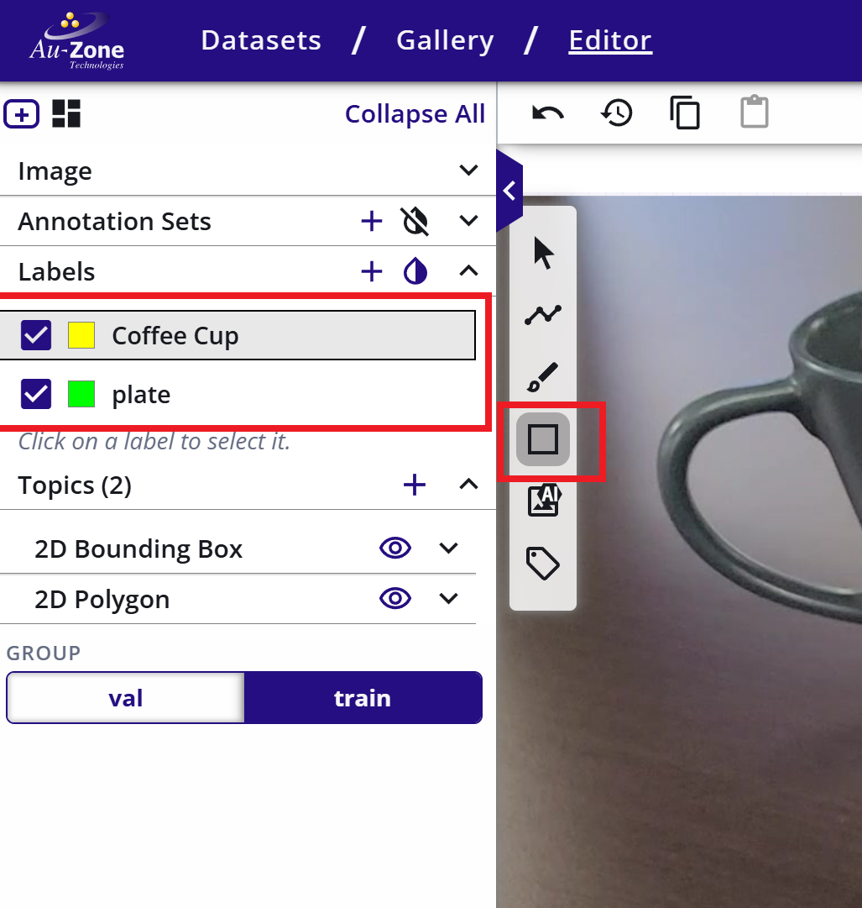
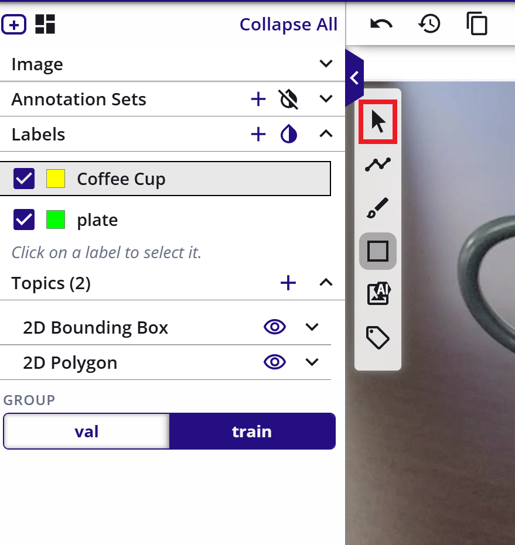
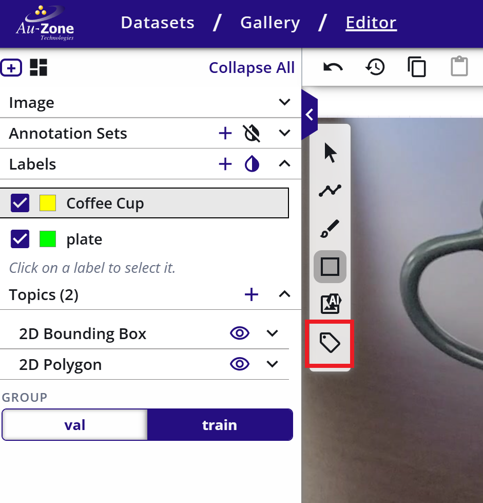
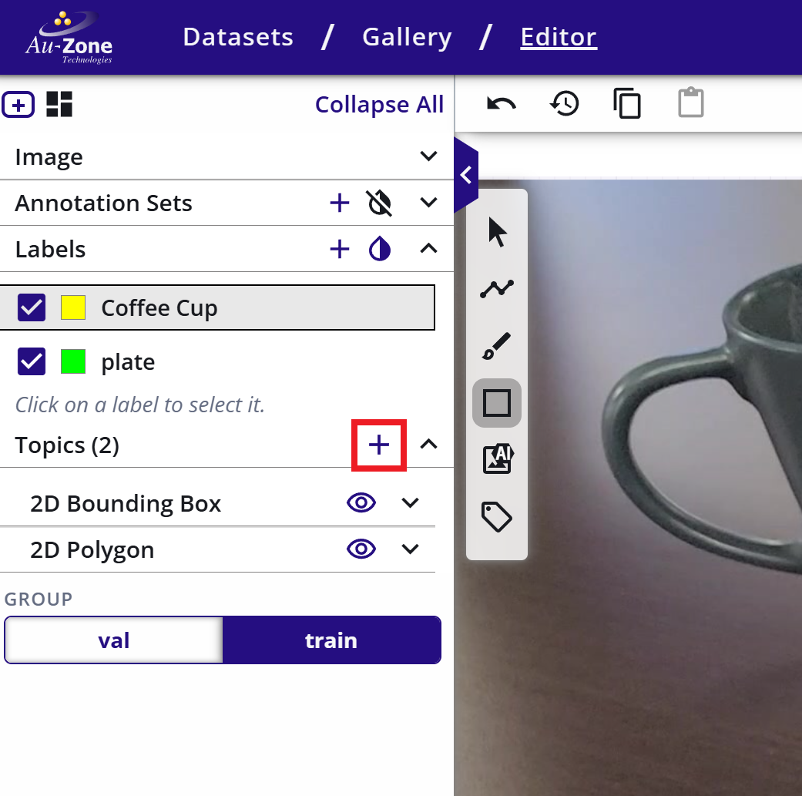
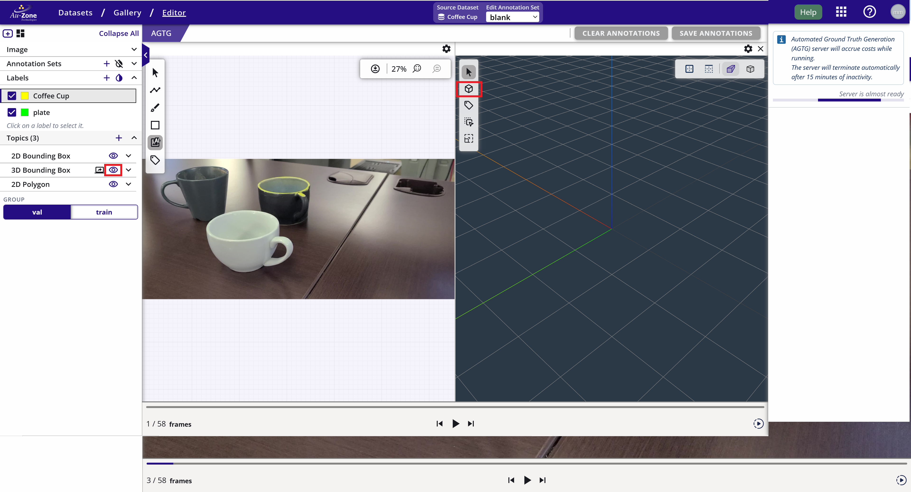
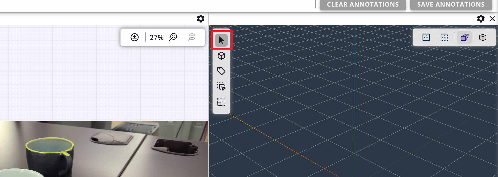
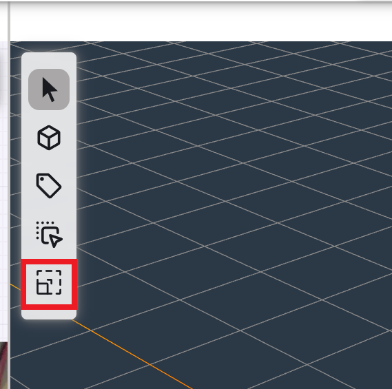
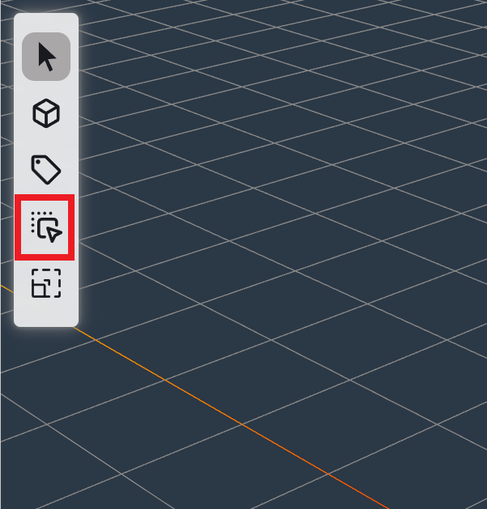
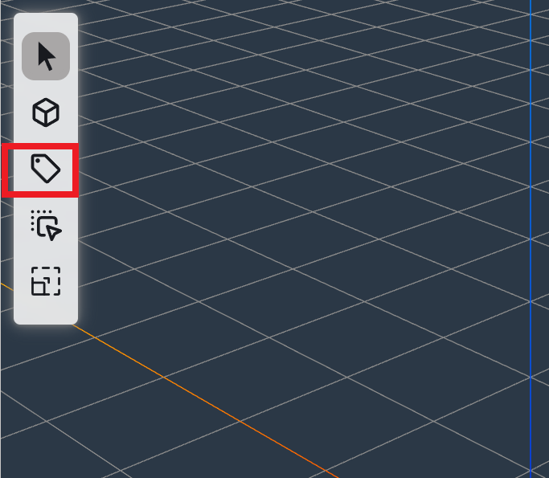

# Dataset Annotations

This page will provide tutorials for annotating EdgeFirst Datasets in EdgeFirst Studio.  As described in the [EdgeFirst Dataset Format](../format.md), a dataset can have 2D and 3D annotations.  Shown below is an example of 2D annotations (left) and 3D annotations (right).  A 2D annotation is a combination of 2D bounding boxes and segmentation masks for any given object that are pixel-based image coordinates.  A 3D annotation is a 3D bounding box surrounding the object in real world coordinates.

<figure markdown="span">
{ align=center }
<figcaption>Sample Annotations</figcaption>
</figure>

To reduce the effort required during the annotation process, EdgeFirst Studio provides tools to auto annotate either a single image or a series of frames in a sequence in a dataset.  The next sections that describes the auto-annotations will showcase this feature. Please note that it is not always a guarantee that the auto-annotations will yield correct results, so EdgeFirst Studio provides the tools to audit the existing annotations that will be described in the audit sections below.

## Auto Annotations via Gallery

This is a combination of manual and AI assisted workflows.

### AI Assisted Annotation

This feature allows users to annotate 2D,3D or 2D segments with just a 2D box prompt. For details of this workflow please refer to [AI Assisted Annotation](../../studio/agtg.md).

### Manual Annotation

THis feature allows user to annotate 2D,3D boxes and 2D annotations manually. It also allows user to edit the annotations create by AI assisted annotation workflow.

Go the the Dataset Gallery page and click on the image to edit. This will open the image in view / edit made.
Select the annotation ste to edit from the left panel (shown in red box). 

#### ADD 2D Box

1. Click on the box annotation in 2D editing panel (shown in red box)
2. Using mouse, drag on image to create box annotation.
3. Make multiple boxes - one for each annotation.
4. Make sure to change the label type on the left panel if the next label belongs to a different class. 

{: style="height:300px;align=center; "}

#### Deleting 2D Box

1. Click on the Pointer in 2D editing panel (shown in red box)
2. Using mouse, click inside the annotation box to delete. This will highlight the box (as shown in image).
3. Press delete button on the keyboard to delete the box.

{: style="height:300px;align=center; "}

#### Editing 2D Box

1. Click on the Pointer in 2D editing panel (shown in red box).
2. Using mouse, click inside the annotation box to edit. This will highlight the box (as shown in image).
3. Drag the anchor points on the box to resize it.
4. Click and drag the box to move the box

{: style="height:300px;align=center; "}

#### Changing Object label of a 2D Box

1. Click on the label mode in 2D editing panel(shown in red box).
2. Select the label in the left panel (shown in red box).
3. Click on any annotation box to change its label.

{: style="height:300px;align=center; "}

#### ADD 3D Box

1. If there are no 3D annotation in the annotation set, then first add 3D 3D Bounding Box topic. Click on '+' icon (shown in red box) and select 3D Bounding Box.

{: style="height:200px;align=center; "}

2. Open the 3D View Panel by clicking on the "eye" icon for the 3D Bounding box.
3. Click on the box annotation in 3D editing panel (shown in red box).
4. Using mouse, Click on the 3D viewing panel. This will make a 3D bounding box.
5. Make multiple boxes - one for each annotation.
6. Make sure to change the label type on the left panel if the next label belongs to a different class. 

#### Deleting 3D Box

1. Click on the Pointer in 3D editing panel(shown in red box).
2. Using mouse, click inside the annotation box to delete. This will highlight the box (as shown in image).
3. Press delete button on the keyboard to delete the box.

#### Editing 3D Box

*Resizing a 3D box*

1. Click on the Scaling in 3D editing panel (shown in red box)
2. Using mouse, click inside the annotation box to edit. This will highlight the box (as shown in image).
3. Drag the anchor points on the box to resize it in x,y,z direct or in xy,yx,zx planes.

{: style="height:200px;align=center; "}

*Moving a 3D box*

1. Click on the Scaling in 3D editing panel (shown in red box)
2. Using mouse, click inside the annotation box to edit. This will highlight the box (as shown in image).
3. Drag the anchor points on the box to move it in z,y, or z direction.

{: style="height:200px;align=center; "}

#### Changing Object label of a 3D Box

1. Click on the label mode in 3D editing panel(shown in red box)
2. Select the label in the left panel (shown in red box)
3. Click on any annotation box to change its label.

{: style="height:200px;align=center; "}

#### Saving Edited annotations

Click on the SAVE ANNOTATIONS button to save the edit, delete or create annotations for this image. Moving to any other image or going to another page will discard the changes.  
