# Dataset Annotations

This page will provide tutorials for annotating EdgeFirst Datasets in EdgeFirst Studio.  As described in the [EdgeFirst Dataset Format](../format.md), a dataset can have 2D and 3D annotations.  Shown below is an example of 2D annotations (left) and 3D annotations (right).  A 2D annotation is a combination of 2D bounding boxes and segmentation masks for any given object that are pixel-based image coordinates.  A 3D annotation is a 3D bounding box surrounding the object in real world coordinates.

<figure markdown="span">
{ align=center }
<figcaption>Sample Annotations</figcaption>
</figure>

To reduce the effort required during the annotation process, EdgeFirst Studio provides tools to leverage SAM-2 tracking and masking that propagates throughout the dataset to run auto annotations on every frame.  The next sections that describes the auto-annotations will showcase this feature.  However, SAM-2 is only suited for video frames that show sequential movements of the targets.  To support individual images, EdgeFirst Studio also provides the tools to utilize SAM-1 to auto annotate each target in the image.  This method will require the annotations of each image.  Furthermore, it is not always a guarantee that the auto-annotations will yield correct results, so EdgeFirst Studio provides the tools to audit the existing annotations that will be described in the audit sections below.

## Auto Annotations via Gallery

The auto-annotation feature is found in the dataset gallery in EdgeFirst Studio.  This feature will preload all frames of a *video* sequence in the dataset into SAM-2 to generate segmentation masks, 2D bounding boxes, 3D bounding boxes (For Raivin/LiDAR Only) by tracking the object across the frames. 

First [navigate to the dataset gallery](management.md#viewing-datasets) and click on the "Video Segment Tool" as indicated in red below to open the Automatic Ground Truth Generation (AGTG) Manager View.

<figure markdown="span">
{ align=center }
<figcaption>Select the Video Segment Tool</figcaption>
</figure>

On first use, you'll find that there are no AGTG servers currently launched.  Click on "Launch AGTG Server" on the right.  This will take some time to initialize the server.  A progress will appear with an indication of the length of time to launch the server.  

<figure markdown="span">
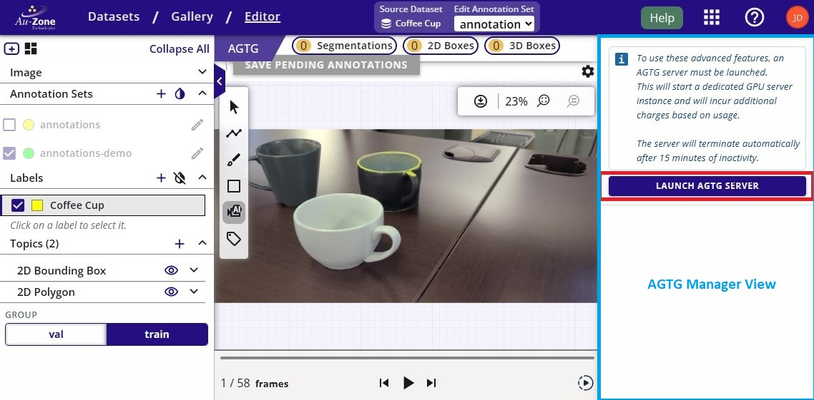{ align=center }
<figcaption>Launch AGTG Server</figcaption>
</figure>

<figure markdown="span">
{ align=center }
<figcaption>Launching Progress</figcaption>
</figure>

!!! warning

    This server is costing credits to run.  An inactivity of 15 minutes will auto-terminate this server.  Otherwise, once you have completed the annotations, please ensure to [terminate the AGTG server](#terminate-agtg-server) to avoid spending more of your credits. 

Once the server has been initialized, you can now specify the starting frame (default to the current frame) and the stop frame (default to the end frame) of the annotation propagation.  This setting specifies the window of propagation where SAM-2 will only propagate across these video frames specified.  Once this setting has been specified, click on "Initialize State" to load the specified video frames into SAM-2.  This step may take some time to initialize.  

<figure markdown="span">
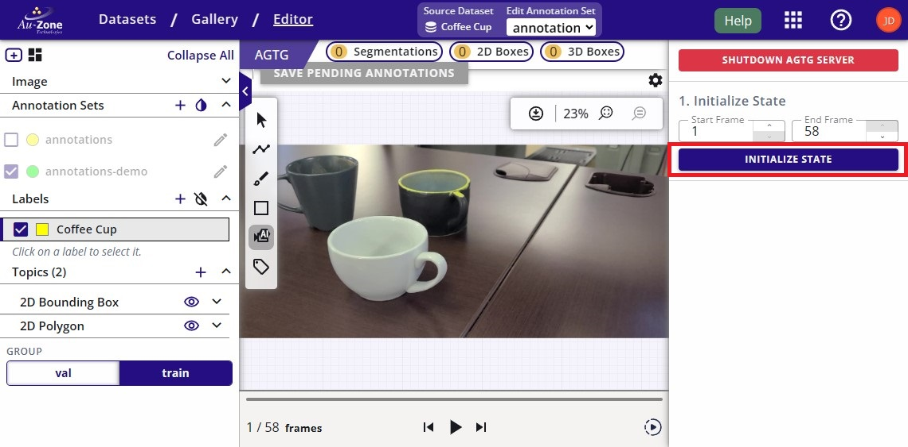{ align=center }
<figcaption>Initialize the Video State</figcaption>
</figure>

Once the state has been initialized, let's first add a new object to annotate by clicking on the "+" next to "Select Objects".

<figure markdown="span">
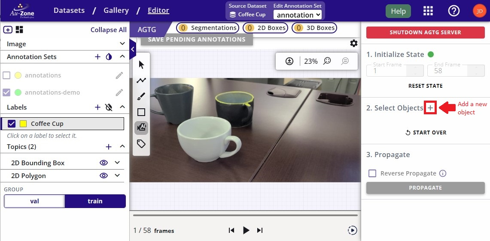{ align=center }
<figcaption>Add New Object</figcaption>
</figure>

You can now provide prompts to SAM-2 to specify the object to segment.  You can either provide bounding boxes (mouse click and drag) or points (mouse clicks) to highlight the object.  By default prompts via bounding box is selected.  To draw a bounding box, click anywhere on the frame and then drag the mouse to expand the bounding box.  The bounding box should cover the object to annotate in the frame.  The figure below shows the resulting SAM-2 mask and bounding box annotations (green) for the first object after providing a bounding box prompt (white).

<figure markdown="span">
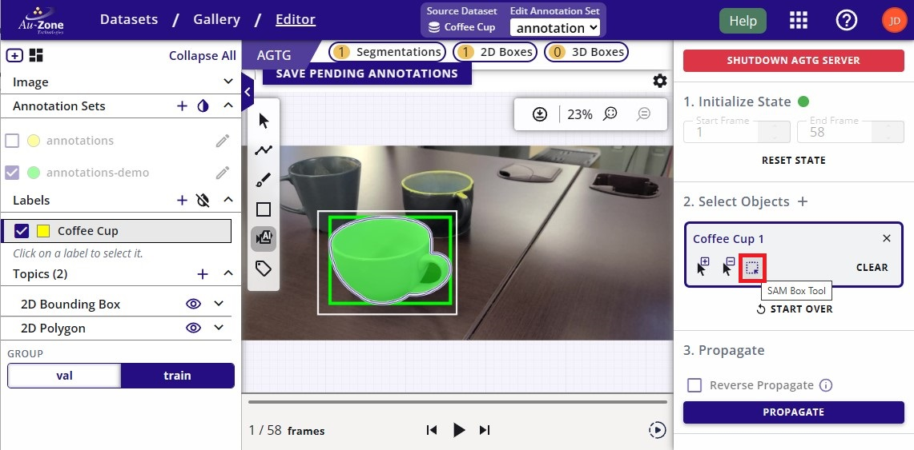{ align=center }
<figcaption>Resulting Annotation using SAM Box Tool</figcaption>
</figure>

!!! warning
    
    The initial annotation may take some time to generate.

For multiple objects in the frame, click on the "+" again.  For every object in the frame, a new object must be added to SAM-2 so the tracker can assign a unique ID.  The figure below shows new objects "Coffee Cup 2" and "Coffee Cup 3" annotated using points as prompts by clicking anywhere on the frame to specify the object.

<figure markdown="span">
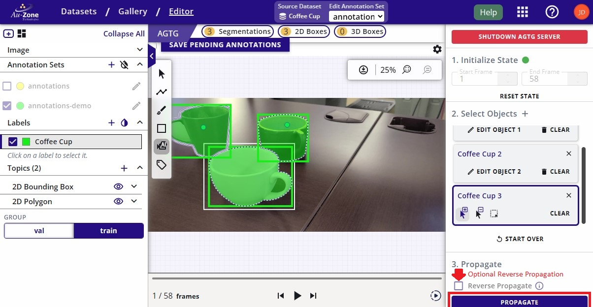{ align=center }
<figcaption>Distinct Frame Annotations</figcaption>
</figure>

Once you have all the annotations completed in the current frame, click on "Propagate" as indicated in red above.  This will utilize SAM-2 video tracking to run forward auto annotations of the prompted objects across the frame window specified above.  Optionally, "Reverse Propagation" can be specified by toggling the checkbox as indicated to run reverse auto annotations of the prompted objects. 

During propagation, the progress and the frame counter will update as shown on the bottom right.  Optionally, you can stop the propagation by clicking on "Stop Propagation". 

<figure markdown="span">
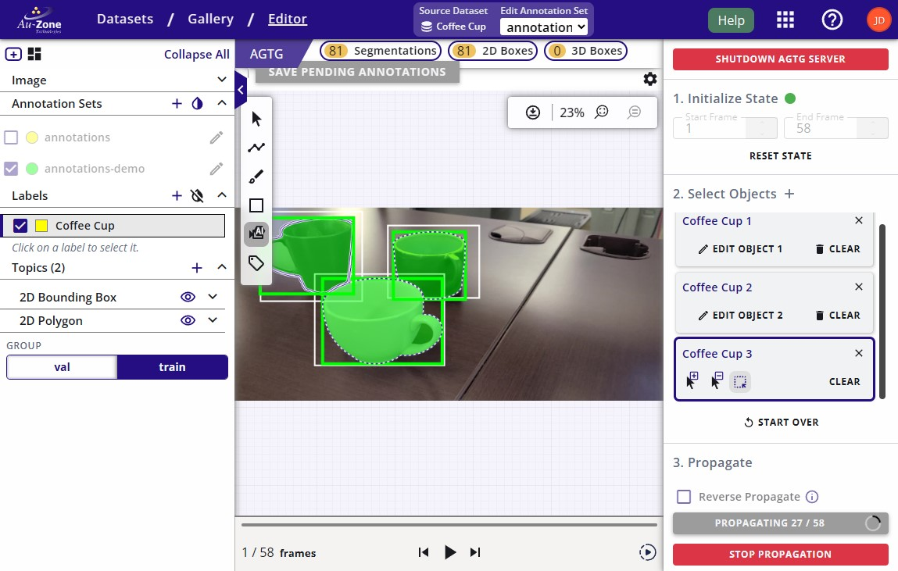{ align=center }
<figcaption>Propagation Progress</figcaption>
</figure>

Once the propagation completes, click on "Save Pending Annotations" to save the annotations.  A completed propagation will show the 2D annotations with masks and 2D bounding boxes for each object across the video frames.

<figure markdown="span">
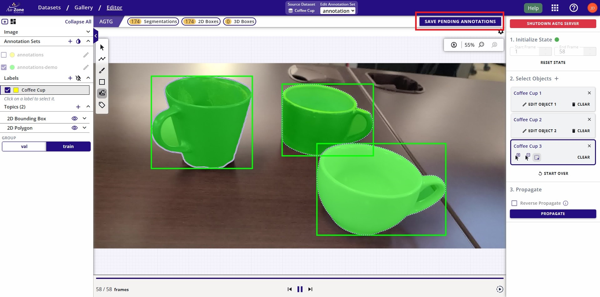{ align=center }
<figcaption>Save Pending Annotations</figcaption>
</figure>

!!! warning

    For cases where the object exits and then re-enters the frame, the object might not be tracked properly.  Repeat the steps as necessary to annotate the objects that were missed.

If you notice any errors on the annotations or missing annotations, follow the tutorial for [auditing 2D annotations](#audit-2d-annotations).  Furthermore, there is also a tutorial for [auditing 3D annotations](#audit-3d-annotations). 

## Auto Annotations via Snapshot

This tutorial describes the steps for auto-annotating an [uploaded MCAP recording](management.md#upload-mcaps) by restoring a dataset snapshot.  This feature can be deployed using [EdgeFirst-Client](../../perception/studio.md#restore-snapshots) via the command line.  However, this tutorial will show the steps in EdgeFirst Studio. 

    <iframe width="560" height="315" src="https://www.youtube.com/embed/j-75Q5-_dC0?start=720&end=1163" title="Auto Annotate Dataset" frameborder="0" allow="accelerometer; autoplay; clipboard-write; encrypted-media; gyroscope; picture-in-picture; web-share" referrerpolicy="strict-origin-when-cross-origin" allowfullscreen></iframe>

To run auto-annotations on the recorded data, click *Restore* on the uploaded snapshot.

<figure markdown="span">
{ align=center }
<figcaption>Restore Snapshot</figcaption>
</figure>

The following fields are for you to specify.  Adjust the following fields for your own use case.

<figure markdown="span">
{ align=center }
<figcaption>Restore Snapshot Fields</figcaption>
</figure>

Once specifed, click *RESTORE SNAPSHOT* to start the auto-annotation process.  This
will start the auto-annotation process.

<figure markdown="span">
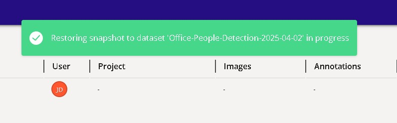{ align=center }
<figcaption>Restore Process</figcaption>
</figure>

The progress will be shown on the dataset specified in the project.

<figure markdown="span">
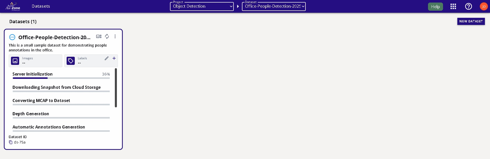{ align=center }
<figcaption>Restore Progress</figcaption>
</figure>

Once completed, the dataset will now contain annotations that resulted from the auto-annotation process.

<figure markdown="span">
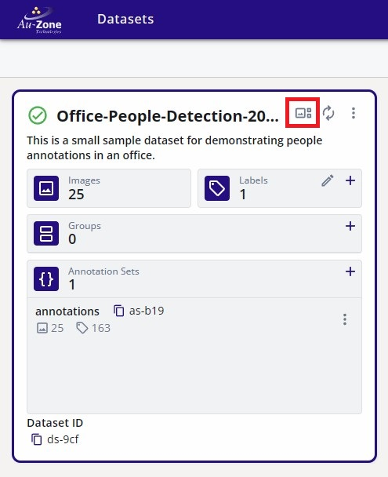{ align=center }
<figcaption>Restored Dataset</figcaption>
</figure>

Next [navigate to the gallery](management.md#viewing-datasets) of the dataset by clicking on the gallery button as indicated in red to visualize the annotations.  The figure below shows a side-by-side display of the annotations from frames 1-3.  The annotations for "people" are shown as both segmentation masks and bounding boxes. 

**Frame 1** | **Frame 2** | **Frame 3** 
:------------------:|:------------------:|:------------------:
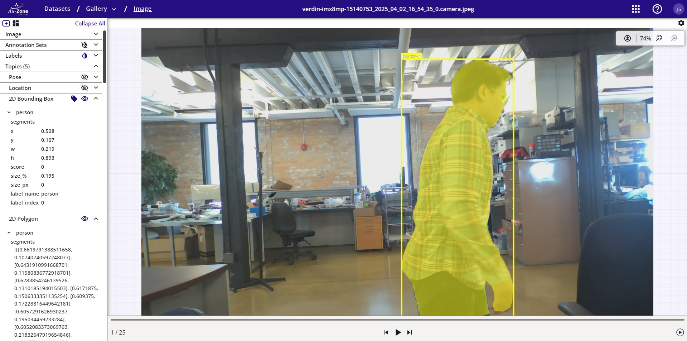 | 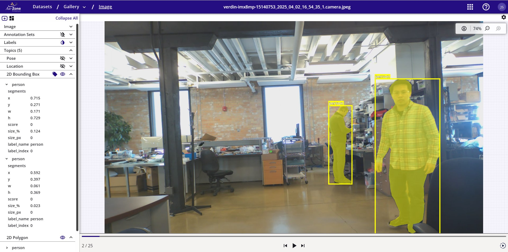 | 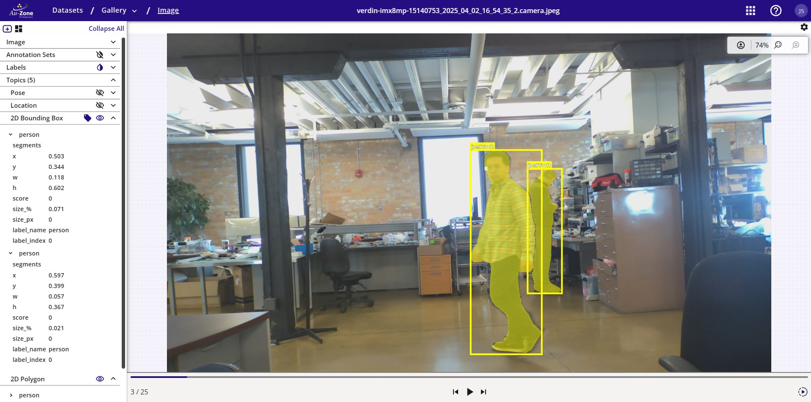

If you notice any errors on the annotations or missing annotations, follow the tutorial for [auditing 2D annotations](#audit-2d-annotations).  Furthermore, there is also a tutorial for [auditing 3D annotations](#audit-3d-annotations). 

## Audit 2D Annotations

This tutorial is based on reviewing the 2D annotations which may require manual annotations on the frame to make corrections to the results from the auto annotations described above.  This step is necessary in order to have a proper fully annotated dataset. 

### Add 2D Annotations

First [navigate to the dataset gallery](management.md#viewing-datasets) and let's start by adding a single 2D annotation on a frame.  Select the "AI Image Segment Tool".  This tool will use SAM-1 to auto-segment an object in the frame. 

<figure markdown="span">
{ align=center }
<figcaption>Auto Segment Mode</figcaption>
</figure>

If there is currently no AGTG server available, go ahead and click on "Launch AGTG Server" indicated in red below.

<figure markdown="span">
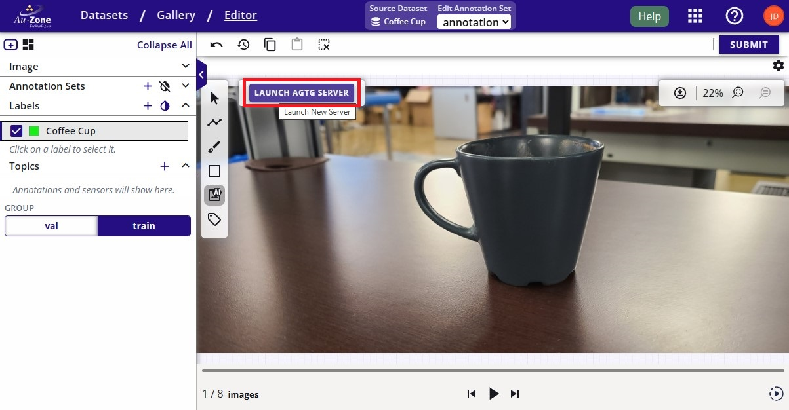{ align=center }
<figcaption>Launch AGTG Server</figcaption>
</figure>

This will open a dialog to confirm to launch an AGTG server.  Go ahead and click "Launch AGTG Server" on the bottom right.

<figure markdown="span">
{ align=center }
<figcaption>Launch AGTG Server</figcaption>
</figure>

!!! warning

    This server is costing credits to run.  An inactivity of 15 minutes will auto-terminate this server.  Otherwise, once you have completed the annotations, please ensure to [terminate the AGTG server](#terminate-agtg-server) to avoid spending more of your credits. 

Once there is a dedicated AGTG server to host SAM-1, enable the "SAM Box Tool".

<figure markdown="span">
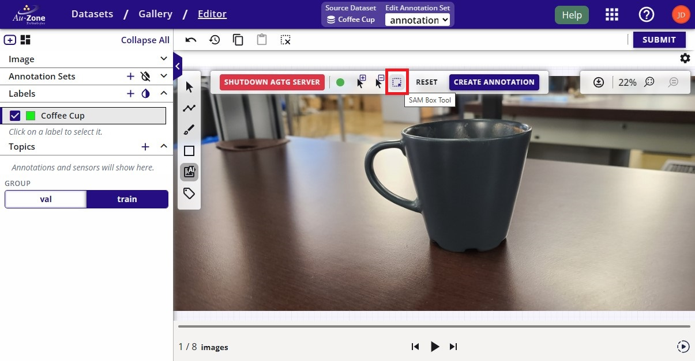{ align=center }
<figcaption>SAM Box Tool</figcaption>
</figure>

Draw the bounding box around the object by clicking on the frame and then dragging the mouse to expand the bounding box.  This will start segmenting the object.  Once the object is properly segmented, go ahead and click "Create Annotation" as indicated in red to accept the annotation.

<figure markdown="span">
{ align=center }
<figcaption>Draw Bounding Box Prompt</figcaption>
</figure>

This will preview the newly created 2D annotation with the segmentation mask and the bounding box.  Once the annotation is properly drawn, go ahead and click "Submit" as indicated in red to save the annotation and to move forward with the next image.

<figure markdown="span">
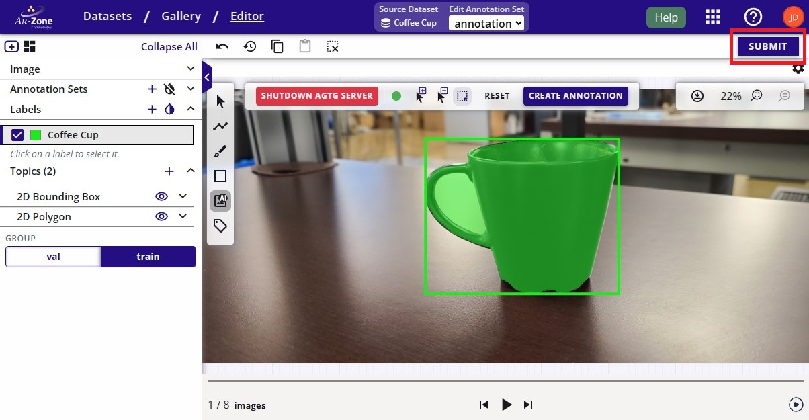{ align=center }
<figcaption>Submit Annotations</figcaption>
</figure>

### Adjust 2D Annotations

To resize a 2D bounding box annotation, select the bounding box from the dropdown on the left under "2D Bounding Box". 

<figure markdown="span">
{ align=center }
<figcaption>Resize Bounding Box</figcaption>
</figure>

This will show the target points around the bounding box allowing you to click on these points and drag the mouse to resize the bounding box. 

Similarly, to adjust the 2D segmentation mask annotation, select the segmentation mask from the dropdown on the left under "2D Polygon". This will also show the target points around the mask polygon allowing you to adjust the mask.

<figure markdown="span">
{ align=center }
<figcaption>Adjust Segmentation Mask</figcaption>
</figure>

### Delete 2D Annotations

To delete an annotation, click on the annotation.  This will first highlight the bounding box annotation.  To delete the annotation, press the "Delete" key on your keyboard.

<figure markdown="span">
{ align=center }
<figcaption>Delete Bounding Box</figcaption>
</figure>

Next repeat the same process for the segmentation mask.  Click on the mask annotation to highlight the mask.  To delete the annotation, press the "Delete" key on your keyboard.

<figure markdown="span">
{ align=center }
<figcaption>Delete Segmentation Mask</figcaption>
</figure>

The annotations will be deleted after following the steps above.

<figure markdown="span">
{ align=center }
<figcaption>Deleted Annotations</figcaption>
</figure>

## Audit 3D annotations

This step requires verifying the outputs of the auto-annotations and to make corrections to the 3D bounding box annotations if necessary in order to have a proper fully annotated dataset.

    <iframe width="560" height="315" src="https://www.youtube.com/embed/j-75Q5-_dC0?start=1536&end=2144" title="Visualize Annotations" frameborder="0" allow="accelerometer; autoplay; clipboard-write; encrypted-media; gyroscope; picture-in-picture; web-share" referrerpolicy="strict-origin-when-cross-origin" allowfullscreen></iframe>

First [navigate to the dataset gallery](management.md#viewing-datasets).

<figure markdown="span">
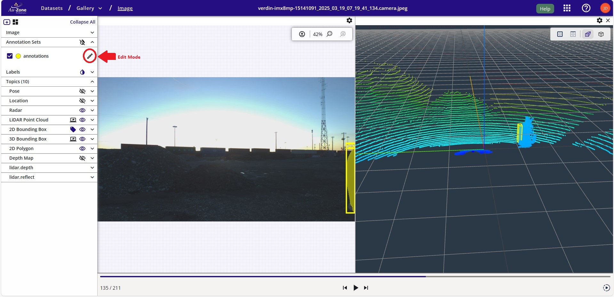{ align=center }
<figcaption>Edit Mode</figcaption>
</figure>

Ensure the point clouds and the 3D bounding box annotations are toggled visible.

<figure markdown="span">
{ align=center }
<figcaption>Visible 3D Annotations</figcaption>
</figure>

### Scale 3D Annotation

The error in the current annotation is that the bounding box is not scaled properly.  Click on the option on the left sidebar to enable 3D bounding box scaling as indicated in red.

<figure markdown="span">
{ align=center }
<figcaption>Scale 3D Annotations</figcaption>
</figure>

Click on the current 3D bounding box to scale and this will provide cursors to scale the 3D bounding box in the 3-axis.

<figure markdown="span">
{ align=center }
<figcaption>Scaling 3D Annotations</figcaption>
</figure>

The 3D bounding box was adjusted with proper scaling to the LiDAR point clouds of the object.

| Scaled YZ Plane             | Scaled XY Plane           | Scaled XZ             |
|-----------------------------|---------------------------|-----------------------|
|  |  |  |

### Translate 3D Annotation

Next the adjusted 3D bounding box needs to be properly translated.  Click on the option on the left sidebar to enable 3D bounding box translation as indicated in red.

<figure markdown="span">
{ align=center }
<figcaption>Translate 3D Annotations</figcaption>
</figure>

Similar to the workflow as scaling the 3D bounding boxes, move the three cursors for each axis to translate the bounding box for each axis.

| Translate YZ Plane          | Translate XY Plane        | Translate XZ          |
|-----------------------------|---------------------------|-----------------------|
|  |  |  |

Once the 3D bounding box annotation is properly oriented, click "SUBMIT" to save the changes.

<figure markdown="span">
{ align=center }
<figcaption>Submit 3D Annotations</figcaption>
</figure>

### Add 3D Annotation

To add a missing 3D bounding box, click on the option on the left sidebar to add a new 3D bounding box annotation as indicated in red.

<figure markdown="span">
{ align=center }
<figcaption>Add 3D Annotations</figcaption>
</figure>

Now click on the grid to add a new 3D bounding box on the position of the click.

<figure markdown="span">
{ align=center }
<figcaption>Added 3D Annotations</figcaption>
</figure>

This newly added 3D bounding box may not be scaled or translated properly.  Follow instructions for [scaling](#scale-3d-annotation) and [translating](#translate-3d-annotation) a 3D bounding box to properly center the bounding box around the LiDAR point cloud as shown below.  Once the annotation is properly scaled and translated, click "SUBMIT" to save the annotation.

<figure markdown="span">
{ align=center }
<figcaption>Submit 3D Annotations</figcaption>
</figure>

## Terminate AGTG Server

In order to avoid running out of credits, terminate an idle AGTG server.  As mentioned, 15 minutes of inactivity will auto-terminate this server.  However, you can terminate the server as shown below.  Navigate to the *Cloud Instances* under the tool options.

<figure markdown="span">
{ align=center }
<figcaption>Cloud Instances</figcaption>
</figure>

Select the AGTG server.

<figure markdown="span">
{ align=center }
<figcaption>Select AGTG Server</figcaption>
</figure>

Click "Stop" to stop the AGTG server.

<figure markdown="span">
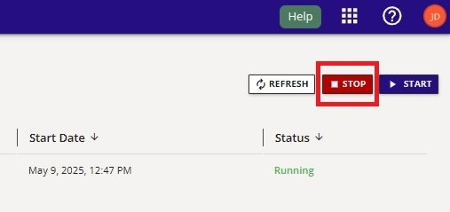{ align=center }
<figcaption>Terminate AGTG Server</figcaption>
</figure>