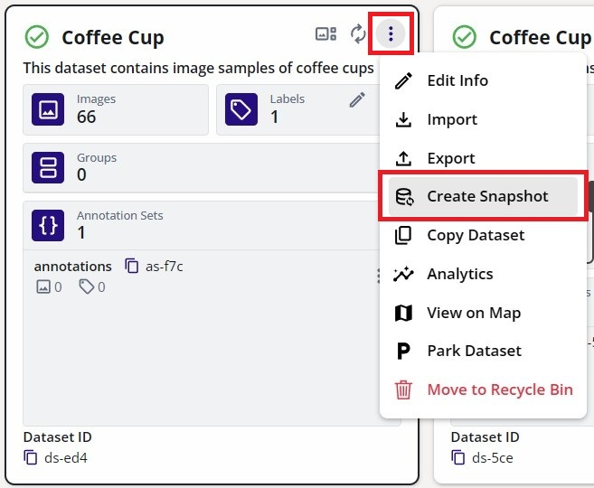
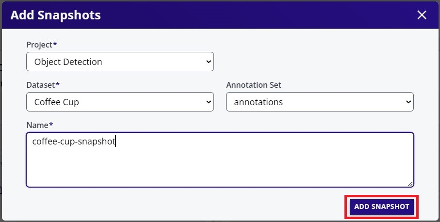
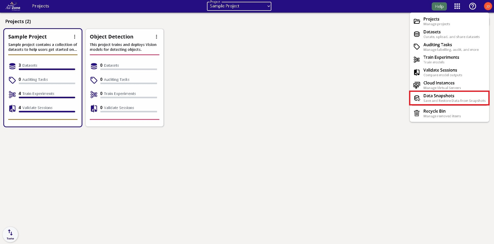
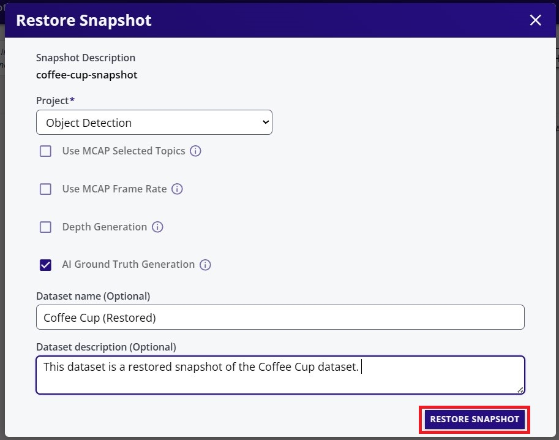
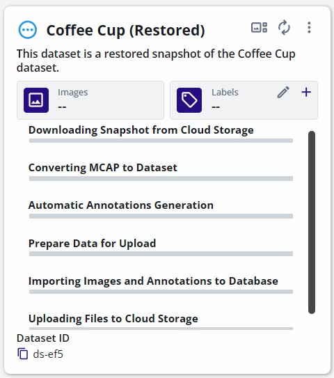

# Automatic Ground Truth Generation (AGTG)

The [AGTG pipeline](../../../studio/agtg.md) describes the stages for automating the annotation process of a dataset. There are two modes of operation.

1. Fully Automatic Ground Truth Generation: A background operation invoked at the time of dataset import as a [snapshot](../../../studio/snapshots.md).
2. Semi-Automatic Ground Truth Generation: User controlled dataset annotation process.

## Fully Automatic Ground Truth Generation

This annotation feature is available at the time of importing the dataset via [snapshot restoration](../../../studio/snapshots.md#restore-snapshot).  The auto-annotation process is done in the background allowing the user to focus on separate tasks.  This section will show the steps for performing this type of auto-annotation in EdgeFirst Studio.  However, this feature can also be deployed using the [EdgeFirst Client](../../perception/studio.md#restore-snapshots) in the command line.

A complete description of this feature along with the buttons associated in this tutorial can be found under [Studio](../../../studio/snapshots.md)

This feature is a two-step process: *Create Snapshot* and *Restore Snapshot*.

### Create Snapshot

Recall that [snapshots](../../../studio/snapshots.md) are frozen and compact form of datasets.  There are three ways of creating snapshots. 

1. Create from Existing Dataset

    On the dataset card, open the dataset context menu and select "Create Snapshot".

    <figure markdown="span">
    { align=center }
    <figcaption>Create Snapshot From Dataset</figcaption>
    </figure>

    Next enter the name for the dataset snapshot.  Click on "Add Snapshot" to begin the snapshot creation. 

    <figure markdown="span">
    { align=center }
    <figcaption>Name the Snapshot</figcaption>
    </figure>

    The snapshot creation process will be shown like the following.

    <figure markdown="span">
    { align=center }
    <figcaption>Snapshot Process</figcaption>
    </figure>

2. Upload from MCAP File

An MCAP file is a [recording captured](../capture.md#capture-with-an-edgefirst-platform) by an [EdgeFirst Platform (Maivin or Raivin)](../../../platforms/quickstart.md). 

To create a snapshot from an MCAP file, visit the "Data Snapshots" page.

<figure markdown="span">
{ align=center }
<figcaption>Data Snapshots</figcaption>
</figure>

3. Upload from Zip/Arrow (EdgeFirst Dataset) Files

### Restore Snapshot

The snapshot restoration process involves several dataset transformations such as the frame rate specification, depth map generation, and auto-annotations. More information can be found in [Studio](../../../studio/snapshots.md).

!!! info "COCO Annotations"
    The labels supported during the auto-annotation process for the *Fully Automatic Ground Truth Generation* are the [COCO labels](../../coco/index.md#coco-labels) listed.

The created snapshots can be found under "Data Snapshots".

<figure markdown="span">
{ align=center }
<figcaption>Data Snapshots</figcaption>
</figure>

To restore the snapshot, click on the snapshot context menu and select "Restore".

<figure markdown="span">
{ align=center }
<figcaption>Restore Snapshots</figcaption>
</figure>

Restoring a snapshot will create a new dataset entirely with annotations.  Specify the project to contain this new dataset and specify the name and the description of the dataset.  Furthermore, toggle the "AI Ground Truth Generation" to auto annotate the dataset samples.  The rest of the settings can be kept in their defaults for this tutorial.  Click "Restore" to start the restoration process. 

<figure markdown="span">
{ align=center }
<figcaption>Restore Snapshots Fields</figcaption>
</figure>

The snapshot restore process can be found under the project datasets.

<figure markdown="span">
{ align=center }
<figcaption>Restore Snapshots Progress</figcaption>
</figure>

Once completed, the dataset will now contain annotations that resulted from the auto-annotation process.

[Insert Image]

Next [navigate to the gallery](../management.md#viewing-datasets) of the dataset by clicking on the gallery button.  The figure below shows a side-by-side display of the annotations from frames 1-3.  The 2D annotations for both segmentation masks and bounding boxes were auto-generated in the background.

**Frame 1** | **Frame 2** | **Frame 3** 
:------------------:|:------------------:|:------------------:
 |  | 

The next section will describe the Semi-Automatic Ground Truth Generation for increased user control during the auto-annotation process.

## Semi-Automatic Ground Truth Generation

This annotation feature is available after [capturing the dataset](../capture.md) into EdgeFirst Studio.  This process occurs in the [dataset gallery](../management.md#viewing-datasets) where the user has more
control over the annotation process.  This feature will preload all frames of a *video* sequence in the dataset into SAM-2 to generate segmentation masks, 2D bounding boxes, 3D bounding boxes (For Raivin/LiDAR Only) by tracking the object across the frames. 

A complete description of this feature along with the functionalities of each buttons shown in this tutorial can be found under [Studio](../../../studio/agtg.md#semi-automatic-ground-truth-generation).

This feature is a three-step process: *Initialize AGTG Server*, *Annotate Starting Frame*, *Propagate*. 

### Initialize AGTG Server

Inside the dataset gallery, click on the "AI Segment Tool" to start the AGTG server.

<figure markdown="span">
{ align=center }
<figcaption>Auto Segment Mode</figcaption>
</figure>

If there is currently no AGTG server available, go ahead and click on "Launch AGTG Server".

<figure markdown="span">
{ align=center }
<figcaption>Launch AGTG Server</figcaption>
</figure>

Please wait while the server is being initialized.

<figure markdown="span">
{ align=center }
<figcaption>Launch AGTG Server</figcaption>
</figure>

!!! warning "Active AGTG Server"
    This server is costing credits to run.  An inactivity of 15 minutes will auto-terminate this server.  Otherwise, once you have completed the annotations, please ensure to [terminate the AGTG server](index.md#terminate-agtg-server) to avoid spending more of your credits.

### Annotate Starting Frame

Once the server has been initialized, annotate the starting frame.  This is the only annotation required by the user. The rest of the frames will be annotated by SAM-2 and the AGTG process.

Start by drawing a bounding box for the first object by clicking and dragging.  For multiple objects in the frame, click "+" to add a new object as shown in red below.  The process for each object should be: *Add a new object* -> *Draw object prompt*. 

By default, the prompts provided to SAM-2 are bounding boxes (mouse click and drag) which should cover the object to be annotated in the frame.  However, points can also be provided (mouse clicks) by clicking areas that are part of the object. 

<figure markdown="span">
{ align=center }
<figcaption>AGTG Initial Prompts</figcaption>
</figure>

### Propagate

Once the first frame has been annotated (*prompts for SAM-2*), specify the "End Frame" which marks the point where SAM-2 stops propagating.  By default this is the end of the sequence (last frame).  Once this has been specified, click on "Propagate" to start the propagation process. 

As the frames propagate, you should see the frames being auto-annotated.  To stop the propagation process click on "Stop Propagation".

## Video Tutorials

This is a high level video tutorial shown an MCAP recording restored as a snapshot.

    <iframe width="560" height="315" src="https://www.youtube.com/embed/j-75Q5-_dC0?start=720&end=1163" title="Auto Annotate Dataset" frameborder="0" allow="accelerometer; autoplay; clipboard-write; encrypted-media; gyroscope; picture-in-picture; web-share" referrerpolicy="strict-origin-when-cross-origin" allowfullscreen></iframe>

## Next Steps

If you notice any errors on the annotations that require adjustments or any missing annotations that needs to be added, follow these tutorials that describe the [manual annotation](manual.md) features.
