# Dataset Annotations

This page will provide tutorials for annotating datasets in EdgeFirst Studio.  As described in the [EdgeFirst Dataset Format](../format.md), a dataset can have 2D and 3D annotations.  Shown below is an example of 2D annotations (left) and 3D annotations (right).  A 2D annotation is a combination of 2D bounding boxes and segmentation masks for any given object that are semantic pixel-based image coordinates.  A 3D annotation is a 3D bounding box surrounding the object in real world coordinates (meters).

<figure markdown="span">
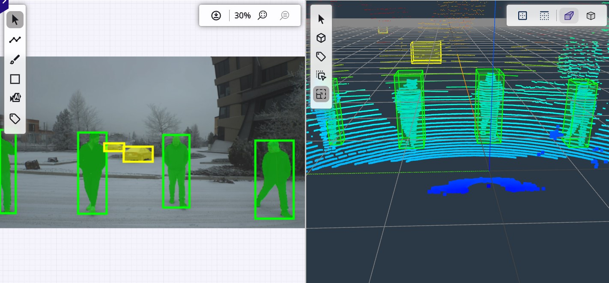{ align=center }
<figcaption>Sample Annotations</figcaption>
</figure>

To reduce the effort required during the annotation process, EdgeFirst Studio provides the tools to auto annotate either a single image or a sequential set of frames in a dataset by leveraging SAM-2 auto-segment and tracking capabilities.  Please note that it is not always guaranteed that the auto-annotations will yield 100% accuracy, so EdgeFirst Studio provides the tools for manual annotations to correct any errors or make adjustments to the existing annotations.

1. Follow these [steps to auto-annotate](automatic.md) your dataset using the Automatic Ground Truth Generation (AGTG) pipeline.
2. Follow these steps for [manual annotations](manual.md).

## Dataset Labels

Each annotation has a label associated to it.  The label identifies the object that is being annotated.  For example, a dataset containing coffee cups contains multiple, but varying objects of coffee cups are tagged with a single label given as "Coffee Cup".

<figure markdown="span">
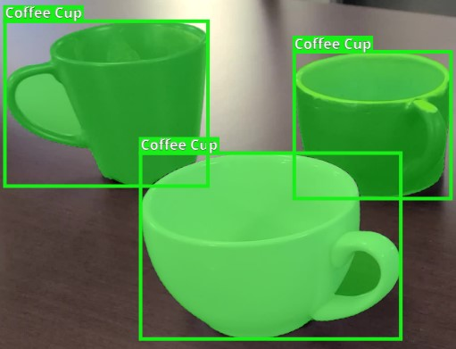{ align=center }
<figcaption>Sample Coffee Cups</figcaption>
</figure>

### Edit Label

EdgeFirst Studio provides features for updating the labels in the dataset.  To update the label "Coffee Cup" to "coffeecup", click on the button with a pencil icon under "Labels" on the dataset card.

<figure markdown="span">
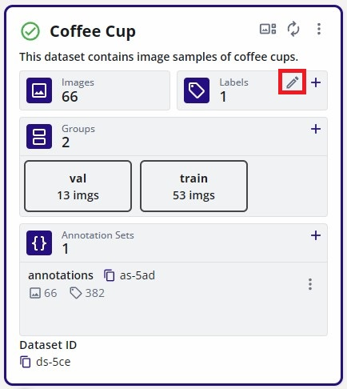{ align=center }
<figcaption>Edit Labels</figcaption>
</figure>

This will bring the option to edit the label, the color associated to the label, and the index.  The index controls the label order which is relevant in multi-class datasets (more than one label).  The first label is given the index 0.  Since this dataset only has one label, its index is 0.  Here the label color was modified to blue and the label was modified to "coffeecup".

<figure markdown="span">
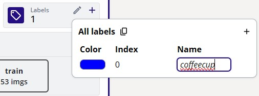{ align=center }
<figcaption>Edited Label</figcaption>
</figure>

The changes should now be reflected in the [gallery](../management.md#viewing-datasets) as shown below.

<figure markdown="span">
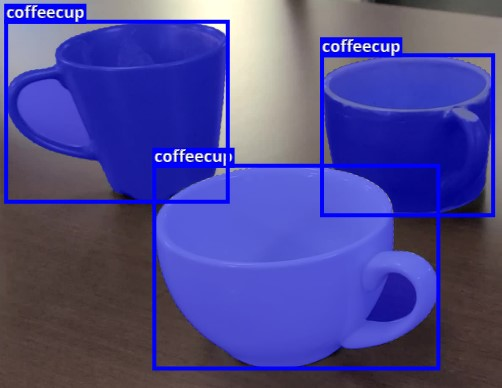{ align=center }
<figcaption>Edited Sample Coffee Cups</figcaption>
</figure>

To change the label of a single annotation follow these steps inside the dataset gallery.

1. Click on the label mode in the 2D editing panel (shown in a red box).
2. Select the label in the left panel (shown in a red box).
3. Click on any annotation listed to change its label.

<figure markdown="span">
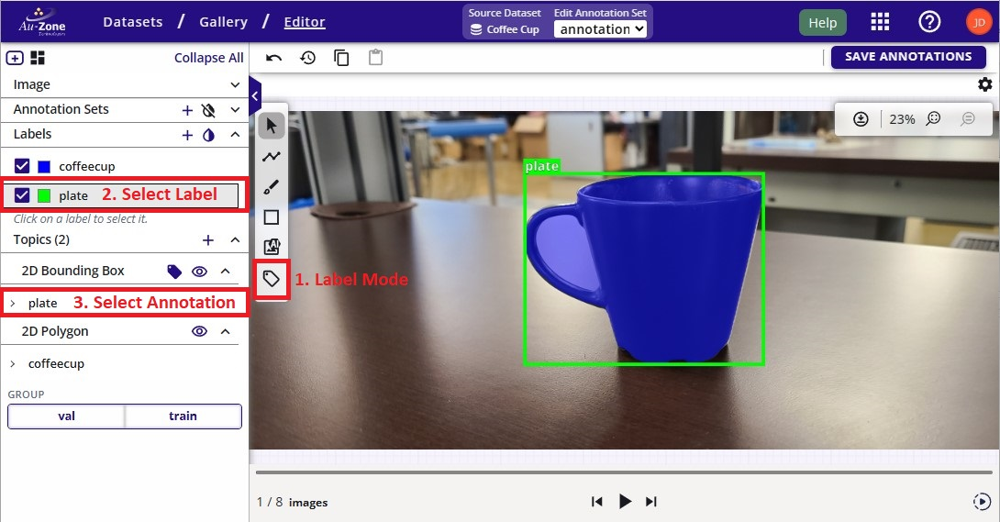{ align=center }
<figcaption>Change Annotation Label</figcaption>
</figure>

### Add Label

To add a new label, click on the button with a pencil icon under "Labels" on the dataset card.

<figure markdown="span">
{ align=center }
<figcaption>Edit Labels</figcaption>
</figure>

This will bring the option to edit the labels.  Click on the "+" button on the top right and this will add a new label as shown below.  By default it will show as "NewLabel" with no color associated to it.  

<figure markdown="span">
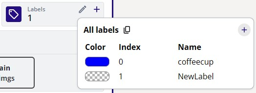{ align=center }
<figcaption>Add Label</figcaption>
</figure>

You can follow the steps shown for [editing the label](#edit-label) to modify the label from "NewLabel" to something else like "plate" with color green for example as shown below.

<figure markdown="span">
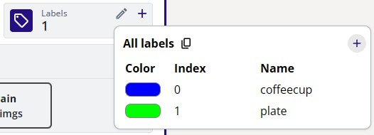{ align=center }
<figcaption>Added Label</figcaption>
</figure>

**Alternatively**, you can also add multiple labels by clicking the button with the "+" icon next to the "Labels" on the dataset card.  This will bring the option for adding comma separated labels. 

<figure markdown="span">
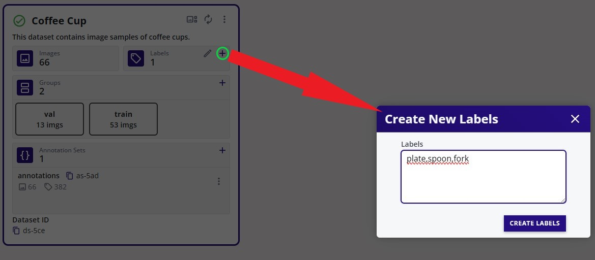{ align=center }
<figcaption>Add Multiple Labels</figcaption>
</figure>

When a new label is added, this allows you to create new annotations with this label as shown in the dropdown in the gallery.

<figure markdown="span">
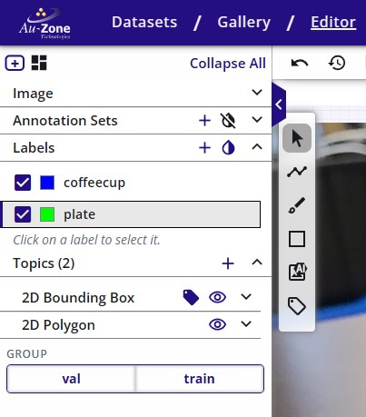{ align=center }
<figcaption>Added Plate Label in Gallery</figcaption>
</figure>

### Remove Label

To remove a label, click on the button with a pencil icon under "Labels" on the dataset card.

<figure markdown="span">
{ align=center }
<figcaption>Edit Labels</figcaption>
</figure>

This will show the list of existing labels.  Click on the "x" button shown on the right of the label when hovering over it.  This will delete the label from the list along with the annotations with this label. 

<figure markdown="span">
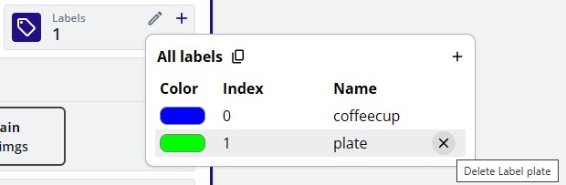{ align=center }
<figcaption>Added Label</figcaption>
</figure>

## Terminate AGTG Server

In order to avoid running out of credits, terminate an idle AGTG server.  As mentioned, 15 minutes of inactivity will auto-terminate AGTG servers.  However, you can terminate a server as shown below.  Navigate to the *Cloud Instances* under the tool options.

<figure markdown="span">
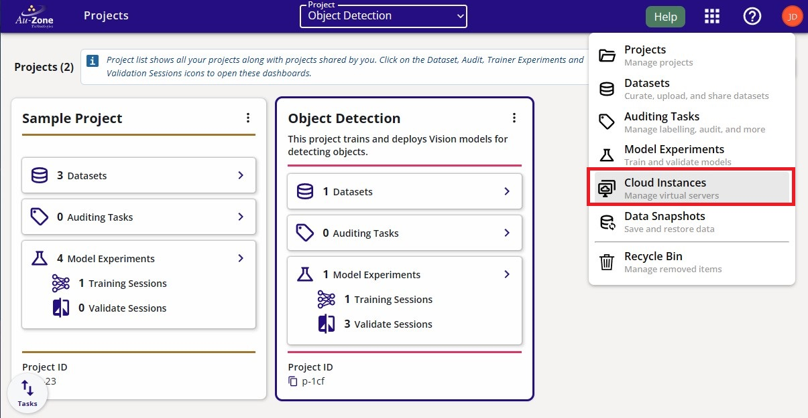{ align=center }
<figcaption>Cloud Instances</figcaption>
</figure>

Select the AGTG server and click "Stop" to stop the server.

<figure markdown="span">
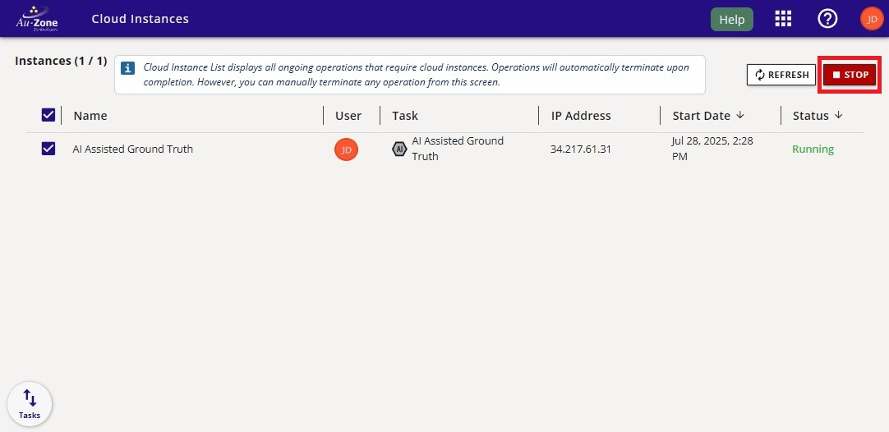{ align=center }
<figcaption>Select AGTG Server</figcaption>
</figure>

Confirm the AGTG server deletion.

<figure markdown="span">
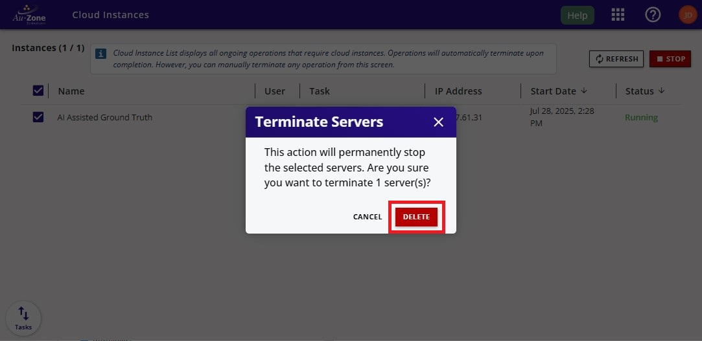{ align=center }
<figcaption>Delete AGTG Server</figcaption>
</figure>
