# Manual Annotations

This page will describe the steps for manually adding annotations in the dataset.  Ideally, the dataset is mostly already [annotated via AGTG](automatic.md).  However, for any errors in the annotations that requires adjustments and corrections, the features described below will allow you to audit the annotations.

As mentioned, a dataset can have 2D and 3D annotations.  This page is split into tutorials for manually annotating 2D and 3D annotations. 

## Manual 2D Annotations

This section describes the steps for adjusting 2D annotations in the dataset.

### Add 2D Annotations

First [navigate to the dataset gallery](../management.md#viewing-datasets) and start by adding a single 2D annotation on an image.  Select the "AI Image Segment Tool".  This tool will use SAM-2 to auto-segment and auto-box an object in the image. 

<figure markdown="span">
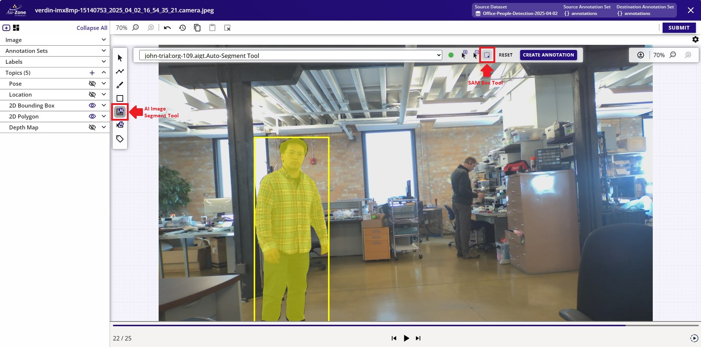{ align=center }
<figcaption>Auto Segment Mode</figcaption>
</figure>

If there is currently no AGTG server available, go ahead and click on "Launch AGTG Server".

<figure markdown="span">
{ align=center }
<figcaption>Launch AGTG Server</figcaption>
</figure>

Please wait while the server is being initialized.

<figure markdown="span">
{ align=center }
<figcaption>Launch AGTG Server</figcaption>
</figure>

!!! warning "Active AGTG Server"
    This server is costing credits to run.  An inactivity of 15 minutes will auto-terminate this server.  Otherwise, once you have completed the annotations, please ensure to [terminate the AGTG server](index.md#terminate-agtg-server) to avoid spending more of your credits. 

Once the server is initialized, draw the bounding box around the object by clicking on the image and then dragging the mouse to expand the bounding box.  This will start segmenting the object.  Once the object is properly segmented, go ahead and click "Save Annotations" as indicated in red to save the annotation and to move forward to the next image.

<figure markdown="span">
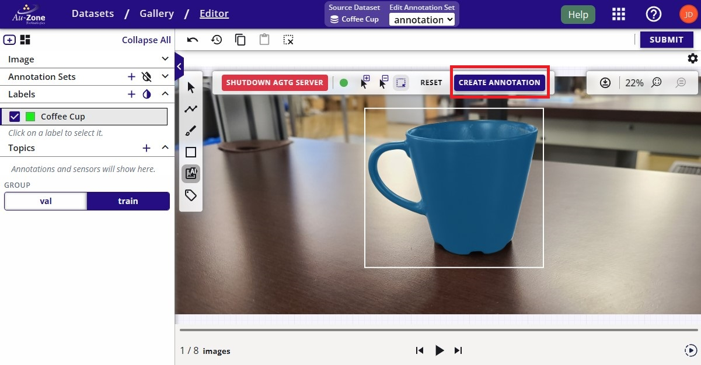{ align=center }
<figcaption>Draw Bounding Box Prompt</figcaption>
</figure>

**Alternatively**, use these tools to manually add bounding boxes and segmentation masks separately.

The standard steps for using these tools are described below.

1. Click on the box tool or brush tool in the 2D editing panel (left - shown in red box).
2. Using the mouse, drag anywhere on the image to create box/mask annotation.
3. Make multiple boxes/masks - one for each annotation.
4. Make sure to change the label type on the left panel if the next label belongs to a different class. 

<figure markdown="span">
{ align=center }
<figcaption>2D Manual Annotation Tools</figcaption>
</figure>

### Adjust 2D Annotations

To resize a 2D bounding box annotation, select the bounding box from the dropdown on the left under "2D Bounding Box". 

<figure markdown="span">
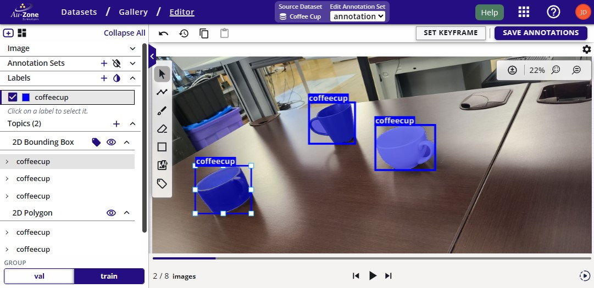{ align=center }
<figcaption>Resize Bounding Box</figcaption>
</figure>

This will show the anchor points around the bounding box allowing you to click on these points and drag the mouse to resize the bounding box. 

Similarly, to adjust the 2D segmentation mask annotation, select the segmentation mask from the dropdown on the left under "2D Polygon". This will also show the anchor points around the mask polygon allowing you to adjust the mask.

<figure markdown="span">
{ align=center }
<figcaption>Adjust Segmentation Mask</figcaption>
</figure>

After making the adjustments, go ahead and click on the "Save Annotations" button on the top left to save these adjustments and move forward with the next image in the dataset.

### Delete 2D Annotations

To delete an annotation, first click on the pointer tool . Click on the annotation.  This will first highlight the bounding box annotation.  To delete the annotation, press the "Delete" key on your keyboard.

<figure markdown="span">
{ align=center }
<figcaption>Delete Bounding Box</figcaption>
</figure>

Next repeat the same process for the segmentation mask.  Click on the mask annotation to highlight the mask.  To delete the annotation, press the "Delete" key on your keyboard or click on the "Delete" button next to the annotation to delete the annotation. 

<figure markdown="span">
{ align=center }
<figcaption>Delete Segmentation Mask</figcaption>
</figure>

The annotations will be deleted after following the steps above.

<figure markdown="span">
{ align=center }
<figcaption>Deleted Annotations</figcaption>
</figure>

## Manual 3D Annotations

This section describes the steps for adjusting 3D annotations in the dataset.

First [navigate to the dataset gallery](../management.md#viewing-datasets).  Ensure that the LiDAR and/or Radar point clouds, and the 3D bounding box annotations are toggled visible. 

<figure markdown="span">
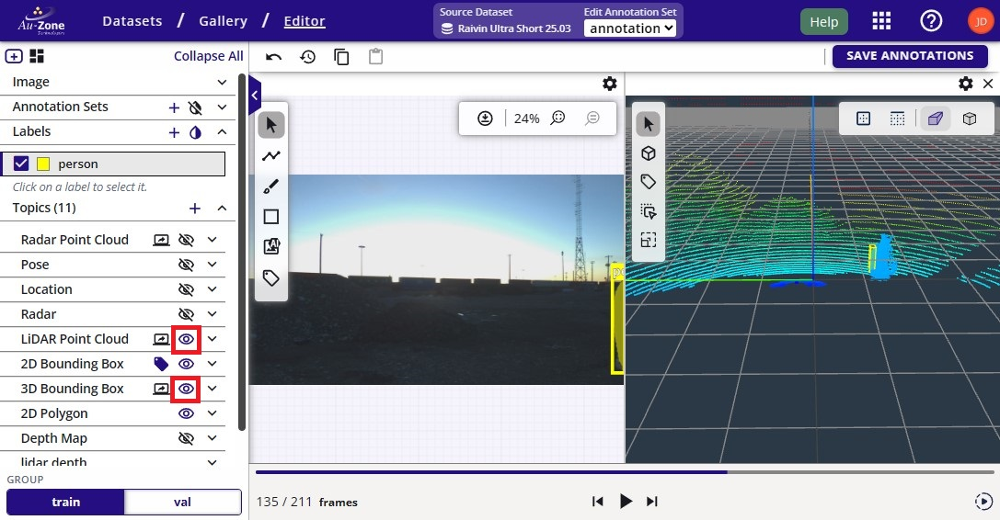{ align=center }
<figcaption>Visible 3D Annotations</figcaption>
</figure>

### Scale 3D Annotation

The error in the current annotation is that the bounding box is not scaled properly.  Click on the option on the left sidebar to enable 3D bounding box scaling as indicated in red.

<figure markdown="span">
{ align=center }
<figcaption>Scale 3D Annotations</figcaption>
</figure>

Click on the current 3D bounding box to scale and this will provide anchor points to scale the 3D bounding box in the 3-axis.

<figure markdown="span">
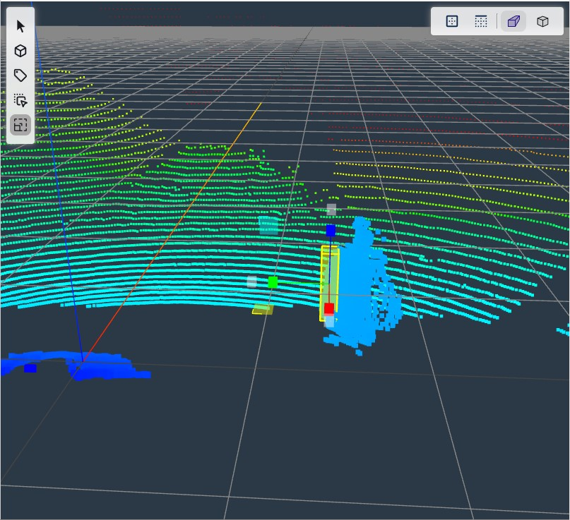{ align=center }
<figcaption>Scaling 3D Annotations</figcaption>
</figure>

Next adjust the scaling of the 3D bounding box in each axis by dragging the anchor points (red, green, blue).  The 3D bounding box shown below was adjusted with proper scaling to the LiDAR point clouds of the object.  

| Scaled YZ Plane             | Scaled XY Plane           | Scaled XZ             |
|-----------------------------|---------------------------|-----------------------|
|  |  | 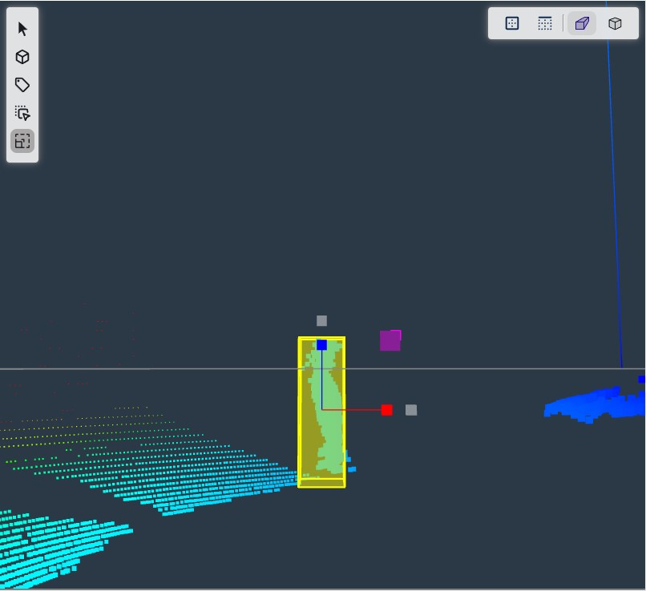 |

However, the translation is still quite off, instructions to fix this issue will be shown in the next section.

### Translate 3D Annotation

Next the adjusted 3D bounding box needs to be properly translated.  Click on the option on the left sidebar to enable 3D bounding box translation as indicated in red.

<figure markdown="span">
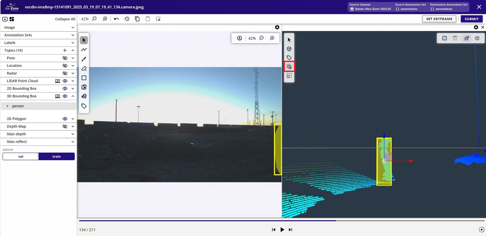{ align=center }
<figcaption>Translate 3D Annotations</figcaption>
</figure>

Similar to the workflow as scaling the 3D bounding boxes above, move the three anchor points for each axis to translate the bounding box for each axis.

| Translate YZ Plane          | Translate XY Plane        | Translate XZ          |
|-----------------------------|---------------------------|-----------------------|
| 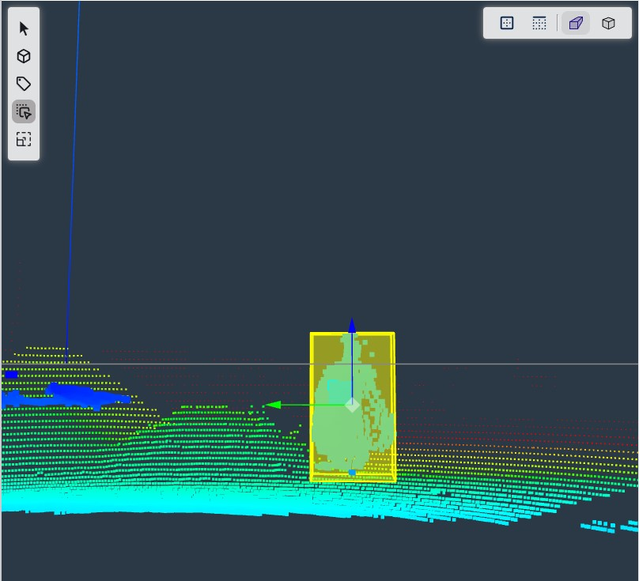 | 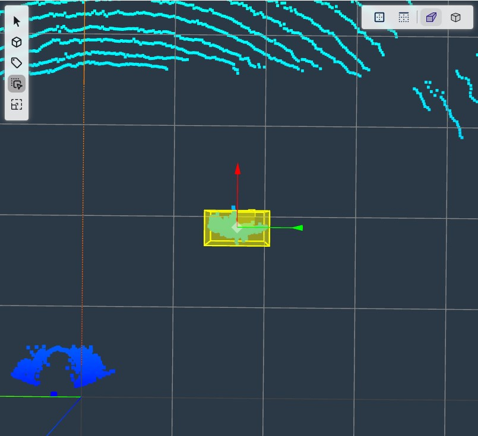 |  |

Once the 3D bounding box annotation is properly oriented, click "Save Annotations" to save the changes.

<figure markdown="span">
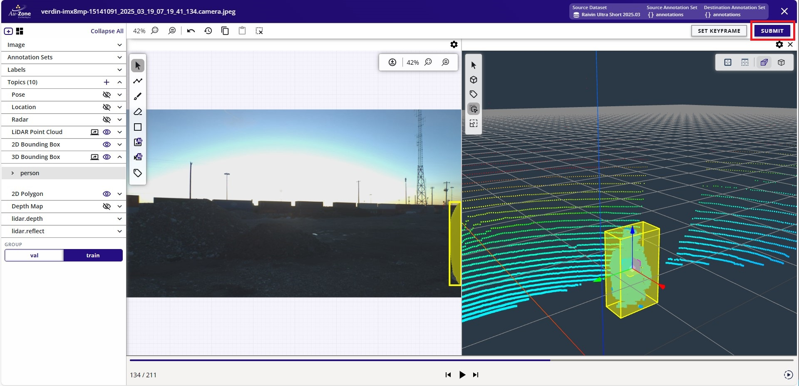{ align=center }
<figcaption>Submit 3D Annotations</figcaption>
</figure>

### Add 3D Annotation

To add a missing 3D bounding box, click on the option on the left sidebar to add a new 3D bounding box annotation as indicated in red.

<figure markdown="span">
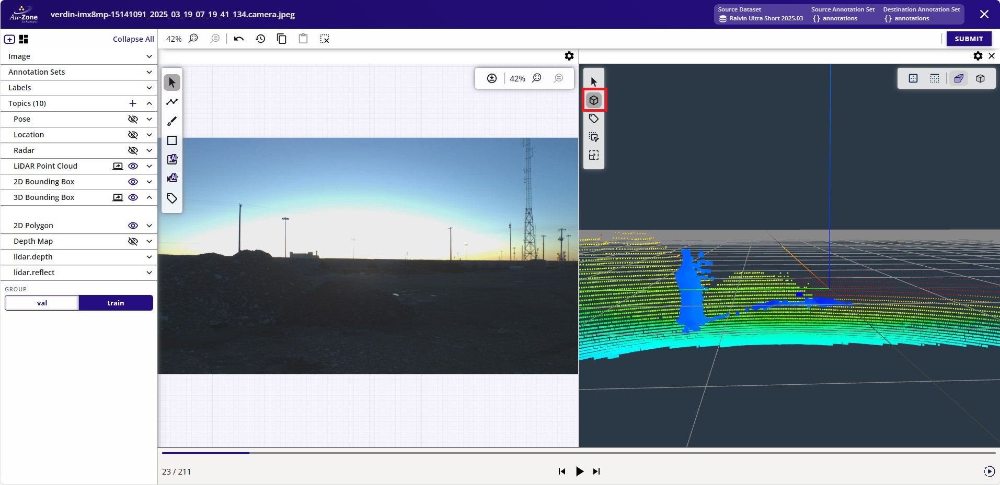{ align=center }
<figcaption>Add 3D Annotations</figcaption>
</figure>

Now click on the grid to add a new 3D bounding box on the position of the click.

<figure markdown="span">
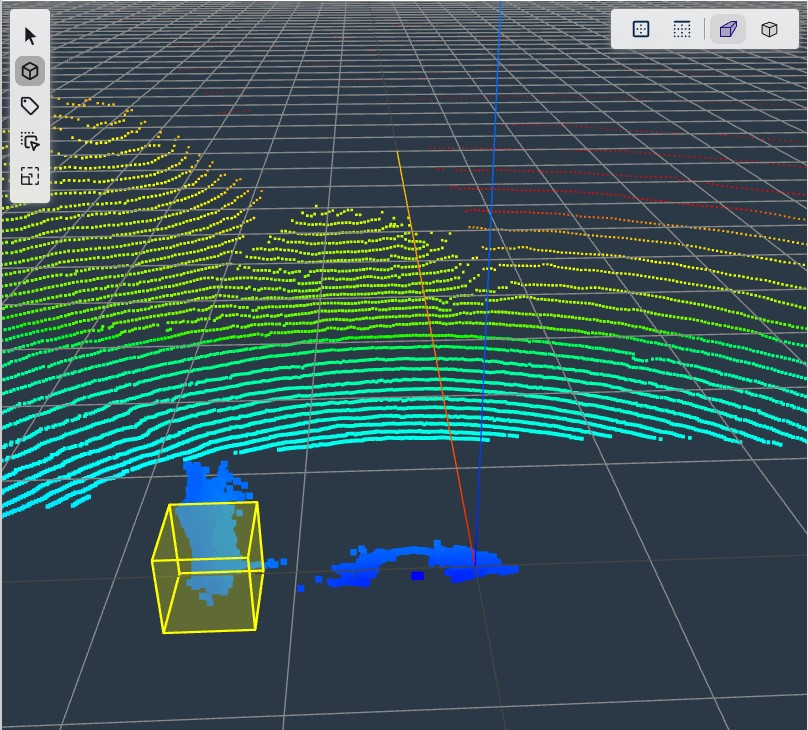{ align=center }
<figcaption>Added 3D Annotations</figcaption>
</figure>

This newly added 3D bounding box may not be scaled or translated properly.  Follow instructions for [scaling](#scale-3d-annotation) and [translating](#translate-3d-annotation) a 3D bounding box to properly center the bounding box around the LiDAR point cloud as shown below.  Once the annotation is properly scaled and translated, click "Save Annotations" to save the annotation.

<figure markdown="span">
{ align=center }
<figcaption>Submit 3D Annotations</figcaption>
</figure>

### Delete 3D Annotation

To delete an annotation, first click on the pointer tool . Click on the annotation.  This will first highlight the 3D bounding box annotation.  To delete the annotation, press the "Delete" key on your keyboard.

## Video Tutorials

This is a high-level video tutorial showing adjustments to the 3D annotations.

    <iframe width="560" height="315" src="https://www.youtube.com/embed/j-75Q5-_dC0?start=1536&end=2144" title="Visualize Annotations" frameborder="0" allow="accelerometer; autoplay; clipboard-write; encrypted-media; gyroscope; picture-in-picture; web-share" referrerpolicy="strict-origin-when-cross-origin" allowfullscreen></iframe>

## Next Steps

Once you have verified that your dataset has been properly annotated, you can now proceed to training your [Vision](../../../models/modelpack/training.md) or [Fusion](../../../models/fusion/training.md) model. 