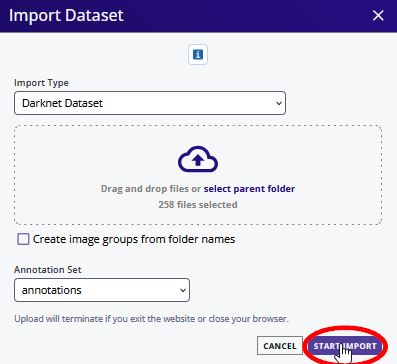
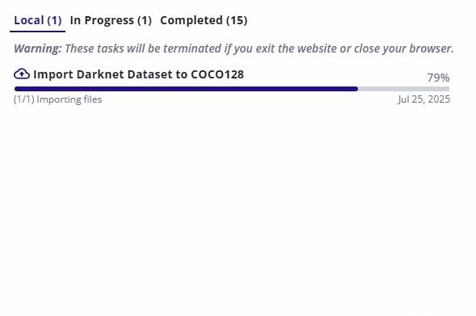
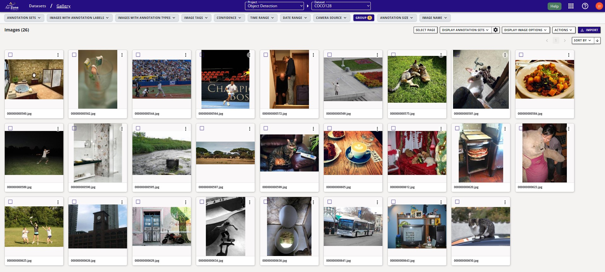
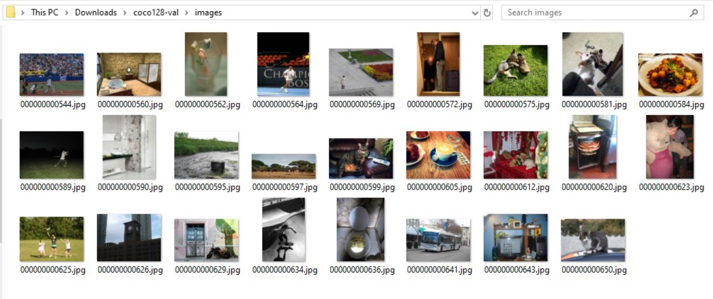
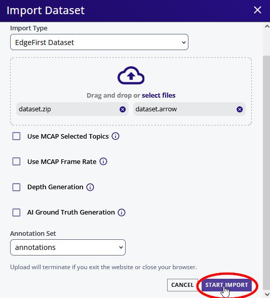
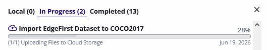

# Dataset Import

This page will provide tutorials for importing annotated datasets with various formats in EdgeFirst Studio.  

## Import Darknet Datasets

There are two methods for importing Darknet Datasets.

1. *Pre-Split*: The dataset directory already contains training and validation splits.
2. *No Split*: The dataset directory does not have a training and validation split. All samples are inside the image and labels directories.

### Pre-Split

Consider a Darknet dataset with training and validation splits structured in the following way.

```text
<coco128>/
├── images/
│   ├── <train>/
│   │   └── *.jpg/png/jpeg/..
│   └── <val>/
|   |   └── *.jpg/png/jpeg/...
├── labels/
│   ├── <train>/
│   │   └── *.txt
│   └── <val>/
│       └── *.txt
```

To import this dataset and to preserve the train and validation splits in EdgeFirst Studio, the dataset needs to be restructured in the following way with one directory containing standalone training samples and another directory with the validation samples.

1. Training Samples

    ```text
    <coco128-train>/
    ├── images/
    │   └── *.jpg/png/jpeg/..
    ├── labels/
    │   └── *.txt
    ```

2. Validation Samples

    ```text
    <coco128-val>/
    ├── images/
    │   └── *.jpg/png/jpeg/..
    ├── labels/
    │   └── *.txt
    ```

!!! note
    The elements enclosed by <> can be any arbitrary name in your machine.

Let's first import the training samples.  To import a dataset, first [create a dataset](management.md#create-dataset) container in EdgeFirst Studio. The following dataset is created with the name set to "COCO128" and the description as "Demo import".  Furthermore, an annotation set has also been created called "annotations".

{{ figure("../assets/import/coco128-container.jpg", "COCO128 Dataset Container") }}

Once a container has been created, open the dataset context menu denoted by the three vertical dots on the top right corner of the dataset card and then click "import".

{{ figure("../assets/import/coco128-options.jpg", "Dataset Options") }}

Select the "Import Type" to "Darknet Dataset".  

{{ figure("../assets/import/coco128-darknet-ds-dropdown.jpg", "Darknet Dataset Option") }}

Specify the dataset in your local PC "coco128-train" to import.

{{ figure("../assets/import/coco128-upload-train-ds.jpg", "Upload COCO128 Training Samples") }}

Click "Start Import" at the bottom right to start the import process.

Import Options | Import Process
:-----------------------------:|:----------------------------:
 | 

Once completed, all the training samples have been imported to the dataset container.

{{ figure("../assets/import/coco128-train-imported.jpg", "Imported COCO128 Training Samples") }}

Next specify all imported samples towards the training group.  Set the slider to 100% training, click "Split" to group all samples into the training group.

{{ figure("../assets/import/coco128-split-all-training.jpg", "100% Training Samples") }}

All of the samples should now be set towards the training group.

{{ figure("../assets/import/coco128-all-training-samples.jpg", "100% Training Samples") }}

Repeat the steps to import the validation samples.  Select the "Import" button under the dataset context menu.

{{ figure("../assets/import/coco128-options.jpg", "Import Option") }}

Select the "Import Type" to "Darknet Dataset".

{{ figure("../assets/import/coco128-darknet-ds-dropdown.jpg", "Darknet Dataset Option") }}

Specify the dataset in your local PC "coco128-val" to import.  Specify the annotation set to the "annotations" annotation set.  The following figure shows the specifications.

{{ figure("../assets/import/coco128-upload-val-ds.jpg", "Upload COCO128 Validation Samples") }}

Click "Start Import" to start the import process and once it completes, the validation samples should have been imported.

{{ figure("../assets/import/coco128-val-imported.jpg", "Imported COCO128 Validation Samples") }}

The added validation samples are not yet assigned to any partition.  Set the slider to 100% Validation and check "Only ungrouped images" as this will transfer all recently imported ungrouped validation samples towards the validation group.  Finally, click the "Split" button to group the samples.

{{ figure("../assets/import/coco128-split-all-validation.jpg", "100% Validation Samples") }}

This dataset container should now have imported the validation samples from your local dataset.

{{ figure("../assets/import/coco128-all-validation-samples.jpg", "COCO128 with Groups") }}

Verify in the [gallery](management.md#view-dataset) that the samples imported match the samples in your local PC.

Validation Samples in Studio | Validation Samples in the PC
:-----------------------------:|:----------------------------:
 | 

### No Split

This tutorial demonstrates how to import a Darknet-format dataset, such as [COCO128](https://www.kaggle.com/datasets/ultralytics/coco128), into EdgeFirst Studio.  The COCO128 dataset is a small sample dataset originally created for [YOLOv5](https://github.com/ultralytics/yolov5) and does not include predefined training and validation splits.

While COCO128 is used in this tutorial as a simple example, the same workflow can be applied to import existing public or custom Darknet datasets into EdgeFirst Studio for viewing, management, annotation, and model development.

To import a dataset, first [create a dataset](management.md#create-dataset) container in EdgeFirst Studio.  The following dataset is created with the name set to "COCO128" and the description as "Demo import".  Furthermore, an annotation set has also been created called "annotations".

{{ figure("../assets/import/coco128-container.jpg", "COCO128 Dataset Container") }}

The [COCO128](https://www.kaggle.com/datasets/ultralytics/coco128?resource=download) dataset was downloaded using the link provided.  This will download a ZIP archive which can then be extracted into a "coco128" directory which contains "images" and "labels" subdirectories.

{{ figure("../assets/import/coco128-directories.jpg", "COCO128") }}

Once a container has been created, open the dataset context menu denoted by the three vertical dots on the top right corner of the dataset card and click "Import".

{{ figure("../assets/import/coco128-options.jpg", "Dataset Options") }}

Select the "Import Type" to "Darknet Dataset".  

{{ figure("../assets/import/coco128-darknet-ds-dropdown.jpg", "Darknet Dataset Option") }}

Specify the dataset "coco128" in your local PC to import.

{{ figure("../assets/import/coco128-upload-ds.jpg", "Upload COCO128 Options") }}

Select "Start Import" at the bottom right to start the import process.

Start Import | Import Process
:-----------------------------:|:----------------------------:
 | 

Once completed, the dataset container will now contain 128 images from COCO and
the annotations stored in the "annotations" container.

{{ figure("../assets/import/coco128-train-imported.jpg", "Imported COCO128 Dataset") }}

The next step is to [split the dataset](management.md#split-dataset) into training and validation partitions.

After the split is complete, you can explore the dataset and verify its annotations by following the tutorial for [viewing the dataset gallery](management.md#view-dataset).

## Import EdgeFirst Datasets

This tutorial will show how to import an [EdgeFirst Dataset](../format/index.md) into EdgeFirst Studio. This tutorial will show importing a dataset such as COCO2017 that is structured as an EdgeFirst Dataset as shown below.

{{ figure("../assets/import/edgefirst-dataset-coco.jpg", "COCO2017 EdgeFirst Dataset") }}

To import a dataset, first [create a dataset](management.md#create-dataset) container in EdgeFirst Studio. The following dataset is created with the name set to "COCO2017" and the description as "Demo Import".  Furthermore, an annotation set has also been created called "annotations".

{{ figure("../assets/import/coco2017-container.jpg", "COCO2017 Dataset Container") }}

Once a container has been created, open the dataset context menu denoted by the three vertical dots on the top right corner of the dataset card and select "Import".

{{ figure("../assets/import/coco2017-import-option.jpg", "Import Option") }}

Select the "Import Type" to "EdgeFirst Dataset".

{{ figure("../assets/import/coco2017-edgefirst-ds-dropdown.jpg", "EdgeFirst Dataset Dropdown") }}

Specify the [ZIP and Arrow file](../format/index.md) in your machine to be imported.  Specify the annotation set to the "annotations" annotation set to store the dataset annotations.  The following figure shows the specifications.

{{ figure("../assets/import/coco2017-import-options.jpg", "Import Options") }}

Select "Start Import" at the bottom right to start the import process.

Start Import | Import Process
:-----------------------------:|:----------------------------:
 | 

Once completed, the dataset container will now store the COCO dataset along with its annotations.

{{ figure("../assets/import/coco2017-imported.jpg", "Imported COCO2017 Dataset") }}

See the dataset and its annotations by following the tutorial for [viewing the dataset gallery](management.md#view-dataset).

## Next Steps

Now that you have learned how to import datasets into EdgeFirst Studio, the next step is to explore how [annotations](annotations/index.md) are created, managed, and maintained within the platform.
