# Dataset Import

This page will provide tutorials for importing annotated datasets with various formats in EdgeFirst Studio.  

## Import Darknet Datasets

There are two methods for importing Darknet Datasets.

1. *Pre-Split*: The dataset directory already contains training and validation splits.
2. *No Split*: The dataset directory does not have a training and validation split. All samples are inside the image and labels directories.

### Pre-Split

Consider a Darknet dataset with training and validation splits structured in the following way.

```text
<coco128>/
├── images/
│   ├── <train>/
│   │   └── *.jpg/png/jpeg/..
│   └── <val>/
|   |   └── *.jpg/png/jpeg/...
├── labels/
│   ├── <train>/
│   │   └── *.txt
│   └── <val>/
│       └── *.txt
```

To import this dataset and to preserve the train and validation splits in EdgeFirst Studio, the dataset needs to be restructured in the following way with one directory containing standalone training samples and another directory with the validation samples.

1. Training Samples

    ```text
    <coco128-train>/
    ├── images/
    │   └── *.jpg/png/jpeg/..
    ├── labels/
    │   └── *.txt
    ```

2. Validation Samples

    ```text
    <coco128-val>/
    ├── images/
    │   └── *.jpg/png/jpeg/..
    ├── labels/
    │   └── *.txt
    ```

!!! note
    The elements enclosed by <> can be any arbitrary name in your machine. 

Let's first import the training samples.  To import a dataset, first [create a dataset](management.md#create-dataset) container in EdgeFirst Studio. The following dataset is created with the name set to "COCO128" and the description as "Demo import".  Furthermore, an annotation set has also been created called "annotations".

<figure markdown="span">
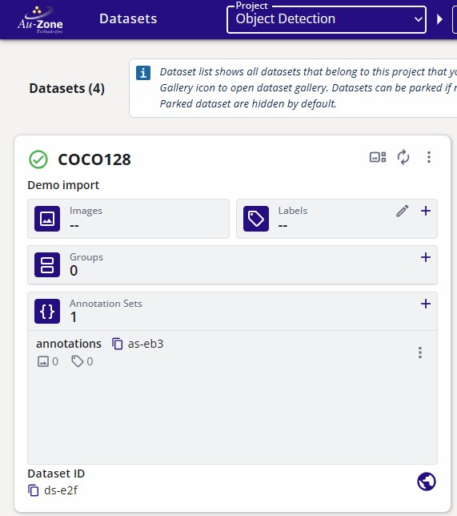{ align=center }
<figcaption>COCO128 Dataset Container</figcaption>
</figure>

Once a container has been created, open the dataset context menu denoted by the three vertical dots on the top right corner of the dataset card.

<figure markdown="span">
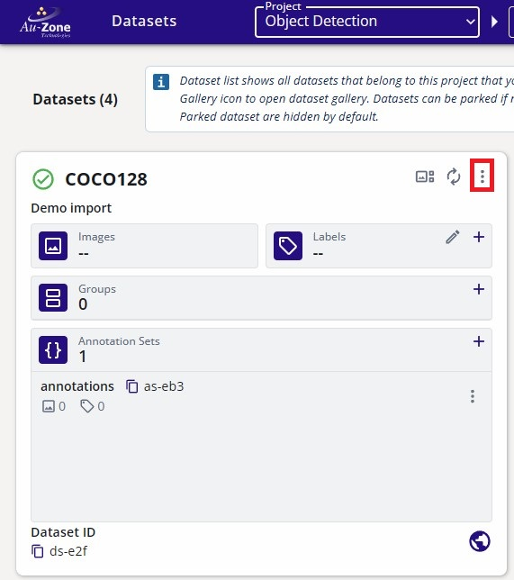{ align=center }
<figcaption>Dataset Options</figcaption>
</figure>

Select "Import".

<figure markdown="span">
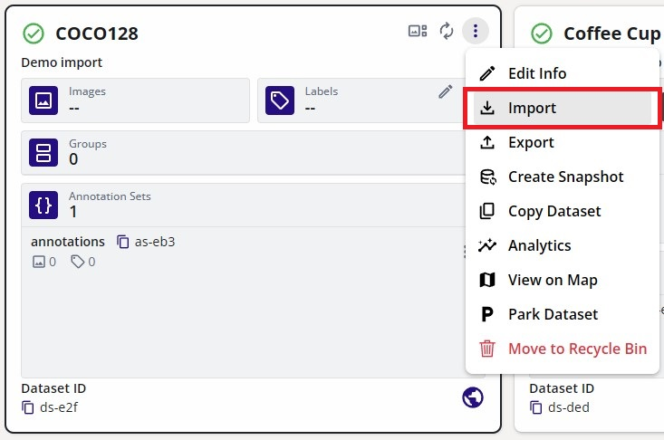{ align=center }
<figcaption>Import Option</figcaption>
</figure>

This will popup a new window for you to specify the dataset to be imported.  In these options, select the "Import Type" to be "Darknet Dataset".  Specify the dataset folder "coco128-train" to be imported.  Specify the annotation set to the "annotations" annotation set.  The following figure shows the specifications.

<figure markdown="span">
{ align=center }
<figcaption>Import Options</figcaption>
</figure>

Select "Start Import" at the bottom right to start the import process. This will start the import process as shown.

<figure markdown="span">
{ align=center }
<figcaption>Import Process</figcaption>
</figure>

Once completed, all the training samples have been imported to the dataset container.

<figure markdown="span">
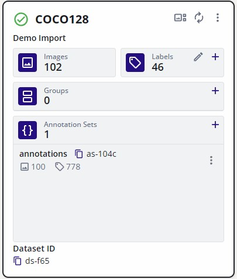{ align=center }
<figcaption>Imported COCO128 Training Samples</figcaption>
</figure>

Next specify all imported samples towards the training group.

<figure markdown="span">
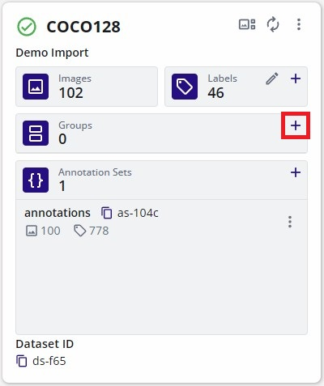{ align=center }
<figcaption>Add Training Group</figcaption>
</figure>

Once the slider has been set to 100% training, click "Split" to group all samples into the training group.

<figure markdown="span">
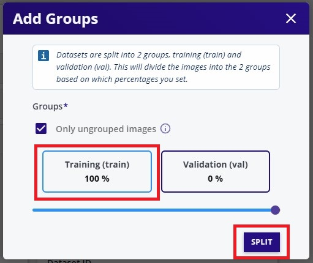{ align=center }
<figcaption>100% Training Samples</figcaption>
</figure>

All of the samples should now be set towards the training group.

<figure markdown="span">
{ align=center }
<figcaption>100% Training Samples</figcaption>
</figure>

Next, import the validation samples by going back to the "Import" feature.

<figure markdown="span">
{ align=center }
<figcaption>Import Option</figcaption>
</figure>

Specify the "Import Type" to "Darknet Dataset" again, but specify the dataset folder "coco128-val" to be imported.  Specify the annotation set to the "annotations" annotation set.  The following figure shows the specifications.

<figure markdown="span">
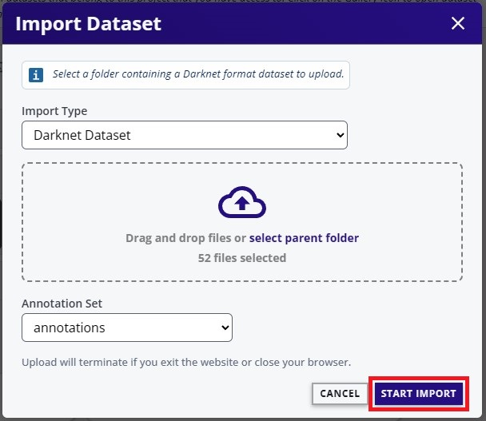{ align=center }
<figcaption>Import Options</figcaption>
</figure>

Click "Start Import" and after it completed, the number of samples on the dataset should have increased.

<figure markdown="span">
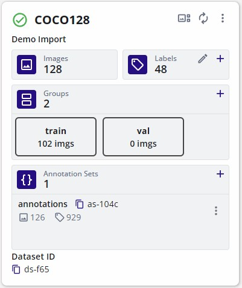{ align=center }
<figcaption>Imported COCO128 Training Samples</figcaption>
</figure>

These newly added samples for validation have not been grouped yet.  Next assign groups to these samples.  Click on the "+" button again to add a validation group.

<figure markdown="span">
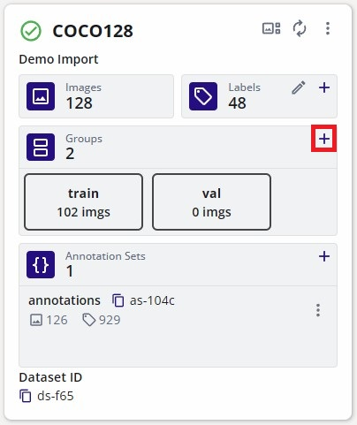{ align=center }
<figcaption>Add Training Group</figcaption>
</figure>

Set the slider to 100% Validation and check "Only ungrouped images" as this will transfer all recently imported ungrouped validation samples towards the validation group. 

<figure markdown="span">
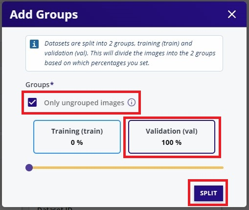{ align=center }
<figcaption>100% Validation Samples</figcaption>
</figure>

Click the "Split" button to group the samples.  This dataset container should now retain the training and validation split as provided from the dataset.

<figure markdown="span">
{ align=center }
<figcaption>COCO128 with Groups</figcaption>
</figure>

Verify in the [gallery](management.md#view-dataset) that the samples imported match the samples in the local machine.

<figure markdown="span">
{ align=center }
<figcaption>Validation Samples in Studio</figcaption>
</figure>

<figure markdown="span">
{ align=center }
<figcaption>Validation Samples in the PC</figcaption>
</figure>

### No Split

This tutorial will show how to import a Darknet dataset such as [COCO128](https://www.kaggle.com/datasets/ultralytics/coco128) into EdgeFirst Studio which has no training and validation split.  This dataset is only meant as a tutorial dataset for [YOLOv5](https://github.com/ultralytics/yolov5), but this tutorial is meant to show the functionality of importing existing public datasets into EdgeFirst Studio. 

To import a dataset, first [create a dataset](management.md#create-dataset) container in EdgeFirst Studio. The following dataset is created with the name set to "COCO128" and the description as "Demo import".  Furthermore, an annotation set has also been created called "annotations".

<figure markdown="span">
{ align=center }
<figcaption>COCO128 Dataset Container</figcaption>
</figure>

For an example dataset, [COCO128](https://www.kaggle.com/datasets/ultralytics/coco128?resource=download) was downloaded using the link provided.  This will download a ZIP archive which can then be extracted into a "coco128" directory which contains "images" and "labels" subdirectories.

<figure markdown="span">
{ align=center }
<figcaption>COCO128</figcaption>
</figure>

Once a container has been created, open the dataset context menu denoted by the three vertical dots on the top right corner of the dataset card.

<figure markdown="span">
{ align=center }
<figcaption>Dataset Options</figcaption>
</figure>

Select "Import".

<figure markdown="span">
{ align=center }
<figcaption>Import Option</figcaption>
</figure>

This will popup a new window for you to specify the dataset to be imported.  In these options, select the "Import Type" to be "Darknet Dataset".  Specify the dataset folder "coco128" to be imported.  Specify the annotation set to the "annotations" annotation set.  The following figure shows the specifications.

<figure markdown="span">
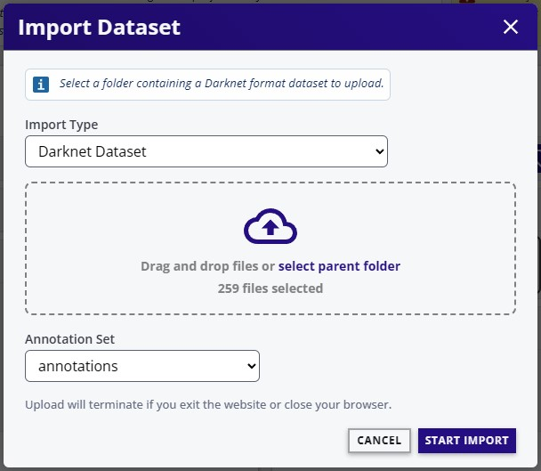{ align=center }
<figcaption>Import Options</figcaption>
</figure>

Select "Start Import" at the bottom right to start the import process.

<figure markdown="span">
{ align=center }
<figcaption>Start Import</figcaption>
</figure>

This will start the import process as shown.

<figure markdown="span">
{ align=center }
<figcaption>Import Process</figcaption>
</figure>

Once completed, the dataset container will now contain 128 images from COCO and 
the annotations stored in the "annotations" container.

<figure markdown="span">
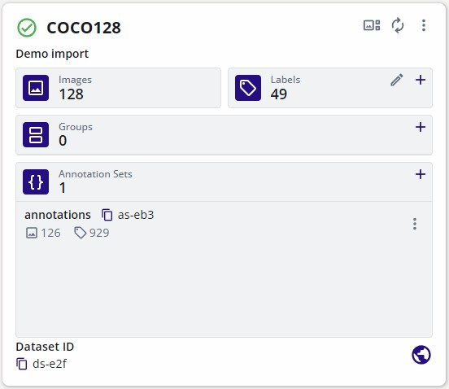{ align=center }
<figcaption>Imported COCO128 Dataset</figcaption>
</figure>

Next [split the dataset](management.md#split-dataset) into training and validations samples.

See the dataset and its annotations by following the tutorial for [viewing the dataset gallery](management.md#view-dataset).

## Import EdgeFirst Datasets

This tutorial will show how to import an [EdgeFirst Dataset](../format.md) into EdgeFirst Studio. This tutorial will show importing a dataset such as COCO2017 that is structured as an EdgeFirst Dataset as shown below.

<figure markdown="span">
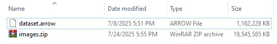{ align=center }
<figcaption>COCO2017 EdgeFirst Dataset</figcaption>
</figure>

To import a dataset, first [create a dataset](management.md#create-dataset) container in EdgeFirst Studio. The following dataset is created with the name set to "COCO2017" and the description as "Demo Import".  Furthermore, an annotation set has also been created called "annotations".

<figure markdown="span">
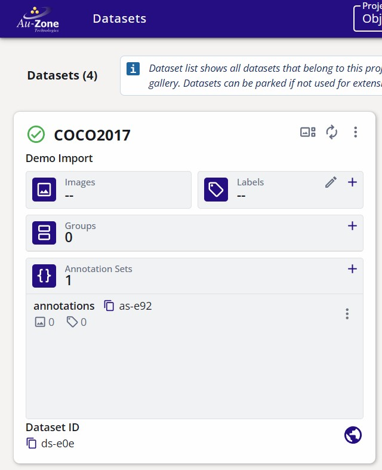{ align=center }
<figcaption>COCO2017 Dataset Container</figcaption>
</figure>

Once a container has been created, open the dataset context menu denoted by the three vertical dots on the top right corner of the dataset card.

<figure markdown="span">
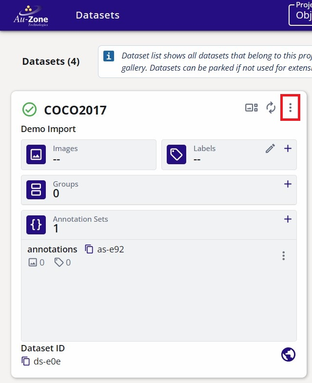{ align=center }
<figcaption>Dataset Options</figcaption>
</figure>

Select "Import".

<figure markdown="span">
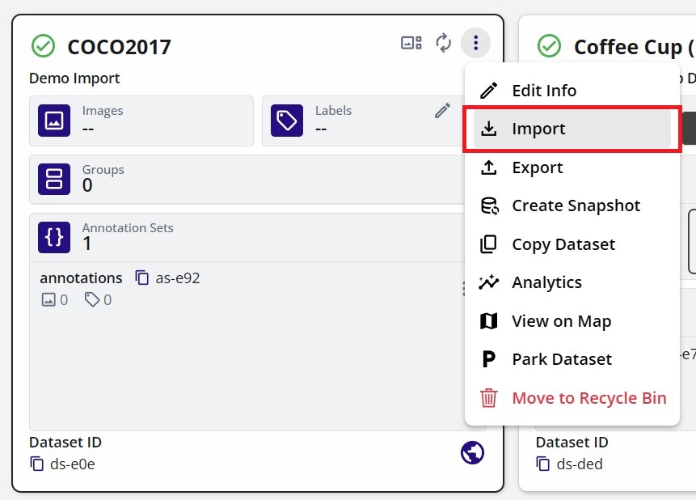{ align=center }
<figcaption>Import Option</figcaption>
</figure>

This will popup a new window for you to specify the dataset to be imported.  In these options, select the "Import Type" to be "EdgeFirst Dataset".  Specify the Zip and Arrow file in your machine to be imported.  Specify the annotation set to the "annotations" annotation set to store the dataset annotations.  The following figure shows the specifications.

<figure markdown="span">
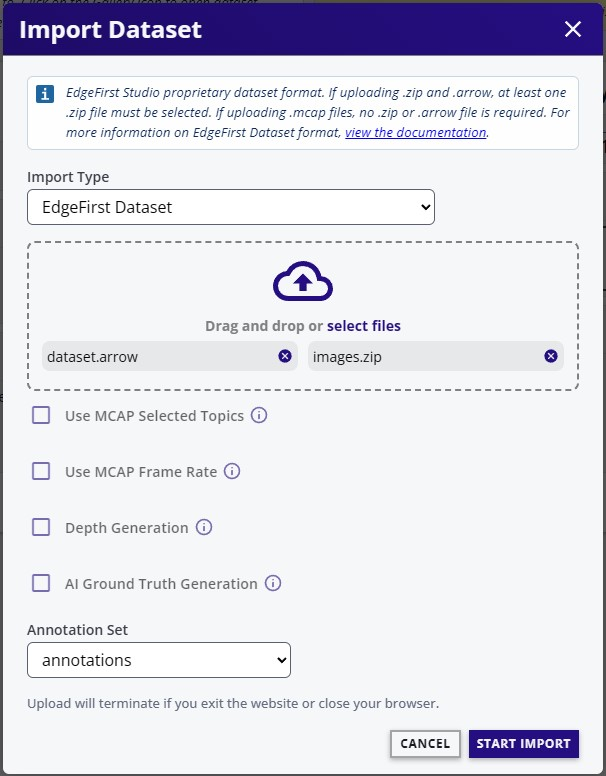{ align=center }
<figcaption>Import Options</figcaption>
</figure>

Select "Start Import" at the bottom right to start the import process.

<figure markdown="span">
{ align=center }
<figcaption>Start Import</figcaption>
</figure>

This will start the import process as shown.

<figure markdown="span">
{ align=center }
<figcaption>Import Process</figcaption>
</figure>

See the dataset and its annotations by following the tutorial for [viewing the dataset gallery](management.md#view-dataset).

## Next Steps

Now that you have seen how to import datasets in EdgeFirst Studio, see how the [annotations](annotations/index.md) are being managed in EdgeFirst Studio.
