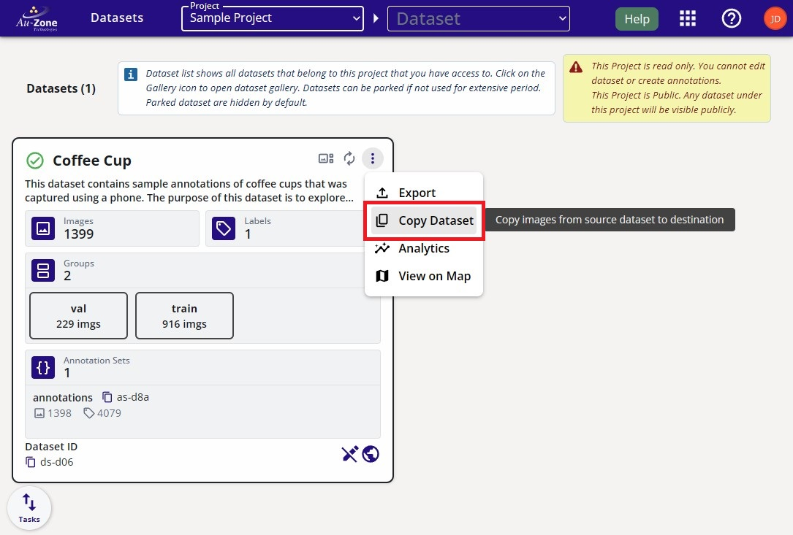
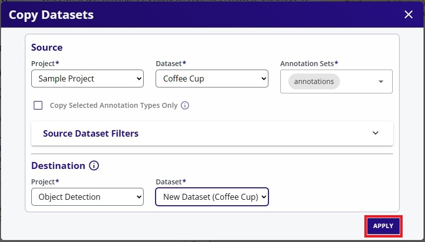
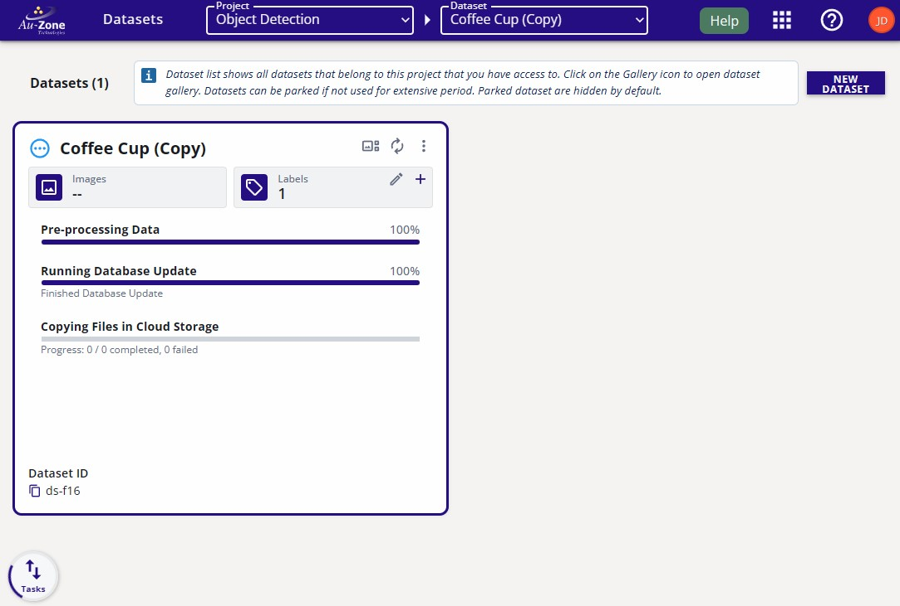
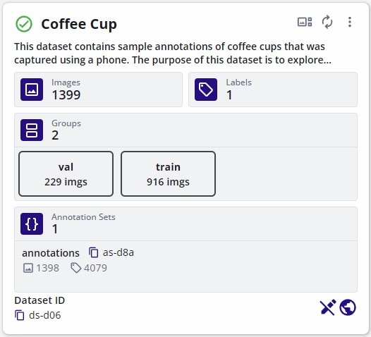
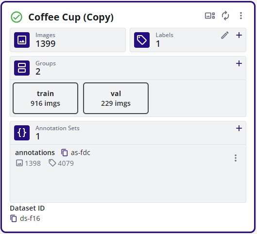
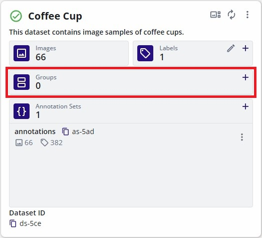
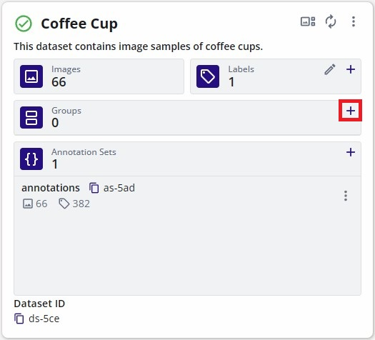
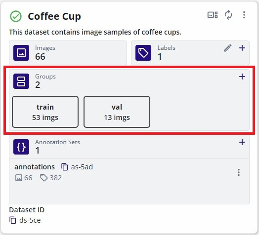

# Dataset Management

This page will provide tutorials for managing datasets in EdgeFirst Studio. 

## Viewing Datasets

This tutorial will show how to open the [gallery](../../studio/datasets/gallery.md) of the dataset to see the individual samples in the dataset.

From the "Projects" page, you can click on the dataset button indicated in red to view the datasets contained in the project.

<figure markdown="span">
{ align=center }
<figcaption>View Datasets</figcaption>
</figure>

You will now see the datasets contained in the project.  Each dataset has a gallery.  To see the images in the gallery, open the gallery by clicking the gallery button indicated in red.

<figure markdown="span">
{ align=center }
<figcaption>Gallery Button</figcaption>
</figure>

When clicking the gallery button, you will either see individual [images](../structure.md#image-based) or [sequences](../structure.md#sequence-based).

Sequences contain the following sequence icon  on the lower left of the card.  Clicking on any sequences will provide video playback.  Otherwise individual images do not have this icon on their cards. 

<figure markdown="span">
{ align=center }
<figcaption>Dataset Sequence</figcaption>
</figure>

## Edit Dataset Information

The dataset name and description can be edited by clicking on the dataset extended menu on the top right portion of the dataset card.  This should bring up the options and "Edit Info" as the first in the list.  Click on "Edit Info".

<figure markdown="span">
{ align=center }
<figcaption>Edit Info</figcaption>
</figure>

This will bring up the window to edit the dataset "Name" and the "Description".  Once the changes are made, click "Apply Changes" to save the changes.

<figure markdown="span">
{ align=center }
<figcaption>Edit Info Fields</figcaption>
</figure>

The changes should appear on the dataset card as shown below.

<figure markdown="span">
{ align=center }
<figcaption>Edited Info</figcaption>
</figure>

## Verifying Datasets

This tutorial will show an example of a dataset that is ready for training. 

    <iframe width="560" height="315" src="https://www.youtube.com/embed/Q8uiYJb1HJ4?start=81&end=118" title="Indoor Dataset Overview" frameborder="0" allow="accelerometer; autoplay; clipboard-write; encrypted-media; gyroscope; picture-in-picture; web-share" referrerpolicy="strict-origin-when-cross-origin" allowfullscreen></iframe>

Verify that the dataset has a training and validation split.  The sample dataset shown below has a dedicated split for training (20066 samples) and validation (2229 samples).

<figure markdown="span">
{ align=center }
<figcaption>Fusion Dataset Groups</figcaption>
</figure>

Another sample dataset shown below is for training Vision models which has a dedicated split for training (1656 samples) and validation (184 samples).

<figure markdown="span">
{ align=center }
<figcaption>Vision Dataset Groups</figcaption>
</figure>

Verify the contents of the dataset and the annotations.  Click the button that navigates to the gallery.  This will show the contents of the dataset.  The dataset may be comprised of multiple sequences as shown below.  

<figure markdown="span">
{ align=center }
<figcaption>Fusion Dataset Sequences</figcaption>
</figure>

<figure markdown="span">
{ align=center }
<figcaption>Vision Dataset Sequences</figcaption>
</figure>

Clicking on any of these sequences will open individual images in the sequence with the visualizations of the annotations.  For more information please see [viewing datasets](#viewing-datasets).

Datasets that train Fusion models provide annotations of the object's 3D bounding box.  For more information on the dataset annotations, please see the [EdgeFirst Dataset Format](../format.md#dataset-annotation-format).

<figure markdown="span">
{ align=center }
<figcaption>Fusion Annotations</figcaption>
</figure>

Datasets that train Vision models provide image annotations of the object's 2D bounding box and segmentation mask.  For more information on the dataset annotations, please see the [EdgeFirst Dataset Format](../format.md#dataset-annotation-format).

<figure markdown="span">
{ align=center }
<figcaption>Vision Annotations</figcaption>
</figure>

For cases where the annotations need corrections, please see [Manual 2D Annotations](annotations/manual.md#manual-2d-annotations) or [Manual 3D Annotations](annotations/manual.md#manual-3d-annotations) for more details.



## Copying Datasets

To copy a dataset, navigate to the dataset you would like to copy.  On the dataset card, select the "Copy Dataset" from the dataset options as shown below.

<figure markdown="span">
{ align=center }
<figcaption>Copy Dataset</figcaption>
</figure>

This will open a new dialog for the user to specify the "Destination".  The "Destination" will be the location of the copied dataset.  The "Source" will be set by default to the current dataset card you've selected.  However, you can also modify the location here.  In the example below, the original dataset is the "Source" which is the "Coffee Cup" dataset from the "Sample Project".  The copied dataset will be placed as specified in the "Destination" fields.  By default a new dataset container will be created in the specified project.  However, you can [create a dataset container](#create-dataset) before copying and specify this dataset container in the "Destination" fields.

<figure markdown="span">
{ align=center }
<figcaption>Copy Dataset Options</figcaption>
</figure>

Once the options are specified, go ahead and click "Apply" at the bottom right to start the copy process.  The progress for the dataset copy will be shown on the new dataset card that was created in the project destination that was specified.

<figure markdown="span">
{ align=center }
<figcaption>Copy Dataset Progress</figcaption>
</figure>

Once the copying process completes, the frames and the annotations have been copied.

**Original Dataset** | **Copied Dataset**
:------------------:|:------------------:
 | 

## Combining Datasets

The process of combining datasets consists of multiple copy processes on a given dataset container.  To combine datasets, first [create a dataset](#create-dataset) container.  Follow the process for [copying a dataset](#copying-datasets) onto the destination dataset container that was created.  The copy process will copy the selected dataset onto the same dataset container and thus combining multiple datasets.

## Splitting Datasets

A proper dataset has samples reserved for training and validation.  This tutorial will show how to split the samples in the dataset into training and validation groups.  This operation randomly shuffles the data prior to assigning them to the specified groups. 

!!! warning
    The dataset needs to be re-split whenever new sample images or frames are added to the dataset.  Newly added samples are not automatically added to any group that already exists. 

Consider the following dataset without any groups reserved.

<figure markdown="span">
{ align=center }
<figcaption>No Groups</figcaption>
</figure>

To create the dataset groups, click on the "+" button in the "Groups" field. 

<figure markdown="span">
{ align=center }
<figcaption>Add Groups</figcaption>
</figure>

This will open a new dialog to specify the percentages of the partition belonging to the "Training" group or "Validation" group. By default 80% of the samples will be dedicated to training and 20% remaining will be dedicated towards the validation samples.

<figure markdown="span">
{ align=center }
<figcaption>Groups Field</figcaption>
</figure>

Once the groups are specified, click "Split" to create the groups.  This will automatically divide the samples in the dataset based on the percentages of each group specified.

<figure markdown="span">
{ align=center }
<figcaption>Dataset Groups</figcaption>
</figure>

## Exporting Datasets

*Coming Soon*