# Dataset Management

This page will provide tutorials for managing datasets in EdgeFirst Studio. 

## Upload MCAPs

This tutorial shows how to upload a [MCAP recording](capture.md#record-mcaps).  For uploading [EdgeFirst Datasets](../format.md), please see the instructions for [Upload from Zip/Arrow File](../../studio/snapshots.md#upload-from-ziparrow-file).

    <iframe width="560" height="315" src="https://www.youtube.com/embed/j-75Q5-_dC0?start=558&end=720" title="Upload MCAP" frameborder="0" allow="accelerometer; autoplay; clipboard-write; encrypted-media; gyroscope; picture-in-picture; web-share" referrerpolicy="strict-origin-when-cross-origin" allowfullscreen></iframe>

In EdgeFirst Studio, select "Data Snapshots" under the tool options.

<figure markdown="span">
{ align=center }
<figcaption>Data Snapshots</figcaption>
</figure>

!!! note
    A project has already been created intended for object detection.  This step
    has been covered in [Getting Started](../../index.md#create-project).

Once you are in the "Data Snapshots" page, upload the recorded MCAP by clicking "From File" which opens a new window dialog for selecting the MCAP downloaded in your PC.

<figure markdown="span">
{ align=center }
<figcaption>Upload MCAP</figcaption>
</figure>

Once the MCAP file is selected, this would start the upload progress in EdgeFirst Studio.  This upload progress may take several minutes depending on the size of the MCAP. Once the upload is complete, the status will be shown like the figure on the right. 

**Upload Progress** | **Completed Upload** 
:------------------:|:------------------:
 | 

For instructions on auto-annotating uploaded MCAPs, see [Auto Annotations via Snapshot](annotations.md#auto-annotations-via-snapshot).

## Importing Darknet Datasets

This tutorial will show how to import a darknet dataset into EdgeFirst Studio.  For importing [EdgeFirst Datasets](../format.md), please see the instructions for [Upload from Zip/Arrow File](../../studio/snapshots.md#upload-from-ziparrow-file).

<iframe width="560" height="315" src="https://www.youtube.com/embed/DJabdEHaZ8E?start=41" title="Import Dataset" frameborder="0" allow="accelerometer; autoplay; clipboard-write; encrypted-media; gyroscope; picture-in-picture; web-share" referrerpolicy="strict-origin-when-cross-origin" allowfullscreen></iframe>

This tutorial will show importing a dataset such as [COCO128](https://www.kaggle.com/datasets/ultralytics/coco128) as an example.

To import a dataset, first [create a dataset](#creating-datasets) container. The following dataset is created with the name set to "Coco128" and the description as "Demo import".  Furthermore, an annotation set has also been created called "Ground Truth".

<figure markdown="span">
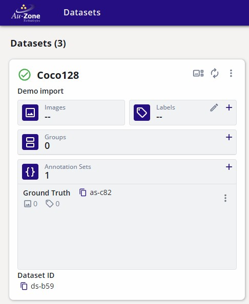{ align=center }
<figcaption>COCO128 Dataset Container</figcaption>
</figure>

For an example dataset, [COCO128](https://www.kaggle.com/datasets/ultralytics/coco128?resource=download) was downloaded using the link provided.  This will download a ZIP archive which can then be extracted.

Once a container has been created, open the dataset options denoted by the three vertical dots on the top right corner of the dataset card.

<figure markdown="span">
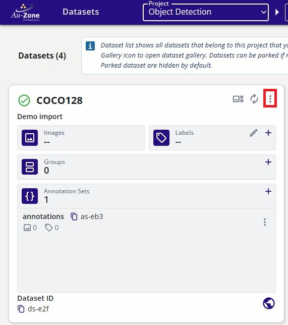{ align=center }
<figcaption>Dataset Options</figcaption>
</figure>

Select "Import".

<figure markdown="span">
{ align=center }
<figcaption>Import Option</figcaption>
</figure>

This will popup a new window for you to specify the dataset to be imported.  In these options, select the "Import Type" to be "Darknet".  Specify the dataset folder "coco128" to be imported.  Specify the annotation set to the "Ground Truth" annotation set.  The following figure shows the specifications.

<figure markdown="span">
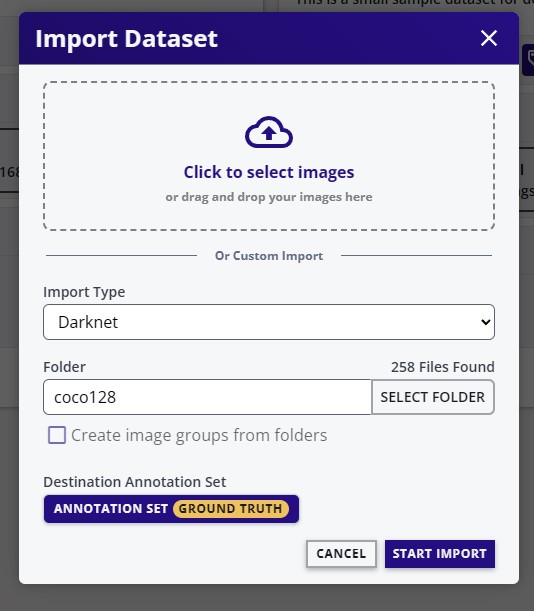{ align=center }
<figcaption>Import Options</figcaption>
</figure>

The "coco128" dataset that was specified contains the "images" and "labels" subdirectories. 

<figure markdown="span">
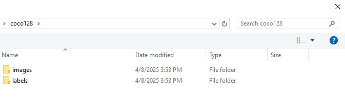{ align=center }
<figcaption>COCO128</figcaption>
</figure>

Select "Start Import" at the bottom right to start the import process.

<figure markdown="span">
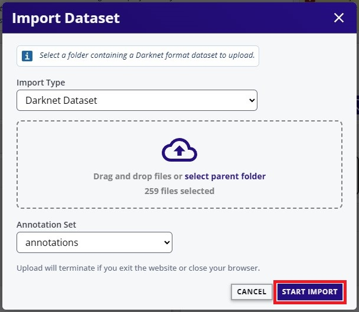{ align=center }
<figcaption>Start Import</figcaption>
</figure>

This will start the import process as shown.

<figure markdown="span">
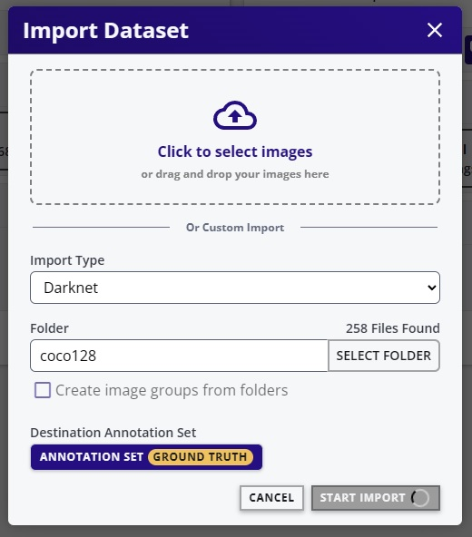{ align=center }
<figcaption>Import Process</figcaption>
</figure>

Once completed, refresh the page to see the changes.  The dataset container will now contain 128 images from COCO and the annotations stored in the "Ground Truth" container.

<figure markdown="span">
{ align=center }
<figcaption>Imported COCO128 Dataset</figcaption>
</figure>

To view the dataset, refer to the instructions provided in [Viewing Datasets](#viewing-datasets).

## Viewing Datasets

This tutorial will show how to open the gallery of the dataset to see the individual samples in the dataset.

    <iframe width="560" height="315" src="https://www.youtube.com/embed/afPsj7_7SnU" title="Viewing Datasets" frameborder="0" allow="accelerometer; autoplay; clipboard-write; encrypted-media; gyroscope; picture-in-picture; web-share" referrerpolicy="strict-origin-when-cross-origin" allowfullscreen></iframe>

From the "Projects" page, you can click on the dataset button indicated in red to view the datasets contained in the project.

<figure markdown="span">
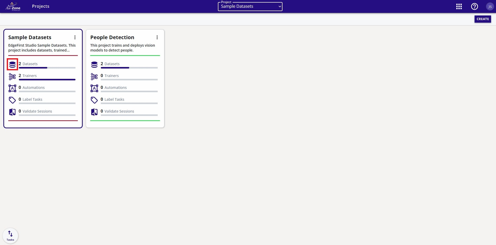{ align=center }
<figcaption>View Datasets</figcaption>
</figure>

You will now see the datasets contained in the project.  Each dataset has a gallery.  To see the images in the gallery, open the gallery by clicking the gallery button indicated in red.

<figure markdown="span">
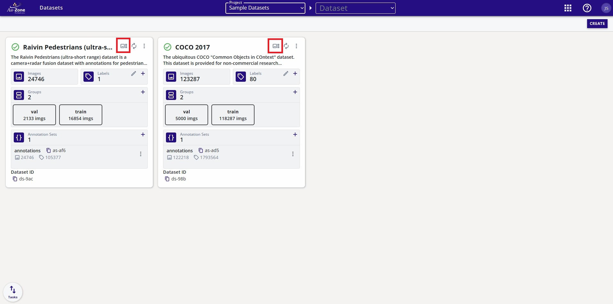{ align=center }
<figcaption>Gallery Button</figcaption>
</figure>

When clicking the gallery button, you will either see the images in the dataset for [Image-Based Datasets](../structure.md#image-based) or sequences for [Sequence-Based Datasets](../structure.md#sequence-based).

For sequence-based datasets, you need to specify which sequence you would like to view.  This can be done by clicking on the sequence.

<figure markdown="span">
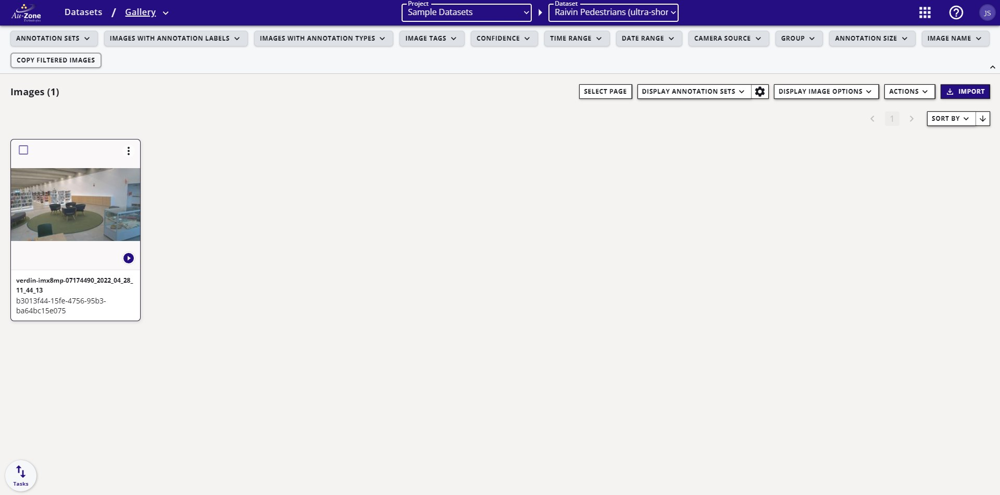{ align=center }
<figcaption>Dataset Sequence</figcaption>
</figure>

When the sequence is clicked, you will now see the frames stored in the sequence along with the annotations.

<figure markdown="span">
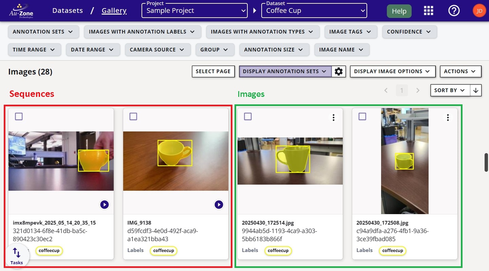{ align=center }
<figcaption>Dataset Sequence</figcaption>
</figure>

## Verifying Datasets

This tutorial will show an example of a dataset that is ready for training. 

    <iframe width="560" height="315" src="https://www.youtube.com/embed/Q8uiYJb1HJ4?start=81&end=118" title="Indoor Dataset Overview" frameborder="0" allow="accelerometer; autoplay; clipboard-write; encrypted-media; gyroscope; picture-in-picture; web-share" referrerpolicy="strict-origin-when-cross-origin" allowfullscreen></iframe>

Verify that the dataset has a training and validation split.  The sample dataset shown below has a dedicated split for training (20066 samples) and validation (2229 samples).

<figure markdown="span">
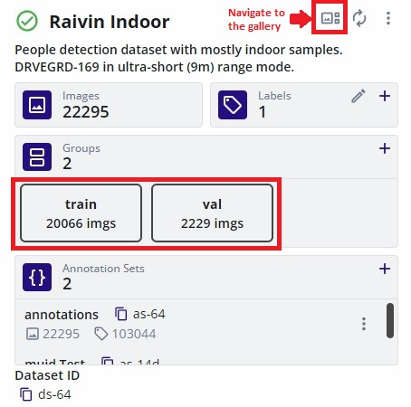{ align=center }
<figcaption>Fusion Dataset Groups</figcaption>
</figure>

Another sample dataset shown below is for training Vision models which has a dedicated split for training (1656 samples) and validation (184 samples).

<figure markdown="span">
{ align=center }
<figcaption>Vision Dataset Groups</figcaption>
</figure>

Verify the contents of the dataset and the annotations.  Click the button that navigates to the gallery.  This will show the contents of the dataset.  The dataset may be comprised of multiple sequences as shown below.  

<figure markdown="span">
{ align=center }
<figcaption>Fusion Dataset Sequences</figcaption>
</figure>

<figure markdown="span">
{ align=center }
<figcaption>Vision Dataset Sequences</figcaption>
</figure>

Clicking on any of these sequences will open individual images in the sequence with the visualizations of the annotations.  For more information please see [Viewing Datasets](#viewing-datasets) above.

!!! info
    Datasets that train Fusion models provide annotations of the object's 3D bounding box.  For more information on the dataset annotations, please see [EdgeFirst Dataset Format](../format.md#dataset-annotation-format).

<figure markdown="span">
{ align=center }
<figcaption>Fusion Annotations</figcaption>
</figure>

!!! info
    Datasets that train Vision models provide image annotations of the object's 2D bounding box and segmentation mask.  For more information on the dataset annotations, please see [EdgeFirst Dataset Format](../format.md#dataset-annotation-format).

<figure markdown="span">
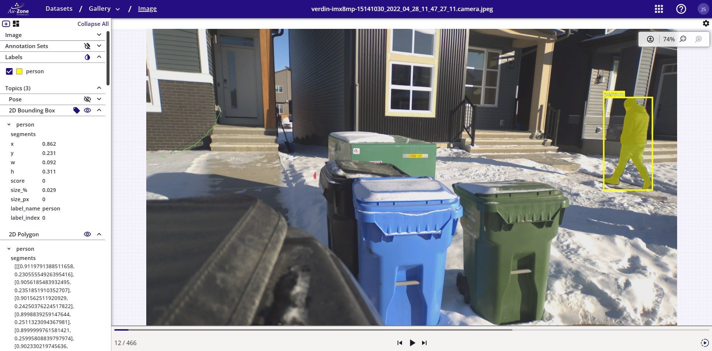{ align=center }
<figcaption>Vision Annotations</figcaption>
</figure>

For cases where the annotations need corrections, please see [Audit 2D Annotations](annotations.md#audit-2d-annotations) or [Audit 3D Annotations](annotations.md#audit-3d-annotations) for more details.

## Creating Datasets

This tutorial will show how to create an empty dataset container in EdgeFirst Studio.  

    <iframe width="560" height="315" src="https://www.youtube.com/embed/DJabdEHaZ8E?start=42&end=94" title="Creating Datasets" frameborder="0" allow="accelerometer; autoplay; clipboard-write; encrypted-media; gyroscope; picture-in-picture; web-share" referrerpolicy="strict-origin-when-cross-origin" allowfullscreen></iframe>

To create a dataset, first select the project to store the new dataset.  Next click the dataset button indicated in red to view the datasets in that selected project.

<figure markdown="span">
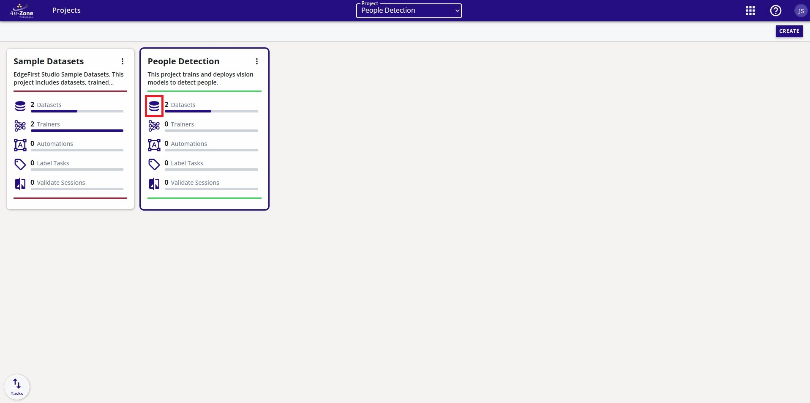{ align=center }
<figcaption>Dataset Button</figcaption>
</figure>

Next create a new dataset by clicking the "New Dataset" button indicated in red on the top right.

<figure markdown="span">
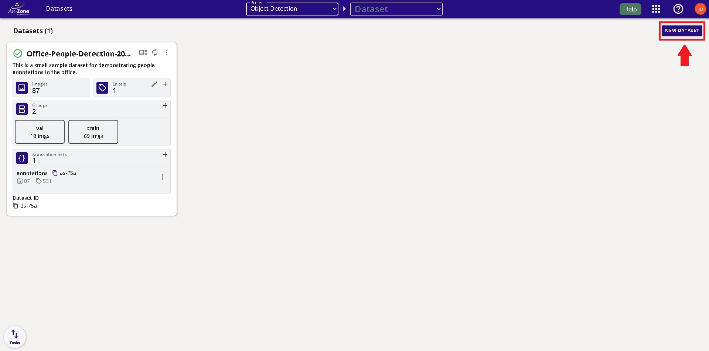{ align=center }
<figcaption>Create Dataset Button</figcaption>
</figure>

Provide the dataset name and the dataset desciption for this new dataset.  Once the fields are filled, click the "Create" button on the bottom left of the window dialog.

<figure markdown="span">
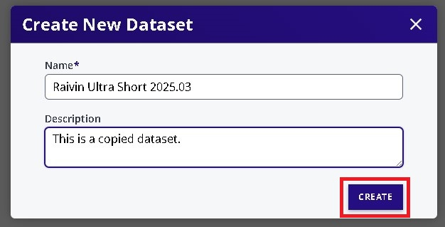{ align=center }
<figcaption>Create Dataset Fields</figcaption>
</figure>

Once created, define an annotation set.  The annotation set is a container for storing the annotations.  To create an annotation set, click the "+" button in the "Annotation Sets" field. 

<figure markdown="span">
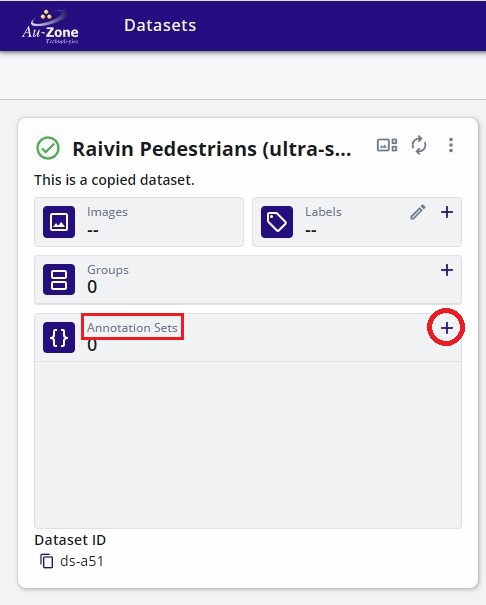{ align=center }
<figcaption>Create Annotation Set</figcaption>
</figure>

Next provide the name and description for the annotation container as shown below.  Once provided, click "Create New Set" to create the annotation set.

<figure markdown="span">
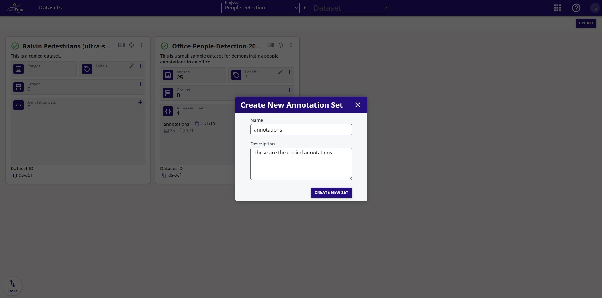{ align=center }
<figcaption>Annotation Set Fields</figcaption>
</figure>

You have now created a dataset and an annotation set container as shown below.  This container can be used to store [copied](#copying-datasets) or [combined](#combining-datasets) datasets.

<figure markdown="span">
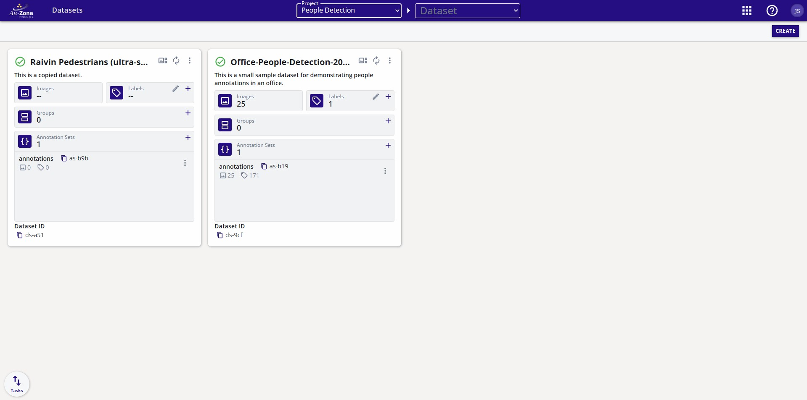{ align=center }
<figcaption>Created Dataset</figcaption>
</figure>

## Copying Datasets

This tutorial will show how to copy datasets.

    <iframe width="560" height="315" src="https://www.youtube.com/embed/qLv8ayxQ-Ns?start=326&end=372" title="Copying Datasets" frameborder="0" allow="accelerometer; autoplay; clipboard-write; encrypted-media; gyroscope; picture-in-picture; web-share" referrerpolicy="strict-origin-when-cross-origin" allowfullscreen></iframe>

To copy a dataset, navigate to the dataset you would like to copy.  On the dataset card, select the "Copy Dataset" from the dataset options as shown below.

<figure markdown="span">
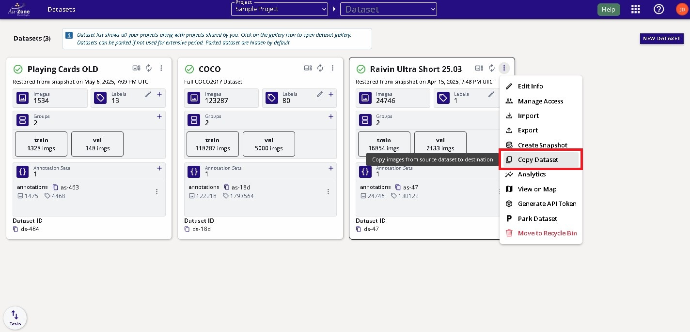{ align=center }
<figcaption>Copy Dataset</figcaption>
</figure>

This will open a new dialog for the user to specify the "Destination Dataset".  The "Destination Dataset" will be the location of the copied dataset.  The "Source Dataset" will be set by default to the current dataset card you've selected.  However, you can also modify the location here.  In the example below, the original dataset is the "Source Dataset" which is the "Raivin Ultra Short 25.03" dataset from the "Sample Project".  The copied dataset will be placed as specified in the "Destination Dataset" fields.  By default a new dataset container will be created in the specified project.  However, you can [create a dataset container](#creating-datasets) before copying and specify this dataset container under "Dataset" in the "Destination Dataset" fields.

<figure markdown="span">
{ align=center }
<figcaption>Copy Dataset Options</figcaption>
</figure>

Once the options are specified, go ahead and click "Apply" at the bottom right to start the copy process.

<figure markdown="span">
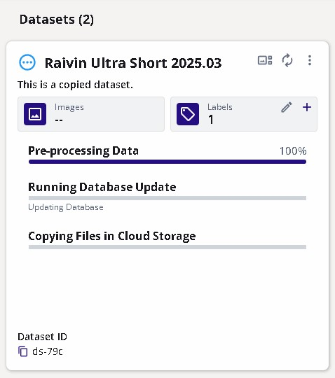{ align=center }
<figcaption>Copy Dataset Process</figcaption>
</figure>

The progress for the dataset copy will be shown on the new dataset card that was created in the project destination that was specified.

<figure markdown="span">
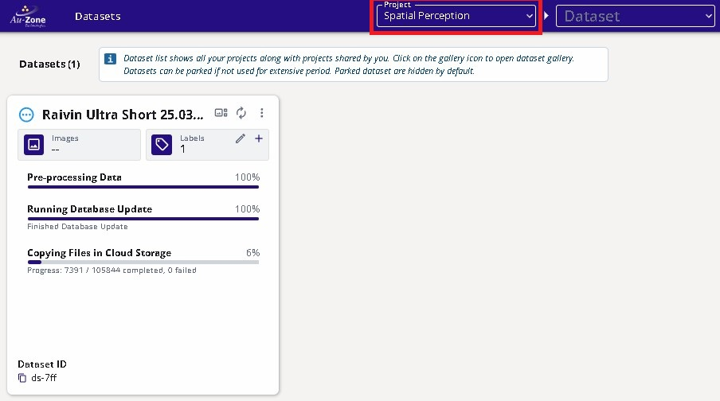{ align=center }
<figcaption>Copy Dataset Progress</figcaption>
</figure>

Once the copying process completes, the frames and the annotations have been copied.

**Original Dataset** | **Copied Dataset**
:------------------:|:------------------:
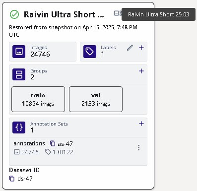 | 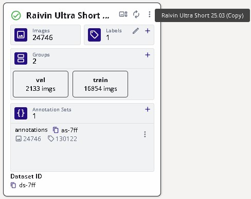

## Combining Datasets

The process of combining datasets consists of multiple copy processes on a given dataset container.  To combine datasets, first [create a dataset](#creating-datasets) container.  Follow the process for [copying a dataset](#copying-datasets) onto the destination dataset container that was created.  The copy process will copy the selected dataset onto the same dataset container and thus combining multiple datasets.

## Splitting Datasets

A proper dataset has samples reserved for training and validation.  This tutorial will show how to split the samples in the dataset into training and validation groups.  This operation randomly shuffles the data prior to assigning them to the specified groups. 

!!! warning
    
    This operation needs to be done whenever new sample images or frames are added to the dataset.  Newly added samples are not automatically added to any group that already exists. 

    <iframe width="560" height="315" src="https://www.youtube.com/embed/qLv8ayxQ-Ns?start=0&end=64" title="Splitting Datasets" frameborder="0" allow="accelerometer; autoplay; clipboard-write; encrypted-media; gyroscope; picture-in-picture; web-share" referrerpolicy="strict-origin-when-cross-origin" allowfullscreen></iframe>

Consider the following dataset without any groups reserved.

<figure markdown="span">
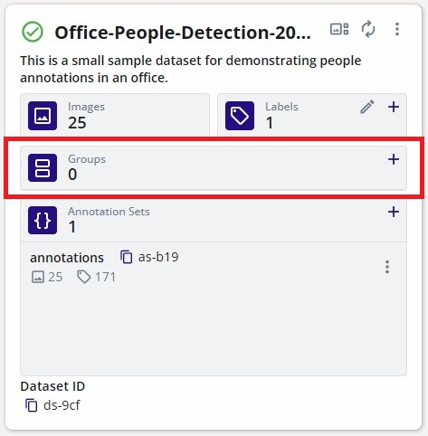{ align=center }
<figcaption>No Groups</figcaption>
</figure>

To create the dataset groups, click on the "+" button in the "Groups" field. 

<figure markdown="span">
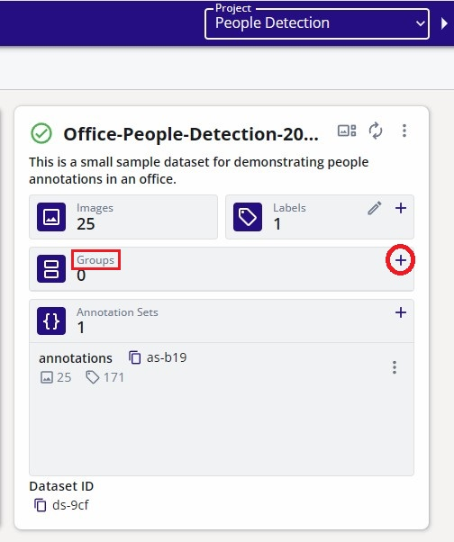{ align=center }
<figcaption>Add Groups</figcaption>
</figure>

This will open a new dialog to specify the percentages of the partition belonging to the "Training" group or "Validation" group. By default 80% of the samples will be dedicated to training and 20% remaining will be dedicated towards the validation samples.

<figure markdown="span">
{ align=center }
<figcaption>Groups Field</figcaption>
</figure>

Once the groups are specified, click "Add Groups" to create the groups.  This will automatically divide the samples in the dataset based on the percentages of each group specified.

<figure markdown="span">
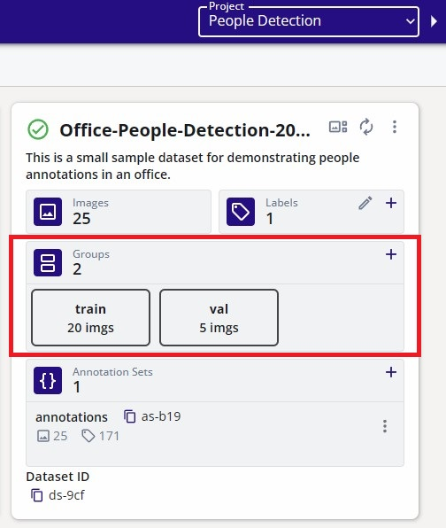{ align=center }
<figcaption>Dataset Groups</figcaption>
</figure>

## Exporting Datasets

*Coming Soon*