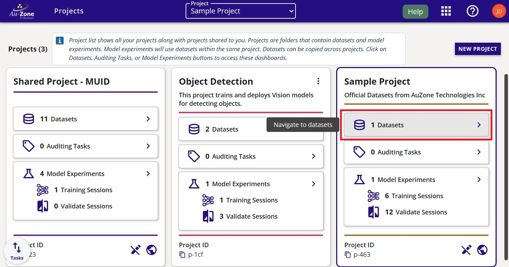
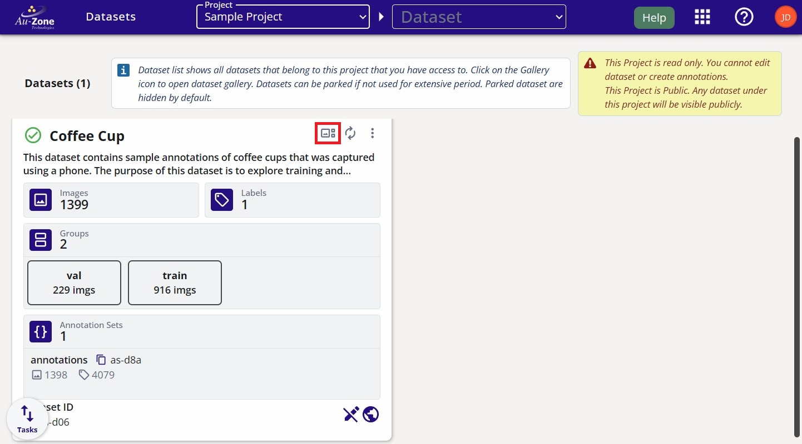
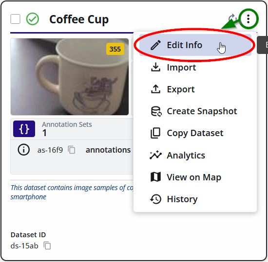
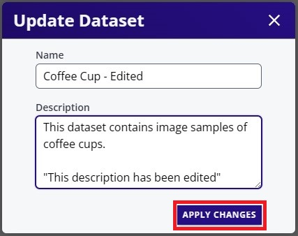
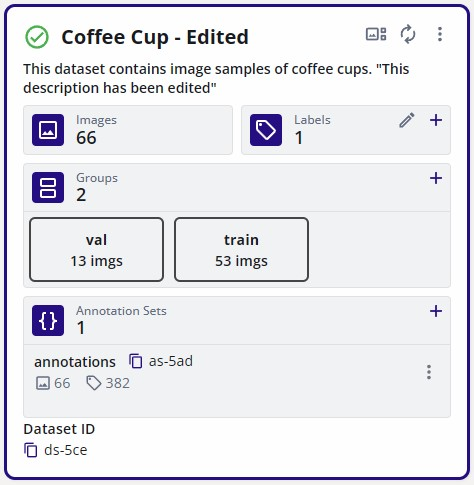
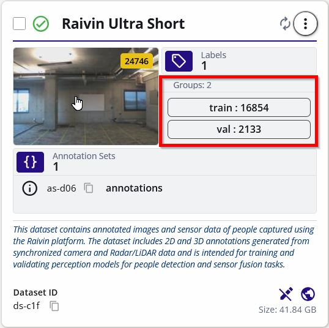
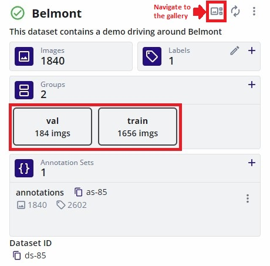
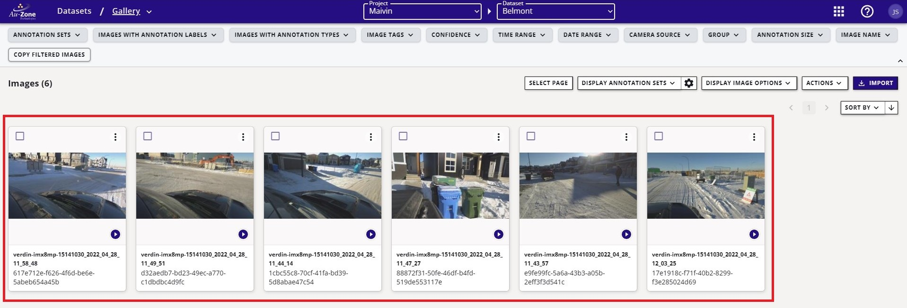
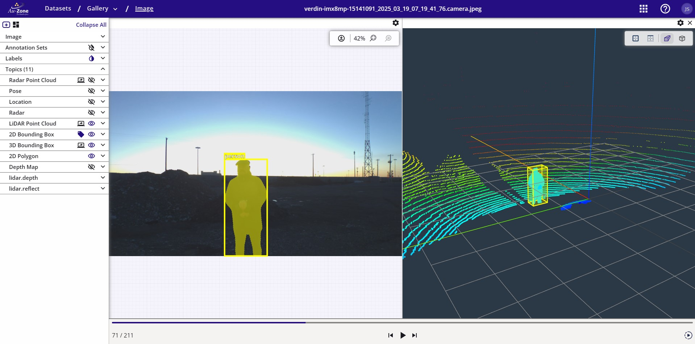

# Dataset Management

This page will provide tutorials for managing datasets in EdgeFirst Studio. 

## View Dataset

This tutorial will show how to open the [gallery](../../studio/datasets/gallery.md) of the dataset to see the individual samples in the dataset.

From the "Projects" page, you can click on the dataset button indicated in red to view the datasets contained in the project.

<figure markdown="span">
{ align=center }
<figcaption>View Datasets</figcaption>
</figure>

You will now see the datasets contained in the project.  Each dataset has a gallery.  To see the images in the gallery, open the gallery by clicking the gallery button indicated in red.

<figure markdown="span">
{ align=center }
<figcaption>Gallery Button</figcaption>
</figure>

When clicking the gallery button, you will either see individual [images](../format/structure.md#image-based) or [sequences](../format/structure.md#sequence-based).

Sequences contain the following sequence icon  on the lower left of the card.  Clicking on any sequences will provide video playback.  Otherwise individual images do not have this icon on their cards. 

<figure markdown="span">
{ align=center }
<figcaption>Dataset Sequence</figcaption>
</figure>

## Edit Dataset Information

The dataset name and description can be edited by clicking on the dataset extended menu on the top right portion of the dataset card.  This should bring up the options and "Edit Info" as the first in the list.  Click on "Edit Info".

<figure markdown="span">
{ align=center }
<figcaption>Edit Info</figcaption>
</figure>

This will bring up the window to edit the dataset "Name" and the "Description".  Once the changes are made, click "Apply Changes" to save the changes.

<figure markdown="span">
{ align=center }
<figcaption>Edit Info Fields</figcaption>
</figure>

The changes should appear on the dataset card as shown below.

<figure markdown="span">
{ align=center }
<figcaption>Edited Info</figcaption>
</figure>

## Verify Dataset

This tutorial will show an example of a dataset that is ready for training. 

    <iframe width="560" height="315" src="https://www.youtube.com/embed/Q8uiYJb1HJ4?start=81&end=118" title="Indoor Dataset Overview" frameborder="0" allow="accelerometer; autoplay; clipboard-write; encrypted-media; gyroscope; picture-in-picture; web-share" referrerpolicy="strict-origin-when-cross-origin" allowfullscreen></iframe>

Verify that the dataset has a training and validation split.  The sample dataset shown below has a dedicated split for training (20066 samples) and validation (2229 samples).

<figure markdown="span">
{ align=center }
<figcaption>Fusion Dataset Groups</figcaption>
</figure>

Another sample dataset shown below is for training Vision models which has a dedicated split for training (1656 samples) and validation (184 samples).

<figure markdown="span">
{ align=center }
<figcaption>Vision Dataset Groups</figcaption>
</figure>

Verify the contents of the dataset and the annotations.  Click the button that navigates to the gallery.  This will show the contents of the dataset.  The dataset may be comprised of multiple sequences as shown below.  

<figure markdown="span">
{ align=center }
<figcaption>Fusion Dataset Sequences</figcaption>
</figure>

<figure markdown="span">
{ align=center }
<figcaption>Vision Dataset Sequences</figcaption>
</figure>

Clicking on any of these sequences will open individual images in the sequence with the visualizations of the annotations.  For more information please see [viewing datasets](#view-dataset).

Datasets that train Fusion models provide annotations of the object's 3D bounding box.  For more information on the dataset annotations, please see the [EdgeFirst Dataset Format](../format/index.md#annotation-data).

<figure markdown="span">
{ align=center }
<figcaption>Fusion Annotations</figcaption>
</figure>

Datasets that train Vision models provide image annotations of the object's 2D bounding box and segmentation mask.  For more information on the dataset annotations, please see the [EdgeFirst Dataset Format](../format/index.md#annotation-data).

<figure markdown="span">
{ align=center }
<figcaption>Vision Annotations</figcaption>
</figure>

For cases where the annotations need corrections, please see [Manual 2D Annotations](annotations/manual.md#manual-2d-annotations) or [Manual 3D Annotations](annotations/manual.md#manual-3d-annotations) for more details.





## Combine Datasets

The process of combining datasets consists of multiple copy processes on a given dataset container.  To combine datasets, first [create a dataset](#create-dataset) container.  Follow the process for [copying a dataset](#copy-dataset) onto the destination dataset container that was created.  The copy process will copy the selected dataset onto the same dataset container and thus combining multiple datasets.



## Export Dataset

*Coming Soon*