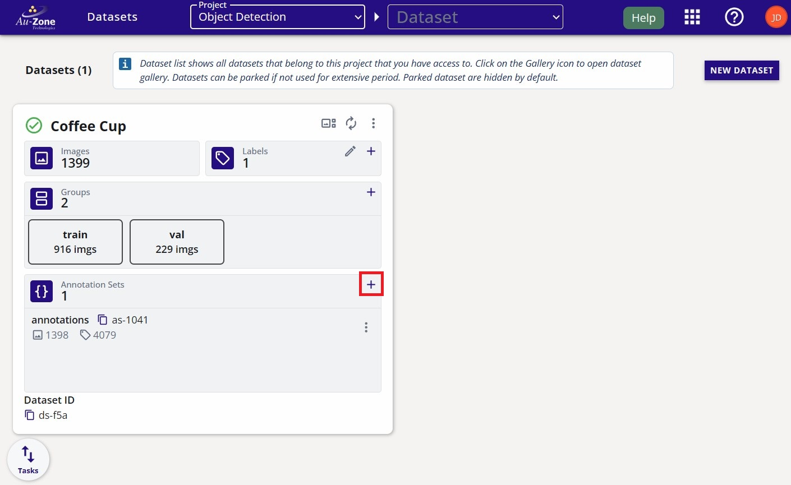
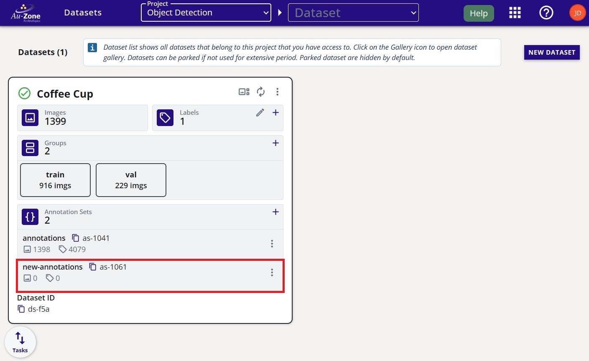
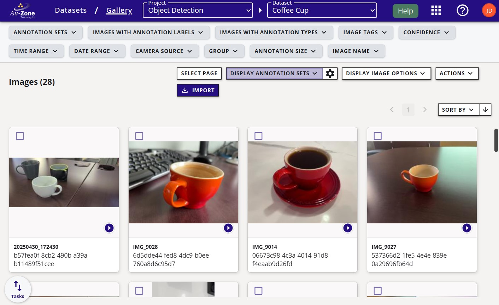
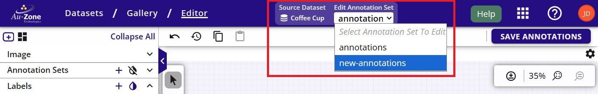

# Annotate Dataset

Now that you have a dataset in your project, you can start annotating the dataset.  This will briefly show the steps for annotating the dataset, but for an in depth tutorial on the annotation process, please see [Dataset Annotations](../../datasets/tutorials/annotations/index.md).  

To annotate a dataset, first create an annotation set on the dataset card.

<figure markdown="span">
{ align=center }
<figcaption>Annotation Set</figcaption>
</figure>

A new annotation set was created called "new-annotations".

<figure markdown="span">
{ align=center }
<figcaption>New Annotation Set</figcaption>
</figure>

Next, open the dataset gallery, by clicking on the gallery button  on the top left of the dataset card.  The dataset will contain sequences (video)  and images.  Click on any sequence card to start [annotating sequences](../../datasets/tutorials/annotations/automatic.md#semi-automatic-ground-truth-generation). 

<figure markdown="span">
{ align=center }
<figcaption>Coffee Cup Gallery</figcaption>
</figure>

On the top navbar, switch to the right annotation set.

<figure markdown="span">
{ align=center }
<figcaption>Switch Annotation Set</figcaption>
</figure>

[Start the AGTG server](../../datasets/tutorials/annotations/automatic.md#initialize-agtg-server) by clicking on the "AI Segment Tool" and follow the prompts as indicated.

<figure markdown="span">
{ align=center }
<figcaption>Auto Segment Mode</figcaption>
</figure>

Once the AGTG server has started, go ahead and [annotate the starting frame](../../datasets/tutorials/annotations/automatic.md#annotate-starting-frame).

<figure markdown="span">
{ align=center }
<figcaption>AGTG Initial Prompts</figcaption>
</figure>

Once the starting frame has been annotate, go ahead and [propagate the annotations](../../datasets/tutorials/annotations/automatic.md#propagate) throughout the rest of the frames.

<figure markdown="span">
{ align=center }
<figcaption>Propagation Process</figcaption>
</figure>

Repeat the steps for all the sequences in the dataset.  For the case of individual images, the same steps apply except there is no propagation step.  More details are provided in the [manual annotations](../../datasets/tutorials/annotations/manual.md#add-2d-annotations). 
