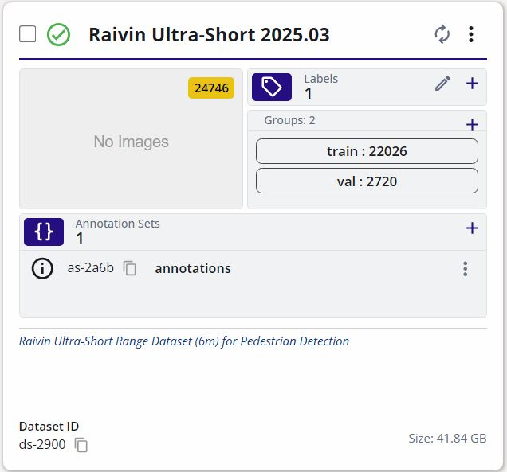
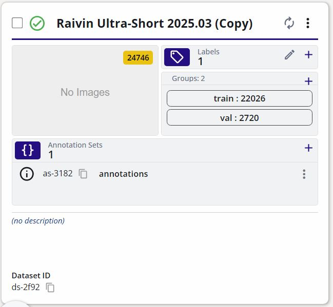

To copy a dataset, navigate to the dataset you would like to copy.  On the dataset card, select "Copy Dataset" from the dataset options as shown below.

{{ figure("/datasets/assets/management/copy-3d-dataset-option.jpg", "Copy Dataset") }}

This will open a new dialog for the user to specify the dataset source and destination.  The destination will be the location of the copied dataset.  The source is the current location of the dataset.  The source is set by default to the current dataset card you've selected.  In the example below, the source is set to the "Raivin Ultra-Short 2025.03" dataset from "Sample Project".  The copied dataset will be placed as specified in the destination fields.  By default a new dataset container will be created in the specified project.  However, you can also [create a dataset container](../../datasets/tutorials/management.md#create-dataset) before copying and specify this dataset container in the destination fields.  

Once you have made your selection, click "Apply" at the bottom right to start the copy process.

{{ figure("/datasets/assets/management/copy-3d-dataset-options.jpg", "Copy Dataset Options") }}

You can navigate to the copied dataset by clicking the "Project" button and then clicking on the "Datasets" button on your project as shown below.

{{ figure("/datasets/assets/management/navigate-to-project.jpg", "Navigate to your Project") }}

The progress for the dataset copy will be shown on the dataset card.

{{ figure("/datasets/assets/management/copy-3d-dataset-progress.jpg", "Copy Dataset Progress") }}

Once the copying process completes, the frames and the annotations would have been copied.

**Original Dataset** | **Copied Dataset**
:------------------:|:------------------:
 | 
