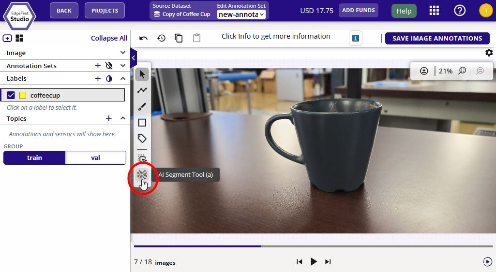
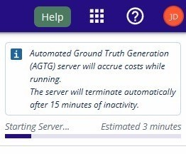
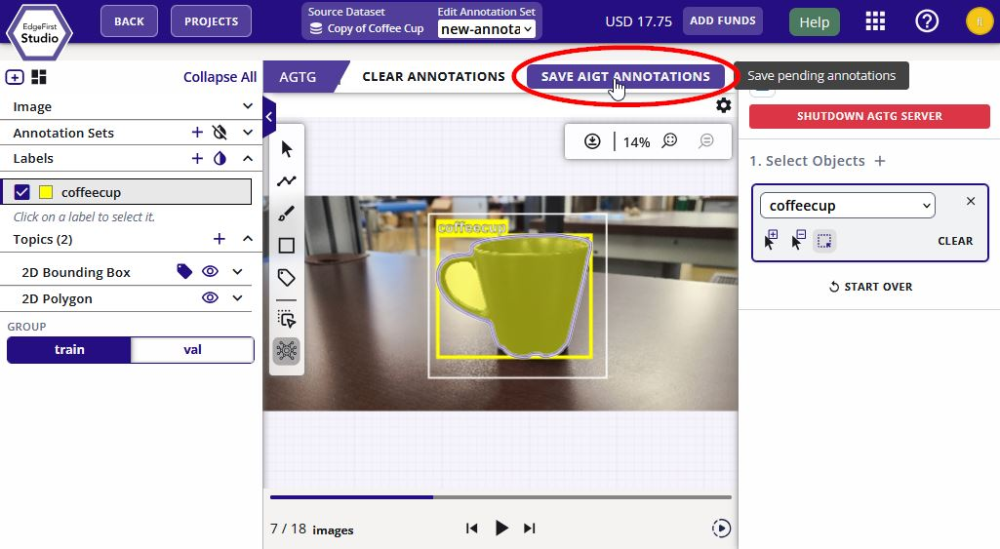
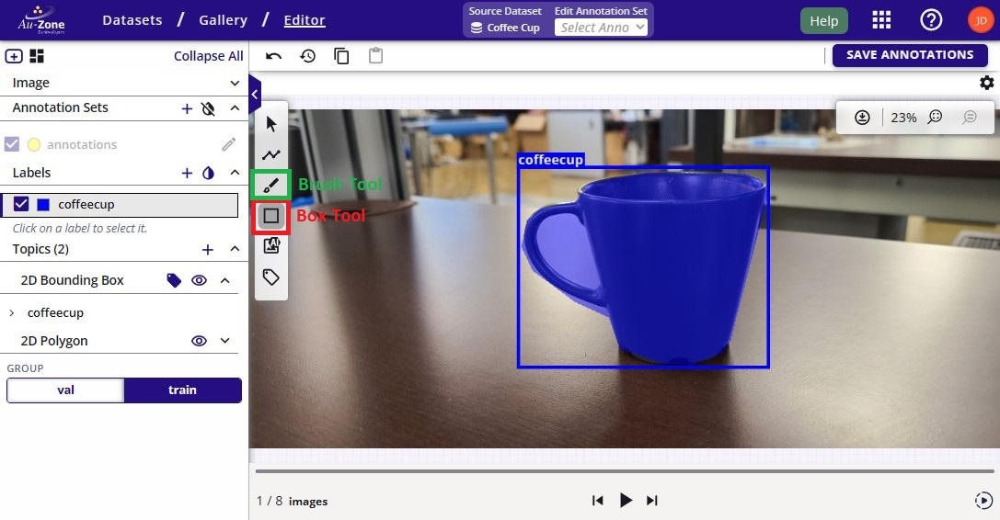
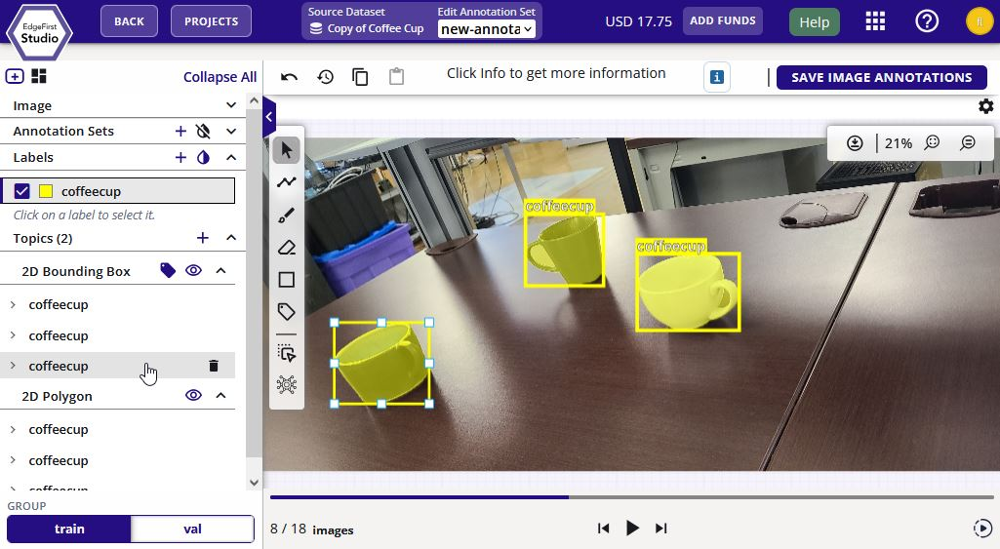
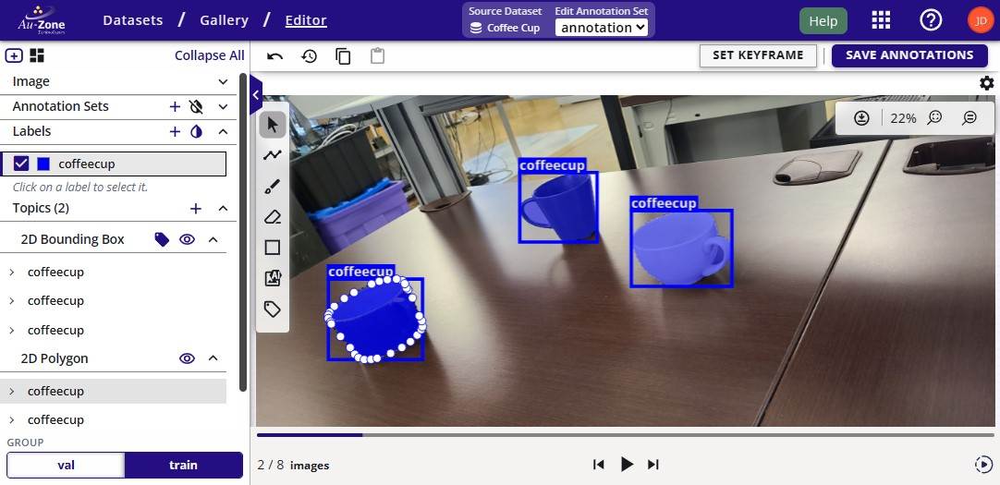
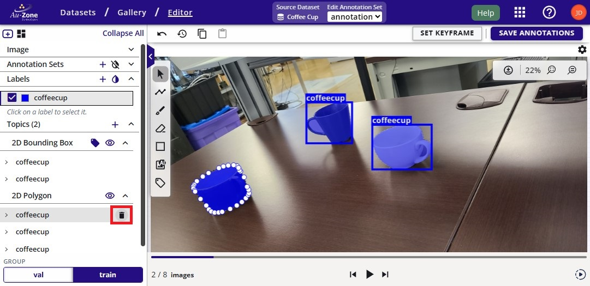
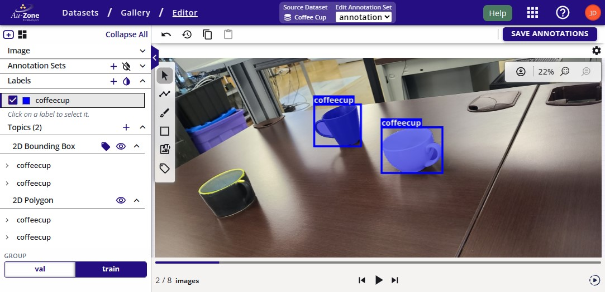

# Manual 2D Annotations

This section describes the steps for adjusting 2D annotations in the dataset.

## Add 2D Annotations

First [navigate to the dataset gallery](../../datasets/tutorials/management.md#view-dataset) and start by adding a single 2D annotation on an image.  Select the "AI Image Segment Tool".  This tool will use SAM-2 to auto-segment and auto-box an object in the image.

<figure markdown="span">
{ align=center }
<figcaption>Auto Segment Mode</figcaption>
</figure>

If there is currently no AGTG server available, go ahead and click on "Launch AGTG Server".

<figure markdown="span">
{ align=center }
<figcaption>Launch AGTG Server</figcaption>
</figure>

Please wait while the server is being initialized.

<figure markdown="span">
{ align=center }
<figcaption>Launch AGTG Server</figcaption>
</figure>

!!! warning "Active AGTG Server"
    This server is costing credits to run.  An inactivity of 15 minutes will auto-terminate this server.  Otherwise, once you have completed the annotations, please ensure to [terminate the AGTG server](../../datasets/tutorials/annotations/index.md#terminate-agtg-server) to avoid spending more of your credits.

Once the server is initialized, draw the bounding box around the object by clicking on the image and then dragging the mouse to expand the bounding box.  This will start segmenting the object.  Once the object is properly segmented, go ahead and click "Save Annotations" as indicated in red to save the annotation and to move forward to the next image.

<figure markdown="span">
{ align=center }
<figcaption>Draw Bounding Box Prompt</figcaption>
</figure>

**Alternatively**, use these tools to manually add bounding boxes and segmentation masks separately.

The standard steps for using these tools are described below.

1. Click on the box tool or brush tool in the 2D editing panel (left - shown in red box).
2. Using the mouse, drag anywhere on the image to create box/mask annotation.
3. Make multiple boxes/masks - one for each annotation.
4. Make sure to change the label type on the left panel if the next label belongs to a different class.

<figure markdown="span">
{ align=center }
<figcaption>2D Manual Annotation Tools</figcaption>
</figure>

## Adjust 2D Annotations

To resize a 2D bounding box annotation, select the bounding box from the dropdown on the left under "2D Bounding Box".

<figure markdown="span">
{ align=center }
<figcaption>Resize Bounding Box</figcaption>
</figure>

This will show the anchor points around the bounding box allowing you to click on these points and drag the mouse to resize the bounding box.

Similarly, to adjust the 2D segmentation mask annotation, select the segmentation mask from the dropdown on the left under "2D Polygon". This will also show the anchor points around the mask polygon allowing you to adjust the mask.

<figure markdown="span">
{ align=center }
<figcaption>Adjust Segmentation Mask</figcaption>
</figure>

After making the adjustments, go ahead and click on the "Save Annotations" button on the top left to save these adjustments and move forward with the next image in the dataset.

## Delete 2D Annotations

To delete an annotation, first click on the pointer tool . Click on the annotation.  This will first highlight the bounding box annotation.  To delete the annotation, press the "Delete" key on your keyboard.

<figure markdown="span">
{ align=center }
<figcaption>Delete Bounding Box</figcaption>
</figure>

Next repeat the same process for the segmentation mask.  Click on the mask annotation to highlight the mask.  To delete the annotation, press the "Delete" key on your keyboard or click on the "Delete" button next to the annotation to delete the annotation.

<figure markdown="span">
{ align=center }
<figcaption>Delete Segmentation Mask</figcaption>
</figure>

The annotations will be deleted after following the steps above.

<figure markdown="span">
{ align=center }
<figcaption>Deleted Annotations</figcaption>
</figure>
