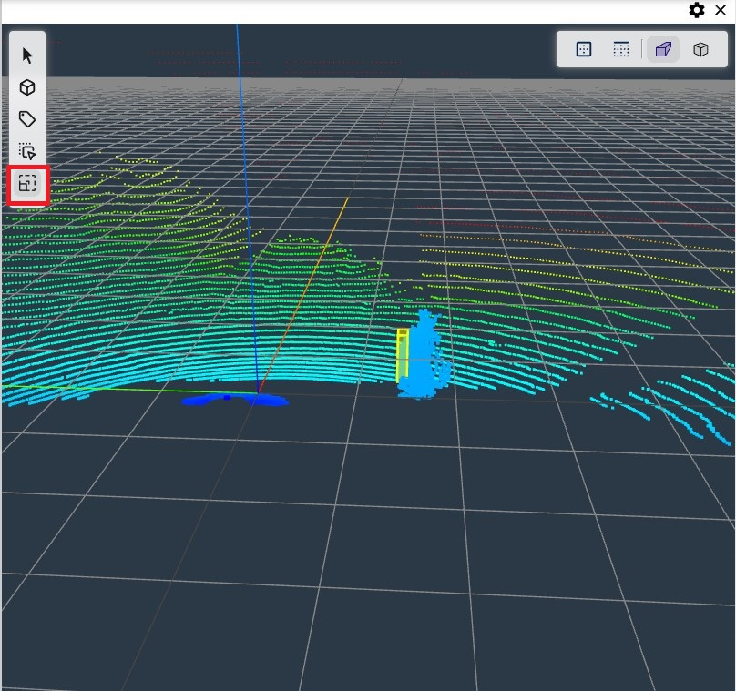
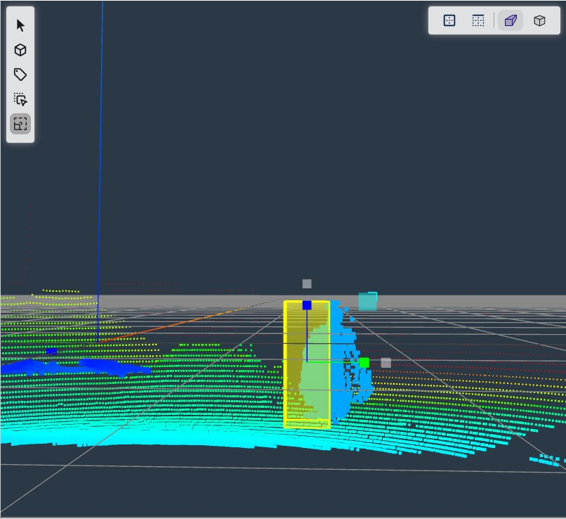
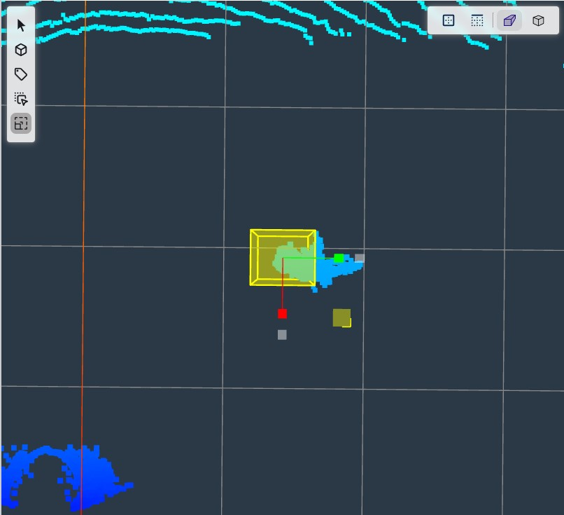
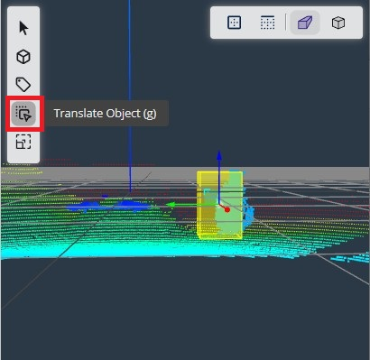
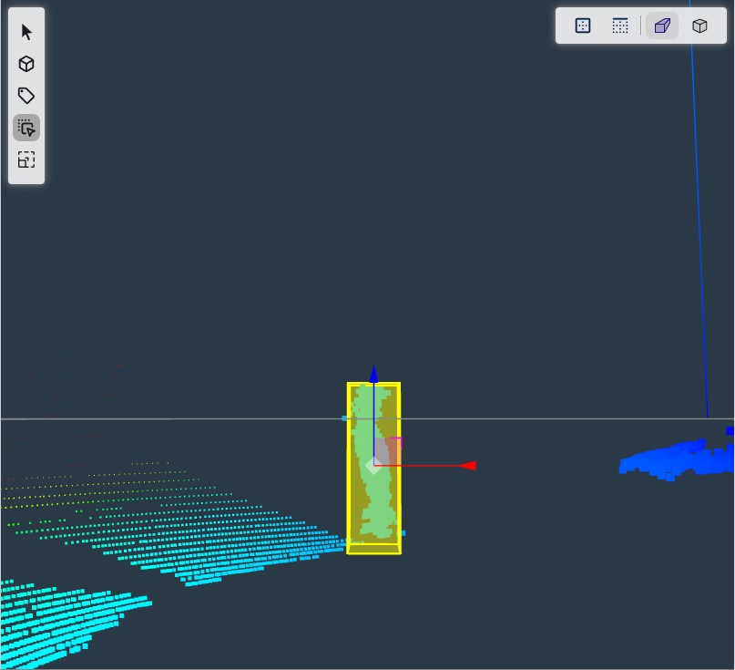
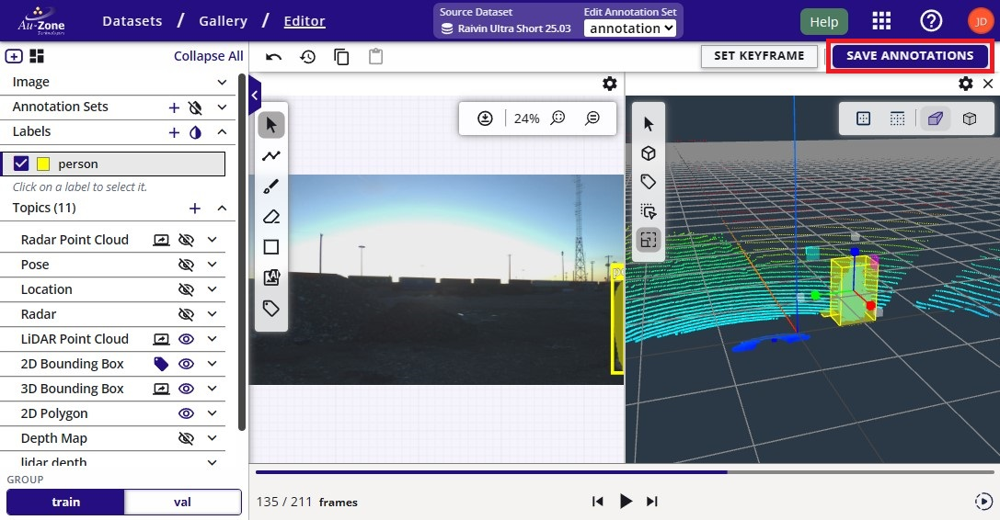
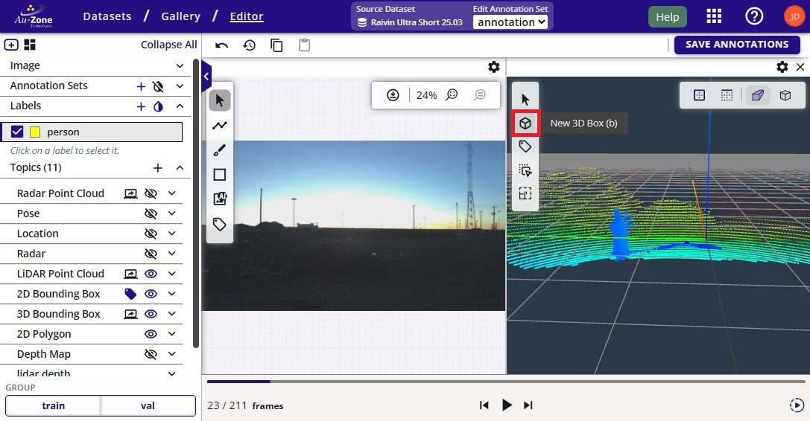
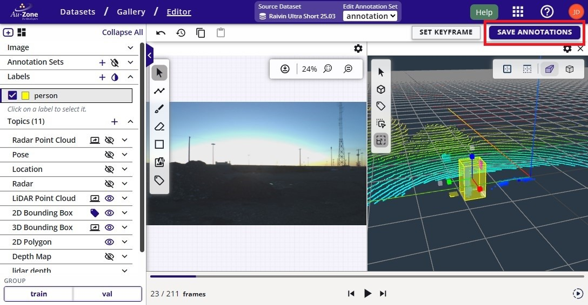

# Manual 3D Annotations

This section describes the steps for adjusting 3D annotations in the dataset.

First [navigate to the dataset gallery](../../datasets/tutorials/management.md#view-dataset).  Ensure that the LiDAR and/or Radar point clouds, and the 3D bounding box annotations are toggled visible. 

<figure markdown="span">
{ align=center }
<figcaption>Visible 3D Annotations</figcaption>
</figure>

## Scale 3D Annotation

The error in the current annotation is that the bounding box is not scaled properly.  Click on the option on the left sidebar to enable 3D bounding box scaling as indicated in red.

<figure markdown="span">
{ align=center }
<figcaption>Scale 3D Annotations</figcaption>
</figure>

Click on the current 3D bounding box to scale and this will provide anchor points to scale the 3D bounding box in the 3-axis.

<figure markdown="span">
{ align=center }
<figcaption>Scaling 3D Annotations</figcaption>
</figure>

Next adjust the scaling of the 3D bounding box in each axis by dragging the anchor points (red, green, blue).  The 3D bounding box shown below was adjusted with proper scaling to the LiDAR point clouds of the object.  

| Scaled YZ Plane             | Scaled XY Plane           | Scaled XZ             |
|-----------------------------|---------------------------|-----------------------|
|  |  |  |

However, the translation is still quite off, instructions to fix this issue will be shown in the next section.

## Translate 3D Annotation

Next the adjusted 3D bounding box needs to be properly translated.  Click on the option on the left sidebar to enable 3D bounding box translation as indicated in red.

<figure markdown="span">
{ align=center }
<figcaption>Translate 3D Annotations</figcaption>
</figure>

Similar to the workflow as scaling the 3D bounding boxes above, move the three anchor points for each axis to translate the bounding box for each axis.

| Translate YZ Plane          | Translate XY Plane        | Translate XZ          |
|-----------------------------|---------------------------|-----------------------|
|  |  |  |

Once the 3D bounding box annotation is properly oriented, click "Save Annotations" to save the changes.

<figure markdown="span">
{ align=center }
<figcaption>Submit 3D Annotations</figcaption>
</figure>

## Add 3D Annotation

To add a missing 3D bounding box, click on the option on the left sidebar to add a new 3D bounding box annotation as indicated in red.

<figure markdown="span">
{ align=center }
<figcaption>Add 3D Annotations</figcaption>
</figure>

Now click on the grid to add a new 3D bounding box on the position of the click.

<figure markdown="span">
{ align=center }
<figcaption>Added 3D Annotations</figcaption>
</figure>

This newly added 3D bounding box may not be scaled or translated properly.  Follow instructions for [scaling](#scale-3d-annotation) and [translating](#translate-3d-annotation) a 3D bounding box to properly center the bounding box around the LiDAR point cloud as shown below.  Once the annotation is properly scaled and translated, click "Save Annotations" to save the annotation.

<figure markdown="span">
{ align=center }
<figcaption>Submit 3D Annotations</figcaption>
</figure>

## Delete 3D Annotation

To delete an annotation, first click on the pointer tool . Click on the annotation.  This will first highlight the 3D bounding box annotation.  To delete the annotation, press the "Delete" key on your keyboard.