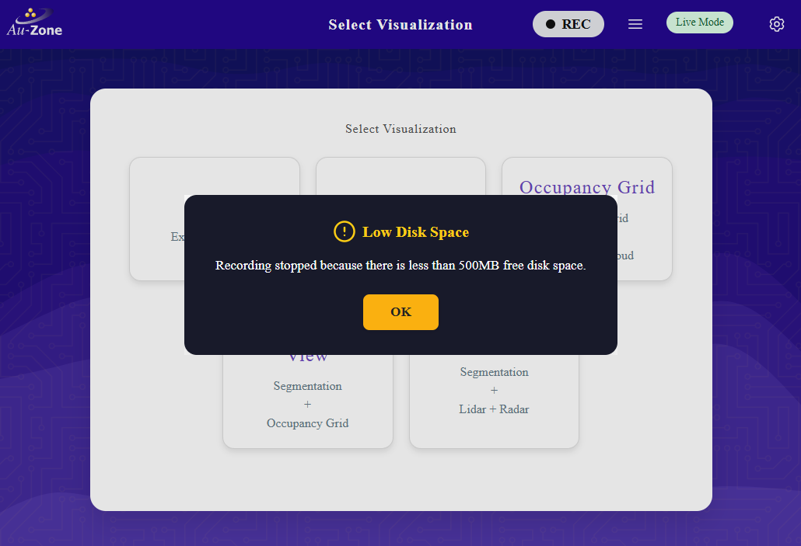
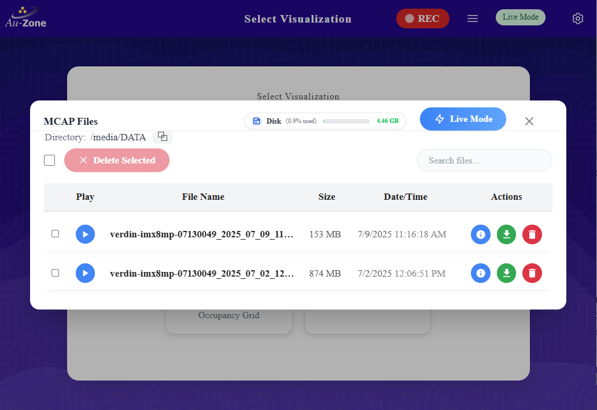

# Recording an MCAP
MCAP recordings can be started and stopped using the Recording Button at the device's [top navbar](../../platforms/walkthrough.md#the-top-ribbon).  It is to the left of the MCAP Details hamburger button, which is used to open the [MCAP Details Modal](../../platforms/recording.md#the-mcap-modal).
<figure markdown="span">
{align=center}
<figcaption>MCAP Recording and Details Buttons</figcaption>
</figure>
Both of these buttons are available on every page of the Maivin, Raivin, and other edge devices running the EdgeFirst middleware.
!!! note
     You must close all modals to be able to click the "Recording" and "Details" Buttons.

For more information about recording MCAPs, please read the [MCAP Recording section](../../platforms/recording.md).

## Starting a Recording
To start a recording, simply click the "Recording" button to begin capturing data.

<figure markdown="span">
{align=center}  
<figcaption>MCAP Recording</figcaption>
</figure>

!!! note
     It may take up to 30 seconds for a recording to start, depending on topic tracked.

!!! warning
     If there is not enough room on the drive to record a MCAP, recording will automatically stop and you will get a "Low Disk Space" error.
     <figure markdown="span">
     {align=center}  
     <figcaption>MCAP Low Disk Space Warning</figcaption>
     </figure>

If you were to open the MCAP Details Modal while recording, you would see a new MCAP file in the MCAP list.

<figure markdown="span">
{align=center}  
<figcaption>MCAP Modal While Recording</figcaption>
</figure>

## Stopping a Recording
To stop recording, click the "Recording" button a second time.