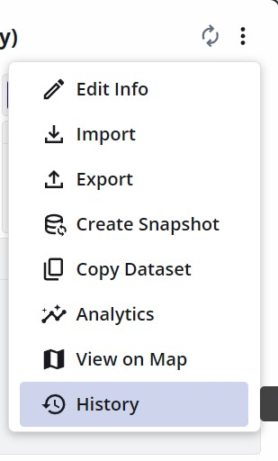
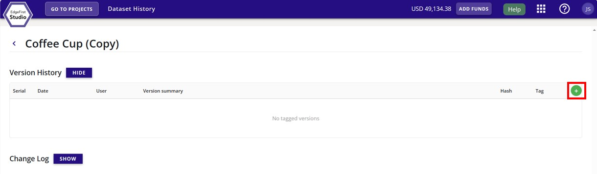
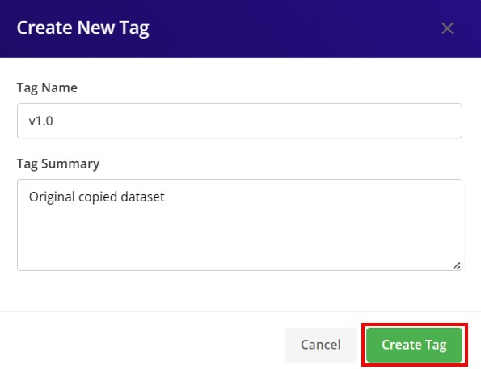

To maintain the current state of the dataset, tag the dataset with a version.

Click on the dataset options at the top right of the dataset card (three vertical dots). Then click the "History" button.

<figure markdown="span">
{ align=center }
<figcaption>Tag Dataset Options</figcaption>
</figure>

Add a new tagged version of the dataset by clicking the + green button on the right of the page as shown.

<figure markdown="span">
{ align=center }
<figcaption>Tag Dataset Button</figcaption>
</figure>

Specify the tag version and tag description. Click "Create Tag" to tag the dataset.

<figure markdown="span">
{ align=center }
<figcaption>Tag Dataset Options</figcaption>
</figure>
